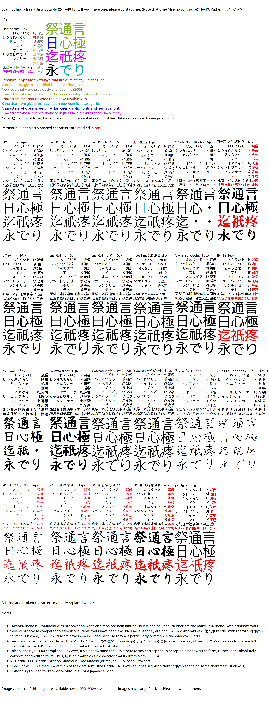

# General content - tooling, dictionaries, fonts and general reference

> **TL;DR**
> - This folder is not a skill topic. It is the **workshop**: the flashcard software, the pop-up dictionary, the fonts, the offline website mirrors and the general-purpose books that every other folder in this repo assumes you already have.
> - It is the canonical home in this repo for **Anki** (install, FSRS, deck options, add-ons, sync, backups, backlog recovery), **Yomitan** and dictionary choices, and **Japanese fonts**.
> - Start here on **day 0**, before you learn a single kana. The whole setup is about 2-3 hours of one-time work and it pays back every day for years.
> - Recommended stack: **Anki (FSRS on) + Yomitan + a browser + one kyoukasho font + a Japanese IME**. Free, offline-capable, portable, and it is what the immersion community actually uses.
> - The trap for technical people: tool-tinkering *feels* like studying and is not. Timebox the setup, then close the settings window.

---

## What this is and why it matters

Every other guide in this repo says things like "add it to Anki", "hover it with Yomitan", "mine the sentence", "the kanji renders wrong because your font is Chinese". This folder is where those sentences get cashed out.

It contains four kinds of things:

1. **Software** - an Anki install/setup guide, and the instructions for the surrounding toolchain.
2. **Fonts** - actual font files, plus a large comparison gallery, because Japanese kanji genuinely change shape between font classes and one of those classes is the one you should learn to write from.
3. **Offline mirrors of three community sites** - the DJT / Itazuraneko guide, Tatsumoto's blog, and Tofugu. These are the source material a lot of "how to learn Japanese" advice on the internet is downstream of. Archived because neocities sites disappear.
4. **General-purpose books** - a linguistics history of the language and two university textbook series, for when you want a structured or academic counterweight to immersion-flavoured advice.

Why it matters more than it looks: the difference between a learner who lasts three years and one who quits in month four is very often mechanical, not motivational. Reviews piled up because the review cap was set to 100. Kanji looked like unreadable mush because the system fell back to a Chinese font. Making one flashcard took 90 seconds instead of 8, so mining never became a habit. Those are all solved problems, and they are all solved in this folder.

## Where it fits in the journey

**Prerequisites:** none. This is genuinely the first thing to do.

**What it unlocks:**

| Set this up | And this becomes possible |
| :--- | :--- |
| Anki + FSRS + sane deck options | Every SRS-based method in the repo: [Kana](../Kana/readme.md), [Kanji](../Kanji/readme.md), [Vocabulary](../Vocabulary/readme.md), [Grammar](../Grammar/readme.md) |
| Yomitan + JMdict-style dictionary + AnkiConnect | Sentence mining and one-click card creation - see [AJATT](../AJATT/readme.md) |
| Pitch-accent dictionary in Yomitan | Knowing how a word is actually pronounced - see [Speaking](../Speaking/readme.md) |
| A kyoukasho (textbook) font | Learning correct handwritten stroke forms - see [Writing](../Writing/readme.md) |
| A Japanese IME | Typing, searching Japanese, using monolingual dictionaries - see [Writing](../Writing/readme.md) |
| mpv / asbplayer / mokuro / a texthooker | Turning anime, manga, novels and games into study material - see [Reading](../Reading/readme.md) and [Listening](../Listening/readme.md) |

**When to revisit:** once at the start (Phases 0-4 below), once around month 3-6 when you add reading plumbing, and once around the monolingual transition when you swap dictionaries.

---

## The ecosystem choices (the "schools of thought" for tooling)

There is no neutral toolchain. Each of these is a coherent bet about where your effort should go.

### 1. The DIY free-software stack - Anki + Yomitan + media tools

Assemble it yourself from free, mostly open-source parts. Anki for SRS, Yomitan for lookups and card creation, mpv/asbplayer/mokuro for media, your own decks and note types.

- **Pros:** free; works offline; you own your data forever; infinite customisation; card creation from *your* media, so every card is tied to something you actually cared about; it is what the mining/immersion community builds around, so guides and note types are plentiful.
- **Cons:** real setup cost (hours, not minutes); nothing stops you from configuring it badly; no curriculum - you have to decide what to study; strong temptation to keep tuning instead of studying.
- **Best for:** people who will be at this for years, who consume Japanese media anyway, and who are not scared of a settings screen.

### 2. SRS-as-a-service - WaniKani, Bunpro, Marumori, Renshuu

Pay someone to make all the scheduling and content decisions. WaniKani teaches kanji and vocabulary on a fixed mnemonic-driven ladder; Bunpro does the same for grammar points; Marumori and Renshuu bundle grammar, kanji, vocabulary and reading into one curriculum.

- **Pros:** zero setup; a real curriculum with a defined order; mnemonics and example sentences already written; the guardrails are the product - it is genuinely harder to shoot yourself in the foot; for many people paying money is the commitment device that makes them show up.
- **Cons:** costs money indefinitely; you cannot fix a bad card, reorder the content, or add your own; the pacing is not yours (WaniKani in particular gates content behind timers, which is either discipline or a cage depending on your temperament); your progress lives on someone else's server; content is generic rather than drawn from things you care about. Tatsumoto's [downsides of WaniKani](<./Tatsumoto Blog offline copy/tatsumoto.neocities.org/blog/what-are-the-downsides-of-using-wanikani.html>) is the harsh version of the case against; take it as one pole of the argument, not the verdict.
- **Free tiers, as documented in this repo's root README:** WaniKani is free for the first three levels; Bunpro has a one-month trial with no credit card.
- **Best for:** people who have repeatedly failed to self-direct, people who want to start in the next ten minutes, and people who value a fixed order over relevance.

### 3. Textbook and classroom

Genki, Nakama, Japanese for Everyone, Minna no Nihongo - a graded sequence of lessons, exercises and audio, optionally with a teacher.

- **Pros:** grammar in a tested pedagogical order with exercises that force production; explicit answers to "am I doing this right"; a class gives you deadlines and a speaking partner; strongly aligned with university credit and with the JLPT.
- **Cons:** slow words-per-hour; heavy on polite/formal register you will hear less of in media; some books lean on romaji (see [Romaji](../Romaji/readme.md) for why that is a problem); and you can finish two textbooks and still be unable to watch an episode of anime, because textbook Japanese and native Japanese are different distributions.
- **Best for:** people who need external structure, people who will be tested, and people who want output practice early. Also a good *reference* layer even if it is not your main engine - two of the three textbook sets in this folder are here for exactly that use.

### 4. App-first and gamified - Duolingo, Memrise, and friends

- **Pros:** frictionless start; excellent streak psychology; good on a phone in a queue.
- **Cons:** for Japanese specifically the ceiling is very low. You can hit a 1000-day streak and be unable to read a page of manga. Kanji coverage is thin, and several of these apps lean on romaji.
- **Best for:** the first week, to confirm you actually want to do this. Or kana drilling, which Memrise is genuinely fine at. Not a main engine.

### 5. Hybrid - the honest majority

Almost everyone who succeeds ends up here: Anki as the SRS spine, one paid service for whatever they cannot self-discipline (usually grammar), a textbook or grammar guide as reference, and media as the actual content.

---

## Anki

This is the single most important tool in the repo, so it gets the most space.

### What it is - Anki

Anki is a free, open-source flashcard program built around spaced repetition. It was created by Damien Elmes in 2006. It runs on Windows, macOS, Linux, Android (AnkiDroid, free) and iOS (AnkiMobile, a one-time paid app that funds development), and syncs between all of them through a free AnkiWeb account.

Get Anki from [apps.ankiweb.net](https://apps.ankiweb.net/). This folder deliberately does not mirror an installer - see [Anki/readme.md](./Anki/readme.md) for why, platform-specific notes, and a first-run setup checklist.

### Why spaced repetition works

The mechanism, stated plainly (the long version is in this folder at [spaced-repetition.html](<./Tatsumoto Blog offline copy/tatsumoto.neocities.org/blog/spaced-repetition.html>)):

Anything you learn decays. Ebbinghaus's forgetting curve describes how fast. But each successful *effortful recall* flattens the curve - the memory comes back stronger and decays more slowly than before. So the optimal moment to review something is *just before you would have forgotten it*: any earlier and the recall is too easy to leave a mark, any later and you have to relearn from scratch.

Doing this by hand for 10,000 words is impossible. An SRS is just the bookkeeping: it tracks the predicted forgetting curve of every single card and shows you each one near its own critical moment. That is the whole idea. Everything else - FSRS, deck options, note types - is implementation detail on top of that one sentence.

Two consequences people resist:

- **100% retention is not a goal, it is a bug.** Chasing it means reviewing everything constantly, which means adding nothing new. The target is roughly 85-92% true retention. If you are at 98%, you are over-reviewing and should be studying more new material or immersing instead.
- **Forgetting some cards is the system working.** A card you fail is a card that was scheduled correctly at the edge of your memory. A deck where you never fail is a deck that is wasting your time.

### FSRS, and why it beats the old scheduler

Anki's legacy scheduler is a descendant of SuperMemo's SM-2 from the 1980s. It works like this: every card has an "ease factor", the next interval is `previous interval * ease * interval modifier`, and pressing "Again" or "Hard" permanently knocks the ease down. Simple, hand-tunable, and broken in a specific way.

The specific breakage has a name: **ease hell**. Because lapses only ever *decrease* ease and there is no mechanism to recover it, a card you failed a few times early on gets stuck with a low ease forever, and its intervals grow far too slowly for the rest of your life. Over a couple of years a large fraction of a big sentence deck ends up like this, and your daily review count balloons for no reason. The community response was a set of clever hacks: set starting ease to the floor (131%), crank the interval modifier up to compensate (192%), never press Hard or Easy, run the RefoldEase add-on to retroactively reset old cards. You will find all of this documented in [setting-up-anki.html](<./Tatsumoto Blog offline copy/tatsumoto.neocities.org/blog/setting-up-anki.html>) in this folder, and in the annotated legacy screenshot at [anki_settings.png](./djtguide.neocities.org/assets/res/anki_settings.png).

**FSRS (Free Spaced Repetition Scheduler) makes all of that obsolete.** Instead of one hand-tuned multiplier, FSRS models each card with three state variables - difficulty, stability and retrievability - and fits its parameters *to your own review history*. You tell it the retention rate you want; it works out the intervals.

Why it is better, concretely:

| | Legacy SM-2 | FSRS |
| :--- | :--- | :--- |
| Parameters | You guess them, globally | Fitted from your actual review log |
| Failure handling | Ease decreases permanently - ease hell | Difficulty and stability are re-estimated; recovery is possible |
| Hard / Easy buttons | Harmful side effects, community said never touch them | Informative grades, use them honestly |
| Target retention | Indirect, via interval modifier guesswork | A single explicit "desired retention" number |
| Community workarounds needed | 131% ease, 192% IM, RefoldEase, no Hard/Easy | None |

Practically: recent Anki releases ship FSRS built in and enable it by default for new collections. Open **Deck Options > FSRS** and confirm it is on. If you have an older collection, turn it on there.

How to run it:

- **Desired retention: leave it at the default 0.9.** This is the single highest-leverage number in Anki and also the most abused. Raising it to 0.95 does not make you smarter, it multiplies your daily workload for a few percent of recall. If your review load is crushing you, 0.85-0.88 on a large sentence-bank deck is reasonable.
- **Click "Optimize" once you have a real review history** - a few hundred to a thousand reviews - then roughly monthly, or whenever your workload feels wrong. Before that there is nothing to fit and the defaults are fine.
- **Use all four buttons honestly.** Under FSRS, "Hard" is a *pass* that reports "that was a struggle", and "Easy" reports "that was instant". They are data, not penalties. Pressing "Again" because you were only 80% sure is the actual mistake - it teaches FSRS the card is harder than it is.
- **Delete the old hacks.** Starting ease 131%, interval modifier 192%, RefoldEase - none of these do anything useful under FSRS. If you are migrating an old collection, just enable FSRS and optimize; do not port the workarounds.

> **Note:** the Tatsumoto mirror in this folder recommends leaving FSRS *off* ("not mature enough"), in a page written around 2024. That advice is now out of date: FSRS fits its parameters to actual review history rather than requiring guessed constants the way SM-2 does, which is why this guide recommends it despite the archived guide's advice. This is one of the few places this repo openly contradicts an archived guide it otherwise recommends - keep reading the mirrors, but check the dates.

### Deck options that actually matter for a Japanese learner

Anki has a lot of knobs. These are the ones with real consequences. Create one options preset (call it `JP`) and attach it to your Japanese decks; use a separate preset for a bulk sentence bank if you have one, because its sane settings are different.

| Setting | Value | Why |
| :--- | :--- | :--- |
| **New cards/day** | 10-20 total across all Japanese decks | This is your only real throttle. Reviews arrive at roughly 8-10x your new-card rate once the deck matures, so 20 new/day is a ~200 review/day commitment forever. Pick a number you can sustain on a bad week, not a good one. |
| **Maximum reviews/day** | 9999 | A low cap does not make due cards disappear, it hides them and silently builds a backlog of cards you are actively forgetting. Both archived guides in this folder agree on this, and they agree on almost nothing else. |
| **Learning steps** | `1m 10m` (default) | Fine. Add a third step like `1m 10m 1d` only if new cards genuinely will not stick. More steps means more time in Anki for little retention gain. |
| **Graduating interval** | 1 day | See it again tomorrow. |
| **Relearning steps** | `10m` | The default is fine. |
| **Leech threshold** | 4-6 lapses | Low, deliberately. |
| **Leech action** | Tag Only or Suspend | You want failing cards pulled out and *fixed*, not left rotating through your reviews forever. More on this below. |
| **Bury new siblings / Bury review siblings** | On | If one note generates several cards (word card, sentence card, audio card), seeing them all in one session is fake reviewing - the first one gives away the rest. Note the legacy DJT screenshot in this folder says to uncheck burying; that advice predates modern sibling handling and is safe to ignore. |
| **New/review order** | Show new cards **after** reviews | Finish your obligations before taking on new debt. If new cards come first you will be tired and sloppy for the reviews that actually matter. |
| **Review sort order** | Default, or "Descending retrievability" if you have a backlog | Descending retrievability front-loads the cards you are *most* likely to still remember. That is the right order for digging out of a hole - they clear fast and generate no relearning - but not a good default on normal days. |
| **Maximum interval** | 36500 (default, 100 years) | Leave it. Capping it lower just manufactures reviews. |
| **FSRS** | On, desired retention 0.9 | See above. |

And in **Tools > Preferences** (these are collection-wide, not per-deck):

- **Learn ahead limit: ~20 minutes** (the default). This is what lets you finish a session without waiting out a 10-minute step. Set it to 0 and reviewing becomes tedious; set it very high and your learning steps stop meaning anything.
- **Show play buttons on cards with audio: on.** Audio on cards is not optional for a language.
- **"Spacebar also answers card": consider disabling.** One key doing two jobs causes accidental double-grades.
- **Scheduler:** modern Anki uses the V3 scheduler; if you somehow see an option for it, enable it. FSRS requires it.

### Essential add-ons

Install from **Tools > Add-ons > Get Add-ons** and paste the numeric code from the add-on's AnkiWeb page. Keep the list short - every add-on is a Python program that can break on the next Anki update.

The genuinely load-bearing ones for Japanese:

| Add-on | What it does | Verdict |
| :--- | :--- | :--- |
| **AnkiConnect** (code `2055492159`) | Opens a local API so Yomitan can create cards in Anki | **Mandatory** if you mine. Nothing else in the chain works without it. |
| **AJT Japanese** | Auto-generates furigana, pitch-accent graphs and native audio on your cards. Bundles MeCab, so no separate install. | **Mandatory.** This is the modern successor to the older "Japanese Support" add-on; use AJT, not the old one. Configure via the `AJT` menu. |
| **AJT Flexible Grading** | Vim-style grading keys, answer from the front, hide buttons you do not want | Strongly recommended. Reduces per-card friction, which is the thing that decides whether you keep doing this. |
| **Review Heatmap** | Calendar of your daily activity and streak | Recommended, for a non-obvious reason: it makes the *one* rule that matters (do your reps every day) visible and emotionally expensive to break. |
| **Kanji Grid** | Shows exactly which kanji your collection covers, groupable by JLPT level or school grade | Recommended. The best objective progress metric you have in the early years. |
| **Advanced Browser** | Sort and filter the card browser by far more fields and properties | Recommended once your collection is large. |
| **Edit Field During Review** | Fix a card in place without leaving the reviewer | Recommended. Removes the excuse not to fix bad cards. |
| **Media Converter** | Converts pasted images to WebP on the fly | Nice to have. Keeps a years-long collection from bloating; makes syncing faster. |
| **Speed Focus Mode** | Auto-reveals the answer after N seconds | Useful at intermediate level, actively bad for beginners. Skip it for the first several months. |
| **Learn Now & Grade Now** | Pull specific new cards into the learning queue, or grade cards from the browser | Useful if you hand-pick cards from a large sentence bank rather than letting Anki feed them to you. |
| **Reset Card Scheduling** | Turns cards back into new cards, clearing lapse history | The right tool for leech rehabilitation - rewrite the card, then reset it. |
| **Mortician** | Buries cards you have failed repeatedly today until tomorrow | Optional but pleasant. Cards that are hopeless today are often easy tomorrow. |

**Add-ons to avoid:**

- **Anything that modifies the scheduler.** Load Balancer, Straight Reward, Auto Ease Factor and friends. They fight FSRS, break on updates, and make your retention unpredictable. Modern Anki has built-in load balancing and "easy days" if that is what you wanted.
- **RefoldEase.** Correct answer to a problem FSRS no longer has.
- **AwesomeTTS / text-to-speech audio.** You are trying to acquire native phonetics. Do not train on a robot. Use AJT Japanese's audio sources or audio mined from real media.
- **Kanji Colorizer.** Use a stroke-order font instead - see [Writing](../Writing/readme.md), which owns stroke order.

The Tatsumoto mirror in this folder has the long version at [useful-anki-add-ons-for-japanese.html](<./Tatsumoto Blog offline copy/tatsumoto.neocities.org/blog/useful-anki-add-ons-for-japanese.html>), including a paste-in list of add-on codes. Note that **True Retention** is listed there as an add-on; that statistic is now built into Anki's stats screen and you do not need it.

### Note types and card formats - one paragraph, then a pointer

Anki's built-in note types are not suited to Japanese. Rather than building one from scratch, import a pre-made mining note type (the Ajatt-Tools "Japanese sentences" note type and the note-type repository linked from the Tatsumoto mirror are the standard choice) and adapt it. The fields you end up wanting are roughly: the sentence with the target word highlighted, the word in kanji, its furigana, its pitch pattern, a short definition, native audio, and a screenshot. **Card design and what belongs on the front is owned by [Vocabulary](../Vocabulary/readme.md); mining strategy is owned by [AJATT](../AJATT/readme.md).**

### Syncing and backups

- **Sync** with a free AnkiWeb account. Press `Y` on desktop, or the sync button. Enable "synchronize audio and images" in Preferences > Syncing.
- **Do not sync a giant media collection.** If you generate bulk decks from video subtitles, the media runs to gigabytes, AnkiWeb has size limits, and syncing becomes miserable. Keep bulk material in a **separate, unsynced Anki profile** (`File > Switch Profile`) and copy cards into your main profile on demand. The `Cross Profile Search and Import` add-on exists exactly for this.
- **Backups.** Anki takes automatic backups into your profile folder, configurable under Preferences > Backups. That protects you from Anki breaking. It does **not** protect you from your laptop dying.
- **So do this too:** every month or two, `File > Export > Anki Collection Package` (`.colpkg`, with media) and put the file somewhere off the machine. Your collection after two years is thousands of hours of your own labour and it is not reproducible. Treat it like a git repo you cannot re-clone.

### The one rule: never let reviews pile up

If you internalise nothing else from this section: **do all of your due reviews, every single day, before you do anything else Japanese.** Not most days. Every day.

The reason is compounding, and it is unforgiving. Skipping one day does not cost you one day of reviews - it costs you that day's reviews *plus* the extra failures those cards cause because they were reviewed past their forgetting point, *plus* the relearning steps those failures generate. A three-day holiday can produce a week of pain. Two weeks off can produce a backlog so large that the only rational move is to blow the deck up.

Also: reviews are the cheap part. New cards are the expensive part. So when life gets busy, the move is **new cards/day = 0, reviews as normal** - never the reverse.

### How to dig out of a 2000-review backlog

It happens. Here is the procedure, in order. Do not improvise.

1. **Stop the bleeding. Set new cards/day to 0** on every deck. Do not add a single new card until the backlog is gone. This is non-negotiable and it is the step people skip.
2. **Uncap reviews.** Set maximum reviews/day to 9999 so you can see the real number and Anki stops hiding work from you.
3. **Set the review sort order to "Descending retrievability"** (Deck Options > Display Order). With a backlog you want the cards you are most likely to still remember first: they clear fast, they succeed, and they do not generate relearning steps. Grinding the most-forgotten cards first is how people burn out on hour one. Anki's own developer has said this sort order is the better choice specifically when you have a backlog.
4. **Decide your dig-out rate and spread the work.** Pick a number you can actually do daily - say 150 - and divide. 2000 / 150 is about two weeks. Then in the **Browse** window, select the backlog and use **Set Due Date** with a range like `1-14` to spread those cards evenly over the next fortnight. Use the plain form (no `!`) so the cards' intervals are left alone and only the due date moves. This converts a wall into a ramp, which is the entire psychological battle.
5. **Alternatively, just grind it with a daily quota.** If the backlog is under about 3-5 days of normal volume, skip step 4 and clear it over a few days with slightly longer sessions. Set Due Date is for when the number is genuinely demoralising.
6. **Expect ugly retention while you dig, and ignore it.** Those cards *were* forgotten - that is what a backlog is. Do not "fix" it by cranking desired retention. Do not re-optimize FSRS mid-dig; wait until you are clear, then optimize on clean data.
7. **Triage as you go.** Any card you fail three times during the dig-out is not a scheduling problem, it is a bad card. Tag it, move on, fix it later.
8. **The nuclear option, for genuinely abandoned decks.** If a deck has been untouched for many months, the backlog is not really a backlog - the knowledge is gone and you are looking at relearning, not reviewing. Reconsider from scratch: reset the deck to new and re-learn it at a sane new-cards/day, or delete it and start with a better deck. Tatsumoto's [should-i-reset-a-deck-i-havent-reviewed.html](<./Tatsumoto Blog offline copy/tatsumoto.neocities.org/blog/should-i-reset-a-deck-i-havent-reviewed.html>) argues this case; it is not defeat, it is arithmetic.
9. **Then fix the cause.** A backlog is a symptom. The cause is almost always new cards/day set above what your life supports. Lower it by a third and leave it there.

### Leeches

A leech is a card you keep failing. With a leech threshold of 4-6 and the leech action set to suspend or tag, Anki will pull them out for you. Then you have to actually deal with them - `tag:leech` in the browser finds them.

Leeches are usually one of four things, and each has a different fix:

- **Two similar cards interfering** (synonyms, near-identical kanji, two words with the same reading). Fix: merge them into one card, or add disambiguating context to both.
- **A card with no context.** An isolated word with an abstract English gloss and nothing to hang it on. Fix: rewrite it as a sentence from real material.
- **A word you have never actually met outside Anki.** Fix: delete it. It is not earning its keep; you will meet it in the wild eventually and learn it then, faster.
- **A genuinely hard word.** Fix: rewrite the card to be more memorable, then use Reset Card Scheduling to clear its lapse history and learn it fresh.

The one thing not to do is unsuspend it unchanged and hope. That is how a leech becomes a permanent tax.

---

## Yomitan and the pop-up dictionary workflow

### What it is - Yomitan

**Yomitan** is a browser extension that gives you an instant pop-up dictionary for Japanese: hover or shift-hover a word on any web page and you get its dictionary form, reading, pitch accent, frequency ranking and definitions - and a `+` button that creates an Anki card from it in one click.

It is the **maintained successor to Yomichan**. Yomichan was the original and was discontinued in early 2023 when its author stepped away; Yomitan is the community continuation, actively developed, available for Chrome/Chromium and Firefox. **Rikaitan** is a separate fork maintained by the Ajatt-Tools community - functionally very close.

This matters when you read the mirrors in this folder: the DJT mirror says "Yomichan", the Tatsumoto mirror says "Rikaitan", and older material says "Rikaisama" or "Rikaichan". They are all describing the same workflow. **Install Yomitan.** Rikaisama and Rikaichan are dead (Rikaisama stopped working with Firefox 57, over half a decade ago).

Why it is the second-most-important tool after Anki: it collapses the cost of a lookup from roughly 30 seconds (select, copy, switch tabs, paste, read, switch back, lose your place) to under one second, and the cost of making a card from about 90 seconds to about 8. Those two multipliers are the difference between reading native material and giving up on it.

### Setting it up

1. Install Yomitan from the Chrome Web Store or Firefox Add-ons.
2. Install **at least one term dictionary** (below). Dictionaries ship as `.zip` files - import them *without* unzipping, via Settings > Dictionaries > Configure installed and enabled dictionaries > Import.
3. In Yomitan settings, turn on **Advanced** (bottom left) to reach the settings the guides talk about.
4. For card creation: install the **AnkiConnect** add-on in Anki (code `2055492159`), have Anki running, then Settings > Anki > Enable Anki integration, pick your deck and note type, and map the fields.
5. **Export your settings** (Settings > Backup > Export) once you are happy. You will want them on your next machine.

Two configuration tweaks worth doing immediately:

- **Hide furigana until hover.** By default the pop-up hands you the reading instantly, which means you never practise recalling it. Add this to Settings > Appearance > Configure custom CSS: `ruby rt { visibility: hidden; } ruby:hover rt { visibility: visible; }`
- **Make the pop-up bigger.** The default is cramped and becomes unusable with monolingual dictionaries. Settings > Position & Size, something like 480x480.

For the field-by-field mining configuration, the guide in this folder at [setting-up-yomichan.html](<./Tatsumoto Blog offline copy/tatsumoto.neocities.org/blog/setting-up-yomichan.html>) is still the best walkthrough (read "Rikaitan" as "Yomitan"). One substantive point from it worth repeating: **do not map the `{audio}` marker.** Yomitan's default audio sources are inconsistent and sometimes carry the wrong pitch accent, and fetching audio slows card creation noticeably. Get audio from AJT Japanese or from the media you are mining instead.

### Which dictionaries to install

Dictionaries come in four functional categories. You want at least one of each of the first three.

| Type | What it does | What to install |
| :--- | :--- | :--- |
| **Term dictionary (J-E)** | The workhorse. Definitions, parts of speech, inflection handling. | A **JMdict**-derived dictionary. JMdict is the community-maintained Japanese-English dictionary that powers Jisho and most other tools. **Jitendex** is the modern, better-formatted, actively-updated JMdict-based dictionary for Yomitan and is the one to pick today. |
| **Kanji dictionary** | Per-character info: readings, meanings, stroke count, grade level. | **KANJIDIC**. Optional at first, useful once you care about individual characters. |
| **Pitch accent** | Tells you where the pitch drops, i.e. how the word is actually pronounced. | The **Kanjium** pitch-accent dictionary is the long-standing one and is what the mirrors reference; newer NHK-derived pitch dictionaries also exist for Yomitan and are worth looking for. Why this matters at all is [Speaking](../Speaking/readme.md)'s territory - but install it from day one, because retrofitting pitch onto 3000 existing cards is miserable. |
| **Frequency list** | Shows how common a word is, right in the pop-up. | Install at least one. This is your triage tool: it is what lets you decide in half a second whether a word is worth a card. JPDB and corpus-derived frequency lists are the usual choices. Word-frequency strategy belongs to [Vocabulary](../Vocabulary/readme.md). |

**Monolingual (J-J) dictionaries** are the fifth category, and a milestone rather than a starting point. Instead of "懐かしい = nostalgic", you get a Japanese definition of 懐かしい - which is more precise, carries the connotations an English gloss flattens, and turns every lookup into extra reading practice. The standard ones, all named in the mirrors in this folder, are 大辞林 (Daijirin), 明鏡 (Meikyou), 新明解 (Shinmeikai), 広辞苑 (Koujien) and 大辞泉 (Daijisen).

**When to switch:** not early. The usual advice is to install monolingual dictionaries *alongside* your J-E one somewhere in the intermediate range - once you can read a monolingual definition and understand it more often than not, which for most people is somewhere past a few thousand known words. Then let the J-E one become the fallback rather than the default. The transition itself is discussed at length in [going-monolingual.html](<./Tatsumoto Blog offline copy/tatsumoto.neocities.org/blog/going-monolingual.html>) in this folder.

Install the J-E dictionary, pitch accent and at least one frequency list from day one; add monolingual dictionaries later, once a manga page can be read without the dictionary being the main activity. The frequency list is the most underrated of the three: once mining is underway, the real question for an unfamiliar word is rarely "what does this mean" - it is "is this word worth roughly 40 reviews". A frequency number in the pop-up answers that instantly and keeps a deck from filling with rare, novelist-only vocabulary.

### Other lookup tools

| Tool | What it is for |
| :--- | :--- |
| [jisho.org](https://jisho.org/) | The standard web J-E dictionary. Also does kanji lookup by radical or handwriting. Where you go when Yomitan is not available. |
| [ichi.moe](https://ichi.moe/) | Paste a whole sentence, get it split into words with each part glossed. The right tool when you know every word and still cannot parse the sentence. |
| [jpdb.io](https://jpdb.io/) | Frequency data and per-media vocabulary lists - tells you which words appear in a specific anime or novel, and how often. |
| [Weblio](https://www.weblio.jp/) | Large Japanese dictionary portal, has both J-E and J-J. Good for words JMdict does not have. |
| **GoldenDict** | Desktop dictionary program; handles many formats, and is the usual way to use large EPWING dictionaries outside the browser. Setup guide in this folder: [setting-up-goldendict.html](<./Tatsumoto Blog offline copy/tatsumoto.neocities.org/blog/setting-up-goldendict.html>). |
| **qolibri** | EPWING viewer. EPWING is the format the big commercial Japanese dictionaries (Koujien, Daijirin, the Kenkyusha J-E) are distributed in. Setup guide: [setting-up-qolibri.html](<./Tatsumoto Blog offline copy/tatsumoto.neocities.org/blog/setting-up-qolibri.html>). Mostly relevant post-monolingual-transition. |
| **Handwriting lookup** | For a kanji you can see but cannot type. Google Translate's handwriting input and [sljfaq.org](https://www.sljfaq.org/afaq/afaq.html) both work; the DJT guide notes Google's recognition is forgiving about stroke order and sljfaq's is not. |

### Reading plumbing - getting text out of media

Yomitan only works on text the browser can see. Making manga, video and games produce such text is a separate small toolchain:

- **Video with Japanese subtitles:** play in a browser with the subtitle track selectable, or use **asbplayer** to overlay external subtitles on streaming video and mine from them. On the desktop, **mpv** plus the **mpvacious** script makes an Anki card - sentence, audio, screenshot - from the current subtitle line with one keypress.
- **Manga:** **mokuro** ([github.com/kha-white/mokuro](https://github.com/kha-white/mokuro)) pre-processes a manga volume into an HTML page with a selectable, invisible text layer over the artwork, so Yomitan just works on it. Its underlying OCR engine, **manga-ocr** ([github.com/kha-white/manga-ocr](https://github.com/kha-white/manga-ocr)), can also be used live. The older tools named in the DJT mirror - **KanjiTomo** and **Capture2Text** - do screen OCR on demand and still function, but mokuro is the better experience today.
- **Games and visual novels:** a **texthooker** extracts the game's text as it is displayed and pipes it to the clipboard, where a texthooker web page picks it up and Yomitan can read it. The DJT mirror documents **ITHVNR**; the maintained successor is **Textractor** ([github.com/Artikash/Textractor](https://github.com/Artikash/Textractor)). Note that VN text is often the highest-density reading practice available, because the game waits for you.
- **Ebooks:** read them in a browser-based reader (ttu-reader and similar) so Yomitan applies. The DJT mirror's ebook-conversion guides cover getting Aozora Bunko text and other formats onto an e-reader, though a browser reader plus Yomitan beats a Kindle for study purposes.

*Media sourcing and immersion scheduling belong to [AJATT](../AJATT/readme.md); reading ladders belong to [Reading](../Reading/readme.md).*

---

## Japanese fonts

### Why a language guide has a fonts section

Three reasons, all of them practical.

**1. Your system may be rendering Japanese with a Chinese font.** Unicode unifies CJK characters, so a single code point can be drawn with Japanese, Simplified Chinese, Traditional Chinese or Korean glyph conventions depending on which font the system picks. Those glyphs are genuinely different shapes. The classic test case is **直** and **置**: in the Japanese form the upper-left has a short vertical stroke, in the Chinese form it does not. If your browser is rendering them without it, your fonts are wrong and you are quietly memorising the wrong characters. Fix: install Japanese fonts and make sure a Japanese locale or Japanese language preference is present so the system prefers them. On Android, adding Japanese to the system language list is often the whole fix.

**2. Kanji shapes differ between font classes, and one class is the one you should write from.** A mincho **辻** and a kyoukasho **辻** are not the same drawing. If you only ever see screen fonts, your handwriting will look like a printout - which is exactly the mistake a kyoukasho font prevents.

**3. Glyph standards changed.** The JIS2004 revision altered the printed forms of a set of characters (the しんにょう radical in 辻 and 迂 is the most-cited example). Fonts predating it render those characters in the older shape. The comparison chart in this folder marks these cases explicitly.

### The font classes you need to know

| Class | Japanese | What it looks like | Where it is used | Should you install one? |
| :--- | :--- | :--- | :--- | :--- |
| **Mincho** | 明朝体 | Serif. Varying stroke weight, small triangular flares at stroke ends, high contrast | Print: novels, newspapers, formal documents | **Yes.** This is what you will read in books, and it renders some strokes distinctly from sans fonts. |
| **Gothic** | ゴシック体 | Sans-serif. Near-uniform stroke width | Screens, UI, signage, subtitles, most of the web | **Yes** - you almost certainly have one already. This is the default reading experience. |
| **Kyoukasho** | 教科書体 | Looks *handwritten but neat*. Shows the stroke forms taught in Japanese primary schools, including how strokes actually start, end and connect | Elementary school textbooks, handwriting instruction | **Yes, and this is the one people skip.** Put it on your kanji/writing cards. It is the only class that shows you the form you are supposed to produce with a pen. |
| **Kaisho / gyousho / sousho** | 楷書体 / 行書体 / 草書体 | Brush script: regular, semi-cursive, cursive | Calligraphy, signage, shop signs, titles, formal invitations | Not for study. Worth having *one* so that brush-script text in the wild is not a wall. |
| **Maru gothic** | 丸ゴシック体 | Rounded sans | Children's material, friendly branding, manga | Optional. |
| **Display / handwriting / pixel** | - | Everything else: cute handwriting, manga lettering, retro bitmap | Manga, games, web design | Not for study, but genuinely useful for calibrating "what can I still read when the shapes get weird". Manga uses a *lot* of non-standard lettering. |

### What is in this folder

Six font families are included as actual files:

| Folder | Files | Class | Notes and what it is for |
| :--- | :--- | :--- | :--- |
| [Hanazono](<./Japanese Fonts/Hanazono/HanaMinA.ttf>) | `HanaMinA.ttf` | Mincho | 花園明朝 (HanaMin). Its distinguishing feature is enormous character coverage - the Tatsumoto page in this folder notes it supports over 100,000 characters. **Install it as your fallback font.** Its job is to make sure obscure kanji render as kanji instead of as empty boxes. `HanaMinA` is the first of the family's volumes (A covers the more common range). |
| [IPA Gothic](<./Japanese Fonts/IPA Gothic/ipag.ttf>) | `ipag.ttf`, `ipagproportional.ttf` | Gothic | Developed by Japan's Information-technology Promotion Agency. Clean, conservative, freely licensed, and a long-standing default for Japanese learners' tools. `ipag` is fixed-width; `ipagproportional` (IPAPGothic) is the proportional variant with kerning, which looks better in prose. The DJT mirror recommends these over Microsoft's own Gothic. |
| [IPA Mincho](<./Japanese Fonts/IPA Mincho/ipam.ttf>) | `ipam.ttf`, `ipam-proportional.ttf` | Mincho | Same provenance, serif. Your print/book-style reading font. Proportional variant as above. |
| [jis-2004 kyoukasho font](<./Japanese Fonts/jis-2004 kyoukasho font/jis-2004 kyoukasho font.zip>) | one zip | Kyoukasho | Textbook font in official stroke forms. The DJT resource catalogue describes it as not having *every* character in the correct JIS-2004 shape, but the overwhelming majority. **This is the file to put on your kanji and writing cards.** Unzip before installing. |
| [NotoSansCJK](<./Japanese Fonts/NotoSansCJK/NotoSansCJKjp-Black.otf>) | 7 weights (Thin, Light, DemiLight, Regular, Medium, Bold, Black) plus 2 monospace weights | Gothic | Google's pan-CJK sans family. "Noto" is short for "no tofu" - the goal being no empty boxes. Broad coverage, many weights, and the `jp` in the filename means these are the **Japanese** glyph variants specifically, which is exactly what you want given the Chinese-glyph problem above. A good system default. |
| [Yu Kyokasho](<./Japanese Fonts/Yu Kyokasho/YuKyoNV-M.otf>) | `YuKyoNV-M.otf` | Kyoukasho | 游教科書体, Medium weight. A second, more modern-looking textbook face. Try both this and the JIS-2004 one on your cards and keep whichever you find clearer. |

**What is not here and where to get it:** a *serif* pan-CJK font (Noto Serif CJK JP, the mincho counterpart to the Noto Sans above), and the **KanjiStrokeOrders** font, which draws stroke-order numbers directly into each character and is the single best thing to put on a handwriting card. Stroke order is [Writing](../Writing/readme.md)'s territory; that font is the tooling answer to it.

### The comparison gallery

The chart above ([fonts.png](./djtguide.neocities.org/assets/res/fonts.png)) is one of the more useful artefacts in this folder. It renders the same diagnostic string in dozens of fonts, grouped into mincho, gothic, handwriting and EPSON kaisho/gyousho rows, and colour-codes the characters that reveal problems: JIS2004-canonical forms, compatibility glyphs, characters whose shapes differ between display and conservative fonts, kana with glyph variation, and characters that pan-Unicode fonts get wrong. Broken or missing characters are shown in red. If you ever need to decide whether a font is trustworthy for study, this is the reference.

Alongside it, `djtguide.neocities.org/assets/samples/` holds **48 individual sample images**, one per font, each showing the font name, weight and the underlying font filename. Browse the folder directly. The full set:

- **Mincho and print faces:** IPA Mincho, Ume Mincho, Ryumin, Futo Min A10, Hanazono, Kowai Mincho, MNewsM
- **Gothic and screen faces:** IPA Gothic, Ume Gothic, NotoSansCJK, Meiryo, Futo Go B101, Jun, Motoya L Cedar, Motoya L Maruberi, Folk Pro, Yasashisa Gothic, Kiloji
- **Kyoukasho and brush-script faces:** FC Kyoukasho, Kyoukasho ICA, Yu Kyokasho, Aoyagi Kouzan, Musashino, Kumoyaji
- **Handwriting and display faces** (mostly relevant for manga, games and web design rather than study): Anzu, Aqua, Armed Banana, Armed Lemon, Azuki, Buuchan, Checkpoint, Elmer, Gyate-Luminescence, Hanazome, Honyaji, Huiji, Jiyucho, Kajuden, Mikiyu Penji, Nachin, Puchi Kuma Hosome, Reiko, Sanafon, Seto, Tanuki Magic, Uzura, Yasashisa Antique
- **Pixel / bitmap:** PixelMplus12

### Installing and using them

- **Windows:** select the font files, right-click, "Install for all users". Then restart the apps that need to see them.
- **macOS:** open with Font Book and install.
- **Linux:** drop them in `~/.local/share/fonts` or `/usr/share/fonts/`, then `fc-cache -fv`. Fontconfig controls system-wide font preference; the guide in this folder at [japanese-fonts.html](<./Tatsumoto Blog offline copy/tatsumoto.neocities.org/blog/japanese-fonts.html>) includes a ready-made `99-japanese-fonts.conf` approach and is the best single reference for getting Japanese to render properly on Linux. (It also has an unnecessary detour into distro advocacy and a swipe at Windows font rendering. Ignore that part; the fontconfig content is solid.)
- **In Anki, per note type:** Tools > Manage Note Types > Cards > Styling, then set `font-family` on `.card`. To use a font on *all* your devices without installing it on each one, copy the font file into your profile's `collection.media` folder with a filename starting with an underscore (e.g. `_yukyo.otf`, the underscore stops `Check Media` from deleting it as unused), then declare it in the styling with an `@font-face` rule that lists both a `local()` name and the `url()` of the media file. The font then syncs with your collection.

> **Recommended: install four fonts and stop.** One gothic for the system and general reading (Noto Sans CJK JP or IPAPGothic), one mincho for book-style text (IPAMincho), Hanazono as the fallback so nothing renders as a box, and a kyoukasho font **specifically on kanji cards**. That last one is the non-obvious win, and it is the one almost everyone skips: handwriting - filling in forms, writing your name, taking notes - eventually matters, and a screen font teaches a shape that cannot be reproduced with a pen. It costs nothing to fix at the start and it is annoying to fix later.

---

## The offline mirrors

This folder archives three community sites. They are **snapshots, not live sites** - which is the point (neocities pages vanish) and also the main caveat (tool names and scheduler advice have moved on).

### How to browse a local mirror

There is no server and nothing to install. **Open the mirror's `index.html` in your browser** - double-click it, or drag it onto a browser window. Internal links are relative, so navigation works normally; external links go to the live internet. A few practical notes:

- The entry point is `index.html` in the site's top folder. Start there, not in the middle.
- Some archived filenames contain characters like `@` (e.g. `script.js@3`, `anki.css@2.css`) - these are wget artefacts from URL query strings. Harmless.
- Search across a whole mirror from the command line rather than clicking: `grep -ril "fsrs" .` or your editor's project-wide search. This is by far the fastest way to use these archives.
- If a page looks unstyled, you have probably opened a stylesheet or a fragment instead of a real page. Go back to `index.html`.

### 1. DJT guide (`djtguide.neocities.org/`) - the /a/ - /djt/ - Itazuraneko lineage

**What it is:** the guide produced by the "Daily Japanese Thread" imageboard community - the same lineage as the Itazuraneko resource archives. Anonymous, collectively edited, blunt, and historically important: an enormous amount of Japanese-learning folk wisdom on the English-speaking internet traces back here.

**Why it matters:** two things in particular. First, [guide.html](./djtguide.neocities.org/guide.html) contains the clearest short statement of the kanji-method debate you will find anywhere - isolated kanji study versus kanji-through-vocabulary versus radicals-only - and it refuses to declare a winner, which is correct. Second, [cor.html](./djtguide.neocities.org/cor.html), the "cornucopia of resources", is a catalogue of a few hundred decks, books and dictionaries with *honest one-line format notes* ("Format broken, all terms on front", "Full of duplicates") that you cannot get from a marketing page.

**Caveats:** it is an imageboard document, so the tone is crude in places and some sections are simply wrong (the guide itself warns you about KanjiDamage's introduction). The download links are largely dead MEGA links. The Anki instructions are pre-FSRS. And parts of the resource list are about acquiring copyrighted material - read it as history.

| Page | What it is |
| :--- | :--- |
| [index.html](./djtguide.neocities.org/index.html) | Mirror entry point. **Start here.** |
| [guide.html](./djtguide.neocities.org/guide.html) | The main guide: writing system, grammar, vocabulary, and the kanji-method comparison. Short and worth reading in full. |
| [resource guide.html](<./djtguide.neocities.org/resource guide.html>) | The long appendix: resources per skill, plus the tool sections (IME, Anki, dictionaries, kanji lookup, ebook tools, OCR, visual novels, mobile, misc). The most useful single page here for tooling. |
| [anki.html](./djtguide.neocities.org/anki.html) | Legacy Anki startup guide plus the original Yomichan-to-Anki integration walkthrough, field by field. Historically the reference; superseded on scheduling, still instructive on card fields. |
| [cor.html](./djtguide.neocities.org/cor.html) | Cornucopia of Resources: the big annotated catalogue of decks, fonts, dictionaries, textbooks and audio courses. |
| [cor_txt.html](./djtguide.neocities.org/cor_txt.html) | Text-oriented companion to the above. |
| [reading list.html](<./djtguide.neocities.org/reading list.html>) | Suggested reading progression. See [Reading](../Reading/readme.md) for the repo's take. |
| [kana/index.html](./djtguide.neocities.org/kana/index.html) | **DJT Kana** - the kana recognition drill the community recommends. Runs offline. See [Kana](../Kana/readme.md). |
| `assets/samples/` | 48 font sample images (listed above). |
| `assets/res/` | Chart images - see the resource index at the end of this guide. |
| `assets/books_*.txt` | Filename catalogues of the DJT ebook library (azw3, epub/mobi, html, txt, translations, history). Indexes only - no book files. Useful as *title lists* of what native readers in the community actually read. |
| `assets/yomi-*.txt` and `assets/yomi-*.png` | Alternative Yomichan definition-formatting templates (Handlebars) plus preview screenshots. Mostly of historical interest; Yomitan's defaults are better, and the Tatsumoto mirror argues you should style your note type in Anki rather than fight the templates. |

### 2. Tatsumoto's blog (`Tatsumoto Blog offline copy/`)

**What it is:** Tatsumoto Ren's site, the hub of the **Ajatt-Tools** community. Roughly 250 pages: a structured guide, a large FAQ answering one question per page, and documentation for the tools that community writes (AJT Japanese, mpvacious, impd, the note-type repository).

**Why it matters:** it is the most *specific* immersion-learning documentation that exists. Where other guides say "use Anki", this one tells you which setting, which value, and why. It is also the most opinionated thing in this folder - it will tell you not to use text-to-speech, not to press Hard or Easy, not to output early, and not to use proprietary software - and the arguments are usually worth engaging with even where you end up disagreeing.

**Caveats:** two real ones. It is written for Linux users and includes a lot of GNU/Linux advocacy that you can skip without losing anything. And its **Anki scheduling advice is a snapshot from the SM-2 era** - it explicitly recommends leaving FSRS off and applying the 131%-ease / 192%-interval-modifier workaround. That was reasonable advice when written and is not reasonable now. Read the *reasoning* (it explains ease hell better than almost anyone) and ignore the *prescription*.

| Page | Why you want it |
| :--- | :--- |
| [index.html](<./Tatsumoto Blog offline copy/tatsumoto.neocities.org/index.html>) | Mirror entry point. **Start here.** |
| [blog/table-of-contents.html](<./Tatsumoto Blog offline copy/tatsumoto.neocities.org/blog/table-of-contents.html>) | The structured guide, in order. The best map of the site. |
| [blog/all_posts.html](<./Tatsumoto Blog offline copy/tatsumoto.neocities.org/blog/all_posts.html>) | Every page, listed. Use with a project-wide text search. |
| [blog/our-immersion-learning-toolset.html](<./Tatsumoto Blog offline copy/tatsumoto.neocities.org/blog/our-immersion-learning-toolset.html>) | The full toolchain in one page: Anki, mpv, mpvacious, impd, GoldenDict, qolibri, Rikaitan, subs2srs, Android. |
| [blog/setting-up-anki.html](<./Tatsumoto Blog offline copy/tatsumoto.neocities.org/blog/setting-up-anki.html>) | Setting-by-setting Anki walkthrough, plus the definitive explanation of ease hell. Pre-FSRS. |
| [blog/useful-anki-add-ons-for-japanese.html](<./Tatsumoto Blog offline copy/tatsumoto.neocities.org/blog/useful-anki-add-ons-for-japanese.html>) | Add-on recommendations, add-ons to avoid, and a paste-in list of codes. |
| [blog/anki-japanese-support.html](<./Tatsumoto Blog offline copy/tatsumoto.neocities.org/blog/anki-japanese-support.html>) | AJT Japanese: furigana, pitch graphs, audio. |
| [blog/setting-up-yomichan.html](<./Tatsumoto Blog offline copy/tatsumoto.neocities.org/blog/setting-up-yomichan.html>) | The field-by-field mining setup. Read "Rikaitan" as "Yomitan". |
| [blog/japanese-fonts.html](<./Tatsumoto Blog offline copy/tatsumoto.neocities.org/blog/japanese-fonts.html>) | The Chinese-glyph problem, fontconfig, and how to ship fonts inside your Anki collection. |
| [blog/spaced-repetition.html](<./Tatsumoto Blog offline copy/tatsumoto.neocities.org/blog/spaced-repetition.html>) / [how-anki-works.html](<./Tatsumoto Blog offline copy/tatsumoto.neocities.org/blog/how-anki-works.html>) / [how-to-review.html](<./Tatsumoto Blog offline copy/tatsumoto.neocities.org/blog/how-to-review.html>) | The theory, the mechanism, and the grading discipline. |
| [blog/yomichan-and-epwing-dictionaries.html](<./Tatsumoto Blog offline copy/tatsumoto.neocities.org/blog/yomichan-and-epwing-dictionaries.html>) / [setting-up-goldendict.html](<./Tatsumoto Blog offline copy/tatsumoto.neocities.org/blog/setting-up-goldendict.html>) / [setting-up-qolibri.html](<./Tatsumoto Blog offline copy/tatsumoto.neocities.org/blog/setting-up-qolibri.html>) | Dictionary tooling, including the big commercial EPWING dictionaries. |
| [blog/going-monolingual.html](<./Tatsumoto Blog offline copy/tatsumoto.neocities.org/blog/going-monolingual.html>) | When and how to switch to J-J dictionaries. |
| [blog/japanese-locale.html](<./Tatsumoto Blog offline copy/tatsumoto.neocities.org/blog/japanese-locale.html>) / [how-to-type-in-japanese.html](<./Tatsumoto Blog offline copy/tatsumoto.neocities.org/blog/how-to-type-in-japanese.html>) / [google-or-microsoft-ime.html](<./Tatsumoto Blog offline copy/tatsumoto.neocities.org/blog/google-or-microsoft-ime.html>) | Locale and IME setup. Details owned by [Writing](../Writing/readme.md). |
| [blog/roadmap.html](<./Tatsumoto Blog offline copy/tatsumoto.neocities.org/blog/roadmap.html>) / [how-to-learn-japanese.html](<./Tatsumoto Blog offline copy/tatsumoto.neocities.org/blog/how-to-learn-japanese.html>) | The method end-to-end. See [AJATT](../AJATT/readme.md). |
| [blog/resources.html](<./Tatsumoto Blog offline copy/tatsumoto.neocities.org/blog/resources.html>) | Recommended decks, dictionaries, fonts and software. |
| [tatsumoto-ren.github.io - github pages.zip](<./Tatsumoto Blog offline copy/tatsumoto-ren.github.io - github pages.zip>) | The site's GitHub Pages source, archived. Useful if you want to rebuild or diff it. |

The FAQ is the underrated part. Individual pages answer things like *how many new cards to learn each day*, *how much time should I spend SRSing*, *what time of day should I do Anki*, *minimum amount of Anki*, *do I have to use an SRS*, *is SuperMemo better than Anki*. Grep for your question.

### 3. Tofugu (`Tofugu Website offline copy/`)

**What it is:** Tofugu, the commercial Japanese-learning and Japan-culture site by the team behind WaniKani. Professionally written and edited, heavily illustrated, beginner-friendly, and the polar opposite of the DJT mirror in tone.

**Why it matters:** it is the best-explained beginner material in this folder. The hiragana and katakana guides are mnemonic-driven and genuinely get people reading kana in a day or two. The grammar articles explain one point at a time with real examples. The **Japanese Learning Resources Database** is ~490 reviewed entries covering textbooks, apps, podcasts, dictionaries, anime and dramas - an unusually honest catalogue given that Tofugu also sells a product.

**Caveats:** Tofugu is WaniKani's marketing arm, so kanji advice tilts toward WaniKani. Read the kanji material with that in mind and compare against [Kanji](../Kanji/readme.md). Also, this is a *partial* mirror - links into pages that were not captured will fail.

| Section | Files | What is in it |
| :--- | :--- | :--- |
| [index.html](<./Tofugu Website offline copy/www.tofugu.com/index.html>) | - | Mirror entry point. **Start here.** |
| [learn-japanese/](<./Tofugu Website offline copy/www.tofugu.com/learn-japanese/index.html>) | 1 | Tofugu's top-level "how to learn Japanese" roadmap. |
| [japanese/](<./Tofugu Website offline copy/www.tofugu.com/japanese/index.html>) | ~430 | The main article archive: kana guides and charts, kanji advice, dictionary comparisons, keyboard/IME setup, study-technique pieces, vocabulary deep-dives. |
| [japanese-grammar/](<./Tofugu Website offline copy/www.tofugu.com/japanese-grammar/index.html>) | ~240 | One article per grammar point. Excellent as a second explanation when a grammar guide's version does not land. See [Grammar](../Grammar/readme.md). |
| [japanese-learning-resources-database/](<./Tofugu Website offline copy/www.tofugu.com/japanese-learning-resources-database/index.html>) | ~490 | Reviewed resource database - textbooks, apps, podcasts, dictionaries, anime, dramas, tools. Includes entries for Anki and for the 10ten reader. |
| [reviews/](<./Tofugu Website offline copy/www.tofugu.com/reviews/index.html>) | ~65 | Longer-form reviews of individual books, tools and courses. |
| [series/](<./Tofugu Website offline copy/www.tofugu.com/series/index.html>) | ~17 | Multi-part series: learning stacks, mnemonics, kanji, kobun (classical Japanese), and others. |
| [japan/](<./Tofugu Website offline copy/www.tofugu.com/japan/index.html>) | ~480 | Culture, society, history, work and daily life. Material here belongs to [Culture](../Culture/readme.md). |
| [travel/](<./Tofugu Website offline copy/www.tofugu.com/travel/index.html>) | ~180 | Places, food, practicalities. Relevant if you are actually going. |
| [interviews/](<./Tofugu Website offline copy/www.tofugu.com/interviews/index.html>) | ~52 | Interviews with translators, teachers and learners. |
| [podcast.html](<./Tofugu Website offline copy/www.tofugu.com/podcast.html>) | 1 | Podcast index. See [Listening](../Listening/readme.md). |
| [archive/](<./Tofugu Website offline copy/www.tofugu.com/archive/index.html>) | 5 | Chronological index of everything captured. The fastest way to see what the mirror actually contains. |

---

## The books

Three sets, serving three different purposes. None of them is a "do this first" book - the repo's per-skill guides own sequencing.

| Book | What it is | Who it suits | How to use it |
| :--- | :--- | :--- | :--- |
| [A Year to Learn Japanese](<./A Year to Learn Japanese/A Year to Learn Japanese 03_20.pdf>) | Not a textbook - a **roadmap document** by u/SuikaCider, grown out of a well-known r/LearnJapanese post. Structured as a timeline: Day 0 Start Here, Day 1 Phonetics, Day 2 Kana, Day 7 Kanji, Day 14 Grammar, Day 21 Vocabulary, then Input, Output and "Creation / Mastery", with interview sections. | Complete beginners who want the shape of the whole journey before committing. Also useful as a sanity check on any method, including this repo's. | Read the Introduction and The Timeline in one sitting, early. The `03_20` in the filename is the March 2020 draft and it is visibly **unfinished** - later sections are placeholders with `XX` page numbers. That is fine; the first half is the valuable half. Its Day 1 Phonetics chapter is notable for putting pronunciation *before* kana, which most guides do not. |
| [A History of the Japanese Language](<./Books/A history of the Japanese Language/A history of the Japanese Language.pdf>) | An academic historical linguistics text on Japanese - how the language got the way it is. ~22 MB. | Nobody in month one. People who find the *why* motivating: why on-yomi and kun-yomi exist, why the writing system is like this, why there are three scripts, where the irregular readings came from. | Not a study resource - a curiosity resource. Dip into it when you hit something that feels arbitrary. Related background is also [Culture](../Culture/readme.md)'s territory. |
| [Japanese for Everyone: A Functional Approach to Daily Communication](<./Books/Japanese for Everyone A Functional Approach to Daily Communication/Japanese for Everyone A Functional Approach to Daily Communication.pdf>) | A single-volume functional textbook, organised around *what you want to do* with the language rather than around a grammar syllabus. ~36 MB. | Self-studiers who want one book rather than a multi-volume series, and people whose priority is practical daily communication over reading. | Use as a spine if you want a textbook track, or as a source of graded example sentences and dialogues if you do not. |
| [Nakama 1](<./Books/Nakamaa 1-2 Communication, Culture, Context/Nakama 1.pdf>) and [Nakama 2](<./Books/Nakamaa 1-2 Communication, Culture, Context/Nakama 2.pdf>) | *Nakama: Japanese Communication, Culture, Context* - a two-volume American university textbook series, roughly two years of college Japanese. ~24 MB each. Communicative approach with substantial culture sections. | People who want a real, classroom-tested curriculum with exercises and a defined order. Also the best fit if you are enrolled in a course or want a course-like structure. Volume 1 is beginner; volume 2 is roughly upper-beginner to lower-intermediate. | Work through it properly (do the exercises) or not at all - a textbook you skim is worse than no textbook. If you are on the immersion track, use it as a grammar reference and a source of graded reading instead. |

> **Recommendation:** on the immersion track, a textbook is not the spine - the words-per-hour is too low and the register is too formal. But a book like Nakama is still worth keeping around for two specific jobs: when a grammar guide's explanation does not land, a second independent explanation with exercises usually fixes it faster than re-reading the first one; and textbooks are a source of genuinely graded reading material, which is scarce at the beginner stage. Use them as a reference library, not a curriculum.

---

## Recommended setup path (opinionated)

One pick: **Anki with FSRS + Yomitan with a JMdict-derived dictionary + a pitch-accent dictionary + a frequency list + four fonts + a Japanese IME.** Free, offline-capable, portable, and the thing every guide in this repo assumes.

The reasoning in one line each:

- **Anki over a paid SRS** because in three years you will have tens of thousands of cards drawn from your own media, and you should own that.
- **FSRS over SM-2** because fitted parameters beat guessed ones, and ease hell is a real tax worth avoiding.
- **Yomitan over anything else** because it is the maintained fork, and because lookup cost is the hidden variable that decides whether you read native material at all.
- **Pitch accent from day one** because retrofitting it onto thousands of existing cards is miserable.
- **A frequency list from day one** because the real question while mining is not "what does this mean" but "is this worth 40 reviews".
- **A kyoukasho font on kanji cards** because the alternative is learning shapes you cannot reproduce with a pen.

**Ignore this and pay for a service if:** your honest track record with self-directed projects is bad. WaniKani plus Bunpro is a worse tool that you will actually open, and that beats a better tool you abandon. You can always migrate to Anki later; almost nobody regrets starting.

**Ignore this and use a textbook if:** you are in a class, or you have a JLPT date inside a year. Structure and test alignment matter more than throughput on that timeline.

---

## Phase-by-phase setup plan

Total: about 2-3 hours, spread over a few days. Do not do it all in one sitting - Phase 5 in particular can wait months.

### Phase 0 - Decide and account for (15 min)

- **Goal:** pick your stack before installing anything, so you stop re-litigating it later.
- **Time:** 15 minutes, once.
- **Do:** read "The ecosystem choices" above. Write down, somewhere you will see it: your SRS, your daily new-card number, your daily time budget. Create a free **AnkiWeb** account.
- **Materials:** this page; [A Year to Learn Japanese](<./A Year to Learn Japanese/A Year to Learn Japanese 03_20.pdf>) introduction if you want the wider map first.
- **Done when:** you can state your stack and your daily new-card number out loud without hedging.

### Phase 1 - Fonts and locale (20 min)

- **Goal:** Japanese renders correctly, in Japanese glyph forms, everywhere on your machine.
- **Time:** 20 minutes, once.
- **Do:** install a gothic (`NotoSansCJKjp-Regular.otf` or `ipagproportional.ttf`), a mincho (`ipam.ttf`), the fallback (`HanaMinA.ttf`), and a kyoukasho font (unzip the JIS-2004 one, or `YuKyoNV-M.otf`). Add Japanese to your system language list (Windows/macOS/Android) or generate a Japanese locale (Linux). Install a Japanese IME while you are in there - Microsoft IME, macOS Japanese input, Google Japanese Input or Mozc; details are [Writing](../Writing/readme.md)'s.
- **Materials:** [Japanese Fonts/](<./Japanese Fonts>), [fonts.png](./djtguide.neocities.org/assets/res/fonts.png), [japanese-fonts.html](<./Tatsumoto Blog offline copy/tatsumoto.neocities.org/blog/japanese-fonts.html>).
- **Done when:** **直** and **置** both render with the short vertical stroke at the upper left in your browser, **and** you can type `にほんご` and convert it to `日本語` in any text box.

### Phase 2 - Anki, installed and configured (45 min)

- **Goal:** a working, synced Anki with FSRS on and preferences set - before any decks.
- **Time:** 45 minutes, once.
- **Do:** install Anki (see [Anki/readme.md](./Anki/readme.md) for download links per platform). Log into AnkiWeb and enable media sync. Set Learn ahead limit ~20 min, audio play buttons on, and consider turning off "spacebar also answers card". Install **AnkiDroid** (free) or **AnkiMobile** (paid) and sync. Install the mandatory add-ons: **AnkiConnect** (`2055492159`) and **AJT Japanese**. Confirm FSRS is enabled in Deck Options.
- **Materials:** [setting-up-anki.html](<./Tatsumoto Blog offline copy/tatsumoto.neocities.org/blog/setting-up-anki.html>) for the walkthrough; the FSRS section above for where it is wrong.
- **Done when:** you create a test card on desktop, press sync, and see that exact card on your phone. Then delete it.

### Phase 3 - Deck options and your first decks (30 min)

- **Goal:** one options preset you trust, and a deck load that will not bury you.
- **Time:** 30 minutes, once, then a 5-minute review after two weeks.
- **Do:** create an options preset named `JP` using the table above - new cards/day at your Phase 0 number, max reviews 9999, learning steps `1m 10m`, graduating interval 1 day, leech threshold 4-6 with suspend or tag, siblings buried, new cards after reviews, FSRS on at 0.9 desired retention. Attach it to every Japanese deck. Import your starting decks - see [Kana](../Kana/readme.md), [Kanji](../Kanji/readme.md), [Vocabulary](../Vocabulary/readme.md) for which ones.
- **Materials:** the deck options table above.
- **Done when:** every Japanese deck shows the `JP` preset, and after two weeks your daily review count is stable and under your time budget. If it is not, lower new cards/day - do not raise the time budget.

### Phase 4 - Yomitan and dictionaries (45 min)

- **Goal:** one-second lookups and sub-ten-second card creation.
- **Time:** 45 minutes, once.
- **Do:** install Yomitan. Import a **JMdict-derived term dictionary** (Jitendex), a **pitch-accent dictionary**, and a **frequency list**; KANJIDIC optionally. Import or build a Japanese mining note type. Enable Anki integration, point it at your mining deck and note type, and map the fields (do **not** map `{audio}`). Apply the hide-furigana CSS and enlarge the pop-up. Export your Yomitan settings as a backup.
- **Materials:** [setting-up-yomichan.html](<./Tatsumoto Blog offline copy/tatsumoto.neocities.org/blog/setting-up-yomichan.html>), [anki.html](./djtguide.neocities.org/anki.html) for the field-mapping logic.
- **Done when:** you open any Japanese web page, hover an unknown word, see its reading, pitch, frequency and definition, click `+`, and find a correctly formatted card in Anki - the whole loop in **under 10 seconds**, without touching the keyboard except to scan.

### Phase 5 - Reading and immersion plumbing (60 min, and not yet)

- **Goal:** turn video, manga, novels and games into minable text.
- **Time:** 60 minutes, whenever you actually start consuming that medium. **Not in week one.**
- **Do:** as needed - **asbplayer** or **mpv + mpvacious** for video; **mokuro** for manga; a browser-based ebook reader; **Textractor** for games.
- **Materials:** [our-immersion-learning-toolset.html](<./Tatsumoto Blog offline copy/tatsumoto.neocities.org/blog/our-immersion-learning-toolset.html>), and the tool sections of [resource guide.html](<./djtguide.neocities.org/resource guide.html>).
- **Done when:** for at least one medium you care about, you can go from "I am watching/reading this" to "card in Anki" in under 15 seconds without breaking flow. One medium is enough. Add others later.
- **Explicitly do this late.** Setting up a texthooker before you can read a sentence is procrastination wearing a lab coat.

### Phase 6 - Maintenance and the monolingual upgrade (ongoing)

- **Goal:** the setup stays healthy for years and upgrades itself once.
- **Time:** ~10 min/week, ~20 min/month.
- **Do:** weekly, triage `tag:leech` and glance at the heatmap. Monthly, click FSRS **Optimize**, check true retention, and export a `.colpkg` backup off-machine. Once, in the intermediate range, add monolingual dictionaries to Yomitan and let the J-E one become the fallback.
- **Materials:** [going-monolingual.html](<./Tatsumoto Blog offline copy/tatsumoto.neocities.org/blog/going-monolingual.html>).
- **Done when:** this is not a project any more, it is a habit - and you have a backup file whose date is inside the last two months.

---

## Daily and weekly routine

The maintenance overhead of the toolchain itself. This is deliberately small - if tooling is eating more than about 20 minutes a week, you are tinkering, not studying. The study routine itself lives in [AJATT](../AJATT/readme.md) and the per-skill guides.

| When | Task | Time | Why |
| :--- | :--- | :--- | :--- |
| **Daily, first** | Clear **all** due reviews | 20-40 min | The one rule. Non-negotiable. |
| **Daily, after reviews** | New cards, up to your daily limit | 10-20 min | Reviews are the debt payment; new cards are the new borrowing. Order matters. |
| **Daily, while immersing** | Mine cards with Yomitan | 0 min extra | It is part of reading, not a separate task. Aim under 10 s per card. |
| **Daily, end** | Sync | 5 s | Press `Y`. Cheap insurance. |
| **Weekly** | Triage `tag:leech` - fix, rewrite or delete | 10 min | Untriaged leeches are a permanent tax on every future day. |
| **Weekly** | Glance at Review Heatmap and true retention | 1 min | The only two dashboards that matter. |
| **Monthly** | FSRS **Optimize** | 1 min | Re-fit the model to your recent behaviour. |
| **Monthly** | Check card count growth vs. review load | 5 min | Catch an unsustainable new-card rate before it becomes a backlog. |
| **Every 1-2 months** | Export `.colpkg` with media, off-machine | 5 min | Your collection is not reproducible. |
| **Every 6 months** | Re-read your deck options; delete add-ons you do not use | 15 min | Configuration rots. Add-ons break. |
| **Once, intermediate** | Add monolingual dictionaries | 20 min | The single biggest quality upgrade to the lookup loop. |

A worked example of what this looks like in practice, at 60-90 minutes of active study a day:

| Slot | Activity |
| :--- | :--- |
| Morning, ~30 min | All due Anki reviews, on the phone, before anything else |
| Commute / background | Passive immersion - audio from things already watched (see [Listening](../Listening/readme.md)) |
| Evening, ~20 min | New cards: kanji and vocabulary at your daily limits |
| Evening, ~30 min | Active immersion with Yomitan open; mine what stops you |
| Before bed, 5 s | Sync |

---

## Common pitfalls

**1. Tool-tinkering as fake studying.**
*The mistake:* three evenings on a custom note type, a CSS theme, a texthooker and eleven add-ons, before knowing 50 words.
*Why it feels right:* it is productive-feeling, measurable, and if you are technical it is genuinely enjoyable. It also has all the surface features of progress.
*The fix:* timebox the setup to the phases above and then close the settings window. A concrete rule: **you may not change your Anki configuration on a day you have not finished your reviews.** This rule is aimed at technically-inclined learners most of all - tinkering is the failure mode that most feels like productive work.

**2. Capping maximum reviews/day.**
*The mistake:* leaving max reviews at 100 or 200 so the number looks manageable.
*Why it feels right:* the daily count stays comfortable, which feels like control.
*The fix:* 9999. The cap does not delete due cards, it hides them - and hidden due cards are cards you are actively forgetting while believing you are on top of things. **Throttle at the input (new cards/day), never at the output.**

**3. Setting new cards/day by ambition.**
*The mistake:* 30-40 new cards a day in week one because progress is exciting.
*Why it feels right:* early on, reviews have not arrived yet, so it genuinely is easy. The bill comes in around week six.
*The fix:* pick a number you could do on your worst week, not your best day. 10-20 total. You can raise it after three stable months; you almost never will want to.

**4. Chasing high retention.**
*The mistake:* setting desired retention to 0.95 or 0.97, or adding learning steps until nothing is ever forgotten.
*Why it feels right:* forgetting feels like failure, and 97% sounds better than 90%.
*The fix:* understand the trade. Retention above ~0.9 buys small recall gains for large workload increases, and the workload comes out of the time you would have spent on new material and immersion - which is where actual acquisition happens. 0.9, or lower on big decks.

**5. Reviewing but never fixing.**
*The mistake:* 400 leeches tagged and ignored, failed daily for a year.
*Why it feels right:* pressing Again is fast; rewriting a card is work.
*The fix:* the weekly 10-minute triage slot. Fix, rewrite or delete. **Deleting a card is allowed** - a word you will meet in the wild is a word you can learn later, faster.

**6. No real backup.**
*The mistake:* trusting AnkiWeb sync, or Anki's local automatic backups, as a backup.
*Why it feels right:* both are technically backups, and both work most of the time.
*The fix:* sync protects against one device dying; local backups protect against Anki breaking. Neither protects against a corrupted collection being *synced over* your good copy, or against losing account access. A monthly `.colpkg` somewhere else costs five minutes.

**7. Following the mirrors as if they were current.**
*The mistake:* installing Yomichan (discontinued), running the 131%-ease workaround (obsolete under FSRS), installing the True Retention add-on (built in now), or hunting dead MEGA links.
*Why it feels right:* the guides are detailed, confident, and internally consistent - they read like current documentation.
*The fix:* **check the date on every archived page.** These mirrors are excellent on reasoning and unreliable on specifics. Read them for *why*; get *what* from the live tool's own documentation.

**8. Chinese glyphs, unnoticed.**
*The mistake:* months of study with the system falling back to a Chinese font.
*Why it feels right:* it is legible. Nothing looks broken. You have no baseline to compare against.
*The fix:* the 直 / 置 test in Phase 1. Two seconds, once.

**9. Never leaving the bilingual dictionary.**
*The mistake:* five years in, still reading one-word English glosses.
*Why it feels right:* it is faster and it works.
*The fix:* it is also lossy - English glosses flatten connotation, register and nuance, and they stop your model of the word from getting more precise. Install monolingual dictionaries alongside the J-E one in the intermediate range and let the switch happen gradually.

**10. Syncing a media monster.**
*The mistake:* generating thousands of subtitle-derived cards with audio and screenshots in your main synced profile.
*Why it feels right:* it is one collection, everything in one place, very tidy.
*The fix:* separate unsynced profile for bulk material, `Cross Profile Search and Import` to pull specific cards into the main one. Your sync stays fast and AnkiWeb stays happy.

---

## Measuring whether the setup is working

Tooling does not have a proficiency test, but it does have measurable health. Numbers, not vibes.

**Anki health** (from the Stats screen and Review Heatmap):

| Metric | Healthy | If it is off |
| :--- | :--- | :--- |
| True retention (mature cards) | 85-92% | Below 85%: too many new cards, or bad cards. Above 95%: over-reviewing - lower desired retention or add new material. |
| Due count, day to day | Roughly flat for a fixed new-card rate | Trending up means new cards/day is above what your review time supports. |
| Days with zero reviews, last 90 | **0** | Anything above zero is the habit failing, not the tool. |
| Backlog | 0 at the end of each day | Anything else: run the dig-out procedure now, not next week. |
| Time per review | Roughly 5-10 s at steady state | Much higher means cards are too long or too ambiguous. Shorten them. |

**Workflow health:**

- **Seconds per mined card.** Time yourself over ten cards. Under 10 s is good; over 30 s means something in the chain is misconfigured, and you will unconsciously stop mining.
- **Lookups per page.** Track it on the same kind of material every month or so. This is the cleanest single proxy for reading progress, and it comes free from the tooling.
- **Kanji Grid coverage.** How many kanji your collection covers, by JLPT level or school grade. Objective, and it moves visibly in the first year.
- **Can you use the tools without thinking?** Concretely: can you mine a card, check its pitch accent, and get back to reading without losing the sentence you were on? If yes, you are done configuring.

**Font and rendering health:**

- 直 and 置 show the upper-left vertical stroke.
- No empty boxes (tofu) on any Japanese page.
- Your kanji cards render in a kyoukasho font, and you can see the difference against the mincho version.

**Red flags that are not about Japanese at all:**

- You changed your deck options more than once in the last month.
- You have more than about a dozen add-ons installed.
- You have an unfinished project to build a better mining setup.
- You read a tooling guide today but did not do your reviews.

---

## Resources

### In this repo (offline)

Complete index of this folder.

#### Software

| Item | Path | Notes |
| :--- | :--- | :--- |
| Anki - install and setup guide | [Anki/readme.md](./Anki/readme.md) | No installer is mirrored here on purpose. Download links per platform, a first-run checklist, and how to verify FSRS is active. |

#### Documents and books

| Item | Path | Notes |
| :--- | :--- | :--- |
| A Year to Learn Japanese (Mar 2020 draft) | [PDF](<./A Year to Learn Japanese/A Year to Learn Japanese 03_20.pdf>) | Roadmap document by u/SuikaCider. Day 0 / Phonetics / Kana / Kanji / Grammar / Vocabulary / Input / Output timeline. Later sections unfinished. |
| A History of the Japanese Language | [PDF](<./Books/A history of the Japanese Language/A history of the Japanese Language.pdf>) | Academic historical linguistics. Background reading, not study material. ~22 MB. |
| Japanese for Everyone | [PDF](<./Books/Japanese for Everyone A Functional Approach to Daily Communication/Japanese for Everyone A Functional Approach to Daily Communication.pdf>) | Single-volume functional textbook, organised by communicative task. ~36 MB. |
| Nakama 1 | [PDF](<./Books/Nakamaa 1-2 Communication, Culture, Context/Nakama 1.pdf>) | University textbook, year one. Communicative approach with culture sections. ~24 MB. |
| Nakama 2 | [PDF](<./Books/Nakamaa 1-2 Communication, Culture, Context/Nakama 2.pdf>) | University textbook, year two. ~24 MB. |
| Beginning Japanese for Professionals - Book 1, 2, 3 | [Book 1](<./Books/Beginning Japanese for Professionals (Konomi, PDXOpen)/Beginning Japanese for Professionals - Book 1.pdf>), [Book 2](<./Books/Beginning Japanese for Professionals (Konomi, PDXOpen)/Beginning Japanese for Professionals - Book 2.pdf>), [Book 3](<./Books/Beginning Japanese for Professionals (Konomi, PDXOpen)/Beginning Japanese for Professionals - Book 3.pdf>) | Open-licensed (CC BY-NC 4.0 by series convention - see [sources.md](./sources.md)) beginner-to-intermediate university course book series by Emiko Konomi, Portland State University's PDXOpen imprint. Same series as [Preadvanced Japanese](<../Listening/Preadvanced Japanese (PDXOpen, Portland State University)>) in `Resources/Listening/`. ~1.6-2.4 MB each. |

#### Anki - official manual, FSRS research and benchmark

| Item | Path | Notes |
| :--- | :--- | :--- |
| Anki Manual (official, complete) | [Anki Manual (docs.ankiweb.net, CC BY-SA 4.0).html](<./Anki/Anki Manual (docs.ankiweb.net, CC BY-SA 4.0).html>) | Single-file offline copy of the entire official manual - Getting Started through FAQ, including deck options and FSRS. The reference this guide's Anki chapter already says to trust over any archived mirror. |
| Wiki Home (index) | [Wiki Home (index).md](<./FSRS research and benchmark (open-spaced-repetition)/Wiki Home (index).md>) | Navigation page for the FSRS algorithm's own wiki documentation below. |
| ABC of FSRS | [ABC of FSRS.md](<./FSRS research and benchmark (open-spaced-repetition)/ABC of FSRS.md>) | Beginner-friendly introduction to the three-component (difficulty/stability/retrievability) memory model FSRS is built on. |
| The Algorithm | [The Algorithm.md](<./FSRS research and benchmark (open-spaced-repetition)/The Algorithm.md>) | The full technical explanation of FSRS's equations and parameters, from the people who build it. |
| The Mechanism of Optimization | [The Mechanism of Optimization.md](<./FSRS research and benchmark (open-spaced-repetition)/The Mechanism of Optimization.md>) | How FSRS fits its parameters to a user's own review history - what the "Optimize" button in Anki actually does. |
| The Metric | [The Metric.md](<./FSRS research and benchmark (open-spaced-repetition)/The Metric.md>) | How FSRS's predictive accuracy is measured (Log Loss, AUC, RMSE (bins)) - the metrics behind the benchmark below. |
| Spaced Repetition Algorithm - A Three-Day Journey from Novice to Expert | [same-titled .md](<./FSRS research and benchmark (open-spaced-repetition)/Spaced Repetition Algorithm - A Three-Day Journey from Novice to Expert.md>) | A longer guided walkthrough of spaced-repetition theory and FSRS specifically, for going deeper than the pages above. |
| Research and Dataset Links | [Research and Dataset Links.md](<./FSRS research and benchmark (open-spaced-repetition)/Research and Dataset Links.md>) | Links to the underlying MaiMemo/Duolingo/Anki/SuperMemo/Mnemosyne datasets and code repositories this research is built on. |
| The Benchmark | [The Benchmark.md](<./FSRS research and benchmark (open-spaced-repetition)/The Benchmark.md>) | The wiki's own one-line pointer to the SRS Benchmark repo below - added for wiki completeness. |
| Notebooks | [Notebooks.md](<./FSRS research and benchmark (open-spaced-repetition)/Notebooks.md>) | The wiki's list of small FSRS research notebooks (loss-landscape visualisation, simulators, review-sort-order comparisons) as separate repos. |
| SRS Benchmark Results (README) | [SRS Benchmark Results (README).md](<./FSRS research and benchmark (open-spaced-repetition)/SRS Benchmark Results (README).md>) | **The public cross-algorithm benchmark.** FSRS v3-v7 plus SM-2-family, HLR (Duolingo), DASH, ACT-R, logistic regression and several neural nets, evaluated against ~727 million real Anki reviews from 10,000 users. The concrete evidence behind this guide's "FSRS beats SM-2" claim. |

This is the **complete `awesome-fsrs` wiki** (9 pages) plus the separate SRS Benchmark README.

#### Spaced repetition and memory research (open access papers)

| Item | Path | Notes |
| :--- | :--- | :--- |
| Dunlosky et al. 2013 - Improving Students' Learning With Effective Learning Techniques | [PDF](<./Spaced repetition and memory research (open access papers)/Dunlosky et al 2013 - Improving Students Learning With Effective Learning Techniques.pdf>) | The canonical review of spacing, testing and "desirable difficulty" effects across 10 study techniques. *Psychological Science in the Public Interest*, 2013. |
| Dunlosky 2013 - Strengthening the Student Toolbox | [PDF](<./Spaced repetition and memory research (open access papers)/Dunlosky 2013 - Strengthening the Student Toolbox (American Educator).pdf>) | Shorter practitioner-facing distillation of the paper above, hosted by ERIC (US Dept. of Education). |
| Roediger & Karpicke 2006 - Test-Enhanced Learning | [PDF](<./Spaced repetition and memory research (open access papers)/Roediger and Karpicke 2006 - Test-Enhanced Learning (Psychological Science).pdf>) | The original testing-effect experiments: retrieval practice beats re-study, and the gap grows with longer retention intervals. |
| Roediger & Karpicke 2006 - The Power of Testing Memory | [PDF](<./Spaced repetition and memory research (open access papers)/Roediger and Karpicke 2006 - The Power of Testing Memory (Perspectives on Psychological Science).pdf>) | The broader review companion to the research report above. |
| Cepeda et al. 2006 - Distributed Practice in Verbal Recall Tasks | [PDF](<./Spaced repetition and memory research (open access papers)/Cepeda et al 2006 - Distributed Practice in Verbal Recall Tasks (meta-analysis).pdf>) | Large meta-analysis (317 experiments) behind the spacing effect and how the optimal interval scales with the desired retention interval - the empirical case for scheduled review itself, independent of which algorithm does the scheduling. |

#### Yomitan - official documentation

| Item | Path | Notes |
| :--- | :--- | :--- |
| Getting Started | [Getting Started.md](<./Yomitan documentation (official, CC BY 4.0)/Getting Started.md>) | Installation and first-run setup, from the tool's own manual. |
| Dictionaries | [Dictionaries.md](<./Yomitan documentation (official, CC BY 4.0)/Dictionaries.md>) | How dictionary import and priority ordering actually works. |
| Anki Integration | [Anki Integration.md](<./Yomitan documentation (official, CC BY 4.0)/Anki Integration.md>) | The official field-mapping and AnkiConnect setup reference - the source this guide's mining walkthrough should defer to. |
| Advanced Settings | [Advanced Settings.md](<./Yomitan documentation (official, CC BY 4.0)/Advanced Settings.md>) | The settings reachable once "Advanced" is switched on. |
| Supported Languages | [Supported Languages.md](<./Yomitan documentation (official, CC BY 4.0)/Supported Languages.md>) | Confirms Yomitan's multi-language scope beyond Japanese. |
| Tools and Resources | [Tools and Resources.md](<./Yomitan documentation (official, CC BY 4.0)/Tools and Resources.md>) | The project's own pointers to dictionaries and companion tools. |
| Migrating from Yomichan | [Migrating from Yomichan.md](<./Yomitan documentation (official, CC BY 4.0)/Migrating from Yomichan.md>) | Relevant given the mirrors in this folder still say "Yomichan" throughout. |
| Index | [Index.md](<./Yomitan documentation (official, CC BY 4.0)/Index.md>) | The manual's own front page. |
| Support and FAQ | [Support and FAQ.md](<./Yomitan documentation (official, CC BY 4.0)/Support and FAQ.md>) | The official FAQ - Firefox scanning/IndexedDB troubleshooting, the "why no online dictionaries" answer, PDF scanning, deleting individual dictionaries. |
| Permissions and Privacy | [Permissions and Privacy.md](<./Yomitan documentation (official, CC BY 4.0)/Permissions and Privacy.md>) | What each browser permission Yomitan requests is actually for. |
| Contributing | [Contributing.md](<./Yomitan documentation (official, CC BY 4.0)/Contributing.md>) | One-line pointer to the main `yomitan` repo's contributing section. |

This is the **complete `yomitan-wiki` repo** (11 of 11 `docs/*.md` pages).

#### Dictionary format documentation (EDRDG - JMdict, KANJIDIC)

| Item | Path | Notes |
| :--- | :--- | :--- |
| JMdict DTD (annotated) | [JMdict DTD (annotated).html](<./Dictionary format documentation (EDRDG - JMdict, KANJIDIC)/JMdict DTD (annotated).html>) | The XML structure every JMdict-derived Yomitan dictionary (including Jitendex) is built from: kanji elements, reading elements, sense elements. |
| JMdict - a Japanese-Multilingual Dictionary (article) | [same-titled .html](<./Dictionary format documentation (EDRDG - JMdict, KANJIDIC)/JMdict - a Japanese-Multilingual Dictionary (article).html>) | The project's own descriptive overview of JMdict's design and history. |
| JMdict Project Description | [JMdict Project Description.html](<./Dictionary format documentation (EDRDG - JMdict, KANJIDIC)/JMdict Project Description.html>) | Shorter project-level summary. |
| KANJIDIC2 DTD (annotated) | [KANJIDIC2 DTD (annotated).html](<./Dictionary format documentation (EDRDG - JMdict, KANJIDIC)/KANJIDIC2 DTD (annotated).html>) | The XML structure of KANJIDIC2 - readings, meanings, stroke counts, grade levels per kanji. |
| KANJIDIC2 Overview | [KANJIDIC2 Overview.html](<./Dictionary format documentation (EDRDG - JMdict, KANJIDIC)/KANJIDIC2 Overview.html>) | Shorter format summary. |
| KANJIDIC (legacy) Documentation | [KANJIDIC (legacy) Documentation.html](<./Dictionary format documentation (EDRDG - JMdict, KANJIDIC)/KANJIDIC (legacy) Documentation.html>) | Documentation for the older, pre-XML KANJIDIC format. |
| EDRDG General Dictionary Licence Statement | [EDRDG General Dictionary Licence Statement.html](<./Dictionary format documentation (EDRDG - JMdict, KANJIDIC)/EDRDG General Dictionary Licence Statement.html>) | The licence governing JMdict, KANJIDIC2 and siblings wherever they appear in this repo (`Resources/Vocabulary/`, `Resources/Kanji/`). |

**Data itself is not duplicated here** - it lives in `Resources/Vocabulary/JMdict (jmdict-simplified JSON)/` and `Resources/Kanji/KANJIDIC2/`. This section is documentation of the format only. Full provenance and licence detail for everything above: [sources.md](./sources.md).

##### EDRDG Wiki Archive (selected pages)

EDRDG's documentation wiki itself is closed ("as a result of problems caused by large numbers of accesses from bots scraping the contents"), replaced by a fixed list of 20 static "local copies of selected pages" served directly from `edrdg.org/wiki/*.html`. That full list - project history, editorial process and the JMdict/KANJIDIC-specific pages the DTD docs above don't cover - is mirrored here as flat HTML, fetched individually and politely (not recursively, since the wiki engine behind them no longer runs).

| Item | Path | Notes |
| :--- | :--- | :--- |
| Main Page | [Main_Page.html](<./Dictionary format documentation (EDRDG - JMdict, KANJIDIC)/EDRDG Wiki Archive (selected pages)/Main_Page.html>) | The wiki's own front page / table of contents. |
| About EDRDG | [About_EDRDG.html](<./Dictionary format documentation (EDRDG - JMdict, KANJIDIC)/EDRDG Wiki Archive (selected pages)/About_EDRDG.html>) | What the Electronic Dictionary Research and Development Group actually is. |
| Editorial Board | [Editorial_Board.html](<./Dictionary format documentation (EDRDG - JMdict, KANJIDIC)/EDRDG Wiki Archive (selected pages)/Editorial_Board.html>) | Who runs JMdict/KANJIDIC editing. |
| Editorial policy | [Editorial_policy.html](<./Dictionary format documentation (EDRDG - JMdict, KANJIDIC)/EDRDG Wiki Archive (selected pages)/Editorial_policy.html>) | The rules entries are actually held to. |
| Editorial Process | [Editorial_Process.html](<./Dictionary format documentation (EDRDG - JMdict, KANJIDIC)/EDRDG Wiki Archive (selected pages)/Editorial_Process.html>) | How an entry moves from proposal to accepted. |
| Updated editorial policy (Carl B-N proposal) | [Updated_editorial_policy.html](<./Dictionary format documentation (EDRDG - JMdict, KANJIDIC)/EDRDG Wiki Archive (selected pages)/Updated_editorial_policy.html>) | A proposed revision to the policy above, hosted on a contributor's own EDRDG page rather than the wiki proper. |
| Edict Overview | [Edict_Overview.html](<./Dictionary format documentation (EDRDG - JMdict, KANJIDIC)/EDRDG Wiki Archive (selected pages)/Edict_Overview.html>) | Overview of the older EDICT format that preceded JMdict. |
| JMdict-EDICT Dictionary Project | [JMdict-EDICT_Dictionary_Project.html](<./Dictionary format documentation (EDRDG - JMdict, KANJIDIC)/EDRDG Wiki Archive (selected pages)/JMdict-EDICT_Dictionary_Project.html>) | Project-level page for the combined JMdict/EDICT effort. |
| JMdictDB Project | [JMdictDB_Project.html](<./Dictionary format documentation (EDRDG - JMdict, KANJIDIC)/EDRDG Wiki Archive (selected pages)/JMdictDB_Project.html>) | The editing database/tooling behind JMdict, distinct from the dictionary file format documented above. |
| JMdict/EDICT software | [JMdictEDICT_software.html](<./Dictionary format documentation (EDRDG - JMdict, KANJIDIC)/EDRDG Wiki Archive (selected pages)/JMdictEDICT_software.html>) | Third-party tools and libraries built on the format. |
| JMdict Getting Started | [JMdict_Getting_Started.html](<./Dictionary format documentation (EDRDG - JMdict, KANJIDIC)/EDRDG Wiki Archive (selected pages)/JMdict_Getting_Started.html>) | A practical on-ramp to actually using the JMdict file, complementing the DTD reference above. |
| JMdict Next Generation | [JMdict_Next_Generation.html](<./Dictionary format documentation (EDRDG - JMdict, KANJIDIC)/EDRDG Wiki Archive (selected pages)/JMdict_Next_Generation.html>) | Discussion of proposed future format changes. |
| Kanji and Reading Information Fields | [Kanji_and_Reading_Information_Fields.html](<./Dictionary format documentation (EDRDG - JMdict, KANJIDIC)/EDRDG Wiki Archive (selected pages)/Kanji_and_Reading_Information_Fields.html>) | Field-by-field explanation of the kanji/reading elements - the practical companion to the annotated DTD. |
| KANJIDIC Project | [KANJIDIC_Project.html](<./Dictionary format documentation (EDRDG - JMdict, KANJIDIC)/EDRDG Wiki Archive (selected pages)/KANJIDIC_Project.html>) | Project-level page for KANJIDIC, parallel to the JMdict-EDICT one above. |
| More information | [More_information.html](<./Dictionary format documentation (EDRDG - JMdict, KANJIDIC)/EDRDG Wiki Archive (selected pages)/More_information.html>) | Further pointers maintained by the project. |
| Sentence-Dictionary Linking | [Sentence-Dictionary_Linking.html](<./Dictionary format documentation (EDRDG - JMdict, KANJIDIC)/EDRDG Wiki Archive (selected pages)/Sentence-Dictionary_Linking.html>) | How example-sentence corpora (e.g. Tanaka) get linked back to dictionary entries. |
| Some Teki Entries | [Some_Teki_Entries.html](<./Dictionary format documentation (EDRDG - JMdict, KANJIDIC)/EDRDG Wiki Archive (selected pages)/Some_Teki_Entries.html>) | A worked editorial case study on the notoriously tricky `的` (teki) entries. |
| Tanaka Corpus | [Tanaka_Corpus.html](<./Dictionary format documentation (EDRDG - JMdict, KANJIDIC)/EDRDG Wiki Archive (selected pages)/Tanaka_Corpus.html>) | Background on the Tanaka example-sentence corpus (the corpus data itself lives in `Resources/Vocabulary/Tanaka Corpus (JP-EN example sentences)/`). |
| WWWJDIC in Japanese | [WWWJDIC_in_Japanese.html](<./Dictionary format documentation (EDRDG - JMdict, KANJIDIC)/EDRDG Wiki Archive (selected pages)/WWWJDIC_in_Japanese.html>) | Using the WWWJDIC lookup service with Japanese-language input/output. |
| WWWJDIC Japanese Pages | [WWWJDIC_Japanese_Pages.html](<./Dictionary format documentation (EDRDG - JMdict, KANJIDIC)/EDRDG Wiki Archive (selected pages)/WWWJDIC_Japanese_Pages.html>) | The Japanese-language front-end pages for the same service. |

This is the **complete list** EDRDG itself publishes as the wiki's replacement - all 20 pages, not a partial selection of them.

#### Fonts

| Item | Path | Class | Use |
| :--- | :--- | :--- | :--- |
| Hanazono (HanaMin A) | [HanaMinA.ttf](<./Japanese Fonts/Hanazono/HanaMinA.ttf>) | Mincho | Fallback font - very large character coverage, prevents tofu |
| IPA Gothic | [ipag.ttf](<./Japanese Fonts/IPA Gothic/ipag.ttf>), [ipagproportional.ttf](<./Japanese Fonts/IPA Gothic/ipagproportional.ttf>) | Gothic | Screen / UI reading. Use the proportional one for prose |
| IPA Mincho | [ipam.ttf](<./Japanese Fonts/IPA Mincho/ipam.ttf>), [ipam-proportional.ttf](<./Japanese Fonts/IPA Mincho/ipam-proportional.ttf>) | Mincho | Print / book-style reading |
| JIS-2004 kyoukasho font | [zip](<./Japanese Fonts/jis-2004 kyoukasho font/jis-2004 kyoukasho font.zip>) | Kyoukasho | **Put this on kanji and writing cards.** Official stroke forms, mostly JIS-2004 compliant |
| Noto Sans CJK JP | [NotoSansCJK/](<./Japanese Fonts/NotoSansCJK/NotoSansCJKjp-Black.otf>) - 7 weights + 2 mono | Gothic | Good system default. `jp` = Japanese glyph variants |
| Yu Kyokasho | [YuKyoNV-M.otf](<./Japanese Fonts/Yu Kyokasho/YuKyoNV-M.otf>) | Kyoukasho | Alternative textbook face, Medium weight |

#### DJT / Itazuraneko mirror

| Item | Path | Notes |
| :--- | :--- | :--- |
| Mirror home | [index.html](./djtguide.neocities.org/index.html) | Entry point |
| Main guide | [guide.html](./djtguide.neocities.org/guide.html) | Writing system, grammar, vocabulary, the kanji-method comparison |
| Resource guide | [resource guide.html](<./djtguide.neocities.org/resource guide.html>) | Per-skill resources + the tool sections (IME, Anki, dictionaries, kanji lookup, ebook, OCR, VN, mobile, misc) |
| Anki startup + Yomichan integration | [anki.html](./djtguide.neocities.org/anki.html) | Legacy scheduling advice; still-useful field mapping |
| Cornucopia of Resources | [cor.html](./djtguide.neocities.org/cor.html) | Annotated catalogue of decks, fonts, dictionaries, textbooks, audio courses |
| CoR (text version) | [cor_txt.html](./djtguide.neocities.org/cor_txt.html) | Text-oriented companion |
| Reading list | [reading list.html](<./djtguide.neocities.org/reading list.html>) | Suggested reading progression |
| DJT Kana drill | [kana/index.html](./djtguide.neocities.org/kana/index.html) | Offline kana recognition trainer. Owned by [Kana](../Kana/readme.md) |
| Font comparison chart | [assets/res/fonts.png](./djtguide.neocities.org/assets/res/fonts.png) | Dozens of fonts, same diagnostic string, colour-coded glyph problems. The reference for judging a font |
| 48 font samples | `assets/samples/` | One image per font, with the source filename. Full list in the Fonts section above |
| Basic Japanese cheat sheet | [assets/res/cheatsheet.jpg](./djtguide.neocities.org/assets/res/cheatsheet.jpg) | Nihonshock one-page reference: conjugations, particles, kana charts, N5 kanji. Great wall poster. Sequencing owned by [Grammar](../Grammar/readme.md) |
| Legacy Anki settings (annotated) | [assets/res/anki_settings.png](./djtguide.neocities.org/assets/res/anki_settings.png) | Annotated SM-2-era deck options. **Historical** - see the FSRS section for what changed |
| Kanji charts | [assets/res/kanji.png](./djtguide.neocities.org/assets/res/kanji.png), [onyomi.jpg](./djtguide.neocities.org/assets/res/onyomi.jpg), [readings.png](./djtguide.neocities.org/assets/readings.png), [ryakuji.png](./djtguide.neocities.org/assets/res/ryakuji.png), [rtk.png](./djtguide.neocities.org/assets/rtk.png) | Kanji reading charts and abbreviated (ryakuji) forms. Owned by [Kanji](../Kanji/readme.md) |
| Vocabulary count chart | [assets/res/vocab_count.png](./djtguide.neocities.org/assets/res/vocab_count.png) | Vocabulary size reference. Owned by [Vocabulary](../Vocabulary/readme.md) |
| Visual novel charts | [assets/res/vn_difficulty.png](./djtguide.neocities.org/assets/res/vn_difficulty.png), [vn_2ch.jpg](./djtguide.neocities.org/assets/res/vn_2ch.jpg), [vn1.jpg](./djtguide.neocities.org/assets/res/vn1.jpg) - [vn6.jpg](./djtguide.neocities.org/assets/res/vn6.jpg), [flyable_heart.png](./djtguide.neocities.org/assets/res/flyable_heart.png) | VN difficulty rankings and recommendation charts. Relevant to [Reading](../Reading/readme.md) |
| Yomichan template files | `assets/yomi-brief-rikai.txt`, `assets/yomi-glossary-bullets.txt` + preview PNGs | Alternative definition-formatting Handlebars templates. Historical; style your note type in Anki instead |
| Ebook library indexes | `assets/books_azw3_collection.txt`, `books_epub_mobi_txt.txt`, `books_html.txt`, `books_txt.txt`, `books_translations.txt`, `books_history.txt` | **Filename catalogues only**, no book files. Useful as lists of what the community actually reads |
| Rikaicake reference | [assets/rikaicake.png](./djtguide.neocities.org/assets/rikaicake.png) | Historical - Rikaisama-era dictionary add-on |
| Guide illustrations | [assets/image00.png](./djtguide.neocities.org/assets/image00.png), [image01.png](./djtguide.neocities.org/assets/image01.png), [image02.jpg](./djtguide.neocities.org/assets/image02.jpg), [back3.png](./djtguide.neocities.org/assets/back3.png) | Inline figures and page background used by the mirrored guide pages |
| Kana drill assets | [kana/play.png](./djtguide.neocities.org/kana/play.png), [kana/shortcuts.png](./djtguide.neocities.org/kana/shortcuts.png), `kana/djtkana.js`, `kana/djtkana.css` | The DJT Kana trainer's own files. Keep them next to `kana/index.html` or the drill breaks |
| Site chrome | `style/*.css`, `assets/script.js`, `favicon.ico` | Stylesheets and scripts for the mirror. Filenames containing `@` are wget artefacts from URL query strings - harmless, leave them |

#### Tatsumoto / Ajatt-Tools mirror

The key pages are tabulated in the mirrors section above. Practical navigation:

| Item | Path |
| :--- | :--- |
| Mirror home | [index.html](<./Tatsumoto Blog offline copy/tatsumoto.neocities.org/index.html>) |
| Structured guide, in order | [blog/table-of-contents.html](<./Tatsumoto Blog offline copy/tatsumoto.neocities.org/blog/table-of-contents.html>) |
| Every page (~250) | [blog/all_posts.html](<./Tatsumoto Blog offline copy/tatsumoto.neocities.org/blog/all_posts.html>) |
| By tag | [blog/all_tags.html](<./Tatsumoto Blog offline copy/tatsumoto.neocities.org/blog/all_tags.html>) - including `tag_anki`, `tag_decks`, `tag_dictionaries`, `tag_epwing`, `tag_yomichan`, `tag_ime`, `tag_mpv`, `tag_pitch` |
| GitHub Pages source, archived | [tatsumoto-ren.github.io - github pages.zip](<./Tatsumoto Blog offline copy/tatsumoto-ren.github.io - github pages.zip>) |

#### Tofugu mirror

Section table above. Entry point: [index.html](<./Tofugu Website offline copy/www.tofugu.com/index.html>). Fastest overview of what was captured: [archive/index.html](<./Tofugu Website offline copy/www.tofugu.com/archive/index.html>). Also includes `images/`, `stylesheets/`, `javascripts/`, `feed.xml`, and stub `about/`, `contact/`, `jobs/`, `news/`, `newsletter/`, `videos/` sections.

### Online

| Tool | Link | What it is for |
| :--- | :--- | :--- |
| **Anki** | [apps.ankiweb.net](https://apps.ankiweb.net/) | The SRS. Desktop downloads, AnkiWeb sync, AnkiDroid and AnkiMobile links |
| **Anki manual** | [docs.ankiweb.net](https://docs.ankiweb.net/) | The authoritative reference for deck options and FSRS. Read this over any archived guide when they disagree |
| **AnkiWeb shared decks** | [ankiweb.net/shared/decks](https://ankiweb.net/shared/decks) | Pre-made decks. Vet before importing - see [Vocabulary](../Vocabulary/readme.md) |
| **Yomitan** | [github.com/yomidevs/yomitan](https://github.com/yomidevs/yomitan) | The pop-up dictionary. Maintained successor to Yomichan |
| **Jitendex** | [jitendex.org](https://jitendex.org/) | Modern, well-formatted JMdict-derived dictionary for Yomitan. The default J-E choice |
| **Jisho** | [jisho.org](https://jisho.org/) | Web J-E dictionary, kanji lookup by radical and handwriting |
| **ichi.moe** | [ichi.moe](https://ichi.moe/) | Sentence parser - splits a sentence into glossed words |
| **JPDB** | [jpdb.io](https://jpdb.io/) | Frequency data and per-media vocabulary lists |
| **Weblio** | [weblio.jp](https://www.weblio.jp/) | Large J-E and J-J dictionary portal |
| **mokuro** | [github.com/kha-white/mokuro](https://github.com/kha-white/mokuro) | Makes manga text selectable so Yomitan works on it |
| **manga-ocr** | [github.com/kha-white/manga-ocr](https://github.com/kha-white/manga-ocr) | The OCR engine behind mokuro; also usable live |
| **Textractor** | [github.com/Artikash/Textractor](https://github.com/Artikash/Textractor) | Texthooker for games and visual novels. Successor to ITHVNR |
| **Tatsumoto (live)** | [tatsumoto.neocities.org](https://tatsumoto.neocities.org/) | The live version of the mirror in this folder - check it for updates |
| **Tofugu (live)** | [tofugu.com](https://www.tofugu.com/) | Live version of the Tofugu mirror |
| **WaniKani** | [wanikani.com](https://www.wanikani.com/) | SRS-as-a-service for kanji and vocabulary. Free for the first three levels |
| **Bunpro** | [bunpro.jp](https://bunpro.jp/) | SRS-as-a-service for grammar. One-month trial, no credit card |
| **Marumori** | [marumori.io](https://marumori.io) | All-in-one curriculum: grammar, kanji, vocabulary, reading |
| **Renshuu** | [renshuu.org](https://www.renshuu.org/) | Customisable all-in-one platform with a large grammar database |

---

## Where to go next

You have a workshop. Now go use it.

**Start here, in this order:**

1. [Kana](../Kana/readme.md) - hiragana and katakana. Days to weeks, and a prerequisite for everything else.
2. [Romaji](../Romaji/readme.md) - short, and worth reading early so you know what to avoid.
3. [Grammar](../Grammar/readme.md) - the framework. Start as soon as you can read hiragana.
4. [Kanji](../Kanji/readme.md) and [Vocabulary](../Vocabulary/readme.md) - the two big SRS loads. This is where your Anki configuration earns its keep.

**Then, as you build capacity:**

- [AJATT](../AJATT/readme.md) - immersion, sentence mining, active versus passive, media sourcing. The method that the toolchain on this page exists to serve.
- [Listening](../Listening/readme.md) and [Reading](../Reading/readme.md) - the two input skills, and the ladders for each.
- [Writing](../Writing/readme.md) - stroke order, handwriting, and full IME/typing setup.
- [Speaking](../Speaking/readme.md) - pitch accent, shadowing, output.

**Alongside, whenever you like:**

- [JLPT](../JLPT/readme.md) - levels, structure, registration, test strategy. Relevant if you need a certificate for a visa or a job.
- [Culture](../Culture/readme.md) - history, society, etiquette, work culture. The reason most of us are here.

Back to the [repo overview](../../README.md).
