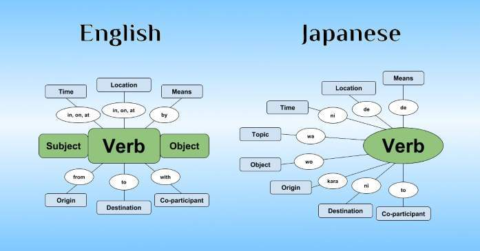

# Grammar



> **TL;DR**
> - Grammar is the **parser** you install once so that every later hour of immersion actually teaches you something. It is not the skill itself - reading and listening are.
> - Start the day after you can read kana without a chart. You do not need kanji or a big vocabulary first.
> - Japanese is not English with different words: particles carry grammatical roles instead of word order, the sentence is head-final, and any "understood" element - including the subject - is routinely invisible.
> - **The path:** one fast structural pass (Cure Dolly's lessons as the spine, [Yokubi](<./yoku.bi grammer guide/YOKUBI_COMPLETE.md>) as the sane cross-check), then immerse hard and re-read. Roughly 3 months of 30 min/day, not 2 years.
> - Everything below the practical guidance is a **reference** you come back to: a [particle reference](#reference-particles) (including the [は vs が problem](#the-hard-one-は-vs-が)), a [conjugation map](#reference-the-conjugation-map), [transitivity pairs](#reference-transitivity-pairs-自動詞--他動詞), and a [keigo primer](#reference-keigo---the-register-ladder).

---

## What this is and why it matters

Grammar is the set of rules that turns a pile of words into a message: what attaches to what, who did what to whom, when, and with what attitude. In Japanese it is the single highest-leverage thing you can study early, because Japanese grammar is *productive and regular* in a way that English grammar is not. Learn about 60 patterns properly and you can decode an enormous fraction of real sentences.

But grammar study has a hard ceiling. You do not become fluent by reading explanations; you become fluent by understanding thousands of real messages. The purpose of a grammar guide is to get you to the point where a native sentence is *parseable* - where the only thing stopping you is a word you do not know, which you can look up. That is the finish line for Phase 1 of your Japanese life, and it is reachable in months, not years.

### Why Japanese grammar is genuinely different

Not "harder". Different in specific, learnable ways. These eight facts cause most beginner confusion:

**1. The verb goes last (SOV, and more precisely head-final).**
Every modifier precedes what it modifies, and the thing that determines the sentence's meaning - the predicate - arrives at the end.

```
私が　図書館で　本を　読む。
わたしが　としょかんで　ほんを　よむ。
watashi ga  toshokan de  hon o  yomu.
I (subject) - library (location) - book (object) - read.
```

You cannot start translating until you have heard the end. This is why beginners can "understand every word" and still miss the sentence: the negation, the tense, the "want to", and the politeness are all glued onto that final verb.

**2. Particles do the job that word order does in English.**
In English, "the dog bit the man" and "the man bit the dog" differ only by position. In Japanese, position is flexible and the particles carry the roles:

```
犬が　男を　噛んだ。    inu ga otoko o kanda.    The dog bit the man.
男を　犬が　噛んだ。    otoko o inu ga kanda.    The dog bit the man. (same meaning, different emphasis)
男が　犬を　噛んだ。    otoko ga inu o kanda.    The man bit the dog. (different meaning)
```

Moving words around changes emphasis. Moving *particles* changes who did what. This is the single most useful thing to internalise in week one.

**3. There is a topic system on top of the subject system.**
は marks what the sentence is *about*; が marks the grammatical subject. English fuses these; Japanese does not. This is why は vs が has its own [section below](#the-hard-one-は-vs-が) - it is the hardest single problem in the language.

**4. Anything understood from context gets dropped - including the subject.**
"お腹が空いた" (onaka ga suita) is a complete sentence meaning "I'm hungry". There is no 私. Japanese has *zero pronouns*: a slot that is grammatically present and semantically filled by context, but phonetically empty. The important consequence: the sentence is not subjectless, the subject is *invisible*, and if you cannot say what it is, you have not understood the sentence. Both Jay Rubin's [Making Sense of Japanese](<./Books/Making Sense of Japanese What the Textbooks Don't Tell You/Making Sense of Japanese What the Textbooks Don't Tell You.pdf>) (its opening chapter is literally titled "The Myth of the Subjectless Sentence") and Cure Dolly's course ([lesson 2](<./Cure Dolly - Organic Japanese Guide/cure-script-main/config/docs/en/2-the-invisible-carriage-and-the-を-particle.md>), [lesson 66](<./Cure Dolly - Organic Japanese Guide/cure-script-main/config/docs/en/66-hidden-subjects-in-japanese-and-how-to-understand-them.md>)) build their entire approach on this point.

**5. Verbs do not agree with anything.**
No person, no number, no gender. 食べる is "eat / eats / will eat", and it is the same whether the eater is me, you, or forty thousand people. All the conjugation machinery goes into tense, polarity, politeness, mood, voice, and evidentiality instead - which is where the real work is.

**6. Adjectives conjugate like verbs.**
高い (takai, "is-expensive") is not "expensive" - it is a predicate with the "is" built in. It takes its own past (高かった), its own negative (高くない), its own て-form (高くて), its own conditional (高ければ). There is no copula on it because it *is* one. Learners from European languages consistently try to say 高いでした, which does not exist.

**7. The copula is だ, not です.**
です is the polite form of だ. Textbooks that open with です teach you the eccentric form first and the standard form later, which is how people end up unable to read a manga panel.

**8. "は is the subject marker" is a beginner lie.**
It is taught because it is *usually harmless* for the first fifty sentences. Then you hit 私はうなぎだ ("as for me, it's eel" - what you are ordering at a restaurant, not a confession of being an eel), and 象は鼻が長い ("as for elephants, the nose is long"), and 私は日本語が分かる, and the lie collapses. Cure Dolly's [lesson 3](<./Cure Dolly - Organic Japanese Guide/cure-script-main/config/docs/en/3-the-は-particle.md>) uses exactly that eel joke to make the point.

---

## Basic terms, and an honest beginner's orientation

The eight facts above tell you *that* Japanese is differently shaped. This section is the layer underneath them: **the vocabulary of the field, and the ten-minute version of how a Japanese sentence works.** It exists because everything below this point - and every resource this page recommends - starts using 助詞, 連用形, ichidan, 形容動詞, copula, topic and sonkeigo within a paragraph or two, and almost nobody stops to define them.

Boundaries, so nothing is duplicated. This section gives the **one-line version** of each idea and then links inward. The depth is in [the particle reference](#reference-particles), [the conjugation map](#reference-the-conjugation-map), [the transitivity list](#reference-transitivity-pairs-自動詞--他動詞) and [the keigo primer](#reference-keigo---the-register-ladder); the errors these ideas cause are enumerated in [common pitfalls](#common-pitfalls). Word segmentation, word strata and counters belong to [Vocabulary](../Vocabulary/readme.md); the scripts belong to [Kana](../Kana/readme.md) and [Kanji](../Kanji/readme.md).

**The honest warning first: do not *study* this section.** Read it once, fast, then go start [a real guide](#recommended-path-opinionated). A glossary is a map, not a journey, and one of the quieter ways to waste a month is to become fluent in grammatical terminology instead of Japanese. Yokubi's [Preamble](<./yoku.bi grammer guide/yokubi-main/src/Preamble.md>) says it better than this page can: "This grammar guide does its best to give you some basic exposure to Japanese grammar. It can't **teach** you it. It can only introduce you to it. Your job is to turn that exposure into acquisition. The exposure is just a foot in the door."

### The ten-minute orientation

Start where Yokubi starts, because it does not start with grammar points. Its [Lesson 0](<./yoku.bi grammer guide/yokubi-main/src/Section1/Part1/Lesson0.md>) is about **parsing**, and it states the dependency plainly: "if you cannot 'parse' a sentence, you will not understand its meaning. If you do not understand its meaning, you cannot acquire the language used in it." Every row in the table below is a fact about how to cut a Japanese sentence into pieces. That is the whole job of week one.

| What English trained you to expect | What Japanese does instead | Why it matters on day one |
| :--- | :--- | :--- |
| **Word order assigns the roles.** "The dog bit the man." | **Particles assign the roles.** が marks the subject, を the object, and moving the words changes emphasis rather than facts. Yokubi calls them "case-marking particles" and says a particle "marks" a role ([Lesson 3](<./yoku.bi grammer guide/yokubi-main/src/Section1/Part1/Lesson3.md>)). | Read particles first, word positions second. This is the single highest-value habit to install - see [the particle reference](#reference-particles). |
| The verb sits in the middle. | **The predicate (述語) is last.** Verb, い-adjective, or noun-plus-copula: one of the three, at the end, carrying the tense, the polarity, the politeness and the mood. | You cannot begin interpreting until you reach the end. Find the predicate, then work leftward. That is the [bracket drill](#measuring-progress). |
| Modifiers attach on both sides of a noun ("the *blue* dress *I bought*"). | **Modifiers only ever precede what they modify.** A whole clause can sit in front of a noun with no "that" or "which" to warn you ([Lesson 14](<./yoku.bi grammer guide/yokubi-main/src/Section1/Part1/Lesson14.md>)). | 私が昨日買った本 is one noun phrase, not a sentence. Mis-slicing this is the commonest parse failure after は vs が. |
| Prepositions come before their noun. | **Everything grammatical comes after its host.** Particles, the copula and every auxiliary attach to the right of the thing they act on. | "Postposition", not preposition. It is why the language reads as a stack rather than a tree of brackets. |
| Spaces show you where words end. | **No spaces at all.** Segmentation is an inference you make, not information on the page. | Get a popup dictionary before you get a grammar guide. [Vocabulary](../Vocabulary/readme.md#what-counts-as-one-word) owns this problem; [General content](<../General content/readme.md>) owns the tooling. |
| Nouns carry number, gender and an article. | **None of the three.** No grammatical gender, no obligatory plural, no articles. 達 and friends exist but "none of them are a true plural" ([Lesson 2](<./yoku.bi grammer guide/yokubi-main/src/Section1/Part1/Lesson2.md>)). | 本 is "book", "the book", "a book" or "books". Stop trying to recover the missing information; context carries it. Some of the definiteness work English does with the/a is carried by は vs が instead - Yokubi draws that comparison directly. |
| Verbs agree with their subject. | **No agreement whatsoever** - not person, not number, not gender. 食べる is the same word for one eater or forty thousand. | Every conjugation you learn is doing something *else*: tense, polarity, politeness, mood, voice, evidentiality. That is where the machinery went. |
| Three tenses. | **Two**: past and non-past. Aspect does the rest. | "Non-past" is not pedantry - the dictionary form usually refers to the *future*, and what English calls the present is normally 〜ている. Table below. |
| "is / are / was" is a verb you conjugate. | **The copula だ**, with です as its polite form and である as its literary one. | Discussed carefully below, because this is the most mis-taught item in beginner Japanese. |
| Adjectives need a separate "is". | **い-adjectives already contain it.** 高い is "is-expensive", so it takes its own past (高かった) and its own negative (高くない). There are two adjective classes and only one of them inflects. | There is no 高いでした. See [Adjectives](#adjectives). |
| Subject and object are obligatory. | **Anything understood is dropped.** Yokubi: Japanese is "a pro-drop language... anything that can be implied or understood from the context can be omitted" ([Lesson 0](<./yoku.bi grammer guide/yokubi-main/src/Section1/Part1/Lesson0.md>)). | Omitted is not absent. If you cannot name who the sentence is about, you have not understood it - [pitfall 2](#2-believing-japanese-has-no-subject). And stop saying 私は: [pitfall 5](#5-over-using-私は). |
| Politeness is word choice and tone. | **Politeness is grammar, and it rides on the predicate.** Yokubi: "the polite tone of the language presents itself as a specific grammatical feature" ([Lesson 17](<./yoku.bi grammer guide/yokubi-main/src/Section1/Part1/Lesson17.md>)). | You are choosing a register with every sentence whether you meant to or not. Recognise, do not produce - [keigo](#reference-keigo---the-register-ladder) and [pitfall 8](#8-trying-to-produce-keigo-too-early). |
| One verb covers "the door opens" and "I open the door". | **Two different words**, each with its own particle: 開く takes が, 開ける takes を. | This is vocabulary, not grammar, and there is no shortcut - [transitivity pairs](#reference-transitivity-pairs-自動詞--他動詞) and [pitfall 6](#6-ignoring-transitivity). |
| Questions reorder the sentence ("do you..."). | **か, or just intonation.** Nothing moves. | Questions are the easiest thing in the language. Enjoy it while it lasts. |
| You count things with bare numbers. | **Counters (助数詞) are obligatory** and the sound changes are irregular. | Closed system, high frequency, worth one boring early pass. Owned by [Vocabulary](../Vocabulary/readme.md#counters-numbers-and-dates). |
| Conjugation fuses the word (go -> went). | **Conjugation stacks parts.** 見られたくなかった is a pile of separate pieces, and Yokubi says so outright ([Lesson 4](<./yoku.bi grammer guide/yokubi-main/src/Section1/Part1/Lesson4.md>)). | Learn to peel from the right. This is why the system is nearly regular and why [the stem system](#the-stem-system) is worth more than a table of memorised forms. |

**One rule generates three of those rows.** Japanese is consistently head-final and consistently postpositional: every head sits to the right of what depends on it, and every grammatical marker sits to the right of what it marks. Cure Dolly reduces it to two sentences in [lesson 46](<./Cure Dolly - Organic Japanese Guide/cure-script-main/config/docs/en/46-word-order-matters-2-simple-rules-to-crack-tough-sentences.md>) - the predicate always goes at the end of the sentence, and "anything that modifies any-THING must go before it." Internalise those two and you can find the skeleton of a sentence you cannot yet translate.

**A live disagreement, since this page recommends both guides.** Yokubi says flatly that "Japanese is an SOV language (Subject-Object-Verb)" and then immediately hedges that "this order is not a rule but a general recommendation". Cure Dolly's lesson 46 calls the SOV label nonsense, on the grounds that メアリーがスーザンをなぐった and スーザンをメアリーがなぐった mean the same thing, so subject-before-object is a statistical habit rather than a rule - while insisting that word order *does* matter, in exactly the two ways just stated. They are describing the same language and neither is lying to you. Take the label from Yokubi if it gets you moving, and the rule from Dolly once sentences get long. What you must not do is take SOV literally and start building Japanese by permuting English - that is [pitfall 3](#3-translating-word-for-word-from-english).

**Tense, and why "non-past" is not pedantry.**

| Form | Usual name | What it actually covers |
| :--- | :--- | :--- |
| 食べる | non-past (終止形, dictionary form) | Habits, general truths, and **most ordinary statements about the future**. Action happening *right now* is usually not this form. |
| 食べている | 〜ている | An ongoing action **or** a continuing state left by a completed one. This, not the dictionary form, is what English "is eating" corresponds to. |
| 食べた | past | Completed. Also used for completion *inside* a hypothetical or future frame, which is why it is sometimes called the completed form. |

Yokubi [Lesson 1](<./yoku.bi grammer guide/yokubi-main/src/Section1/Part1/Lesson1.md>) is direct about it: "ordinary statements about the future use the plain form most of the time. This is where the name 'non-past' comes from" - and it warns you not to treat the names as rules. Cure Dolly's [lesson 4](<./Cure Dolly - Organic Japanese Guide/cure-script-main/config/docs/en/4-japanese-verb-tenses.md>) makes the same point from the English side: "I eat cake" is not what an English speaker says while eating cake either, so the Japanese non-past is less alien than its name suggests.

**The thing that actually costs you comprehension is aspect, not tense.** 死んでいる is "he is dead", not "he is dying", because for that verb 〜ている marks the enduring state left behind rather than an action in progress. Yokubi's [Lesson 22](<./yoku.bi grammer guide/yokubi-main/src/Section1/Part2/Lesson22.md>) splits it into "enduring action" and "enduring state" and is worth reading early for that one distinction alone; it also warns that てある "should not be considered 'the passive' version of the verb". Misreading 〜ている in a manga panel changes the plot, which is more than a wrong tense usually does.

**The copula, stated carefully.** **だ is the copula. です is its polite form; である is the literary one.** The test that settles it is which one carries the grammar: the copula is the thing that inflects - だ -> だった / じゃない / なら / で / な - while です is a politeness layer on top, to the point that Yokubi notes it "can even act just like a filler word with no added meaning" ([Lesson 1](<./yoku.bi grammer guide/yokubi-main/src/Section1/Part1/Lesson1.md>)). That is precisely why 高いです is fine and **高いでした does not exist**: 高い is already a predicate containing the "is", so です is adding politeness and nothing else, and there is nothing there for it to put into the past. See [pitfall 7](#7-assuming-です-is-the-copula) and [the copula table](#adjectives).

Two honest footnotes. Yokubi's Lesson 1 counts だ and です as "two copulas" rather than as one copula plus a polite form - but the same lesson says "です is the polite version of だ", so the two framings are not disagreeing about the language, only about how to count. And in real conversational Japanese the copula is frequently just left off: この部屋は静か is a complete, valid sentence, "despite this being what is traditionally taught in school" ([Lesson 15](<./yoku.bi grammer guide/yokubi-main/src/Section1/Part1/Lesson15.md>)).

**Topic and comment.** Japanese sets up what it is talking about, then says something about it, and keeps relating new statements back to that frame until the frame changes. Yokubi's Lesson 0 calls this being a "topic driven language" and says that tracking how the topic changes "is fundamental to get a good 'parse' on a sentence". は marks that frame - the 主題 - and が marks the grammatical subject, the 主語. They are not alternatives, which is why 象は鼻が長い has one of each and is not a sentence with two subjects. **は is not the subject marker** ([pitfall 1](#1-treating-は-as-the-subject-marker)), and the full treatment - six rules and a default policy - is [here](#the-hard-one-は-vs-が). Do not attempt to master that section in week one; see [pitfall 10](#10-trying-to-master-each-point-before-moving-on).

### Basic terms - the Japanese side

These are the words Japanese-language grammar sources, dictionary tags and school textbooks use. You do not need to produce any of them. You need to recognise them, because they are what a native-audience reference, a JMdict part-of-speech tag or a Japanese teacher will hand you.

| Term | Reading | What it means | Where this guide treats it |
| :--- | :--- | :--- | :--- |
| 文法 | ぶんぽう | Grammar. 日本語文法 is the search term that gets you native-audience material. | - |
| 品詞 | ひんし | **Part of speech.** Japanese school grammar recognises exactly ten of them. | [terminology clash](#where-the-two-vocabularies-disagree) |
| 自立語 / 付属語 | じりつご / ふぞくご | Independent word (can stand on its own) vs dependent word (cannot). 助詞 and 助動詞 are the dependent ones. | [terminology clash](#where-the-two-vocabularies-disagree) |
| 体言 | たいげん | A non-inflecting independent word that can serve as a subject - in practice, nouns and pronouns. | below |
| 用言 | ようげん | An **inflecting** independent word that can serve as a predicate: 動詞, 形容詞, 形容動詞. The 体言/用言 split is the one that actually matters, because 用言 are the words with conjugation tables. | [the conjugation map](#reference-the-conjugation-map) |
| 名詞 / 代名詞 | めいし / だいめいし | Noun / pronoun. Japanese pronouns "act just like normal nouns most of the time" and are not obligatory ([Lesson 2](<./yoku.bi grammer guide/yokubi-main/src/Section1/Part1/Lesson2.md>)). | [pitfall 5](#5-over-using-私は) |
| 動詞 | どうし | **Verb.** Three classes in learner terms, five in school terms. | [verb groups](#verb-groups-and-the-terminology-problem) |
| 形容詞 | けいようし | **い-adjective.** A 用言: it inflects, and it contains its own "is". | [Adjectives](#adjectives) |
| 形容動詞 | けいようどうし | The school-grammar name for a **な-adjective** - literally "adjectival verb", which is close to the worst possible name in English. Dictionaries do keep 名詞 and 形容動詞 as separate categories ([Lesson 15](<./yoku.bi grammer guide/yokubi-main/src/Section1/Part1/Lesson15.md>)). | [Adjectives](#adjectives) |
| 連体詞 | れんたいし | A part of speech English guides drop entirely: non-inflecting words that do nothing but modify a following noun - この, その, あの, いわゆる, and **大きな / 小さな**. This is why 大きなかった does not exist: 大きな is not an い-adjective at all. | [terminology clash](#where-the-two-vocabularies-disagree) |
| 副詞 | ふくし | **Adverb.** "True" 副詞 take no particle and can sit almost anywhere in the sentence; others are built with と, に or the 〜く form of an い-adjective ([Lesson 31](<./yoku.bi grammer guide/yokubi-main/src/Section2/Part3/Lesson31.md>)). | [Adjectives](#adjectives) |
| 助詞 | じょし | **Particle.** Split four ways: 格助詞 (case), 接続助詞 (conjunctive), 副助詞 (adverbial), 終助詞 (sentence-final). | [the particle reference](#reference-particles) |
| 格助詞 | かくじょし | A **case-marking** particle: が, を, に, で, へ, と, から, まで, の. These are the ones that define the logical structure. Note what is *not* on the list. | [core structural particles](#core-structural-particles) |
| 終助詞 | しゅうじょし | A **sentence-final** particle: ね, よ, な, ぞ, ぜ, わ, さ, かな. Where casual Japanese lives, and where polite textbooks are silent. | [sentence-ending particles](#sentence-ending-particles) |
| 助動詞 | じょどうし | **Auxiliary.** In school grammar this class contains ない, たい, ます, た, う/よう, れる/られる, せる/させる, らしい, そうだ - and だ itself. They are dependent words that attach to a 用言 and then inflect in their own right. | [the stem system](#the-stem-system) |
| 接続詞 / 感動詞 | せつぞくし / かんどうし | Conjunction / interjection. The two 品詞 nobody argues about. | - |
| 活用 | かつよう | **Inflection / conjugation.** A word that does it is a 活用語; the six 活用形 below are its bases. | [the conjugation map](#reference-the-conjugation-map) |
| 活用形 | かつようけい | One of the six named bases: 未然形, 連用形, 終止形, 連体形, 仮定形, 命令形. | [the stem system](#the-stem-system) |
| 語幹 / 活用語尾 | ごかん / かつようごび | The **invariant root** vs the **inflecting tail**. For 食べる the 語幹 is 食べ; for 書く it is the 書 part, with か/き/く/け/こ as the tail. This is *not* what English guides mean by "stem" - see below. | [the stem system](#the-stem-system) |
| 未然形 | みぜんけい | The base that ない and う/よう attach to: 書か / 書こ. | [the stem system](#the-stem-system) |
| 連用形 | れんようけい | The base that ます, た and て attach to, and the one that joins clauses and builds compound verbs: 書き. **This is what learner guides call the ます-stem or i-stem.** | [the stem system](#the-stem-system) |
| 終止形 | しゅうしけい | The form a sentence ends on - i.e. the dictionary form. | [the master form table](#the-master-form-table) |
| 連体形 | れんたいけい | The form used **before a 体言**. For modern verbs it is identical to the 終止形, which is why learner guides never name it - but it is *not* identical for the copula (だ -> **な**), and that single fact is why 静かな部屋 exists and why a relative clause may not end in だ ([Lesson 14](<./yoku.bi grammer guide/yokubi-main/src/Section1/Part1/Lesson14.md>)). | [Adjectives](#adjectives) |
| 仮定形 / 命令形 | かていけい / めいれいけい | The base ば attaches to, and the imperative. Both are 書け for a godan verb. | [the master form table](#the-master-form-table) |
| 自動詞 / 他動詞 | じどうし / たどうし | **Intransitive / transitive.** Paired lexically, and the particle is the tell: が vs を. | [transitivity pairs](#reference-transitivity-pairs-自動詞--他動詞) |
| 主語 | しゅご | **Subject.** Marked by が when it is marked at all, and frequently not visible. | [は vs が](#the-hard-one-は-vs-が) |
| 主題 | しゅだい | **Topic.** Marked by は. Not a grammatical role - a frame around the sentence. Note that this term comes from 日本語学, not from school grammar, and its absence there is the root of the whole は confusion. | [は vs が](#the-hard-one-は-vs-が) |
| 述語 | じゅつご | **Predicate.** The verb, い-adjective, or noun-plus-copula at the end. Locating it is move one of every parse. | [measuring progress](#measuring-progress) |
| 格 | かく | **Grammatical case** - the role a noun plays. Japanese marks it with particles rather than with word order or endings, hence 格助詞. | [core structural particles](#core-structural-particles) |
| 節 | せつ | **Clause.** 主節 main, 従属節 subordinate, 連体修飾節 the noun-modifying kind English calls a relative clause. | [Lesson 14](<./yoku.bi grammer guide/yokubi-main/src/Section1/Part1/Lesson14.md>) |
| 態 | たい | **Voice**: 能動態 active, 受動態 passive, 使役 causative. Japanese 〜れる/られる is closer to "receptive" than to the English passive. | [the master form table](#the-master-form-table) |
| 時制 / アスペクト | じせい / - | Tense / aspect. Two tenses; the aspectual work is done by 〜ている, 〜てある, 〜てしまう and friends. | [the て-form](#the-て-form-and-the-た-form) |
| 敬語 | けいご | **Honorific language**, the whole system. | [keigo](#reference-keigo---the-register-ladder) |
| 丁寧語 / 尊敬語 / 謙譲語 | ていねいご / そんけいご / けんじょうご | Polite (toward the listener) / honorific (raising someone else) / humble (lowering yourself). **Three independent axes, not three levels of one scale.** | [the four registers](#the-four-registers) |
| 文型 | ぶんけい | **Sentence pattern** - the unit Japanese teaching materials and JLPT prep actually organise grammar into, rather than the "grammar point". There are 13,220 of them as queryable data in this folder. | [machine-readable data](#machine-readable-grammar-data) |

### Basic terms - the English-side jargon

The other half of the problem: the English words learner resources use without defining, several of which mean something different from what they mean in a Latin or German class. If the general linguistic vocabulary is what is tripping you up rather than the Japanese, Ixrec wrote a whole page for exactly that and it is [in this repo](<./Ixrec Guide to Japanese/ixrec.neocities.org/GT.html>).

| Term | What it means here, and the trap in it |
| :--- | :--- |
| **Particle** | A short, non-inflecting marker that attaches to the *end* of what it marks. Nearly meaningless in isolation, which is why every entry in [the reference](#reference-particles) has an example sentence. |
| **Copula** | The "is" word: **だ**, politely です, literarily である. The trap is assuming です is the copula and だ a casual abbreviation of it. It is the other way round - [pitfall 7](#7-assuming-です-is-the-copula). |
| **Topic vs subject** | Topic = what the sentence is *about* (は). Subject = who does the verb or what the adjective describes (が). English fuses them; Japanese does not, and a sentence can carry both. |
| **i-adjective vs na-adjective** | Two classes. い-adjectives are real 用言 and inflect (高い / 高かった / 高くない). な-adjectives do not inflect at all - the copula attached to them does, which is the whole reason な-adjective behaviour looks like copula behaviour. Watch 綺麗, 嫌い, 幸い: the い is part of the reading, not an ending. |
| **Adjectival noun** | The other name for a な-adjective, used by linguists and by Cure Dolly. It leans the opposite way from school grammar's 形容動詞 ("adjectival verb"). Both names describe the same behaviour; pick one and translate when you talk to people. |
| **godan / ichidan** | The standard class names, and the ones this guide uses. 五段 "five rows" because the final kana moves across its consonant row; 一段 "one row" because it does not. Also sold as **Group 1 / Group 2**, **u-verbs / ru-verbs**, and consonant-stem / vowel-stem verbs. Group 3 or "irregular" means する and 来る, and that is the entire list. See [verb groups](#verb-groups-and-the-terminology-problem). |
| **Stem** | Dangerously overloaded. In English learner guides it means one of the *bases* a helper attaches to - the "ます-stem", the "i-stem", the "a-stem" - which in Japanese terms are 活用形, not 語幹. In Japanese, 語幹 means the invariant root. Same word, two different objects. |
| **Auxiliary / helper verb / helper adjective** | A word that attaches to a base and then inflects itself. ます is a helper verb; ない and たい inflect like adjectives, which is why 食べたくなかった decomposes instead of being memorised. Japanese school grammar files all of these as 助動詞. See [the stem system](#the-stem-system). |
| **Transitive / intransitive** | Takes を / cannot take を. In Japanese these are usually two separate *words* rather than two uses of one word, so it is a vocabulary problem wearing a grammar costume - [transitivity pairs](#reference-transitivity-pairs-自動詞--他動詞). |
| **Plain vs polite form** | だ-land vs です/ます-land. Plain is the *default*, not slang, and not rude. Polite is an overlay. Mixing them mid-conversation without meaning to is the one register error worth avoiding early. |
| **Dictionary form / lemma** | The uninflected headword (食べる), which is what a dictionary and your flashcard store. Text contains inflected surface forms (食べさせられなかった), and running one back to the other is **deconjugation** - there is an executable ruleset for it [in this folder](<./Deconjugation Rules (Yomitan - Yomichan)>). |
| **Non-past** | The dictionary form, named honestly: it covers habits, general truths and most future statements. Calling it "present" makes you expect it to describe what is happening right now, which it usually does not. |
| **Zero pronoun** | A subject (or object) that is grammatically present and filled by context but phonetically empty. The term matters because it forces the right question - not "is there a subject" but "which one" - [pitfall 2](#2-believing-japanese-has-no-subject). |
| **Head-final** | The head of a phrase sits to the right of everything that depends on it. One property, from which SOV order, modifier-before-noun order and postpositions all follow. |
| **Agglutinative** | Forms are built by stacking separable pieces rather than by fusing the word. It is why 見られたくなかった is long and why it is also *regular*. |
| **Attributive vs predicative** | Modifying a following noun (静か**な**部屋, 高い本) vs ending the sentence (静か**だ**, 高い). Japanese distinguishes these forms; English mostly does not. This is the 連体形/終止形 distinction under an English name. |
| **Nominaliser** | Something that turns a clause into a noun so it can take a particle: の, こと, ところ, or the 連用形 of a verb. |
| **Register** | Which social band a sentence is pitched at. In Japanese this is grammatically encoded, not optional decoration - [keigo](#reference-keigo---the-register-ladder). |

### Where the two vocabularies disagree

This is the part almost nothing documents, and it costs real time. Japanese school grammar (学校文法, what Japanese schoolchildren are taught) and the grammar taught to foreign learners (日本語教育文法) are **two different analyses of the same language, built for different purposes.** School grammar classifies by meaning and function; learner grammar classifies by sound and by output form, because that is what a person trying to produce a sentence needs. Neither is wrong, and you will meet both.

| The thing | 学校文法 calls it | Learner resources call it | Why the mismatch bites |
| :--- | :--- | :--- | :--- |
| な-adjectives | 形容動詞, "adjectival **verb**" | na-adjective, or adjectival **noun** | The two traditions lean in opposite directions about what it really is. What you need from either is the same: 静かだった yes, 静かかった no. |
| Verb classes | Five: 五段, 上一段, 下一段, カ行変格, サ行変格 | Three: godan, ichidan, irregular | School grammar splits 一段 by vowel row (見る vs 食べる) and names the irregulars by kana row. Learner guides collapse both splits because they change nothing in modern conjugation. Do not panic when a Japanese source lists five. |
| Conjugation | Six bases: 未然形, 連用形, 終止形, 連体形, 仮定形, 命令形 | A dozen-plus named outputs: ます-form, ない-form, て-form, た-form, ば-form, volitional, potential, passive | **School grammar names the base; learner grammar names the result.** They are not in one-to-one correspondence, which is why a clean conversion table does not exist. [The stem table](#the-stem-system) in this guide is the bridge - it lists both. |
| "Stem" | 語幹 - the part that never changes | any base a helper attaches to | Two different objects, one English word. 書き is a 連用形, not a 語幹. |
| たい, ない | 助動詞 that inflect on the 形容詞 pattern | "helper adjectives" (Cure Dolly), or just part of the conjugation | The least harmful disagreement on this list and the one that looks most like one: both traditions agree the thing inflects like an adjective, and only the label differs. |
| 大きな, 小さな, この | 連体詞 - its own part of speech | usually not mentioned at all | English guides have no such category, so 大きな reads as a broken い-adjective rather than as a different word. |
| は | 副助詞 (specifically 提題の副助詞), explicitly **not** a 格助詞 | "topic particle", or Cure Dolly's "non-logical particle" | Here the two traditions actually *agree*, and both disagree with the beginner intuition: は is not a case marker in either analysis. |
| The は-phrase in 象は鼻が長い | 主語 (subject), with 鼻が長い as the 述部 | 主題 (topic), explicitly not the subject | The load-bearing one. See below. |

**The は problem is a native disagreement, not a translation artefact.** School grammar analyses 象は鼻が長い by calling 象は the **主語** and 鼻が長い the 述部, containing its own subordinate subject 鼻が. That is a large part of why [pitfall 1](#1-treating-は-as-the-subject-marker) is so hard to shake: "は is the subject marker" is not merely a foreign textbook's shortcut, it is roughly what Japanese children are taught. Pushing the other way, 三上章's 『象は鼻が長い』 (1960) argued 主語廃止論 - that Japanese has no subject at all, and 象は is a topic - which is the respectable ancestor of the claim that [pitfall 2](#2-believing-japanese-has-no-subject) tells you not to make. The argument has run since the Taishō era and is not settled.

**This guide takes neither position.** は marks the 主題, が marks the 主語, and when you cannot see the 主語 it has been omitted rather than abolished. The practical reason to prefer that analysis over school grammar's is that it is the one that keeps working: it parses 象は鼻が長い, 私はうなぎだ and 私は日本語が分かる with one rule instead of three exceptions. But understand *why* both popular errors are so persistent - each has a serious pedigree behind it.

**One more consequence worth internalising.** Because these are two analyses rather than one analysis and some mistakes, the *reason* a form exists is often only visible from the Japanese side while the *rule* is only stated clearly on the learner side. Yokubi will tell you, correctly, "don't make relative clauses that end with だ" and leave it there ([Lesson 14](<./yoku.bi grammer guide/yokubi-main/src/Section1/Part1/Lesson14.md>)) - consistent with its own stance that "asking **why** is often not going to lead you anywhere". School grammar tells you why in one word: the 連体形 of だ is な. Which of those two you find more useful is exactly the axis this page's [recommended path](#recommended-path-opinionated) is built on, and it is why the recommendation is to run two guides at once rather than one.

### Week one: what to do, and what to leave alone

The single most valuable thing in Yokubi's [Before you begin](<./yoku.bi grammer guide/yokubi-main/src/Before-you-begin.md>) is not a grammar fact, it is a pacing instruction: "You shouldn't spend a week on each lesson. In fact, one new lesson a day might be too slow... Just don't get stuck reviewing it forever." It also tells you, twice, not to memorise the guide, and that "if you still don't know what to do" the answer is to go learn kana and vocabulary *outside* the grammar guide. That is the correct posture, and it is the opposite of how most people approach a new language.

| Do this in week one | Not this | Why |
| :--- | :--- | :--- |
| Find the **predicate** first, then work leftward. | Translate left to right. | The end of the sentence holds the tense, the polarity and the politeness. Reading Japanese in English order guarantees you restart every sentence. |
| Learn が, を, に, で, は as **jobs**. | Learn them as English prepositions. | に is not "to". A particle marks a role; roles do not translate one-to-one. |
| Read a whole guide **fast**, at about 60% comprehension. | Master each lesson before moving on. | The early points only make sense in light of the later ones - [pitfall 10](#10-trying-to-master-each-point-before-moving-on). |
| Learn だ and the plain forms as the **default**. | Start from です/ます and treat だ as slang. | Plain form is the base of the system and the register most of what you will read is written in. The [exception](#recommended-path-opinionated) is real: if you need to speak to colleagues next month, go polite-first on purpose. |
| Say the whole sentence with **nothing** where the subject would be. | Open every sentence with 私は. | 私は is *marked* and means "as for me, unlike other people" - [pitfall 5](#5-over-using-私は). |
| **Recognise** keigo when a shop assistant uses it. | Try to produce it. | Wrong keigo is worse than correct plain politeness - [pitfall 8](#8-trying-to-produce-keigo-too-early). |
| Accept that は vs が will take months. | Spend week two on it. | It is the hardest single problem in the language and it resolves with exposure, not with study. The [default policy](#the-hard-one-は-vs-が) is enough to be going on with. |
| Read the Japanese in **kana**. | Read it in romaji. | The conjugation system is nearly regular in kana and looks arbitrary in romaji - that is a real structural argument, not an aesthetic one. See [Romaji](../Romaji/readme.md). |
| Learn vocabulary in parallel, elsewhere. | Learn vocabulary from the grammar guide. | Yokubi's own Preamble: "Grammar guides are a terrible place to learn vocabulary." [Vocabulary](../Vocabulary/readme.md) owns this. |
| Memorise nothing from this section. | Drill the glossary above. | Terminology is a lookup table. It earns its keep the day a guide uses a word you do not know, and not before. |

And when a lesson defeats you, the instruction from Yokubi's Preamble is the right one: "if something is too hard, skip it... You're trying to get something into your head. If you can't, that's fine, you'll pick it up naturally later. Don't look back."

---

## Where it fits in the journey

**Prerequisites:**

| Need | Why | Where |
| :--- | :--- | :--- |
| Hiragana and katakana, readable without a chart | Every guide below writes Japanese in kana from line one | [../Kana/readme.md](../Kana/readme.md) |
| A vocabulary deck already running | Grammar guides are a terrible place to learn words, and their examples are unreadable with a 50-word vocabulary | [../Vocabulary/readme.md](../Vocabulary/readme.md) |
| A pop-up dictionary (Yomitan) or a phone dictionary | You will look up 30 words per lesson and that is normal | [../General content/readme.md](<../General content/readme.md>) |

**Not prerequisites:** kanji (start it in parallel, do not wait), romaji (skip it - see [../Romaji/readme.md](../Romaji/readme.md)), speaking ability, the JLPT.

**What grammar unlocks:**

- **Reading.** Graded readers and easy manga become possible around the end of the basic conjugation phase. See [../Reading/readme.md](../Reading/readme.md).
- **Sentence mining.** You cannot mine a sentence you cannot parse. Grammar is the gate to the whole AJATT loop - see [../AJATT/readme.md](../AJATT/readme.md).
- **Listening comprehension.** Spoken Japanese contracts and drops things (じゃない -> じゃん, ておく -> とく, ている -> てる). You can only hear a contraction of a form you already know.
- **Output.** Producing correct Japanese needs the conjugation map in muscle memory. See [../Speaking/readme.md](../Speaking/readme.md) and [../Writing/readme.md](../Writing/readme.md).

---

## The schools of thought

Nine real options, honestly. All nine have produced fluent speakers; they differ enormously in how much of your time they waste.

### 1. Tae Kim's Guide to Learning Japanese - the community default

A free, complete grammar guide, [353 pages as a PDF](<./Tae Kim Guide to Learning Japanese/grammar_guide.pdf>) in this repo (2012 edition). Its stated thesis, from its own introduction, is that conventional textbooks fail because they "try to teach you Japanese with English" - they teach the polite form before the dictionary form, insert subjects that Japanese omits, and organise material around English phrases instead of Japanese structure. Tae Kim's fix is to build the grammar bottom-up in an order that makes sense in Japanese: writing system, then だ and particles, then adjectives, then verbs, then polite form, then everything else.

- **Pros:** free; casual/plain form first; a genuinely sensible dependency ordering; enormous community familiarity (if you ask a question online, people will answer in Tae Kim's terms); a real reference with a proper table of contents; covers honorific and humble forms (section 5.2), which most immersion-oriented guides skip entirely.
- **Cons:** terse in places where beginners need three examples, not one; the writing is dry; the 2012 PDF is frozen while the website has moved on; a number of his structural framings are contested - Cure Dolly devotes two whole lessons ([77](<./Cure Dolly - Organic Japanese Guide/cure-script-main/config/docs/en/77-real-japanese-structure-vs-tae-kim-structural-review-of-tae-kim-s-japanese-grammar.md>), [78](<./Cure Dolly - Organic Japanese Guide/cure-script-main/config/docs/en/78-breaking-the-core-tae-kim-vs-the-copula-japanese-structure-based-critical-review.md>)) to arguing against his treatment of the copula and sentence core.
- **Best for:** people who want one free, offline, complete, searchable book and can tolerate dryness. Also the best *lookup* guide of the free options because its structure is conventional.

### 2. Cure Dolly's Organic Japanese - the structural model

A YouTube course (~100 lessons) whose transcripts are [in this repo in full](<./Cure Dolly - Organic Japanese Guide/cure-script-main/config/docs/en/>). It is not a list of grammar points; it is a *model* of Japanese, presented with a train metaphor and built up from a single claim.

What the model actually says, from the lessons themselves:

- Every Japanese sentence has exactly two core elements: a subject ("A-car") and a predicate ("B-engine"). There are only three kinds of engine - a verb, an い-adjective, or a noun plus the copula だ ([lesson 1](<./Cure Dolly - Organic Japanese Guide/cure-script-main/config/docs/en/1-the-basic-types-of-sentences.md>)).
- The subject is always marked with が. "が is the center of Japanese grammar... In some sentences we're not going to be able to see the が, but it's always there, and it's always doing the same job."
- When you cannot see the subject, it has been replaced by the **zero pronoun** - the "invisible carriage" - whose value comes from context and whose default is 私 ([lesson 2](<./Cure Dolly - Organic Japanese Guide/cure-script-main/config/docs/en/2-the-invisible-carriage-and-the-を-particle.md>)).
- は is a **non-logical** particle. It can never be the subject or the predicate, and it is not part of the logical structure at all - it flags the topic ("as for X") and sits *on top of* a complete sentence that still has its own invisible が-subject ([lesson 3](<./Cure Dolly - Organic Japanese Guide/cure-script-main/config/docs/en/3-the-は-particle.md>)).
- "Conjugation" in the European sense is the wrong frame. What is really happening is that helper verbs, helper adjectives and helper nouns attach to one of the verb's stems, and the system is close to 100% regular once you look at it in kana rather than romaji ([lesson 7.5](<./Cure Dolly - Organic Japanese Guide/cure-script-main/config/docs/en/7-5-conjugation.md>), [lesson 81](<./Cure Dolly - Organic Japanese Guide/cure-script-main/config/docs/en/81-global-principle-of-all-japanese-word-forms.md>)).
- Consequently, な-adjectives are not adjectives but *adjectival nouns*, and する-verbs are not verbs but *nouns* that may drop を ([lesson 41](<./Cure Dolly - Organic Japanese Guide/cure-script-main/config/docs/en/41-5-key-facts-about-the-basic-structure-of-japanese.md>)).
- The payoff lesson is [lesson 34, "Understand any sentence"](<./Cure Dolly - Organic Japanese Guide/cure-script-main/config/docs/en/34-understand-any-sentence.md>): find the engine, find its A-car (visible or zero), and treat everything else as modifying one of those two. That is a *procedure*, and it works.

- **Pros:** genuinely explanatory rather than descriptive - a huge amount of apparent irregularity becomes regular; the zero-pronoun analysis makes real sentences parseable in a way "は = subject" never does; superb for systematic thinkers; the transcripts here are searchable, interlinked, and faster to review than video.
- **Cons:** the terminology ("A-car", "B-engine", "self-move word", "helper adjective", "logical vs non-logical particle") matches *no other resource*, so you must translate when you talk to anyone else; the videos use a synthesised voice over a 3D avatar with rough audio, which a lot of people cannot get past; and some analyses are non-standard. The transcript repo itself is honest about this - its notes warn that Dolly "sometimes does get a bit too negative towards textbooks", occasionally frames her approach as the only correct one, and that some of her simplifications are "at least slightly inaccurate/wrong". Treat it as a very good working model, not gospel.
- **Best for:** engineers, linguists, and anyone who has already bounced off a textbook and wants to know *why* Japanese does what it does.
- **Note:** the course covers plain vs polite (です/ます, [lesson 17](<./Cure Dolly - Organic Japanese Guide/cure-script-main/config/docs/en/17-polite-japanese-and-the-volitional.md>)) but has no dedicated sonkeigo/kenjougo lesson. Get keigo from Tae Kim 5.2 or from the [primer below](#reference-keigo---the-register-ladder).

### 3. Yokubi (yoku.bi) - the modern, concise one

A community-maintained rewrite of Sakubi, 63 lessons in four parts. Available here as [one single condensed file](<./yoku.bi grammer guide/YOKUBI_COMPLETE.md>) and as the [original per-lesson source](<./yoku.bi grammer guide/yokubi-main/src/SUMMARY.md>). Its own FAQ is unusually candid about what it is: "short, straight to the point, and very direct explanations. It does **not** hold your hand... It **expects** the learner to focus more on immersion and natural content, rather than worry about specific grammar explanations to the tiniest of details." Its changes from Sakubi include adopting standard ichidan/godan terminology, adding a "lesson 0" on sentence anatomy, and re-sourcing almost every example sentence from native media (via [massif.la](https://massif.la/ja)).

- **Pros:** modern, actively maintained, conventional terminology (so it transfers), real native example sentences, explicitly tells you *when* to stop reading and start immersing (the "ABSOLUTE TERRITORY" marker, about two-thirds through); no exercises to get bogged down in; excellent per-lesson structure for spaced re-reading.
- **Cons:** deliberately shallow on some points - it tells you *how*, and says asking *why* "is often not going to lead you anywhere", which is exactly the opposite of what a structural thinker wants; it explicitly says it is not aimed at JLPT learners; no audio.
- **Best for:** the default recommendation for most people. If you want one modern guide that will not waste your time, this is it.

### 4. Imabi - the near-linguistics reference

A free, enormous, extremely deep grammar site, mirrored here (~1,985 HTML pages). Organised into levels: Beginners 1-2, Intermediate 1-2, Advanced 1-2, Veteran I-II, plus Classical Japanese and Okinawan. It goes into etymology, historical forms, dialect, and register distinctions that no other English resource touches.

- **Pros:** the deepest free English-language treatment of Japanese grammar that exists; when you have a question no other guide answers, Imabi usually answers it; covers Classical Japanese, which matters if you read older literature or want to understand where ぬ/む/べき come from.
- **Cons:** punishing as a first pass - dense, long, jargon-heavy, and it will happily give you eight competing historical analyses of a particle you just wanted to use; slow going even for advanced learners.
- **Best for:** targeted lookup once you are intermediate, not as a curriculum.
- **Mirror caveat:** read [Important note.txt](<./imabi.org blog offline copy/Important note.txt>) before you rely on the offline copy. At snapshot time (2025/10) the site was mid-"SITE REMODEL" with only 54% of pages remodelled, so some pages in the mirror are older versions.

### 5. Sakubi - "Yesterday's Grammar Guide"

The minimalist ancestor. 54 lessons, single HTML page, public domain (CC0), unmaintained since late 2017. Deliberately terse, with "intermissions" on phonology and jargon between lessons, and a philosophy of getting you to real Japanese as fast as physically possible.

- **Pros:** you can skim the entire thing in a weekend; genuinely free of fluff; the best option if you want a grammar *overview* rather than a course; single file, works anywhere.
- **Cons:** superseded by Yokubi in essentially every respect (Yokubi's author had the original author's blessing); unmaintained; some phrasings the Yokubi author describes as "questionable statements that were incorrect or very opinionated".
- **Best for:** historical interest, or a 3-hour skim before you commit to a longer guide. Otherwise use Yokubi.

### 6. The textbook route - Genki, Teach Yourself, Japanese for You

Structured courses with dialogues, exercises, audio, and a fixed syllabus. This repo has [Teach Yourself Japanese Complete Course](<./Books/Teach Yourself Japanese Complete Course/Book.pdf>) (183 pages plus 30 audio tracks) and [Japanese for You: The Art of Communication](<./Books/Japanese for You The Art of Communication/Japanese for you.pdf>) (104 pages, two audio tracks, lessons organised by communicative function - Lesson 1 is 描写する "Description").

- **Pros:** you always know what to do next; exercises force production, which nothing else here does; audio from day one; graded, tested dialogues; if you ever take a class or a course in Japan, this is the register and sequence they will use; genuinely the best route if you need certified progress on a deadline.
- **Cons:** slow (a year of Genki gets you roughly where three months of Yokubi plus immersion gets you); expensive if bought new; **polite-first**, which means the Japanese you can actually produce sounds nothing like the Japanese in Berserk, Chainsaw Man, or any anime you will actually watch; it teaches grammar as a *list of points* rather than a system, which is exactly the complaint Tae Kim opens his guide with; and the vocabulary drifts out of date.
- **Best for:** people in a class, people who need external structure to not quit, and people who want the polite register first because they will be speaking to colleagues before they read manga.

### 7. Bunpro - SRS for grammar

A paid web service that turns grammar points into spaced-repetition items, organised by JLPT level, with example sentences and audio. (Historically it offers a free trial without a credit card; check current terms.)

- **Pros:** it *forces review*, which is the failure mode of every free guide - you read Tae Kim once and forget 70% of it; large banks of example sentences with audio; the JLPT-level organisation is genuinely useful if you are sitting an exam; good for filling gaps you can identify.
- **Cons:** it can turn grammar into flashcard trivia - you learn to recognise "〜ざるを得ない: N2" in a cloze and still fail to notice it in a novel; it is an *SRS*, so it costs daily time forever, competing with the vocabulary reviews that give you more per minute; and the JLPT ordering is not a good *learning* ordering. Paid.
- **Best for:** a second pass after a free guide, especially with a JLPT date on the calendar. Not a first pass. (For Anki mechanics, FSRS settings, and deck configuration, see [../General content/readme.md](<../General content/readme.md>) - this is only about Bunpro as a grammar curriculum.)

### 8. A Dictionary of Japanese Grammar (DoJG) - reference, NOT a curriculum

Be explicit about this, because people get it wrong: **DoJG is a dictionary.** You do not read it front to back. It is three volumes (Basic, Intermediate, Advanced) of alphabetically-ordered entries, each giving a pattern, its formation, register notes, several example sentences, and - the real value - a "related expressions" section contrasting it with the five patterns you keep confusing it with. This repo has a [single-page HTML reference covering all three volumes](<./DoJG grammer guide/日本語文法辞典.html>) and a [DoJG Anki deck](<./DoJG grammer guide/DoJG anki deck.apkg>).

- **Pros:** the best "what is the difference between X and Y" resource in English, full stop; the example sentences are clean and well chosen; the cross-references are worth the price of admission.
- **Cons:** useless as a study plan (no ordering, no progression, no narrative); the entry format assumes you know grammatical terminology; the Anki deck is a trap - 200+ abstract grammar-point cards with no context is exactly the "grammar as trivia" failure mode. Use the deck as a *browsable index*, not as a daily review load.
- **Best for:** the thing you open when immersion throws you a pattern you half-recognise.

### 9. "Just immerse, grammar will emerge" - the extreme AJATT position

The claim: children acquire grammar without explanation, so explicit grammar study is at best a crutch and at worst harmful. Just consume massive amounts of Japanese and the patterns will settle.

- **Honest pros:** it is not crazy. Acquisition really does come from comprehensible input, not from explanations - every good guide on this page says so, Yokubi's ABSOLUTE TERRITORY section says so explicitly, and grammar knowledge genuinely does not transfer into fluency by itself. People have done it.
- **Honest cons:** for an adult beginner it wastes enormous amounts of time. Input only teaches you when it is *comprehensible*, and unparsed Japanese is not comprehensible - it is noise. A 20-hour grammar pass converts thousands of hours of future noise into signal. The children analogy also fails: children get ten thousand hours of one-on-one, context-rich, feedback-heavy input, which you will not get while holding a job.
- **Best for:** nobody at the start. It is a legitimate *strategy after* a light grammar pass - which is what "one fast pass then immerse" actually means.

### Also worth knowing

| Resource | What it is | Use it for |
| :--- | :--- | :--- |
| **Ixrec's Guide to Japanese** | A four-part guide (Alphabets / Particles / Conjugation / Clauses) written by a visual-novel translator, explicitly trading beginner-friendliness for accuracy and completeness. Its intro names Tae Kim as doing a good job and positions itself as the less-simplified alternative. | A denser second opinion on particles and conjugation, and a good complement if Tae Kim felt too hand-wavy. [In repo](<./Ixrec Guide to Japanese/ixrec.neocities.org/index.html>). |
| **Itazuraneko / DJT master reference** | The Daily Japanese Thread community's whole library, mirrored. Its grammar section curates Tae Kim (beginners), Imabi (in-depth), Visualizing Japanese Grammar (video lessons by a native teacher), and 庭三郎の現代日本語文法概説 (native-audience reference for advanced learners), plus four reference works: the 文型一覧表 master pattern table, DoJG, どんなときどう使う (N5-N1 patterns), and the Handbook of Japanese Grammar. | The place to go when you want a *different* explanation of the same point, or a native-Japanese-audience reference. [In repo](<./Itazuraneko Master Reference/djtguide.github.io-main/djtguide.github.io-main/grammar/grammarmain.html>). |
| **Japanese the Manga Way** (Wayne P. Lammers, 309 pp.) | Teaches grammar through real manga panels published in Japan, presenting all spoken Japanese as variations on three basic sentence types (verb, adjective, noun) - the same three-way split Cure Dolly uses. Grew out of Mangajin magazine's "Basic Japanese" column. | The best bridge between "I know some grammar" and "I can read a manga page". Every point is illustrated with actual native dialogue, contractions and interjections included. [In repo](<./Books/Japanese The Manga Way/Japanese the Manga Way.pdf>). |
| **All About Particles** (Naoko Chino, 174 pp.) | A handbook of 69 particles and function words, ordered roughly by frequency, each with numbered usages and example sentences. Includes -ba, -tara, nara, and the sentence-enders, which most "particle lists" omit. | The definitive particle lookup. When the [reference below](#reference-particles) is not enough, this is the next stop. [In repo](<./All About Particles/All About Particles.pdf>) (also [HTML](<./All About Particles/All About Particles.html>) and [Anki deck](<./All About Particles/All About Particles.apkg>)). |
| **Making Sense of Japanese** (Jay Rubin, 135 pp.) | **Not for beginners.** An essay collection by the translator of Murakami, famous for its treatment of the invisible subject ("The Myth of the Subjectless Sentence"), は vs が ("Wa and Ga: The Answers to Unasked Questions"), and the giving/receiving and passive-causative systems. Witty, literary, and assumes you already know the forms. | Read it at intermediate, when は vs が has started to actively annoy you. It will reframe things you thought you understood. [In repo](<./Books/Making Sense of Japanese What the Textbooks Don't Tell You/Making Sense of Japanese What the Textbooks Don't Tell You.pdf>). |

---

## Recommended path (opinionated)

**The pick: one fast structural pass with Cure Dolly's lessons as the spine and Yokubi as the parallel cross-check, then immerse hard and re-read. Tae Kim and DoJG are lookups, not curricula.**

The reasoning:

1. **One resource is not enough, and three is too many.** Every grammar explanation is a simplification. Reading two explanations of the same point from different angles is how you find the shape of the actual rule - and it costs almost nothing extra, because the second one takes two minutes once you have read the first. Yokubi's own "Still stuck?" advice says the same thing: "Reading explanations about the same thing in different places can make it easier to understand."
2. **Cure Dolly for the model, Yokubi for the vocabulary of the field.** Dolly gives you a procedure for parsing sentences that actually works. Yokubi gives you the standard terminology (ichidan, godan, て-form, potential, conditional) that you need to ask questions, read other resources, and not sound like you learned Japanese from one YouTube channel. Take the model from one and the words from the other.
3. **Fast pass, not mastery pass.** Do not try to master each point before moving on. You cannot - the earlier points only make sense in light of the later ones (は does not make sense until you have met relative clauses; the conditionals do not make sense until you have seen them in context). Read fast, accept 60% comprehension, and let immersion do the rest. Yokubi is blunt about this: "You shouldn't spend a week on each lesson. In fact, one new lesson a day might be too slow."
4. **Then re-read.** The second pass is where it locks in, and it takes a quarter of the time. Schedule it.

**Ignore this recommendation if:**

- **You have a deadline.** JLPT N5/N4 in three months, a visa requirement, a university course - go Bunpro plus a textbook. Structure and exam alignment beat elegance when there is a date involved. See [../JLPT/readme.md](../JLPT/readme.md).
- **You cannot stand the Cure Dolly presentation.** Plenty of people cannot. Then: Yokubi as the spine, Tae Kim as the second opinion, and read Jay Rubin when you hit intermediate. You lose the unified model but you lose nothing else, and the transcripts in this repo are a decent middle path if it is the *voice* rather than the *ideas* you cannot take.
- **You need to speak polite Japanese to colleagues next month.** Go polite-first with a textbook, and come back for the plain forms. The immersion crowd will tell you this is backwards. For anime it is backwards. For a standup meeting in Osaka it is not.
- **You have already finished a guide and still cannot read.** More grammar is not your problem. See [the last pitfall](#9-the-i-finished-tae-kim-and-still-cannot-read-problem).

A useful complement once grammar reading is underway is a **sentence bank**: a lightweight deck of whole sentences (from Tae Kim, from anime, or similar) reviewed at a steady daily pace and graded only "Good" - pure-exposure repetition for grammar patterns and prosody, kept separate from vocabulary and kanji decks. See [AJATT](../AJATT/readme.md) for the full mining and deck-structure picture.

---

## Phase-by-phase plan

Budget assumption: 60-90 minutes a day of active study, of which grammar gets 20-30 minutes, plus passive immersion whenever your hands are busy.

### Phase 0 - Prerequisites

- **Goal:** be able to start.
- **Time:** whatever it takes; do not start Phase 1 early.
- **Daily routine:** kana drills; get an SRS deck running.
- **Materials:** [../Kana/readme.md](../Kana/readme.md), [../Vocabulary/readme.md](../Vocabulary/readme.md), [../General content/readme.md](<../General content/readme.md>) for Anki and Yomitan setup.
- **Done when:** you can read あのひとはだれですか out loud at normal speed without consulting a chart, and you have at least 100 words in an SRS deck with reviews happening daily.

### Phase 1 - The core sentence and the logical particles

- **Goal:** be able to look at a simple sentence and say what each particle is doing, and identify the predicate.
- **Time:** 1-2 weeks (roughly 8-12 lessons).
- **Daily routine:** 20 min - read one new lesson, then re-read yesterday's lesson in 3 minutes. Write out 3 example sentences by hand with the particles circled and labelled.
- **Materials:**
  - Cure Dolly [lessons 1-3](<./Cure Dolly - Organic Japanese Guide/cure-script-main/config/docs/en/1-the-basic-types-of-sentences.md>), [8](<./Cure Dolly - Organic Japanese Guide/cure-script-main/config/docs/en/8-the-に-and-へ-particles.md>), [8b](<./Cure Dolly - Organic Japanese Guide/cure-script-main/config/docs/en/8b-particles-explained.md>) - the core sentence, the zero pronoun, は, を, に, へ.
  - Yokubi ["The anatomy of Japanese sentences"](<./yoku.bi grammer guide/yokubi-main/src/Section1/Part1/Lesson0.md>) through its particles lesson - read the [Before you begin](<./yoku.bi grammer guide/yokubi-main/src/Before-you-begin.md>) and [Preamble](<./yoku.bi grammer guide/yokubi-main/src/Preamble.md>) pages first; Yokubi tells you to and it is right.
  - Cross-check anything confusing against Tae Kim sections 3.1-3.3 and 3.8.
- **Done when:** you can (a) state what が, を, に, で, へ and は each do, in your own words, without looking; (b) explain out loud why 私はうなぎだ does not mean "I am an eel"; (c) take 犬が男を噛んだ, swap the particles, and say how the meaning changed.

### Phase 2 - The conjugation machine

- **Goal:** verbs and adjectives stop being opaque. This is the densest phase and the one that pays the most.
- **Time:** 2-4 weeks.
- **Daily routine:** 20-25 min reading; plus a 3-minute written drill every single day: pick one verb and write out its 8 core forms from memory (dictionary, ます, ない, past, て, volitional, potential, ば).
- **Materials:**
  - Cure Dolly [lesson 4](<./Cure Dolly - Organic Japanese Guide/cure-script-main/config/docs/en/4-japanese-verb-tenses.md>), [5](<./Cure Dolly - Organic Japanese Guide/cure-script-main/config/docs/en/5-verb-groups-and-the-て-form.md>), [6](<./Cure Dolly - Organic Japanese Guide/cure-script-main/config/docs/en/6-adjectives.md>), [7](<./Cure Dolly - Organic Japanese Guide/cure-script-main/config/docs/en/7-negative-forms-and-adjectives-in-past-tense.md>), [7.5](<./Cure Dolly - Organic Japanese Guide/cure-script-main/config/docs/en/7-5-conjugation.md>), [10](<./Cure Dolly - Organic Japanese Guide/cure-script-main/config/docs/en/10-helper-verbs-the-potential-helper-verb.md>), [13](<./Cure Dolly - Organic Japanese Guide/cure-script-main/config/docs/en/13-passive-conjugation-receptive-helper-verb.md>), [17](<./Cure Dolly - Organic Japanese Guide/cure-script-main/config/docs/en/17-polite-japanese-and-the-volitional.md>), [19](<./Cure Dolly - Organic Japanese Guide/cure-script-main/config/docs/en/19-causative-causative-receptive.md>), [72](<./Cure Dolly - Organic Japanese Guide/cure-script-main/config/docs/en/72-the-great-connector-い-stem-magic.md>).
  - Yokubi: verbs, negated verbs, い-adjectives, past verbs, the て form, な-adjectives, irregular/する verbs, basic politeness, いる/ある, potential, passive.
  - Tae Kim 3.4-3.7 and 4.1, 4.6, 5.1 as the cross-check.
  - [The conjugation map below](#reference-the-conjugation-map) - print it.
- **Done when:** you can produce, from memory and without a chart, in under 3 minutes: the 8 core forms of 書く, 食べる, する and 来る; and 高い / 高くない / 高かった / 高くなかった / 高くて and 静かだ / 静かじゃない / 静かだった / 静かで / 静かな. And you can say what is wrong with 高いでした.

### Phase 3 - Clauses: the sentence grows

- **Goal:** handle sentences with more than one clause. This is where you stop being able to translate word by word and start actually parsing.
- **Time:** 3-5 weeks.
- **Daily routine:** 20 min reading; plus the **bracket drill**: take one sentence a day from something real (a manga panel, a card in your sentence bank, a YouTube comment), bracket its clauses, mark the main predicate, and name the zero pronoun.
- **Materials:**
  - Cure Dolly [11](<./Cure Dolly - Organic Japanese Guide/cure-script-main/config/docs/en/11-compound-sentences-くれる-あげる-and-more-uses-of-the-て-form.md>), [12](<./Cure Dolly - Organic Japanese Guide/cure-script-main/config/docs/en/12-quotation-particle-と-compound-verbs-nouns.md>), [30](<./Cure Dolly - Organic Japanese Guide/cure-script-main/config/docs/en/30-japanese-conditionals-と.md>), [31](<./Cure Dolly - Organic Japanese Guide/cure-script-main/config/docs/en/31-the-ば-れば-conditional.md>), [32](<./Cure Dolly - Organic Japanese Guide/cure-script-main/config/docs/en/32-the-たら-なら-conditionals.md>), and then the payoff lessons: [34](<./Cure Dolly - Organic Japanese Guide/cure-script-main/config/docs/en/34-understand-any-sentence.md>), [41](<./Cure Dolly - Organic Japanese Guide/cure-script-main/config/docs/en/41-5-key-facts-about-the-basic-structure-of-japanese.md>), [43](<./Cure Dolly - Organic Japanese Guide/cure-script-main/config/docs/en/43-paradigm-shift-cut-through-the-confusion.md>).
  - Yokubi: relative clauses, questions with か and の, explanatory のだ, the four conditionals, quoting with と/って/という, reasoning with から/ので.
  - Tae Kim 3.10 (relative clauses and sentence order), 4.3, 4.4, 4.8, 4.11, 4.12.
- **Done when:** given an unseen 40-character sentence with two clauses, you can bracket the clauses, point at the main predicate, and say what each clause contributes - four times out of five, in under a minute each.

### Phase 4 - Finish the pass and start reading in anger

- **Goal:** get to the end of the guide, and cross over into real material. Do not wait to feel ready.
- **Time:** 3-4 weeks.
- **Daily routine:** invert the ratio. 10 min new grammar, 20+ min reading real Japanese with a dictionary. Yokubi's ABSOLUTE TERRITORY marker exists exactly for this transition: "At this point, you should begin reading, skimming later lessons to see what the guide has to say about the unfamiliar grammar you encounter."
- **Materials:**
  - Finish Yokubi Parts 3 and 4 and the remaining Cure Dolly lessons you care about - skim, do not study.
  - [Japanese the Manga Way](<./Books/Japanese The Manga Way/Japanese the Manga Way.pdf>) is the ideal Phase 4 book: real panels, real contractions, grammar notes attached.
  - Easy native material - see [../Reading/readme.md](../Reading/readme.md) and [../Listening/readme.md](../Listening/readme.md).
- **Done when:** you have read to the end of your chosen guide once, and you have a daily reading habit of 20+ minutes that you have kept for two consecutive weeks.

### Phase 5 - Second pass, and lookup on demand (ongoing, 6-12 months)

- **Goal:** convert reading knowledge into recognition speed, and let immersion set your grammar agenda.
- **Time:** ongoing, 10 min/day of grammar at most.
- **Daily routine:** immerse. When a sentence stops you and the blocker is *structure* rather than *vocabulary*, look it up - that is your grammar study for the day. Re-read one old lesson per day on rotation (the whole guide again in ~2 months, at a quarter of the original cost).
- **Materials:** [DoJG](<./DoJG grammer guide/日本語文法辞典.html>) and [All About Particles](<./All About Particles/All About Particles.pdf>) for lookups; [Imabi](<./imabi.org blog offline copy/offline copy/imabi.org/imabi.org/index.html>) when you want the deep answer; [Jay Rubin](<./Books/Making Sense of Japanese What the Textbooks Don't Tell You/Making Sense of Japanese What the Textbooks Don't Tell You.pdf>) once は vs が starts to bother you; the [Itazuraneko grammar index](<./Itazuraneko Master Reference/djtguide.github.io-main/djtguide.github.io-main/grammar/grammarmain.html>) when you want a fourth opinion.
- **Done when:** this phase does not end, but you have graduated from it when your grammar questions come from real sentences instead of from a guide's table of contents, and when you go a week without needing a lookup.

### Phase 6 (optional) - Keigo recognition and exam-shaped grammar

- **Goal:** recognise honorific and humble language in the wild; if relevant, cover the exam-listed patterns.
- **Time:** 2-3 weeks for keigo recognition; JLPT prep is its own project.
- **Materials:** [the keigo primer below](#reference-keigo---the-register-ladder), Tae Kim 5.2, Imabi's keigo pages, and the Itazuraneko [keigo section](<./Itazuraneko Master Reference/djtguide.github.io-main/djtguide.github.io-main/horon/keigomain.html>) (native-audience). For exams: [../JLPT/readme.md](../JLPT/readme.md).
- **Done when:** you can hear いらっしゃいませ / 少々お待ちください / ご利用いただきありがとうございます and decompose each one into its plain equivalent without thinking about it.

---

## Daily and weekly routine

A concrete plan for 60-90 minutes a day. Copy it and adjust.

| Block | Minutes | What | Notes |
| :--- | :--- | :--- | :--- |
| Grammar - new | 15-20 | One new lesson from your primary guide. Read it once, properly, then stop. | Do not re-read until it "clicks". It will not click today. |
| Grammar - cross-check | 3-5 | The same point in your secondary guide. | Two angles on one point beats one angle on two points. |
| Grammar - drill | 3 | Written conjugation drill (Phase 2) or bracket drill (Phase 3+). | On paper. Typing does not work as well for this. |
| SRS | 20-30 | Vocabulary + kanji + sentence-bank reviews. | See [../Vocabulary/readme.md](../Vocabulary/readme.md) and [../Kanji/readme.md](../Kanji/readme.md). Grammar-as-SRS is optional and usually not worth it early. |
| Active immersion | 20-30 | Reading or listening with intent, dictionary available. | Ramps up as grammar reading ramps down. See [../AJATT/readme.md](../AJATT/readme.md). |
| Passive immersion | all day | Audio in the background while you work. | Zero cost, non-zero return. |

| Day | Grammar focus |
| :--- | :--- |
| Mon-Fri | 1 new lesson/day + cross-check + daily drill. |
| Sat | **Parse hour.** Take 10 sentences from the week's immersion. Bracket every clause, label every particle, name every zero pronoun. Write down every point you could not resolve. |
| Sun | **No new grammar.** Speed-re-read the week's five lessons (15 min total) and answer Saturday's unresolved questions using DoJG or Imabi. |

The Sunday no-new-grammar rule matters. The re-read is where retention comes from, and if it is not scheduled it will not happen.

---

## Common pitfalls

### 1. Treating は as the subject marker

**The mistake:** parsing 私は学生です as "私 = subject". **Why it feels right:** in the first fifty sentences you meet, the topic *is* the subject, so the shortcut works. Every beginner textbook encourages it. **The fix:** learn は as "as for X" from day one, and learn が as the subject marker. Then 象は鼻が長い parses cleanly ("as for elephants, the nose is long") instead of producing the panicked question "why are there two subjects?". See [は vs が](#the-hard-one-は-vs-が).

### 2. Believing Japanese "has no subject"

**The mistake:** concluding from 疲れた ("[I]'m tired") that Japanese sentences can lack subjects. **Why it feels right:** you genuinely cannot see one. **The fix:** the subject is omitted, not absent - and if you cannot say who it is, you have not understood the sentence. Make "name the zero pronoun" an explicit step in your parsing procedure. Jay Rubin opens Making Sense of Japanese with this exact error, and Cure Dolly [lesson 66](<./Cure Dolly - Organic Japanese Guide/cure-script-main/config/docs/en/66-hidden-subjects-in-japanese-and-how-to-understand-them.md>) is entirely about recovering it.

### 3. Translating word for word from English

**The mistake:** building a Japanese sentence by translating an English one. You end up with 私は犬が好きです for "I like dogs" and then cannot explain why 好き takes が. **Why it feels right:** it is how you were taught French. **The fix:** learn from the Japanese side. Tae Kim's own advice: "if you find yourself trying to figure out how to say an English thought in Japanese, save yourself the trouble and stop... if you don't know how to say it already, then you don't know how to say it." Learn whole patterns from real sentences instead of assembling them from English.

### 4. Learning grammar points as isolated trivia

**The mistake:** 300 Bunpro or Anki cards of grammar points, reviewed daily, disconnected from anything you have read. **Why it feels right:** it produces visible numbers and feels like progress. **The fix:** grammar needs *encounters*, not reps. One pattern met in five real sentences beats twenty flashcard reviews of it. If you must SRS grammar, SRS whole sentences from your own immersion, not abstract patterns. See [../AJATT/readme.md](../AJATT/readme.md) for sentence mining.

### 5. Over-using 私は

**The mistake:** starting every sentence with 私は because the English has "I". **Why it feels right:** English requires a subject and your textbook printed 私は in every example. **The fix:** drop it. 私は is *marked* - it means "as for me (as opposed to other people)", so using it constantly makes you sound self-absorbed or weirdly contrastive. Default to nothing. Add 私は only when you are genuinely contrasting yourself with someone else.

### 6. Ignoring transitivity

**The mistake:** saying ドアを開く or 電気が消す. **Why it feels right:** English uses the same word for "the door opens" and "I open the door". **The fix:** transitivity is a *lexical* property in Japanese - learn 開く and 開ける as two different words, with their particle baked into the card. See [transitivity pairs](#reference-transitivity-pairs-自動詞--他動詞).

### 7. Assuming です is the copula

**The mistake:** thinking です is the "is" and だ is a casual abbreviation of it. **Why it feels right:** textbooks teach です first, so it looks primary. **The fix:** だ is the copula; です is its polite form; である is the literary form. This matters practically, because the copula is what conjugates: だ -> だった / じゃない / なら / で. There is no 高いでした because 高い already contains the copula function - as Cure Dolly [lesson 1](<./Cure Dolly - Organic Japanese Guide/cure-script-main/config/docs/en/1-the-basic-types-of-sentences.md>) puts it, 赤い does not mean "red", it means "is-red".

### 8. Trying to produce keigo too early

**The mistake:** attempting お待ちになっていただけますでしょうか in month three. **Why it feels right:** you do not want to be rude, and Japan has a reputation for politeness. **The fix:** the failure mode of wrong keigo is *worse* than plain politeness. です/ます is safe with essentially everyone you will meet as a learner. Learn to *recognise* keigo (you will hear it in every shop) and defer *producing* it until someone whose job it is corrects you. See [keigo](#reference-keigo---the-register-ladder).

### 9. The "I finished Tae Kim and still cannot read" problem

**The mistake:** finishing a grammar guide, opening a manga, understanding nothing, and concluding you need to study more grammar. **Why it feels right:** grammar study is comfortable, measurable, and in English. Reading Japanese is uncomfortable, unmeasurable, and slow. Going back to grammar feels productive. **The fix:** this is the single most common trap on this page, and more grammar is the wrong answer. Grammar gave you the parser; only immersion gives you fluency. A guide is a *foot in the door*, in Yokubi's words - its job is exposure, and yours is to turn exposure into acquisition. One pass, then read, and look grammar up when a real sentence demands it. Expect the first two weeks of real reading to feel terrible. That is not a sign you were undertrained; that is what the process feels like.

### 10. Trying to master each point before moving on

**The mistake:** spending a week on は vs が in week two. **Why it feels right:** it is how you studied maths, and it is genuinely frustrating to move on without understanding. **The fix:** Japanese grammar is not a linear dependency chain - the early points only fully make sense once you have met the later ones. Go fast, accept partial understanding, and plan the second pass. There is one exception worth slowing down for: the conjugation mechanics in Phase 2. Those really do gate everything after them.

### 11. Reading only in English

**The mistake:** consuming grammar explanations as reading material while never reading Japanese. **Why it feels right:** the explanations are interesting and you understand them. **The fix:** measure your week in minutes of *Japanese* read, not lessons of *English about Japanese* read. If the second number is bigger after Phase 2, you have a problem.

---

## Measuring progress

Grammar progress is measurable. Vibes are not. Run these, write down the numbers, and re-run them monthly.

**1. The particle-stripping test.** Take 5 sentences you have seen before. Delete every particle. Put them back from memory. **Target:** 5/5 by end of Phase 1 on Phase-1-level sentences.

**2. The conjugation sprint.** Timer on. Write the 8 core forms (dictionary, ます, ない, past, て, volitional, potential, ば) for 書く, 食べる, する, 来る. **Target:** all 32 correct in under 3 minutes, from memory, end of Phase 2. If you need a chart, you are not done.

**3. The bracket test.** 5 unseen sentences of 30-50 characters. For each: bracket the clauses, circle the main predicate, name the zero pronoun. **Target:** 4/5 in under a minute each, end of Phase 3.

**4. The は/が forced choice.** 20 sentences with the particle blanked. **Target:** 16+ correct, and - more importantly - you can *state the reason* for each answer. Getting it right by feel is fine for output; getting it right with a reason means you actually have the rule.

**5. The explain-it-back test.** Out loud, in 60 seconds, no notes: the difference between たら and ば. Then と and なら. Then 〜ている and 〜てある. Then 開く and 開ける. If you cannot explain it in your own words, you do not know it - you have only read it. This is the single most honest test on this list, and the most uncomfortable.

**6. The cold-read ratio.** Open a page you have never seen. For each sentence you fail on, classify the blocker: *vocabulary* or *structure*. Record the ratio. **This is the headline metric.** Early on it will be mostly structure. The goal of all grammar study is to drive it to nearly all vocabulary. When a month goes by and the ratio has not moved, change something.

**7. The transitivity spot-check.** 10 pairs from [the list below](#reference-transitivity-pairs-自動詞--他動詞) with the members shuffled. Say which one takes を. **Target:** 10/10 - this is pure memorisation and there is no excuse.

**8. The re-read decay check.** Re-read a lesson you covered 4 weeks ago. How much felt new? If it is more than about a third, your re-read schedule is too loose.

---

## Resources

### In this repo (offline)

Everything in `Resources/Grammar/`. Entries are ordered roughly by when you would use them.

#### Full grammar courses and guides

| Resource | Path | Format | What it is / when to use |
| :--- | :--- | :--- | :--- |
| **Cure Dolly - Organic Japanese** (lesson transcripts) | [en/](<./Cure Dolly - Organic Japanese Guide/cure-script-main/config/docs/en/>) | ~100 numbered `.md` files | The structural course, transcribed and interlinked. Start at [lesson 1](<./Cure Dolly - Organic Japanese Guide/cure-script-main/config/docs/en/1-the-basic-types-of-sentences.md>). Searchable, faster than video, with editor's notes flagging where Dolly is simplifying or contested. Primary spine of the recommended path. |
| Cure Dolly - single-file script | [script.html](<./Cure Dolly - Organic Japanese Guide/cure-script-main/script.html>) | HTML (2.8 MB) | The whole course in one file. Good for full-text search or offline reading on a phone. |
| Cure Dolly - project notes | [about.md](<./Cure Dolly - Organic Japanese Guide/cure-script-main/config/docs/en/about.md>) | Markdown | Who transcribed it (Mordraug and Nunko), what Kellen changed in the Markdown conversion. Read this before you cite a transcript as her exact words. |
| **Yokubi - complete** | [YOKUBI_COMPLETE.md](<./yoku.bi grammer guide/YOKUBI_COMPLETE.md>) | Markdown (~4,200 lines) | All 63 lessons in one file. The best single-file modern grammar guide here. Recommended cross-check, or primary guide if you skip Cure Dolly. |
| Yokubi - per-lesson source | [yokubi-main/src/](<./yoku.bi grammer guide/yokubi-main/src/SUMMARY.md>) | mdBook source | One file per lesson. Better for a lesson-a-day schedule and for spaced re-reading. Read [Before-you-begin.md](<./yoku.bi grammer guide/yokubi-main/src/Before-you-begin.md>) and [Preamble.md](<./yoku.bi grammer guide/yokubi-main/src/Preamble.md>) first. |
| Yokubi - FAQ and credits | [FAQ.md](<./yoku.bi grammer guide/yokubi-main/src/FAQ.md>), [Credits.md](<./yoku.bi grammer guide/yokubi-main/src/Credits.md>) | Markdown | The project's own account of how it differs from Sakubi and what sources it drew on. Genuinely useful for judging the guide. |
| Yokubi - source links | [info.txt](<./yoku.bi grammer guide/info.txt>) | Text | Upstream URLs. |
| **Tae Kim's Japanese Grammar Guide** | [grammar_guide.pdf](<./Tae Kim Guide to Learning Japanese/grammar_guide.pdf>) | PDF, 353 pp. (Nov 2012) | The community default. Chapters: Introduction, Writing System, Basic Grammar, Essential Grammar, Special Expressions, Advanced Topics. Best *lookup* of the free guides because its ToC is conventional. Also the only free guide here with a real keigo chapter (5.2). |
| Tae Kim - website mirror | [website offline copy.7z](<./Tae Kim Guide to Learning Japanese/website offline copy.7z>) | 7z archive (7.4 MB) | The web version, which is newer than the PDF. Extract before use. |
| Tae Kim - source link | [info.txt](<./Tae Kim Guide to Learning Japanese/info.txt>) | Text | Upstream URL. |
| **Sakubi - Yesterday's Grammar Guide** | [index.html](<./Sakubi - Yesterdays Grammar Guide/sakubi.neocities.org/index.html>) | Single HTML page | 54 lessons, CC0, unmaintained since 2017. The minimalist ancestor of Yokubi. Weekend skim. |
| Sakubi - browser save | [昨日 Sakubi： Yesterday's Grammar Guide.html](<./Sakubi - Yesterdays Grammar Guide/昨日 Sakubi： Yesterday's Grammar Guide.html>) | HTML | Standalone saved copy with assets inlined. |
| **Imabi** (offline mirror) | [imabi.org/index.html](<./imabi.org blog offline copy/offline copy/imabi.org/imabi.org/index.html>) | HTTrack mirror, ~1,985 HTML pages | The deepest free English grammar reference. Levels: Beginners 1-2, Intermediate 1-2, Advanced 1-2, Veteran I-II, Classical Japanese, Okinawan. Lookup, not curriculum. |
| Imabi - mirror caveat | [Important note.txt](<./imabi.org blog offline copy/Important note.txt>) | Text | **Read first.** At snapshot time the live site was mid-remodel with only ~54% of pages updated, so some mirrored pages are older revisions. |
| **Ixrec's Guide to Japanese** | [index.html](<./Ixrec Guide to Japanese/ixrec.neocities.org/index.html>) | Site mirror | Four-part guide trading beginner-friendliness for accuracy: [Alphabets](<./Ixrec Guide to Japanese/ixrec.neocities.org/Alphabets.html>), [Particles](<./Ixrec Guide to Japanese/ixrec.neocities.org/Particles.html>), [Conjugation](<./Ixrec Guide to Japanese/ixrec.neocities.org/Conjugation.html>), [Clauses](<./Ixrec Guide to Japanese/ixrec.neocities.org/Clauses.html>). Dense second opinion. |
| Ixrec - supplements | [GT](<./Ixrec Guide to Japanese/ixrec.neocities.org/GT.html>), [CV](<./Ixrec Guide to Japanese/ixrec.neocities.org/CV.html>), [AGT](<./Ixrec Guide to Japanese/ixrec.neocities.org/AGT.html>), [OJ](<./Ixrec Guide to Japanese/ixrec.neocities.org/OJ.html>) | HTML | Grammar Terminology (read this if the jargon trips you up), Confusing Vocabulary, Additional Grammar Topics, Old Japanese. |
| Ixrec - grammar primer | [primer/index.html](<./Ixrec Guide to Japanese/ixrec.neocities.org/primer/index.html>) | HTML | A condensed primer plus a [vocab list](<./Ixrec Guide to Japanese/ixrec.neocities.org/primer/vocab_list.html>). |
| Ixrec - dissected manga | [Love_Hina_c1](<./Ixrec Guide to Japanese/ixrec.neocities.org/Love_Hina_c1.html>), [Houkago_Wedding](<./Ixrec Guide to Japanese/ixrec.neocities.org/Houkago_Wedding.html>), [Dieland_c1](<./Ixrec Guide to Japanese/ixrec.neocities.org/Dieland_c1.html>), [j-comi](<./Ixrec Guide to Japanese/ixrec.neocities.org/j-comi.html>) | HTML | Full manga chapters broken down line by line. Excellent Phase 3/4 material - this is what "parse a real sentence" looks like at scale. |
| **Maggie Sensei** (offline mirror) | [index.html](<./maggiesensei.com offline copy/maggiesensei.com/index.html>) | Site mirror, 212 MB | A long-running Japanese-teaching blog (2009-2026), mirrored with `wget` and organised as WordPress year/month/day folders plus `category/` and `about-us/`. Its niche is the colloquial and idiomatic register that structured guides skip - slang, sentence-final particles, set phrases, nuance between near-synonyms - written as individual lesson posts rather than as a curriculum. Use it by searching for a specific expression, not by reading through. Verified sample of post slugs: 草食系男子, 婚活 slang, どん引き, 若者言葉, 謙遜, 恐れ入りますが, 「もんか」「もんだ」「だなんて」, 〜ていく/〜てくる, あげる/くれる/もらう. **Caveat:** the mirror's directory names are mojibake - UTF-8 URL-encoded Japanese saved as Latin-1 - so browsing by folder name is painful; grep the HTML instead. The wget logs are kept alongside it. |
| Ixrec - media recommendations | [Japanese Media Recommendations.ods](<./Ixrec Guide to Japanese/Japanese Media Recommendations.ods>) | Spreadsheet (38 MB) | Difficulty-rated immersion material. Really belongs to [../Reading/readme.md](../Reading/readme.md) and [../Listening/readme.md](../Listening/readme.md), but it lives here. |
| **Classical Japanese Grammar** (OpenCourseWare) | [Classical Japanese Grammar OCW.pdf](<./Classical Japanese Grammar (OpenCourseWare)/Classical Japanese Grammar OCW.pdf>) | PDF | *Classical Japanese: A Grammatical Compendium* - a bungo (classical Japanese) reference grammar for students who already have modern Japanese grammar down: the six conjugation bases, the classical auxiliary verbs, and particles that vanished or changed meaning since. The only classical-grammar resource in this folder - useful once you try to actually read 方丈記 or 土佐日記 from the Culture or Reading folders. |

#### References and dictionaries

| Resource | Path | Format | What it is / when to use |
| :--- | :--- | :--- | :--- |
| **DoJG - single-page reference** | [日本語文法辞典.html](<./DoJG grammer guide/日本語文法辞典.html>) | HTML (4.5 MB) | A Dictionary of Japanese Grammar, all three volumes (基本 Basic / 中級編 Intermediate / 上級編 Advanced) on one page with a clickable table of concepts. The best "what is the difference between X and Y" lookup in English. Has a day/night toggle. |
| DoJG - Anki deck | [DoJG anki deck.apkg](<./DoJG grammer guide/DoJG anki deck.apkg>) | Anki deck (61 MB) | The dictionary as flashcards. Use as a browsable index; do not add 200 abstract grammar cards to your daily reviews. See [../General content/readme.md](<../General content/readme.md>) for deck handling. |
| **All About Particles** (Naoko Chino) | [All About Particles.pdf](<./All About Particles/All About Particles.pdf>) | PDF, 174 pp. | 69 particles and function words, roughly frequency-ordered, each with numbered usages and examples. Includes -ba, -tara, nara and the sentence-enders. The particle lookup of record; has extensive wa/ga comparisons. |
| All About Particles - web version | [All About Particles.html](<./All About Particles/All About Particles.html>) | HTML | The same book as a single searchable page (saved from Ixrec's hosting). Easier to Ctrl+F than the PDF. |
| All About Particles - Anki deck | [All About Particles.apkg](<./All About Particles/All About Particles.apkg>) | Anki deck | Particle cards from the book. Same caveat as DoJG - better as reference than as a review load. |
| **Japanese particles cheatsheet** | [Japanese particles - from JapanesePod101.pdf](<./Particles/Japanese particles - from JapanesePod101.pdf>) | PDF, 1 page | A one-page absolute-beginner cheatsheet: は, が, を, へ and friends with two examples each. Print it and stick it on the wall for Phase 1. |
| **Itazuraneko / DJT master reference** | [index.html](<./Itazuraneko Master Reference/djtguide.github.io-main/djtguide.github.io-main/index.html>) | Site mirror | The whole DJT community library. Its [grammar index](<./Itazuraneko Master Reference/djtguide.github.io-main/djtguide.github.io-main/grammar/grammarmain.html>) curates guides and references with honest one-line assessments of each. |
| Itazuraneko - 文型一覧表 | [masterreference.html](<./Itazuraneko Master Reference/djtguide.github.io-main/djtguide.github.io-main/grammar/masterreference.html>) | HTML | Master reference table of grammar patterns. The fastest "what is this pattern called" lookup here. |
| Itazuraneko - DoJG online | [dojgmain.html](<./Itazuraneko Master Reference/djtguide.github.io-main/djtguide.github.io-main/grammar/dojgmain.html>) | HTML | A second DoJG interface, split by volume ([basic](<./Itazuraneko Master Reference/djtguide.github.io-main/djtguide.github.io-main/grammar/dojg/dojgbasic.html>) / [intermediate](<./Itazuraneko Master Reference/djtguide.github.io-main/djtguide.github.io-main/grammar/dojg/dojgintermediate.html>) / [advanced](<./Itazuraneko Master Reference/djtguide.github.io-main/djtguide.github.io-main/grammar/dojg/dojgadvanced.html>)). |
| Itazuraneko - どんなときどう使う | [donnatoki.html](<./Itazuraneko Master Reference/djtguide.github.io-main/djtguide.github.io-main/grammar/donnatoki.html>) | HTML | 日本語表現文型辞典 - a well-regarded reference covering patterns from N5 to N1. Useful if you are exam-bound. |
| Itazuraneko - Handbook of Japanese Grammar | [hjg.html](<./Itazuraneko Master Reference/djtguide.github.io-main/djtguide.github.io-main/grammar/hjg.html>) | HTML | Wider coverage than DoJG, less depth. Good when DoJG has no entry. |
| Itazuraneko - Visualizing Japanese Grammar | [vjg.html](<./Itazuraneko Master Reference/djtguide.github.io-main/djtguide.github.io-main/grammar/vjg.html>) | HTML + video | Short illustrated video lessons by Hamano Shoko (George Washington University) - a native teacher's perspective. Nice change of medium when text is not landing. |
| Itazuraneko - 庭三郎の現代日本語文法概説 | [niwasaburoo/index.html](<./Itazuraneko Master Reference/djtguide.github.io-main/djtguide.github.io-main/grammar/niwasaburoo/index.html>) | HTML (Japanese) | A native-audience reference grammar. For advanced learners who want the Japanese-language analysis. |
| Itazuraneko - Tae Kim / Imabi copies | [taekim.html](<./Itazuraneko Master Reference/djtguide.github.io-main/djtguide.github.io-main/grammar/taekim.html>), [imabi.html](<./Itazuraneko Master Reference/djtguide.github.io-main/djtguide.github.io-main/grammar/imabi.html>) | HTML | Second copies of both guides inside the mirror, including another [Tae Kim PDF](<./Itazuraneko Master Reference/djtguide.github.io-main/djtguide.github.io-main/grammar/taekim/grammar_guide.pdf>). |
| Itazuraneko - 補論 (misc. grammar) | [bunpoumain.html](<./Itazuraneko Master Reference/djtguide.github.io-main/djtguide.github.io-main/horon/bunpoumain.html>) | HTML (Japanese) | Native-audience grammar odds and ends. |
| Itazuraneko - 敬語 (keigo) | [keigomain.html](<./Itazuraneko Master Reference/djtguide.github.io-main/djtguide.github.io-main/horon/keigomain.html>) | HTML (Japanese) | Keigo material for a native audience. Phase 6. |
| Itazuraneko - 方言 (dialects) | [hougenmain.html](<./Itazuraneko Master Reference/djtguide.github.io-main/djtguide.github.io-main/horon/hougenmain.html>) | HTML (Japanese) | Dialect guides. Relevant the first time a character speaks Kansai-ben at you. |
| Itazuraneko - 言葉 | [kotobamain.html](<./Itazuraneko Master Reference/djtguide.github.io-main/djtguide.github.io-main/horon/kotobamain.html>) | HTML (Japanese) | Commonly confused similar phrases. Surprisingly useful. |
| **Keigo Guidelines** (敬語の指針, Bunkacho) | [keigo_no_shishin_2007.pdf](<./Keigo Guidelines (Bunkacho)/keigo_no_shishin_2007.pdf>) | PDF, 82 pp. | Japan's own official account of keigo, from a 2007 Agency for Cultural Affairs council report: the three-way sonkeigo/kenjougo/teineigo classification, and a Q&A chapter of real usage problems (confusing sonkeigo with kenjougo, over-politeness, uchi/soto, regional variation). A primary-source, Japanese-authored complement to [the keigo primer](#reference-keigo---the-register-ladder) below - Japan describing its own register system, not a textbook describing it in English. |
| **Japanese-Language Education Reference Framework** (日本語教育の参照枠, Bunkacho) | [nihongo_kyoiku_no_sanshowaku_2021.pdf](<./Japanese-Language Education Reference Framework (Bunkacho)/nihongo_kyoiku_no_sanshowaku_2021.pdf>) | PDF, 156 pp. | The Japanese government's 2021 CEFR-modelled A1-C2 framework for teaching, learning and assessing Japanese, with roughly 500 can-do descriptors across five language activities. Institutional and current; the newer, government sibling of the JF Standard Guidebook below. |
| **JF Standard Guidebook** (Japan Foundation) | [JF Standard Guidebook for Users (English).pdf](<./JF Standard Guidebook (Japan Foundation)/JF Standard Guidebook for Users (English).pdf>) | PDF, 91 pp. | The Japan Foundation's own can-do framework (six CEFR-aligned levels, a "language competence tree" of linguistic/sociolinguistic/pragmatic competences) - the structure the Marugoto textbook series is built around. The institutional answer to "what should I be able to do at this level", not a grammar-point curriculum. |
| **Centering and zero pronouns in Japanese discourse** (Walker, Iida & Cote) | [1994 paper](<./Centering and Zero Pronouns in Japanese Discourse (Walker, Iida, Cote)/Walker-Iida-Cote 1994 - Japanese Discourse and the Process of Centering.pdf>), [1996 chapter](<./Centering and Zero Pronouns in Japanese Discourse (Walker, Iida, Cote)/Iida 1996 - Discourse Coherence and Shifting Centers in Japanese Texts.pdf>) | 2 PDFs, academic papers | The scholarly literature behind [pitfall 2](#2-believing-japanese-has-no-subject), "Japanese has no subject": how wa/ga/o/ni marking and discourse "centering" (which entity a passage is about) constrain what an unexpressed (zero) argument refers to, tested against native-speaker judgements and 250 real newspaper utterances. Not a teaching resource - read once は vs が stops being satisfied by prose explanations. |

#### Books

| Resource | Path | Format | What it is / when to use |
| :--- | :--- | :--- | :--- |
| **Japanese the Manga Way** (Wayne P. Lammers) | [Japanese the Manga Way.pdf](<./Books/Japanese The Manga Way/Japanese the Manga Way.pdf>) | PDF, 309 pp., text layer | Grammar taught through real manga panels, structured around three basic sentence types (verb, adjective, noun). Grew out of Mangajin magazine. **The best Phase 4 book here** - it is the bridge from "I studied grammar" to "I read manga". Detailed index. |
| **Making Sense of Japanese** (Jay Rubin) | [PDF](<./Books/Making Sense of Japanese What the Textbooks Don't Tell You/Making Sense of Japanese What the Textbooks Don't Tell You.pdf>) / [text version](<./Books/Making Sense of Japanese What the Textbooks Don't Tell You/Making Sense of Japanese - text version.txt>) | PDF, 135 pp. + plain text | **Intermediate, not beginner.** Essays by Murakami's translator: "The Myth of the Subjectless Sentence", "Wa and Ga: The Answers to Unasked Questions", "The Invisible Man's Family Reunion" (giving/receiving), the causative, the passive, "The Natural Potential", and the explainers (から だ, わけ だ, の だ). Read when は vs が starts to annoy you. |
| **Teach Yourself Japanese Complete Course** | [Book.pdf](<./Books/Teach Yourself Japanese Complete Course/Book.pdf>) | PDF, 183 pp., **scanned - no text layer** | A conventional self-study course ("all-around confidence"): dialogues, exercises, graded lessons, polite-first. Use if you want external structure. Not searchable - budget time for page-flipping. |
| Teach Yourself - audio | [CD1](<./Books/Teach Yourself Japanese Complete Course/Audio/CD1>) / [CD2](<./Books/Teach Yourself Japanese Complete Course/Audio/CD2>) | 16 + 14 MP3s | Per-lesson audio (`p1l01`-`p1l16`, `p2l01`-`p2l14`). Usable on its own as beginner listening even if you skip the book. |
| Teach Yourself - preview scans | [Screens/](<./Books/Teach Yourself Japanese Complete Course/Screens/Screen1.jpg>) | 4 JPGs | Sample pages, so you can judge the book before committing. |
| **Japanese for You: The Art of Communication** | [Japanese for you.pdf](<./Books/Japanese for You The Art of Communication/Japanese for you.pdf>) | PDF, 104 pp., **scanned - no text layer** | A slim course organised by *communicative function* rather than grammar point (Lesson 1 is 描写する, "Description"). All-Japanese dialogues with furigana, polite register. A different angle: what you are trying to *do* with the language rather than which form comes next. |
| Japanese for You - audio | [Track A](<./Books/Japanese for You The Art of Communication/Audio/Japanese for you A.mp3>) / [Track B](<./Books/Japanese for You The Art of Communication/Audio/Japanese for you B.mp3>) | 2 MP3s | The two cassette sides. Dialogue audio for the lessons. |

#### Machine-readable grammar data

Everything above is prose. Everything below is data - greppable, joinable, scriptable. The tables in this guide are hand-written and finite (a 20-row conjugation map, a 30-pair transitivity table, a 13-verb keigo table); these files are the same information at 10-100x the coverage. Licensing, attribution requirements, verified entry counts and a "declined and why" list are in [sources.md](./sources.md).

| Resource | Path | Format | What it is / when to use |
| :--- | :--- | :--- | :--- |
| **Conjugation rule tables (JMdictDB / jconj)** | [jconj data/](<./Conjugation Rule Tables (JMdictDB - jconj)>) | 5 files, **TAB-separated despite the `.csv` names**, 62 KB | **The rules, not a table of results.** The tables that generate the conjugation display on jisho.org: given a JMdict part-of-speech code, they give the stem length, the okurigana to append and the euphonic changes, per conjugation × negative × formal × variant. **1,137 rules** over **92 POS codes**. `kwpos.csv` is the definitive answer to "what verb classes does Japanese actually have" - all 92, with English descriptions. Note `kwpos.csv` has no header row |
| **Deconjugation rules (Yomitan / Yomichan)** | [japanese-transforms.js](<./Deconjugation Rules (Yomitan - Yomichan)/japanese-transforms.js>), [deinflect.json](<./Deconjugation Rules (Yomitan - Yomichan)/deinflect.json (legacy Yomichan).json>) | JS module (**808** suffix rules, **145** named rules, 13 groups) + legacy pure JSON (**569** rules, 36 types) | The **reverse** direction, which is the one the guide cannot give you: given 食べさせられなかった, what could the dictionary form be? This is the rule set that makes pop-up dictionaries work. Use the `.js` as the maintained version; use `deinflect.json` if you want rules without parsing JavaScript. Strictly better than the [conjugation map](#phase-2---the-conjugation-machine) because it is executable |
| **Conjugation tables with pitch accent (Kanjium)** | [conjugations.txt](<./Conjugation Tables with Pitch Accent (Kanjium)/conjugations.txt>) | TSV, **81 columns**, **1,407** words ≈ 112,000 forms, 6.8 MB | The *results* table to jconj's *rules* table, and the only file anywhere here with **pitch accent per conjugated form**. Full grid: plain/polite × negative × past × te/zu/conditional/provisional/volitional/imperative × potential/passive/causative/causative-passive, plus `*_acc` accent columns for a dozen of those forms. Column names are in the bundled `upstream-column-names.txt`. (Kanjium's `compverbs.txt` compound-verb file is **not duplicated here** - it is in `Resources/Vocabulary/`) |
| **J-UniMorph** (Tohoku University NLP) | [jpn.tsv](<./J-UniMorph Japanese Inflection Dataset/jpn.tsv>) | TSV, `lemma / form / features`, **12,687** forms over **107** lemmas, CC-BY-4.0 | The rigorous one, and the only file that **labels what each form means** in a standard schema instead of ad-hoc English names. ~118 forms per verb across 23 features - and it includes **`ELEV` (2,314 forms, sonkeigo) and `HUMB` (1,940 forms, kenjougo)**, which makes it the data version of [Phase 6's keigo table](#phase-6-optional---keigo-recognition-and-exam-shaped-grammar) as well as the conjugation map |
| **Grammar points, expressions and counters** | [grammar.json](<./Grammar Points and Expressions (JSON)/grammar.json>), [expressions.json](<./Grammar Points and Expressions (JSON)/expressions.json>), [conjugations.json](<./Grammar Points and Expressions (JSON)/conjugations.json>), [counter-words.json](<./Grammar Points and Expressions (JSON)/counter-words.json>) | JSON, 11.4 MB total | **`expressions.json` is the pick of these: 13,220 JMdict `exp`-tagged entries**, i.e. 文型 and fixed patterns as a lexicon - the category a guide's index can never cover and a dictionary buries. `conjugations.json` computes **44,834** forms for **3,511** words across **19** real JMdict classes (`v5k-s`, `v5u-s`, `v5aru`, `v5r-i`, `adj-ix`...). `grammar.json` is **595** JLPT-levelled grammar points with stable IDs, patterns, formation notes, formality and cross-links - **but every entry is marked `review_status: draft` by its own author and has had no native-speaker review**, so use it as an index to look things up *by*, not an authority to check facts *against*. `counter-words.json` is the 125-entry JMdict `ctr` set |
| **Transitivity pairs** (Jim Breen; sci.lang.japan FAQ) | [transitivity-pairs-breen.tsv](<./Transitivity Pairs (Jim Breen)/transitivity-pairs-breen.tsv>), [transitivity-pairs-sljfaq.tsv](<./Transitivity Pairs (Jim Breen)/transitivity-pairs-sljfaq.tsv>) | TSV, **267** + **154** pairs, plus the source HTML | The fix for [pitfall 6](#6-ignoring-transitivity). The guide's table has ~30 pairs; this is the closest thing to a complete list, from the person who built EDICT, grouped into **5 formation patterns** (eru-aru, u-eru, the reverse direction, the す-ending transitives, leftovers) with readings, POS codes and glosses on both halves. The TSVs are extracted from the original HTML, which is kept beside them; both source sites are dead and these came from the Wayback Machine |
| **Onomatopoeia and manga SFX** | [onomatopoeia.json](<./Onomatopoeia and Manga SFX Dataset/onomatopoeia.json>) | JSON, **2,644** headwords / **6,155** senses, 0.7 MB | 擬音語・擬態語 are a real wall precisely because manga SFX are **absent from ordinary dictionaries** - ドドド and ズキュウウウン are not in JMdict. Katakana headword → English senses. The cheapest real capability gain in this folder. Licence unclear, see sources.md |
| **Verb-particle collocations (Kanjium)** | [particles.txt](<./Verb Particle Collocations (Kanjium)/particles.txt>) | TSV, **106,325** rows / **10,740** particle+word pairs over **6,012** words, 12.4 MB | Answers the question the [particle reference](#reference-particles) below cannot: not "what does に mean" but **"which particle does this verb take"** - with an attested Tatoeba sentence and its translation for every pair. 13 particles across 6,012 words. Nothing else in this repo covers verb valency |
| **KeiCO keigo corpus** (Ochanomizu University) | [keico_corpus (LREC version).csv](<./Keigo-Annotated Sentence Corpus (KeiCO)/keico_corpus (LREC version).csv>) | CSV, **10,007** sentences, CC-BY-4.0, 0.8 MB | Academic, peer-reviewed keigo data, which barely exists. Every sentence labelled for 尊敬語 / 謙譲語 / 丁寧語 (3,887 / 957 / 2,432) and graded 1-4 for politeness, across **122** topic fields that are exactly the situations keigo comes up in (謝る, 依頼, 訪問, 客, メール, 断る). Filter to `尊敬語=1, Level=4` for a few hundred model sentences for [Phase 6](#phase-6-optional---keigo-recognition-and-exam-shaped-grammar) |

### Online

| Name | Link | Notes |
| :--- | :--- | :--- |
| Tae Kim's Guide to Learning Japanese | [guidetojapanese.org](https://guidetojapanese.org/learn/grammar) | The live, maintained version - newer than the PDF here. [Basic grammar entry point](https://guidetojapanese.org/learn/grammar/basic). |
| Yokubi | [yoku.bi](https://yoku.bi/Introduction.html) | The live guide. Source and issue tracker on [GitHub](https://github.com/Morgawr/yokubi); community [Discord](https://discord.gg/KZj4dVFDzu). |
| Sakubi | [sakubi.neocities.org](https://sakubi.neocities.org/) | The original, unmaintained since 2017, public domain. |
| Imabi | [imabi.org](https://imabi.org/) | Live and continuously updated - prefer this over the mirror when you are online. |
| Cure Dolly - video course | [YouTube playlist](https://www.youtube.com/watch?v=pSvH9vH60Ig&list=PLg9uYxuZf8x_A-vcqqyOFZu06WlhnypWj) | The original lessons. Turn on captions; the synthesised audio is rough. |
| Cure Dolly - script site | [kellenok.github.io/cure-script](https://kellenok.github.io/cure-script/1-the-basic-types-of-sentences.html) | The transcripts as a browsable site. Original transcription by Mordraug and Nunko in [this Google Doc](https://docs.google.com/document/d/1XpuXerkGU8waJ4DPDNJA4bGeqOvM-csXjTe57iHARHc/). |
| Ixrec's Guide | [ixrec.neocities.org](https://ixrec.neocities.org/) | Live version. |
| Itazuraneko / DJT guide | [djtguide.github.io](https://djtguide.github.io/) | The live mirror of the community library. |
| **BunPro** | [bunpro.jp](https://bunpro.jp/) | SRS for grammar points, JLPT-aligned, with example sentences and audio. Paid, with a trial. Best as a second pass or for exam prep. |
| **MaruMori** | [marumori.io](https://marumori.io) | A comprehensive, customisable all-in-one curriculum (grammar, kanji, vocabulary, reading) built around immersion. Paid. A reasonable single-subscription alternative to assembling this yourself. |
| **Renshuu** | [renshuu.org](https://www.renshuu.org/) | 800+ grammar expressions with model sentences and quizzes, heavily customisable. Has a generous free tier. |
| massif.la | [massif.la/ja](https://massif.la/ja) | Search engine for Japanese sentences from native published material. **Use this constantly** - when a guide's explanation is unclear, read 20 real examples of the pattern instead. Yokubi sourced its examples here. |
| Tofugu - grammar | [tofugu.com/japanese-grammar](https://www.tofugu.com/japanese-grammar/) | Long, friendly, well-illustrated articles on individual points. Good when you want a gentler explanation of one thing. |
| JLPT Sensei - N5 particles | [jlptsensei.com](https://jlptsensei.com/jlpt-n5-particles-list/) | Exam-oriented particle lists by level. |
| JapanesePod101 - particles | [japanesepod101.com](https://www.japanesepod101.com/japanese-particles/) | Source of the one-page cheatsheet in this folder. |
| Wikipedia - Japanese particles | [en.wikipedia.org](https://en.wikipedia.org/wiki/Japanese_particles) | A surprisingly solid, comprehensive list with linguistic terminology. Good for orienting yourself. |

---

## Reference: particles

Particles (助詞 joshi) are short, non-conjugating markers that attach to what precedes them and define its role in the sentence. They are next to meaningless in isolation - as Naoko Chino puts it in All About Particles, "Japanese particles have virtually no meaning bereft of context" - which is why every entry below has an example.

One organising distinction worth carrying: some particles define the **logical structure** (who did what to whom: が, を, に, で, から, まで), while others operate *on top* of that structure to manage emphasis, topic and attitude (は, も, the sentence-enders). Cure Dolly calls these "logical" and "non-logical" particles; the terminology is hers, but the distinction is real and it explains why swapping が and を changes the facts while swapping は around does not.

### The hard one: は vs が

This is the single hardest problem in Japanese grammar. It has no one-line answer, but it has about six rules that cover almost everything.

**The base distinction.** が marks the grammatical **subject** - the doer of the verb, or the thing the adjective or copula describes. は marks the **topic** - "as for X, ...". A topic is not a grammatical role at all; it is a frame around the sentence. This is why they are not alternatives: a sentence can have both.

```
象は鼻が長い。
ぞうは　はなが　ながい。
zō wa hana ga nagai.
As for elephants, the nose is long. => Elephants have long noses.
```

は frames the discussion (elephants); が marks what is actually long (the nose). Once you see this, "two subjects" stops being a paradox.

Because は is a frame rather than a role, it can sit on top of almost anything - a subject, an object, a time, a place, or another particle:

```
昨日は雨だった。        As for yesterday, it rained.        (は over a time expression)
その本は読んだ。        As for that book, [I] read it.      (は over what would be を)
東京には行ったことがない。 As for to-Tokyo, [I] have never been. (は stacked on に)
```

And the fact that は is not the subject is exactly why the restaurant joke works:

```
私はうなぎだ。
わたしは　うなぎだ。
watashi wa unagi da.
NOT "I am an eel." It is: "As for me, [it] is eel." => "I'll have the eel."
```

The subject of だ is an invisible "it" - the thing under discussion, i.e. what everyone is ordering. (Cure Dolly [lesson 3](<./Cure Dolly - Organic Japanese Guide/cure-script-main/config/docs/en/3-the-は-particle.md>).)

**Rule 1 - New information takes が; known information takes は.** First mention of something introduces it with が; once it is established, it becomes the topic with は. This is why Japanese fairy tales open the way they do:

```
昔々、おじいさんとおばあさんがいました。
むかしむかし、おじいさんと　おばあさんが　いました。
Long ago, there were an old man and an old woman.   (first mention -> が)

おじいさんは山へ芝刈りに行きました。
おじいさんは　やまへ　しばかりに　いきました。
The old man went to the mountain to cut grass.      (now known -> は)
```

Corollary: question words that are subjects always take が, never は, and so does the answer:

```
誰が来ましたか。   だれが　きましたか。   Who came?
田中さんが来ました。 たなかさんが　きました。 Tanaka came.
```

You cannot ask 誰は来ましたか - you cannot make an unknown into a topic. Conversely, これは何ですか is fine, because これ *is* known (you are pointing at it); it is 何 that is new, and 何 is the predicate here, not the subject.

**Rule 2 - が can single out exhaustively; は can contrast.** が says "this one, and by implication not the others":

```
私がやります。     わたしが　やります。    I'll do it. (I, not anyone else - volunteering)
私はやります。     わたしは　やります。    As for me, I'll do it. (implying others might not)
```

は used twice in a sentence is almost always contrastive:

```
肉は食べるが、魚は食べない。
にくは　たべるが、さかなは　たべない。
niku wa taberu ga, sakana wa tabenai.
[I] eat meat, but [I] don't eat fish.
```

This contrastive は is also why 〜ではない / 〜じゃない has a は in it: it is literally "as for being X, [it] is not".

**Rule 3 - inside a subordinate or relative clause, the subject takes が (or の), not は.** This is the most mechanically reliable rule on this page, and the most useful:

```
私が作ったケーキ。       わたしが　つくった　ケーキ。    The cake that I made.
                       (NOT 私は作ったケーキ)

雨が降ったら、行かない。   あめが　ふったら、いかない。    If it rains, [I] won't go.
                       (NOT 雨は降ったら)

彼が来る前に帰ろう。      かれが　くる　まえに　かえろう。  Let's go home before he comes.
```

In relative clauses, が can often be replaced by の (私の作ったケーキ) with no change of meaning. The practical consequence: **when you see a は in a complex sentence, it almost certainly belongs to the main clause, not the subordinate one.** That is a parsing tool - it tells you where the top-level sentence is. (The exception: contrastive は can appear in a subordinate clause when contrast is genuinely meant. Read it as contrast, not topic.)

**Rule 4 - a family of predicates takes が for the thing that triggers the state.** These are adjectives, adjectival nouns, or intransitive-flavoured verbs describing desire, emotion, ability, perception or existence. The experiencer is usually the topic (は), and the trigger takes が:

```
私は犬が好きです。      わたしは　いぬが　すきです。      As for me, dogs are likeable. => I like dogs.
私は日本語が分かる。     わたしは　にほんごが　わかる。     As for me, Japanese is understandable.
水が飲みたい。         みずが　のみたい。              [I] want to drink water.
時間がない。          じかんが　ない。                [I] have no time. / There's no time.
彼は背が高い。         かれは　せが　たかい。           He is tall. (as for him, the back/height is high)
猫の声が聞こえる。      ねこの　こえが　きこえる。         [I] can hear a cat's voice.
```

The list to memorise: 好き, 嫌い, 上手, 下手, 得意, 欲しい, 怖い, 痛い, 分かる, できる, ある, いる, 見える, 聞こえる, 必要, and anything ending in 〜たい.

**Why this pattern exists** is worth one paragraph, because it changes how the whole language looks. 好き is not the verb "to like"; it is an adjectival noun meaning roughly "likeable". 〜たい is not the verb "to want"; it is a helper *adjective*. So 犬が好きだ is not "I like dogs" but "dogs are likeable [to me]", and クレープが食べたい is not "I want to eat crepes" but something closer to "crepes are eat-desirable". Cure Dolly's [lesson 43](<./Cure Dolly - Organic Japanese Guide/cure-script-main/config/docs/en/43-paradigm-shift-cut-through-the-confusion.md>) argues that English is ego-centric - it insists on putting an actor at the centre of every subjective state - while Japanese is happy to put the *thing that induces the state* at the centre instead. You do not have to buy her framing wholesale, but if you adopt it, the が stops looking arbitrary.

Note the useful consequence: since 〜たい is an adjective and adjectives cannot take を, the object of a 〜たい verb often flips to が. Both 水を飲みたい and 水が飲みたい occur; the が version is the more classical analysis.

**Rule 5 - scope.** は's scope extends to the end of the sentence, jumping over subordinate clauses. が's scope is its own clause. This is another parsing tool: a topic set at the start of a long sentence is still in force at the end.

**Rule 6 - Jay Rubin's framing, worth internalising.** In [Making Sense of Japanese](<./Books/Making Sense of Japanese What the Textbooks Don't Tell You/Making Sense of Japanese What the Textbooks Don't Tell You.pdf>), the chapter is called "Wa and Ga: The Answers to Unasked Questions" - the idea being that a は-marked topic answers a question nobody asked out loud ("what about X?"), whereas が identifies which thing satisfies a predicate. It is a different angle on the same facts and it clicks for some people where the topic/subject framing does not.

**Beginner default policy**, until this is intuitive:

1. Subordinate or relative clause? -> が.
2. Question word as subject, or answering one? -> が.
3. One of the Rule 4 predicates? -> が for the trigger.
4. First mention of something? -> が.
5. Contrasting two things? -> は on both.
6. Otherwise, setting up what you are talking about? -> は.
7. Genuinely unsure and not in a subordinate clause? -> は is the safer guess in conversation.

Further reading, in order of increasing depth: [All About Particles](<./All About Particles/All About Particles.pdf>) entries 1 and 2 (with its explicit wa/ga cross-references); Cure Dolly [lesson 61](<./Cure Dolly - Organic Japanese Guide/cure-script-main/config/docs/en/61-は-and-が-the-deeper-secrets-the-yin-yang-structure-of-japanese.md>) and [lesson 60](<./Cure Dolly - Organic Japanese Guide/cure-script-main/config/docs/en/60-the-other-half-of-japanese-structure-non-logical-topic-comment-structure.md>); Jay Rubin; then [Imabi](<./imabi.org blog offline copy/offline copy/imabi.org/imabi.org/index.html>) if you want the linguistics.

### Core structural particles

#### は (wa)

は follows the topic the speaker wants to talk about, and is therefore called the topic-marking particle. The topic is often the grammatical subject, but it can be anything (including the grammatical object, and sometimes a time or place), and it may also follow another particle. It is written は but always pronounced *wa* in this function.

**Formation:** [ A ] wa [ B ] desu. => As for [ A ], [ it ] is [ B ]

**Example:**
昨日は雨だった。
Kinō wa ame datta.
It was rainy yesterday.

***

#### が (ga)

が marks the grammatical subject - the doer of a verb, or the thing an adjective or copula describes. Use it when the subject is new information, when it is being singled out from alternatives, inside subordinate clauses, and with the desire/ability/emotion predicates. See [は vs が](#the-hard-one-は-vs-が).

**Formation:** [ Subject ] ga [ Verb / Adjective / Noun + copula ]

**Example:**
犬が好きです。
Inu ga suki desu.
I like dogs. (Lit. dogs are likeable [to me])

Do not confuse this が with the conjunction が meaning "but" - [see below](#が-ga---but).

***

#### を (o)

を follows the noun that is the direct object of a transitive verb. Written を, pronounced *o*. It also marks the path or space traversed by a motion verb (橋を渡る - cross the bridge, 公園を歩く - walk through the park), and it is the particle that intransitive verbs cannot take.

**Formation:** [ Noun ] o [ Verb ]

**Example:**
リンゴを食べた。
Ringo o tabeta.
I ate an apple.

***

#### に (ni)

に is the all-purpose target particle. It marks the destination of movement, the location of existence with いる and ある, the indirect object (the recipient), a point in time, the purpose of going somewhere (with the ます-stem), the result of a change with なる, and the agent in passive sentences.

**Formation:** [ Place / Time / Recipient ] ni [ Verb ]

**Examples:**
日本に行きます。
Nihon ni ikimasu.
I am going to Japan.

机の上に本がある。
Tsukue no ue ni hon ga aru.
There is a book on the desk. (location of existence)

友達に本をあげた。
Tomodachi ni hon o ageta.
I gave a book to my friend. (recipient)

七時に起きる。
Shichi-ji ni okiru.
I get up at seven. (point in time)

先生に褒められた。
Sensei ni homerareta.
I was praised by the teacher. (agent of a passive)

***

#### へ (e)

へ marks a destination. Written へ, pronounced *e*. It is similar to に but emphasises the direction of movement rather than the arrival point, so it cannot replace に for existence, recipients, or times. It also has a slightly more formal or written flavour.

**Formation:** [ Place ] e [ Verb ]

**Example:**
駅へ行く。
Eki e iku.
I am going toward the station.

***

#### で (de)

で marks the location where an action takes place ("in", "at"), and also the means or instrument by which it is done ("by", "with", "using"), the material something is made of, the cause or reason, and the scope of a superlative.

**Formation:** [ Place / Means ] de [ Verb ]

**Examples:**
レストランで食べる。
Resutoran de taberu.
I will eat at a restaurant. (location of action)

バスで行きます。
Basu de ikimasu.
I will go by bus. (means)

風邪で休んだ。
Kaze de yasunda.
I stayed home because of a cold. (cause)

世界で一番高い山。
Sekai de ichiban takai yama.
The tallest mountain in the world. (scope)

Note the contrast with に: で is where the *action* happens, に is where something *is*. 公園で遊ぶ (play in the park - action) vs 公園にいる (be in the park - existence). Cure Dolly's [lesson 55](<./Cure Dolly - Organic Japanese Guide/cure-script-main/config/docs/en/55-secrets-of-the-で-particle-why-do-we-say-みんなで行く-and-世界で一番.md>) argues all of these uses come from one underlying idea, which is worth reading once you have met them all.

***

#### の (no)

の connects two nouns, marking possession or any other attributive relationship - the second noun is the head, the first modifies it. It also nominalises clauses (食べるのが好き - I like eating), can substitute for が as the subject of a relative clause, and acts as an explanatory sentence-ender in casual speech.

**Formation:** [ Noun A ] no [ Noun B ] => [ Noun B ] belonging to / of [ Noun A ]

**Examples:**
私の本。
Watashi no hon.
My book.

日本語の先生。
Nihongo no sensei.
A Japanese[-language] teacher. (relationship, not possession)

***

#### も (mo)

も means "also" or "too". It replaces が, は or を when indicating that the subject or object is *also* doing something or *also* something. It does not replace に or で - it stacks on them (にも, でも). With a negative and a question word it means "not any" (誰も来ない - nobody came).

**Formation:** [ Noun ] mo [ Predicate ] => [ Noun ] too

**Example:**
私も学生です。
Watashi mo gakusei desu.
I am a student too.

***

#### から (kara)

から indicates the starting point of an action, a place, or a time - "from" or "since". After a plain-form clause it means "because" ([see below](#から-kara---because)). It also marks the material in 〜から作る and the agent of a transfer in 〜からもらう.

**Formation:** [ Starting Point ] kara [ Ending Point ] made.

**Example:**
東京から来ました。
Tōkyō kara kimashita.
I came from Tokyo.

***

#### まで (made) and までに (made ni)

まで indicates the end point or limit of an action or state - the opposite of から. It means "until" or "as far as". Distinguish it sharply from までに, which means "by (a deadline)": まで is continuous up to a point, までに is a point no later than.

**Formation:** [ Starting Point ] kara [ Ending Point ] made.

**Examples:**
朝まで勉強する。
Asa made benkyō suru.
I will study until morning. (continuous)

五時までに帰る。
Go-ji made ni kaeru.
I will be home by five o'clock. (deadline)

***

#### と (to)

と links nouns exhaustively ("A and B, and that is the complete list"). It also means "with" (someone), introduces a direct or interpreted quote, and acts as one of the four conditionals ([see below](#the-four-conditionals-と-ば-たら-なら)).

**Formation:** [ Noun A ] to [ Noun B ]

**Examples:**
私と妹。
Watashi to imōto.
My sister and I.

友達と話した。
Tomodachi to hanashita.
I talked with a friend. (accompaniment)

行くと言った。
Iku to itta.
He said he would go. (quote)

***

#### や (ya)

や lists nouns non-exhaustively, implying there are others not mentioned - "and so on", "things such as". The paired と/や distinction is one of the cleanest in the language: と is a closed list, や is an open one.

**Formation:** [ Noun A ] ya [ Noun B ]

**Example:**
ケーキやパンを買った。
Kēki ya pan o katta.
I bought things like cake and bread.

***

### Question, listing and limiting particles

#### か (ka)

か turns a statement into a question. In polite speech it is the standard question marker; in casual speech it is often dropped in favour of rising intonation, and か alone can sound blunt or masculine. Between two nouns it means "or". Embedded in a sentence it forms indirect questions (〜かどうか - whether or not), and attached to question words it makes indefinites (誰か - someone, 何か - something, どこか - somewhere).

**Formation:** [ Sentence ] ka.

**Examples:**
日本語を勉強しますか。
Nihongo o benkyō shimasu ka.
Do you study Japanese?

コーヒーかお茶。
Kōhī ka o-cha.
Coffee or tea.

来るかどうか分からない。
Kuru ka dō ka wakaranai.
I don't know whether he is coming or not.

***

#### とか (to ka)

とか lists examples informally - vaguer and more colloquial than や, and common in speech. It can also soften a single item ("like, X").

**Formation:** [ Noun A ] to ka [ Noun B ] to ka

**Example:**
アニメとか漫画とかが好きだ。
Anime to ka manga to ka ga suki da.
I like things like anime and manga.

***

#### など (nado)

など means "et cetera", "and the like". More formal and written than とか. Often paired with や.

**Formation:** [ Noun A ] ya [ Noun B ] nado

**Example:**
本や雑誌などを買った。
Hon ya zasshi nado o katta.
I bought books, magazines and so on.

***

#### だけ (dake)

だけ means "only", "just" - a neutral statement of limit, with no implication that the amount is insufficient. It attaches to nouns and to plain-form verbs and adjectives.

**Formation:** [ Noun / Verb ] dake

**Example:**
水だけ飲んだ。
Mizu dake nonda.
I drank only water.

***

#### しか (shika)

しか also means "only", but it **requires a negative predicate** and carries the sense that this is *not enough* - "nothing but", "no more than". It replaces が and を, and stacks on other particles (にしか, でしか). The contrast with だけ is the point: 千円だけある is a neutral "I have just 1000 yen"; 千円しかない is "I've only got 1000 yen" with a sigh.

**Formation:** [ Noun ] shika [ Negative predicate ]

**Example:**
千円しかない。
Sen-en shika nai.
I only have a thousand yen. (and that's not much)

***

#### ばかり (bakari)

ばかり has three main uses that are easier to keep apart than they look. (1) After a noun: "nothing but, only" - with a sense of excess. (2) After a た-form: "just did" - immediate past. (3) After a number: "about, approximately". Cure Dolly devotes [a whole lesson](<./Cure Dolly - Organic Japanese Guide/cure-script-main/config/docs/en/27-ばかり.md>) to unifying them.

**Formation:** [ Noun ] bakari / [ Verb-ta ] bakari

**Examples:**
ゲームばかりしている。
Gēmu bakari shite iru.
He does nothing but play games.

今来たばかりだ。
Ima kita bakari da.
I just arrived.

***

#### のみ (nomi)

のみ means "only" - the formal, written equivalent of だけ. You will see it in signs, contracts and literary prose, rarely in speech. (会員のみ - members only.)

***

#### ずつ (zutsu)

ずつ attaches to a quantity and means "each" or "at a time", distributing it evenly.

**Formation:** [ Quantity ] zutsu

**Example:**
一人ずつ入ってください。
Hitori zutsu haitte kudasai.
Please come in one at a time.

***

#### くらい / ぐらい (kurai / gurai) and ほど (hodo)

Both express approximate extent. くらい/ぐらい is "about, approximately" with quantities (三十分ぐらい - about thirty minutes) and "to the extent that" with clauses. ほど is similar but leans toward "to the extent of" and appears in the 〜ほど〜ない comparative ("not as ... as"). Jay Rubin has an entire chapter on ほど ("The Johnny Carson Hodo") because it trips up intermediate learners so reliably. Cure Dolly compares them in [lesson 94](<./Cure Dolly - Organic Japanese Guide/cure-script-main/config/docs/en/94-くらい-vs-ほど.md>).

**Example:**
死ぬほど疲れた。
Shinu hodo tsukareta.
I'm tired to the point of death.

***

### Connective and reason particles

#### から (kara) - "because"

Attached to a complete clause, から gives a reason. It is speaker-subjective - the reason as *you* see it - and it can therefore be followed by commands, requests and volitional forms.

**Formation:** [ Clause ] kara, [ Clause ].

**Example:**
寒いから、窓を閉めて。
Samui kara, mado o shimete.
It's cold, so close the window.

***

#### ので (no de) - "because" (softer)

ので gives a reason more objectively and more politely than から - it presents the reason as a given circumstance rather than as your argument. It is the safer choice when making excuses to someone above you. Note the connection form: nouns and な-adjectives take な before ので (静かなので), and だ becomes な.

**Formation:** [ Clause (plain) ] no de, [ Clause ].

**Example:**
電車が遅れたので、遅くなりました。
Densha ga okureta no de, osoku narimashita.
The train was delayed, so I am late.

***

#### が (ga) - "but"

Distinct from the subject-marking particle: this が is a conjunction joining two clauses in contrast. It is slightly formal and very common in writing. (Cure Dolly's [lesson 41](<./Cure Dolly - Organic Japanese Guide/cure-script-main/config/docs/en/41-5-key-facts-about-the-basic-structure-of-japanese.md>) explicitly flags it as "the other が, the が that isn't a particle but a conjunction".)

**Formation:** [ Clause ] ga, [ Clause ].

**Example:**
高いですが、買います。
Takai desu ga, kaimasu.
It's expensive, but I'll buy it.

***

#### けど / けれど / けれども (kedo / keredo / keredomo)

The casual-to-formal ladder of "but": けど (casual) < けれど < けれども (formal). Functionally the same as conjunctive が but usable in plain speech. Frequently left dangling at the end of a sentence to trail off politely - 行きたいけど... ("I'd like to go, but...").

**Formation:** [ Clause ] kedo, [ Clause ].

**Example:**
行きたいけど、時間がない。
Ikitai kedo, jikan ga nai.
I want to go, but I don't have time.

***

#### し (shi)

し lists multiple reasons or co-existing facts - "and what's more". It implies the list is not exhaustive, so it often carries a "for one thing..." flavour. Very common sentence-finally in casual speech to leave a reason hanging.

**Formation:** [ Clause ] shi, [ Clause ] shi, ...

**Example:**
安いし、おいしいし、また行きたい。
Yasui shi, oishii shi, mata ikitai.
It's cheap, it's tasty, I want to go again.

***

#### のに (no ni)

のに means "even though", "despite" - and it usually carries a note of dissatisfaction or surprise, which is what distinguishes it from a neutral けど.

**Formation:** [ Clause (plain) ] no ni, [ Clause ].

**Example:**
勉強したのに、試験に落ちた。
Benkyō shita no ni, shiken ni ochita.
Even though I studied, I failed the exam.

***

#### ながら (nagara)

Attached to the ます-stem, ながら means "while doing" - two simultaneous actions by the same subject, with the ながら clause being the background one.

**Formation:** [ Verb-masu-stem ] nagara, [ Clause ].

**Example:**
音楽を聞きながら勉強する。
Ongaku o kikinagara benkyō suru.
I study while listening to music.

***

#### The four conditionals: と, ば, たら, なら

All four land somewhere in the range of "if" and "when", and the differences are genuinely hard - Yokubi's own conditionals lesson admits their nuances are "incredibly hard to explain in terms of English grammar, so you'll have to rely on intuition and exposure". Here is the least-wrong summary:

| Form | Core meaning | Attaches to | Main-clause restrictions | Example |
| :--- | :--- | :--- | :--- | :--- |
| **と** | Automatic, inevitable, repeatable consequence. General truths, machine behaviour, habits. | plain non-past | Cannot be followed by a command, request, invitation or volitional | 春になると、桜が咲く。<br>*When spring comes, the cherry blossoms bloom.* |
| **ば** | Logical sufficient condition - "if X, that is enough for Y". | e-stem + ば (godan), れば (ichidan), 〜ければ (い-adj), であれば (copula) | Cannot state that the condition will definitely happen ("when you come around" needs たら) | 押せば開く。<br>*If you push it, it opens.* |
| **たら** | Sequential "when/if" - "once X has happened, then Y". Both hypothetical and purely temporal. | た-form + ら | The freest of the four; works with commands and requests. Add もし to force the hypothetical reading | 家に帰ったら電話する。<br>*When I get home, I'll call.* |
| **なら** | Contextual - "if it is the case that X", "if you're talking about X". Picks up something just said. | nouns and plain forms directly (no copula) | Often has a flavour of accepting the other person's premise | 行くなら、車で行こう。<br>*If you're going, let's go by car.* |

Concrete disambiguation:

```
もし敵がいたら私が斬り捨てます。
If there are enemies, I will cut them down.        (たら - hypothetical, もし signals it)

朝起きたら、食堂には誰もいなかった。
When I woke up in the morning, there was nobody in the cafeteria.   (たら - purely temporal)

傘を持って来ればよかった。
かさを　もって　くれば　よかった。
I should have brought an umbrella.                  (ば + よかった - regret about the past)
```

That last one is worth dissecting, because it is the pattern Cure Dolly uses in [lesson 34](<./Cure Dolly - Organic Japanese Guide/cure-script-main/config/docs/en/34-understand-any-sentence.md>) to demonstrate parsing. Literally it is "[if I had brought an umbrella], [(it) would have been good]" - two clauses, joined by the conditional, with the second clause's subject being an invisible "it" meaning "the situation in general". Finding that invisible subject is the whole skill.

Read all four together: Cure Dolly [lesson 30](<./Cure Dolly - Organic Japanese Guide/cure-script-main/config/docs/en/30-japanese-conditionals-と.md>) (と), [31](<./Cure Dolly - Organic Japanese Guide/cure-script-main/config/docs/en/31-the-ば-れば-conditional.md>) (ば), [32](<./Cure Dolly - Organic Japanese Guide/cure-script-main/config/docs/en/32-the-たら-なら-conditionals.md>) (たら/なら); Tae Kim 4.8; Yokubi's four-conditionals lesson; [All About Particles](<./All About Particles/All About Particles.pdf>) entries 34-37.

***

#### って (tte)

The casual contraction of the quotative と / という. It quotes, defines, or reports hearsay, and sentence-finally it reports what someone said. It also functions as a very casual topic marker in place of は.

**Formation:** [ Quote ] tte [ Verb of speech ] / [ Sentence ] tte.

**Examples:**
明日来るって言ってた。
Ashita kuru tte itteta.
He said he's coming tomorrow.

田中さんって誰。
Tanaka-san tte dare.
Who's this Tanaka? (casual topic)

***

### Sentence-ending particles

These carry attitude, gender-coding, and register. They are where casual Japanese lives, and they are almost entirely absent from polite textbooks - which is a large part of why textbook learners find anime dialogue alien. Yokubi and Sakubi both give them an early dedicated lesson; [All About Particles](<./All About Particles/All About Particles.pdf>) covers sixteen of them.

#### ね (ne)

Seeks agreement or confirmation - the English tag question. Also used to soften a statement.

**Formation:** [ Sentence ] ne.

**Example:**
寒いですね。
Samui desu ne.
It's cold, isn't it?

***

#### よ (yo)

Presents information the listener does not have, or asserts conviction. Adds emphasis or a sense of "I'm telling you". Overusing it sounds pushy.

**Formation:** [ Sentence ] yo.

**Example:**
日本語を勉強しますよ。
Nihongo o benkyō shimasu yo.
I will study Japanese, I tell you.

***

#### よね (yo ne)

The combination: assert something while inviting agreement - "it's X, right?". Extremely common and very useful for hedging.

**Example:**
明日でしたよね。
Ashita deshita yo ne.
It was tomorrow, right?

***

#### な / なあ (na / naa)

Masculine-leaning equivalent of ね, seeking agreement or expressing feeling to oneself. Lengthened なあ is reflective or wistful. Note: な after a plain-form **verb** is a negative command instead - 行くな ("don't go"), which is abrupt and forceful.

**Example:**
いい天気だなあ。
Ii tenki da naa.
What nice weather.

***

#### かな / かしら (ka na / kashira)

"I wonder...". かな is neutral-to-masculine and very common; かしら is feminine and now somewhat dated. Both are self-directed questions.

**Example:**
来るかな。
Kuru ka na.
I wonder if he'll come.

***

#### ぞ / ぜ (zo / ze)

Strong, masculine, emphatic assertion - ぞ is often self-addressed determination ("right, let's go!"), ぜ is more directed at a listener. Very common in shounen manga and anime, essentially absent from polite speech. Recognise them; think before producing them.

**Example:**
行くぞ。
Iku zo.
Let's go. / I'm going.

***

#### わ (wa)

Sentence-final わ is feminine and softening in standard Tokyo speech (distinct from the topic は). Note that in Kansai dialect a sentence-final わ is gender-neutral and means something closer to よ, which is a common source of confusion.

***

#### さ (sa)

Casual, filler-like emphasis - "y'know". Also used mid-sentence as a pause filler in very casual speech.

***

#### の (no) - the sentence-ender

Sentence-final の makes an explanatory statement or a soft question. It is the casual, contracted form of のだ / のです, and it reads as feminine or childlike in isolation. 〜のだ / 〜んだ is the masculine/neutral equivalent and is one of the most important patterns in the language - it frames a sentence as an explanation of something.

**Example:**
どうしたの。
Dō shita no.
What's wrong? / What happened?

***

#### かい / だい (kai / dai)

Older masculine question endings - かい for yes/no questions, だい for question-word questions. Common in fiction, from older male characters especially. Cure Dolly's [lesson 63](<./Cure Dolly - Organic Japanese Guide/cure-script-main/config/docs/en/63-wild-sentence-enders-in-real-life-japanese-かい-だい-ぜ-ぞ-さ-から-し-ちょうだい.md>) covers this whole family at once, which is the efficient way to learn them.

***

## Reference: the conjugation map

### Verb groups, and the terminology problem

There are exactly three verb classes, and four competing naming schemes for them. Learn the shapes; recognise all the names.

| Class | Also called | How to spot it | Examples |
| :--- | :--- | :--- | :--- |
| **一段 ichidan** | Group 2, ru-verbs, vowel-stem verbs, "one-form" verbs | Ends in -いる or -える; the stem is everything before る | 食べる (taberu), 見る (miru), 起きる (okiru), 寝る (neru) |
| **五段 godan** | Group 1, u-verbs, consonant-stem verbs, "five-form" verbs | Ends in any -う row kana; includes all verbs not ending in る, plus many that do | 書く (kaku), 話す (hanasu), 飲む (nomu), 買う (kau), 取る (toru) |
| **Irregular** | Group 3 | There are two | する (suru), 来る (kuru) |

Where the names come from: Tae Kim uses **ru-verbs / u-verbs** (his section 3.5.2 is literally "Classifying verbs into ru-verbs and u-verbs"). Yokubi deliberately switched to **ichidan / godan** - its FAQ lists "Dropped words like 'one form' and 'five forms' in favour of ichidan and godan terminology" as a major change from Sakubi. Classroom textbooks commonly use **Group 1 / 2 / 3**. Japanese-language sources use 五段 / 一段 / 不規則. They all mean the same three things.

**The trap:** verbs ending in -いる or -える are *usually* ichidan, but a set of common ones are godan and must be memorised: 入る (hairu), 走る (hashiru), 帰る (kaeru), 知る (shiru), 切る (kiru), 要る (iru), 減る (heru), 蹴る (keru), 混じる (majiru). Tae Kim has an appendix for exactly this (3.5.3). There is no rule; learn the exceptions as vocabulary.

Also note 行く (iku) is godan but has an irregular て/た-form: 行って / 行った, not 行いて.

### The stem system

This is the mechanism underneath every form, and understanding it converts a table of 15 memorised conjugations into one rule. A godan verb's final kana shifts within its consonant row - which is exactly why it is called 五段, "five rows" - and a helper word attaches to the result.

For 書く (kaku):

| Stem | Form | Attaches | Gives |
| :--- | :--- | :--- | :--- |
| a-stem (未然形) | 書か | ない, せる, れる | 書かない, 書かせる, 書かれる |
| i-stem (連用形) | 書き | ます, たい, ながら, and other verbs | 書きます, 書きたい, 書きながら, 書き始める |
| u-stem (終止形) | 書く | - (dictionary form) | 書く |
| e-stem (仮定形/命令形) | 書け | ば; or stands alone as the imperative | 書けば, 書け, 書ける (potential) |
| o-stem (未然形) | 書こ | う | 書こう |

Ichidan verbs are simpler: drop る and attach. 食べ + ない/ます/たい/られる/させる/よう.

Two things follow that are worth stating explicitly:

1. **ます, ない, たい, られる, せる are words, not endings.** ます is a helper verb; ない and たい are helper *adjectives* (which is why 食べたい conjugates like an adjective: 食べたかった, 食べたくない). This is the core insight of Cure Dolly's [lesson 7.5](<./Cure Dolly - Organic Japanese Guide/cure-script-main/config/docs/en/7-5-conjugation.md>) and [lesson 81](<./Cure Dolly - Organic Japanese Guide/cure-script-main/config/docs/en/81-global-principle-of-all-japanese-word-forms.md>), and it is genuinely load-bearing - once you see 〜たくなかった as たい -> たく + ない -> なかった, you stop memorising it.
2. **The i-stem is the great connector.** It joins verbs to verbs (読み始める), verbs to nouns (読み物), and clause to clause in more literary style. [Lesson 72](<./Cure Dolly - Organic Japanese Guide/cure-script-main/config/docs/en/72-the-great-connector-い-stem-magic.md>) is devoted to it.

### The て-form and the た-form

The て-form is the universal connector. It joins clauses ("and then"), and it is the hook that a large family of helper constructions attaches to: 〜ている (ongoing), 〜てある (resultant state), 〜ておく (do in advance), 〜てしまう (complete/regret), 〜てみる (try), 〜ていく / 〜てくる (directionality), 〜てください (request), 〜てもいい (permission), 〜てはいけない (prohibition), 〜てあげる / 〜てくれる / 〜てもらう (giving and receiving actions). Learn the て-form cold; it pays back more than any other single form.

The た-form follows the exact same sound changes with た instead of て. Formation, godan:

| Ending | て-form | た-form | Example |
| :--- | :--- | :--- | :--- |
| く | いて | いた | 書く -> 書いて / 書いた |
| ぐ | いで | いだ | 泳ぐ -> 泳いで / 泳いだ |
| う, つ, る | って | った | 買う -> 買って, 待つ -> 待って, 取る -> 取って |
| む, ぶ, ぬ | んで | んだ | 飲む -> 飲んで, 遊ぶ -> 遊んで, 死ぬ -> 死んで |
| す | して | した | 話す -> 話して / 話した |
| (irregular) | って | った | 行く -> 行って / 行った |

Ichidan: drop る, add て / た. 食べる -> 食べて / 食べた.
する -> して / した. 来る -> 来て / 来た.

い-adjectives: 〜い -> 〜くて. 高い -> 高くて. Noun/な-adjective: + で. 学生で, 静かで.

### The master form table

| Form | 書く (godan) | 食べる (ichidan) | する | 来る |
| :--- | :--- | :--- | :--- | :--- |
| Dictionary (plain non-past) | 書く | 食べる | する | 来る (くる) |
| Polite (ます) | 書きます | 食べます | します | 来ます (きます) |
| ます-stem | 書き | 食べ | し | 来 (き) |
| Negative | 書かない | 食べない | しない | 来ない (こない) |
| Past | 書いた | 食べた | した | 来た (きた) |
| Past negative | 書かなかった | 食べなかった | しなかった | 来なかった |
| て-form | 書いて | 食べて | して | 来て (きて) |
| Volitional ("let's") | 書こう | 食べよう | しよう | 来よう (こよう) |
| Polite volitional | 書きましょう | 食べましょう | しましょう | 来ましょう |
| Potential ("can") | 書ける | 食べられる (食べれる) | できる | 来られる (来れる) |
| Passive / receptive | 書かれる | 食べられる | される | 来られる |
| Causative ("make/let do") | 書かせる | 食べさせる | させる | 来させる |
| Causative-passive | 書かせられる (書かされる) | 食べさせられる | させられる | 来させられる |
| Imperative | 書け | 食べろ (食べよ) | しろ (せよ) | 来い (こい) |
| Negative imperative | 書くな | 食べるな | するな | 来るな |
| ば-conditional | 書けば | 食べれば | すれば | 来れば |
| たら-conditional | 書いたら | 食べたら | したら | 来たら |
| Desiderative (たい) | 書きたい | 食べたい | したい | 来たい |
| Progressive (ている) | 書いている | 食べている | している | 来ている |

Notes on the messy cells:

- **Potential and passive are identical for ichidan verbs** (食べられる is both "can eat" and "be eaten"). Context disambiguates. In casual speech the potential is often shortened to 食べれる, which is extremely common and mildly non-standard.
- **Potential verbs take が, not を**, at least traditionally: 日本語が話せる. を is now widely heard too. Tae Kim covers this in 4.6.3.
- **〜られる also marks respect** - 社長が来られます can be honorific rather than passive. See [keigo](#reference-keigo---the-register-ladder).
- **できる is the potential of する** and is a completely separate word. 勉強できる, not 勉強しられる.
- **Godan causative-passive** has a contracted colloquial form: 書かされる for 書かせられる. Both occur; the short one is more common in speech.
- **見える vs 見られる vs 見れる** - these are not interchangeable and the distinction bites intermediate learners. 見える is "be visible / come into view" (spontaneous), 見られる is "can see / be allowed to see" (potential) and also "be seen" (passive), 見れる is the casual potential. Same pattern for 聞こえる / 聞ける / 聞かれる. Cure Dolly [lesson 54](<./Cure Dolly - Organic Japanese Guide/cure-script-main/config/docs/en/54-irregularities-how-they-work-見る-見られる-見れる-見える-聞く-聞ける-聞こえる.md>) is the best short treatment.
- On the word "passive": Japanese 〜れる/られる marks *receiving an action*, and it does not require the demotion of an agent the way the English passive does. 水が犬に飲まれた is naturally rendered as a passive in English but is not structurally passive in Japanese. Cure Dolly [lesson 13](<./Cure Dolly - Organic Japanese Guide/cure-script-main/config/docs/en/13-passive-conjugation-receptive-helper-verb.md>) argues for calling it the "receptive". You can use either name; just do not assume it behaves like the English passive.

### Adjectives

Two classes, and only one of them actually conjugates.

**い-adjectives** are predicates with the copula function built in. They conjugate:

| Form | 高い (takai, expensive) | いい / よい (good) |
| :--- | :--- | :--- |
| Plain non-past | 高い | いい |
| Negative | 高くない | よくない |
| Past | 高かった | よかった |
| Past negative | 高くなかった | よくなかった |
| て-form | 高くて | よくて |
| Adverbial | 高く | よく |
| ば-conditional | 高ければ | よければ |
| たら-conditional | 高かったら | よかったら |
| Polite | 高いです | いいです |
| Polite past | 高かったです | よかったです |
| Polite negative | 高くないです / 高くありません | よくないです / よくありません |
| Noun-modifying | 高い本 | いい本 |

**The big trap:** there is no 高いでした and no 高いでしたか. Past tense lives in the adjective (高かった), and です is only added on top for politeness. The reason is structural: 高い already means "is-expensive", so adding a past copula would be adding a second one.

いい is irregular: it conjugates as if it were よい.

**な-adjectives** (also called adjectival nouns, 形容動詞) do not conjugate at all - the copula attached to them does:

| Form | 静か (shizuka, quiet) |
| :--- | :--- |
| Plain non-past | 静かだ |
| Negative | 静かではない / 静かじゃない |
| Past | 静かだった |
| Past negative | 静かではなかった / 静かじゃなかった |
| て-form | 静かで |
| Adverbial | 静かに |
| Conditional | 静かなら (静かならば) |
| Polite | 静かです |
| Polite past | 静かでした |
| Polite negative | 静かではありません / 静かじゃないです |
| Noun-modifying | 静かな部屋 |

The な in 静かな部屋 is the attributive form of the copula. This is Cure Dolly's argument that these are nouns with one superpower - the ability to use な, the "soft form" of だ, to modify a following noun ([lesson 41](<./Cure Dolly - Organic Japanese Guide/cure-script-main/config/docs/en/41-5-key-facts-about-the-basic-structure-of-japanese.md>), [lesson 37](<./Cure Dolly - Organic Japanese Guide/cure-script-main/config/docs/en/37-new-structure-secrets-な-vs-の-なる-たる-adjectives.md>)). Whether or not you adopt the terminology, the practical rule is the same: な-adjective behaviour is copula behaviour.

Watch out for the handful that look like い-adjectives but are な-adjectives: 綺麗 (きれい), 嫌い (きらい), 幸い (さいわい), 有名... The kana い is part of the *reading*, not the adjective ending - and the test is whether it can be written in kanji (綺麗な) or takes な.

**The copula itself:**

| Form | Plain | Polite | Literary |
| :--- | :--- | :--- | :--- |
| Non-past | だ | です | である |
| Past | だった | でした | であった |
| Negative | じゃない / ではない | じゃないです / ではありません | ではない |
| Past negative | じゃなかった | じゃなかったです / ではありませんでした | ではなかった |
| て-form | で | でして | であって |
| Conditional | なら | - | であれば |
| Attributive (before a noun) | な | - | なる |

である is the form used in formal writing, academic prose and narration; Cure Dolly's [lesson 84](<./Cure Dolly - Organic Japanese Guide/cure-script-main/config/docs/en/84-である-and-the-structure-of-japanese-what-older-copulas-tell-us-である-であります-でござる-でございます.md>) traces the whole family (である, であります, でござる, でございます) and is worth reading because it explains why ございます exists.

---

## Reference: transitivity pairs (自動詞 / 他動詞)

Japanese systematically pairs an **intransitive** verb (自動詞 jidōshi - the thing happens / does it itself) with a **transitive** one (他動詞 tadōshi - someone does it to the thing). English usually reuses one word for both, which is why this is a persistent error source.

```
ドアが開く。      ドアが　あく。      The door opens.            (intransitive - が)
ドアを開ける。    ドアを　あける。    [I] open the door.         (transitive - を)
```

The particle is the tell: 自動詞 takes が for the thing that changes; 他動詞 takes を for the thing acted upon. Saying ドアを開く is not a subtle error, it is ungrammatical.

Cure Dolly frames these as "self-move" and "other-move" words (a literal reading of 自動詞/他動詞) and is careful to note that this is *not quite* the same as Western transitivity - her [lesson 15](<./Cure Dolly - Organic Japanese Guide/cure-script-main/config/docs/en/15-transitive-intransitive-verbs.md>) says transitivity "does exist in Japanese and most of the time there is a big overlap", but the categories are not identical, so if you do not already know the Western terms there is no need to learn them for Japanese. Useful calibration either way.

### Common pairs

| Intransitive (が) | Transitive (を) | Meaning |
| :--- | :--- | :--- |
| 開く (aku) | 開ける (akeru) | open |
| 閉まる (shimaru) | 閉める (shimeru) | close |
| 付く (tsuku) | 付ける (tsukeru) | attach; turn on |
| 消える (kieru) | 消す (kesu) | go out / erase, turn off |
| 出る (deru) | 出す (dasu) | come out / take out |
| 入る (hairu) | 入れる (ireru) | enter / put in |
| 上がる (agaru) | 上げる (ageru) | rise / raise |
| 下がる (sagaru) | 下げる (sageru) | fall / lower |
| 始まる (hajimaru) | 始める (hajimeru) | begin |
| 終わる (owaru) | 終える (oeru) | end |
| 落ちる (ochiru) | 落とす (otosu) | fall / drop |
| 起きる (okiru) | 起こす (okosu) | get up / wake someone |
| 決まる (kimaru) | 決める (kimeru) | be decided / decide |
| 変わる (kawaru) | 変える (kaeru) | change |
| 直る (naoru) | 直す (naosu) | be fixed / fix |
| 壊れる (kowareru) | 壊す (kowasu) | break |
| 割れる (wareru) | 割る (waru) | crack, split |
| 倒れる (taoreru) | 倒す (taosu) | fall over / knock over |
| 汚れる (yogoreru) | 汚す (yogosu) | get dirty / make dirty |
| 建つ (tatsu) | 建てる (tateru) | be built / build |
| 増える (fueru) | 増やす (fuyasu) | increase |
| 減る (heru) | 減らす (herasu) | decrease |
| 集まる (atsumaru) | 集める (atsumeru) | gather |
| 助かる (tasukaru) | 助ける (tasukeru) | be saved / save |
| 治る (naoru) | 治す (naosu) | heal |
| 動く (ugoku) | 動かす (ugokasu) | move |
| 回る (mawaru) | 回す (mawasu) | turn, rotate |
| 渡る (wataru) | 渡す (watasu) | cross / hand over |
| 残る (nokoru) | 残す (nokosu) | remain / leave behind |
| 届く (todoku) | 届ける (todokeru) | arrive / deliver |

### The patterns are partial - and that is the point

There are recurring shapes:

- **-aru / -eru**: 閉まる/閉める, 始まる/始める, 決まる/決める, 集まる/集める (intransitive -aru, transitive -eru)
- **-eru / -asu**: 増える/増やす, 減る/減らす, 動く/動かす (transitive in -asu)
- **-reru / -su**: 壊れる/壊す, 汚れる/汚す, 倒れる/倒す
- **-ru / -su**: 直る/直す, 回る/回す, 渡る/渡す, 残る/残す
- **-iru / -osu**: 落ちる/落とす, 起きる/起こす
- **-u / -eru**: 開く/開ける, 付く/付ける, 建つ/建てる

But notice that 変わる/変える breaks the -aru/-eru pattern's direction of derivation, that 直る/直す and 治る/治す are homophones with different kanji, that 開く can also be read ひらく with a different nuance, and that some verbs are their own pair (開く/開ける vs ひらく/ひらける - Cure Dolly has [a lesson just on that one](<./Cure Dolly - Organic Japanese Guide/cure-script-main/config/docs/en/76-the-right-opening-あく-あける-ひらく-ひらける-開く-開け.md>)). There are also singletons with no partner at all, and pairs where the two members have drifted semantically.

There is no master rule to look for: the patterns above are only about 70% predictive, and the exceptions tend to appear in exactly the sentences that matter. Learn each pair as two separate vocabulary items with the particle baked into the card - `ドアを開ける` and `ドアが開く`, not `開ける / 開く`. A few minutes of pattern-noticing is worth it for the intuition, but going much further than that is not - this is one of the few places in Japanese grammar where brute memorisation genuinely is the efficient path.

Some verbs that look like pairs are not. 見える / 見られる and 聞こえる / 聞ける are spontaneous-potential forms, not transitivity pairs - see [the notes on the form table](#the-master-form-table).

---

## Reference: keigo - the register ladder

敬語 (keigo) is Japanese's system of grammatically-encoded politeness. Do not confuse the three things it does: **politeness** toward the listener, **elevation** of a third party, and **lowering** of yourself. They are independent axes, and they combine.

### The four registers

| Register | Japanese | What it does | Marker | Example |
| :--- | :--- | :--- | :--- | :--- |
| Plain / casual | 普通体, だ体 | The default. Neutral, not rude. | dictionary forms, だ | 食べる, 行く, 学生だ |
| Polite | 丁寧語 teineigo | Politeness toward the **listener**. | です, ます, ございます | 食べます, 行きます, 学生です |
| Honorific | 尊敬語 sonkeigo | Raises the **person you are talking about** (never yourself). | お〜になる, special verbs, 〜られる | 召し上がる, いらっしゃる, お読みになる |
| Humble | 謙譲語 kenjōgo | Lowers **yourself** (and your in-group), thereby raising the other party. | お〜する, special verbs | いただく, 申す, お送りします |

The default posture Tae Kim describes in his section 5.2 is the key mental model: the speaker always places themself at the lowest level, so *your* actions get humble forms and *other people's* actions get honorific forms. You cannot honorifically elevate yourself, and you cannot humble someone else.

Two hard practical points:

- **Politeness and honorific are not the same thing.** です/ます is teineigo, and it is orthogonal to sonkeigo/kenjōgo. You can be honorific in plain form (a novel might have いらっしゃる with no ます) and polite without being honorific (行きます).
- **Your in-group is humbled too.** Talking to a client about your own company president, you use humble forms for him, because he is inside your uchi. This is where keigo stops being grammar and becomes sociology - and the sociology (uchi/soto, hierarchy, why the system exists at all) belongs to [../Culture/readme.md](../Culture/readme.md). Read that alongside this.

### The grammatical machinery

For any verb without a special form, there are productive patterns:

**Honorific (raising the other person):**

| Pattern | Formation | Example |
| :--- | :--- | :--- |
| お〜になる | お + ます-stem + になる | 読む -> お読みになる (read) |
| ご〜になる | ご + Sino-Japanese noun + になる | 利用 -> ご利用になる (use) |
| 〜れる / 〜られる | the passive/receptive form, used as mild respect | 来る -> 社長が来られます (the president is coming) |
| 〜てくださる | the honorific of 〜てくれる | 教えてくださる (kindly teaches [me]) |
| お〜ください | お + ます-stem + ください (honorific request) | 待つ -> お待ちください (please wait) |

**Humble (lowering yourself):**

| Pattern | Formation | Example |
| :--- | :--- | :--- |
| お〜する / お〜いたす | お + ます-stem + する/いたす | 送る -> お送りします / お送りいたします (I'll send it) |
| ご〜する / ご〜いたす | ご + Sino-Japanese noun + する/いたす | 案内 -> ご案内します (I'll show you the way) |
| 〜ていただく | the humble of 〜てもらう | 教えていただく (I humbly receive teaching) |
| 〜させていただく | humble "allow me to" | 説明させていただきます (allow me to explain) |

Note that 〜られる is doing double duty as passive, potential *and* honorific. In practice, context and the subject's social position disambiguate, and honorific 〜られる is the mildest of the honorific options.

### The special verbs

These override the productive patterns and must be learned as vocabulary. This is the set you will actually hear.

| Plain | Honorific (尊敬語) | Humble (謙譲語) |
| :--- | :--- | :--- |
| する | なさる | いたす |
| いる | いらっしゃる, おいでになる | おる |
| 行く / 来る | いらっしゃる, おいでになる | 参る (mairu); 伺う (ukagau, to visit) |
| 言う | おっしゃる | 申す, 申し上げる |
| 食べる / 飲む | 召し上がる (meshiagaru) | いただく |
| 見る | ご覧になる (goran ni naru) | 拝見する (haiken suru) |
| 聞く / 尋ねる | お聞きになる | 伺う (ukagau) |
| 知っている | ご存じだ (gozonji da) | 存じております |
| くれる | くださる | - |
| あげる | - | さしあげる |
| もらう | - | いただく, 頂戴する |
| ある | - | ございます |
| 会う | - | お目にかかる |

### Honest advice for beginners

**Recognise it. Do not produce it.**

You will hear keigo constantly - every shop, every train announcement, every customer-service interaction, every business scene in a drama. So learning to *parse* it early is genuinely useful:

```
いらっしゃいませ。                       Welcome. (honorific いらっしゃる, imperative-ish)
少々お待ちください。                     Please wait a moment. (お + 待ち + ください)
こちらでよろしいでしょうか。               Is this alright? (よろしい + でしょうか)
ご利用いただき、ありがとうございます。      Thank you for using [our service]. (ご〜いただく + ございます)
店内でお召し上がりですか。                Will you be eating in? (お + 召し上がり + です)
```

Being able to decompose those five is a realistic and worthwhile goal. Being able to *construct* them correctly is not, early on, and the failure mode is bad in a specific way: **incorrect keigo is worse than correct plain politeness.** Mixing honorific and humble in the wrong direction, or applying honorifics to yourself, reads as either comically formal or subtly insulting - whereas plain です/ます is safe with essentially everyone a learner will meet. Japanese companies train new graduates in keigo. You are allowed to be a beginner.

The one thing to get right early is the **plain/polite switch**, because it is grammatical rather than sociological and you will use it every day: know when you are in だ-land and when you are in です-land, and do not mix them mid-conversation without meaning to. Cure Dolly's [lesson 17](<./Cure Dolly - Organic Japanese Guide/cure-script-main/config/docs/en/17-polite-japanese-and-the-volitional.md>) makes the case for learning plain form first and treating です/ます as an overlay - worth reading if you came from a polite-first textbook and cannot produce a casual sentence.

Where to go deeper: Tae Kim section 5.2 (the best free English treatment here); [Imabi](<./imabi.org blog offline copy/offline copy/imabi.org/imabi.org/index.html>) for the exhaustive version; the Itazuraneko [keigo section](<./Itazuraneko Master Reference/djtguide.github.io-main/djtguide.github.io-main/horon/keigomain.html>) for native-audience material. For using register in actual conversation, see [../Speaking/readme.md](../Speaking/readme.md). For *why* the system exists - hierarchy, uchi/soto, workplace expectations - see [../Culture/readme.md](../Culture/readme.md).

---

## Where to go next

| If you want to... | Go to |
| :--- | :--- |
| Read kana before you start any of this | [../Kana/readme.md](../Kana/readme.md) |
| Understand why this guide tells you to skip romaji | [../Romaji/readme.md](../Romaji/readme.md) |
| Learn kanji in parallel (do not wait for grammar to finish) | [../Kanji/readme.md](../Kanji/readme.md) |
| Build the vocabulary that makes grammar examples readable | [../Vocabulary/readme.md](../Vocabulary/readme.md) |
| Set up Anki, FSRS, Yomitan, dictionaries and fonts | [../General content/readme.md](<../General content/readme.md>) |
| Turn grammar knowledge into acquisition - sentence mining, immersion scheduling | [../AJATT/readme.md](../AJATT/readme.md) |
| Start reading real Japanese (Phase 4 and beyond) | [../Reading/readme.md](../Reading/readme.md) |
| Hear the contracted, casual forms in the wild | [../Listening/readme.md](../Listening/readme.md) |
| Produce Japanese - output practice, pitch accent, shadowing, register in speech | [../Speaking/readme.md](../Speaking/readme.md) |
| Handwrite, learn stroke order, or type Japanese | [../Writing/readme.md](../Writing/readme.md) |
| Map grammar to exam levels and test strategy | [../JLPT/readme.md](../JLPT/readme.md) |
| Understand the social system behind keigo, and life in Japan generally | [../Culture/readme.md](../Culture/readme.md) |
| See the whole repo map | [../../README.md](../../README.md) |
