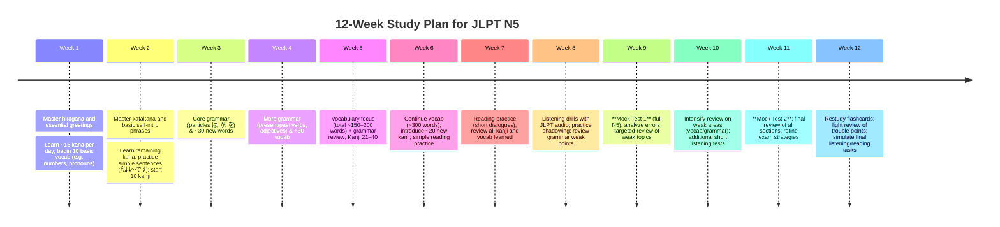

# Mastering the JLPT N5: Scope, Methods, and 12-Week Plan

## Executive Summary  
The JLPT N5 is the most basic level of the Japanese-Language Proficiency Test.  Contrary to the common assumption that "N5 is easy," about half of examinees still fail it, underscoring the need for disciplined study.  This report details the official exam format and content, plus evidence-based study methods and resources.  We outline a 12-week preparation plan (for both light and intensive study schedules), diagnostic testing milestones, and test-day tactics.  Key findings include: (1) **Official scope** – N5 tests ~800 common words and ~100 basic kanji, in two scored sections (Language Knowledge/Reading and Listening) totaling 90 minutes. Passing requires ≥80/180 overall with ≥38 in language/reading and ≥19 in listening. (2) **Study methods** – Active techniques (spaced repetition flashcards, self-testing and sentence-making, extensive/graded reading, shadowing audio) are far more effective than passive review. (3) **Planning** – Learners typically need 300–600 hours of study to reach N5. We suggest targets at 1, 3, and 6 months (e.g. mastering hiragana/katakana early, building vocab + core grammar steadily, then integration through mock exams). (4) **Resources** – Top textbooks include *Genki I* (English explanations) and *Minna no Nihongo I* (comprehensive practice).  Apps like Anki (flashcards), WaniKani (kanji SRS), BunPro (grammar SRS) and free sites (JLPT official samples, Jisho.org, graded-reader libraries) support study. We provide pros/cons and cost estimates in comparison tables. (5) **12-week plan** – A structured weekly roadmap (with alternatives for 1–3h or 4–6h/day) ensures gradual coverage of kana, vocab, grammar, kanji, reading, listening, plus regular review.  A mermaid timeline illustrates this plan. (6) **Test strategies** – On exam day, follow strict timing (do easy questions first, mark answers carefully, rest during breaks), and avoid common pitfalls like cramming new material, ignoring instructions, or panicking.  

This guide compiles official JLPT sources and trusted study advice to give an honest, no-nonsense preparation strategy for N5. It emphasizes active learning and planning over vague tips. Refer to the cited sources for official details and evidence behind these recommendations.  

## Official N5 Scope and Format  
The JLPT N5 tests **basic Japanese**: simple sentences in hiragana/katakana with frequent kanji.  Officially, it covers *“typical expressions and sentences written in hiragana, katakana and basic kanji”*.  Approximately **800 vocabulary words** and **100 kanji** are targeted.  Grammar focuses on fundamental particles (は, が, を, に, etc.), verb/adjective conjugations (present/past, polite/negative), question words (何, 誰, etc.), and elementary structures.  Complex grammar beyond that or advanced topics are *not* tested.  Reading passages are very short and simple (e.g. signs, flyers, or dialogues). The listening part uses slow, clear dialogues on everyday topics. 

The exam has **two scored sections**: 
- **Language Knowledge (Vocabulary/Grammar) & Reading** – combined (0–120 points).  
- **Listening** – separate (0–60 points).  

Total time is **90 minutes**: 20 minutes for vocabulary, 40 for grammar/reading, and 30 for listening. (These times were shortened in Dec 2020; originally some textbooks cited 105 min, but the current format is 90 min.)  In total, N5 has about **67 questions** (≈21 vocab, 22 grammar/reading, 24 listening).  Below is a simplified breakdown:

- **Vocabulary (文字・語彙)**: Multiple-choice on word usage, synonyms/antonyms, fill-in blanks, and **kanji readings**.  
- **Grammar (文法)**: Choose correct particles/forms, fill in sentences, test basic sentence structure.  
- **Reading (読解)**: Comprehension of very short passages (single sentences or brief paragraphs).  
- **Listening (聴解)**: Understanding short spoken exchanges (key detail questions, general gist, quick-response prompts).  

Each question type maps to official item types (e.g. *kanji reading*, *contextual expressions*, etc.) as listed on the Japan Foundation site.  Sample official item categories for N5 include kanji reading, word meanings, sentence completion, and simple reading comprehension.  

**Scoring and passing:** The test is scored on a scaled basis (0–180 total). To pass N5, you must score **≥80/180** overall *and* meet section cutoffs: ≥38/120 in Language Knowledge/Reading and ≥19/60 in Listening.  Failure in any section means failing the exam. These standards have been in place since 2010. Roughly 50–60% of takers pass N5, so it’s far from automatic even at this lowest level.  

Recent changes: In Dec 2020 the N5 timing was revised. Official documents note that **Language Knowledge (Vocabulary)** was set to 20 min and **Grammar+Reading** to 40 min (total 60) for N5.  (Earlier guides might show 25/50 splits.) Audio is played once.  All other aspects (format, scoring, question types) remain as before. 

## Evidence-Based Study Methods  
Study should emphasize **active, spaced learning** rather than passive review. Research strongly supports spaced repetition and active recall in language learning.  For each skill:

- **Vocabulary & Kanji:** Use a spaced-repetition flashcard system (SRS) like Anki or WaniKani. Spaced repetition is *“an evidence-based learning technique”* proven to increase retention.  Introduce new words gradually and regularly review older ones (the “spacing effect”).  Flashcards should prompt you to recall meanings and readings (not just recognition).  Incorporate example sentences so words aren’t learned in isolation. Employ mnemonic imagery or stories for kanji radicals (methods used by WaniKani).  Practice writing kanji by hand (reinforces motor memory) for the ~100 N5 characters.  For vocabulary lists, rely on context and usage, not just rote memorization; e.g. generate your own sentence for each word (active use). This taps the **testing effect**, which shows that retrieving information (self-testing) strengthens memory.  

- **Grammar:** Study each grammar point actively. Don’t just read rule explanations—use them. Write example sentences, speak them aloud, and teach them to an imaginary student. Use resources like the *Try! JLPT N5* or *Tae Kim’s Guide* with English commentary, then apply each point by making several original sentences. Convert passive recognition into recall: test yourself on usage (e.g. cover the rule and try to use it). If possible, keep a journal and write 2–3 N5-level sentences daily (e.g. describe your day in Japanese).  Grammar points should be combined with vocabulary study for context.  Some learners use grammar card decks (on Anki or paper) focusing on common N5 patterns.  

- **Listening:** Active listening practice is crucial. Use slow Japanese dialogues (e.g. **shadowing** exercises) to train comprehension and pronunciation. Shadowing means listening to a sentence/audio and immediately repeating it aloud, which improves ear training and fluency. Listen repeatedly: first try to catch the gist, then listen again with transcript to confirm details, then once more without looking. Practice with JLPT-style questions (many apps/websites offer sample N5 listening exercises). Real-world resources (e.g. *NHK Easy Japanese News*, slow podcasts, or Dramas with simple language) help accustom you to authentic speed.  Always answer practice questions in conditions similar to the exam (no pausing audio). This mirrors the exam’s quick pace: in N5, listening questions come fast, so build stamina.  

- **Reading:** Engage in both intensive and extensive reading. For intensive practice, do N5-level practice tests and short comprehension exercises, focusing on understanding every sentence. For extensive reading, use graded readers (children’s stories or learner-oriented books) targeted at beginner levels. Graded readers are “fun stories… enjoyable and confidence-building” that significantly improve Japanese. They expose you to large amounts of target vocabulary/grammar in context. The key is easy reading: you should seldom have to stop and look up words. According to graded-reading experts, reading regularly **smoothly** boosts grammar and vocabulary implicitly.  Libraries of free graded Japanese materials (e.g. Tadoku or White Rabbit Press) are available.  Reading maps directly to JLPT content: encountering many N5 patterns in stories helps cement them. 

In all study, **spaced repetition** and **active recall** dominate. For example, combine flashcards with regular self-quizzing. After learning a grammar point, test yourself on it days later. This combats the forgetting curve. Also use error logs: write down mistakes from practice tests and review them actively (don’t just glance at the correct answer).  

## Diagnostic Testing and Progress  
Early diagnosis and regular assessments prevent wasted effort.  

- **Initial assessment:** Start by taking an *untimed* N5 mock test or placement quiz (many are online). This establishes a baseline. JLPT Japan Foundation only provides sample questions, but some third-party “placement tests” like the JF Standard (J-CAT) or various quizzes can estimate your level. If you score well (say ≥70%) on section pass thresholds, you’re on track; if not, identify weak areas. Don’t trust guesswork—measure where you stand.  

- **Milestones:** Set concrete checkpoints. For example:  
  - *After 1 month:* Master hiragana and katakana; know ~200 basic words (greetings, numbers, everyday objects) and 20–30 kanji. Complete N5 basic grammar (simple sentence structure, particles は/が/を, basic verbs/adjectives). Take a short practice quiz to verify.  
  - *After 3 months:* Have ~400–500 words, ~60 kanji, and all core grammar (te-form, adjectives, question words) down. Begin reading short dialogues and simple paragraphs. Score around the section minimums in timed mini-tests.  
  - *After 6 months:* Achieve near-complete coverage: ~600–800 words, ~80–100 kanji (N5 essentials), all required grammar points, plus the ability to understand short written passages and spoken conversations. At this stage take at least one full official practice exam under timed conditions to gauge readiness.  

Tracking hours: Studies suggest ~300–600 study hours are needed to clear N5. A rough guide: if you study **2 hours/day**, 5 days/week (10 h/wk), then 5 months yields ~200 hours; 10 months yields ~400 hours. A motivated beginner often needs the full 6–9 months of steady study (e.g. 300+ hours). Someone with prior exposure (e.g. knows some kanji or basic phrases) might manage in ~3–4 months (~150–300 hours). Tailor your plan to your starting point: track cumulative hours and practice test scores to adjust pace.  

- **Progress assessments:** Schedule **full mock exams** at least once per month after the first 2 months of study. Simulate exam conditions (quiet, timed). Review every mistake immediately: if you miss a question, relearn the grammar or vocab it tested. Maintain an error log by topic and re-test those points later.  Mid-way (6 weeks) and end-of-course (12 weeks) practice tests are crucial checkpoints. Achieving section scores above 38 (lang/reading) and 19 (listening) under timed conditions by the end is a good indicator of likely pass. Use official practice workbooks (JLPT Official Practice Workbooks from 2012 and 2018) and reputable mock tests (e.g. Conjugaizen exercises).  

Below is a **mermaid timeline** outlining a generic 12-week plan (detailed tables follow). Adjust the weeks as needed based on your assessment results. Observe flexibility – if you fall behind, repeat a week’s focus rather than rushing ahead.  

## Recommended Resources (with Pros/Cons and Cost)  
Choosing high-quality materials saves time. Below are top picks prioritized for English-speaking learners:

| Resource                     | Type             | Pros                                                        | Cons                                                       | Approx. Cost |
|------------------------------|------------------|-------------------------------------------------------------|------------------------------------------------------------|-------------|
| **Genki I** (text+workbook) | Beginner textbook | Clear English grammar explanations; integrated exercises; widely-used outside Japan. | Uses romaji for some vocab (may slow kana reading); doesn’t fully cover *all* JLPT N5 grammar nuances. | ~£40 (set)  |
| **Minna no Nihongo I** (Elementary 1) | Beginner textbook | Comprehensive (companion grammar book, workbook, listening), *used by many schools*. Supported by many teachers.  | Primary text is Japanese-only (needs translation book); some examples feel unnatural; expensive set. | ~£50–£60 (two books) |
| **Japanese from Zero!** (G. Masuda series) | Beginner textbook | English explanations; gentle introduction. (Often recommended for casual learners.) | Not aligned strictly to JLPT; slower pace (3rd edition split into 0, 1, 2).  | ~£35 (set) |
| **Marugoto A1/A2 (Starter)** | Communicative course | JF-sponsored series focusing on *communication*, covers all N5 topics over A1+A2 levels; free online exercises. | Less grammar-drill (not JLPT-specific); not as common among tutors. | ~£30 each |
| **TRY! JLPT N5** | Grammar reference | N5–N1 series; available in English. Covers all N5 grammar succinctly. Free audio & vocab lists. | Brief explanations (may require external examples); minimal listening or reading practice. | ~£25 |
| **Nihongo So-Matome N5** | Exam prep series | Skill-specific (grammar, voc, kanji, reading, listening) books. Gradual, easy approach for each skill; comes with CD. | Not comprehensive alone (use alongside other texts); some translation errors noted. | ~£12–15 each (approx. £60 total) |
| **Shin Kanzen Master N5** | Exam prep series | Detailed coverage; many practice questions. | N5 version rare (more N3/N4 content); grammar explanations minimal (Japanese-only). | ~£30 |
| **Tae Kim’s Guide (Online)** | Grammar reference | Free; clear grammar points with examples. | Not JLPT-specific; no exercises. | **Free** |
| **Anki** (flashcard app) | Flashcards (free software) | Fully customizable SRS flashcards for vocab/kanji/grammar; supports images/sound. Many free N5 decks available. | Desktop free, iOS paid; time needed to create/use decks. | Free (or £25 for iOS app) |
| **WaniKani** | Kanji SRS app | Systematic radicals-based kanji learning; covers JLPT kanji with mnemonics. Gamified, community forums. | Starts slow, subscription ~$9/mo (some levels free). | ~£9/mo (or discounted long plans) |
| **BunPro** | Grammar SRS (web/app) | SRS flashcards for Japanese grammar, has N5 curriculum. Each point has example sentences and links to reviews. | Free trial limited; subscription for full access. | Free (basic), ~$8/mo full |
| **NHK News Web Easy** | Reading practice | Short news articles with furigana; great for intermediate beginners (though content slightly above N5 level). Free. | Some articles may include advanced terms; web-only. | **Free** |
| **Jisho.org** | Dictionary | Comprehensive English-Japanese dictionary (word/kanji lookup). Handy for self-study. | Web/app only; not textbook. | **Free** |
| **Nihongo no Mori (YouTube)** | Video lessons | Native-speaker explanations (mostly N4+); some N5 grammar series by Cure Dolly or Japanese Ammo with Misa also exist. | Not structured like courses; need to find N5-specific videos. | **Free** |
| **JapanesePod101** | Audio lessons | Beginner podcasts with transcripts; good for listening/speaking practice. | High quality but limited free; full access via paid premium. | Free with ads; Premium ~$12/mo |
| **JLPT Official Sample/Test** | Official materials | Authentic format; official questions (workbook PDFs exist). | Limited quantity; listening audio only in official practice sets. | **Free** from jlpt.jp |
| **Graded Reader Libraries** | Reading material | (e.g. Tadoku.free) Thousands of leveled stories *for learners*. Improves reading speed and confidence. | Need discipline to read extensively; some time investment in finding level-appropriate. | **Free** / cheap |

Each learner’s best combination will vary. For example, English speakers often combine Genki 1 (grammar/vocab), Try! N5 (grammar drill), and So-Matome series (vocab/kanji practice). Alternatively, Japanese-learning newcomers might prefer the beginner dialogue style of *Marugoto*. Whatever you choose, complement it with **active tools** (flashcards, audio drills, graded readers) rather than relying on one passive source. 

## 12-Week Study Plan (Weekly Goals & Daily Routines)  
Below is a **sample 12-week roadmap** with weekly focuses and suggested daily workloads for two study intensities. Adjust as needed for your pace. Each “1–3h/day” cell lists core tasks; the “4–6h/day” cell includes additional practice to match a higher time budget.

| Week | 1–3 hours/day (Light Schedule)                                                                 | 4–6 hours/day (Intensive Schedule)                                                         |
|------|-------------------------------------------------------------------------------------------------|--------------------------------------------------------------------------------------------|
| 1    | - **Kana mastery**: Learn 5–10 new hiragana characters/day (0→46).  Practice writing them. - **Listening**: Learn 10 basic words (greetings, pronouns) using Anki flashcards. - **Speaking**: Memorize 3 self-intro lines (e.g. “私 は [Name] です”). | - Do all of the above. - **Extra Kana**: Add 10–15 kana/day to finish hiragana by week’s end. - **Kanji intro**: Start learning 10 simple kanji (e.g. numbers, 日, 月) with writing practice. - **Review**: Additional flashcard review in evening. |
| 2    | - **Katakana mastery**: Learn 5–10 new katakana/day (0→46). - **Grammar**: Focus on “〜です/〜ではありません” (polite present/past). Write 5 simple sentences using は/が. - **Vocab**: 15 new common nouns (e.g. 時間, 先生) via flashcards. | - Do all above. - **Kanji**: Learn 15 more common kanji (日, 月, 火, 水...). - **Reading**: Practice reading simple sentences containing kana+learned kanji. - **Practice**: 30 min listening to slow dialogues (e.g. children’s stories, NHK Easy audio). |
| 3    | - **Grammar**: Particles を/に/へ (direct object, indirect object). Practice 10 fill-in-the-blank drills (try JLPT practice workbook). - **Vocab**: 20 new adjectives and verbs (ます-form). - **Listening**: Begin simple N5 listening drills (with transcripts). | - Do all above. - **Kanji**: 10–15 new kanji (e.g. 人, 行, 東, 西). - **Practice**: Shadow short audio sentences aloud. - **Reading**: Read 1–2 short graded-reader paragraphs each day. |
| 4    | - **Grammar**: Verb conjugations (present negative 〜ません, past tense 〜ました/ませんでした). Do 10 sentence transformations. - **Vocab**: 20 more words (time/date terms, daily life verbs). | - Do all above. - **Kanji**: 10–15 new kanji (e.g. 大, 小, 上, 下). - **Mock quiz**: Take a 20-min vocab+grammar mini-test (use unofficial worksheets) to identify weak spots. - **Focus practice**: Drill any trouble particle/grammar with extra exercises. |
| 5    | - **Combined Review**: Go through all vocab/grammar learned; identify weaknesses. - **Kanji**: Learn Kanji #51–60 (e.g. 中, 名, 本, 会). - **Vocabulary**: 30 total Kanji-based words (using all kanji learned). | - Do all above. - **Integration**: Write short diary entry (3–5 sentences) using as many N5 vocab/grammar as possible. - **Listening**: Add 15 minutes of Japanese songs or children’s anime dialogues (passive listening for immersion). |
| 6    | - **Vocabulary focus**: Increase total to ~300 words; include daily expressions (e.g. “おなかが すきました”). - **Reading**: Practice reading JLPT-style sentences (e.g. fill-in the blank worksheets). | - Do all above. - **Kanji**: 10–15 new (e.g. 学, 生, 校, 時). - **Listening**: Use official JLPT listening practice (if available) or free apps for 10–15 min. |
| 7    | - **Reading practice**: Read simple dialogues or children’s story (20–30 sentences/day). Summarize each in English. - **Grammar**: Introduce 〜たい (want to do) and practice. | - Do all above. - **Vocabulary**: Learn additional 20 words from weak areas (identified by practice). - **Conversation**: Practice speaking basic Q&A (e.g. with a study partner or language app). |
| 8    | - **Listening practice**: Daily 15-min listening to slow audio (e.g. NHK Easy or Podcasts); answer simple questions. - **Kanji review**: Quiz yourself on all kanji learned so far (readings and meanings). | - Do all above. - **Full Quiz**: Take a 30-minute combined vocab+grammar test (past N5 questions). - **Identify errors**: Review mistakes immediately and study those topics. |
| 9    | **Mock Exam 1**: Take a full-length N5 practice test under timed conditions (90 min). - **Analysis**: Carefully check answers, note any grammar/vocab unknown. | **Mock Exam 1** (as above). - **In-depth Review**: Spend extra time reviewing every mistake (why wrong, what rule). Use this to plan final weeks. |
| 10   | - **Targeted Review**: Focus on weakest areas from Mock 1 (e.g. tricky grammar points, confusion of similar words). - **Kanji**: Final ~10 kanji to reach ~100 total (e.g. also learn readings for numbers/dates). | - All of the above. - **Additional Mocks**: Try a second shorter test (e.g. JLPT workbook exercises) targeting listening and reading speed. |
| 11   | **Mock Exam 2**: Full timed test. Aim to surpass pass thresholds in both sections. - **Final Review**: Write down all remaining trouble words; review flashcards intensively. | **Mock Exam 2** (as above). - **Stress Test**: Simulate exam environment twice (no breaks, timed). Practice transferring answers to sheet quickly. |
| 12   | - **Light Review**: Briefly review notes/flashcards; do 20 min each of listening & reading practice. - **Strategy**: Plan exam day logistics (transport, required materials). | - Do all of the above. - **Relaxation**: Avoid heavy studying day before exam; ensure proper rest and confidence-building (review only easy notes). |

An accompanying **Mermaid timeline** (above) provides a high-level view.  In practice, adjust these tasks: if you fall behind, drop less-critical items (e.g. second mock) to solidify basics.  Always **incrementally build** – avoid cramming 100 words in one day (studies say huge loads with no review are wasted effort). Consistency beats marathon sessions. For example, 20 spaced minutes of flashcards daily is better than a 3-hour cramming night.

## Test-Day Strategies and Common Pitfalls  
Even with perfect preparation, exam day can trip you up. Key strategies:

- **Before the Test:** Get a good night’s sleep. Have a light breakfast. Double-check you have the essentials: exam voucher/admission card, valid photo ID, multiple sharp HB pencils and erasers, watch (no electronics allowed), and perhaps tissues/water. Arrive early (listen carefully to instructions).  Mentally review that *no calculators or notes* are allowed. 

- **Answer Sheet Tactics:** Fill in your answers carefully (JLPT uses bubble sheets). In listening, mark answers immediately as you listen (fill blanks on the question sheet or bubbling it in with pencil, per instruction). In reading/vocab sections, don’t leave any question unattempted – there’s no penalty for guessing. Manage time: if stuck on a question, move on and return if time permits.

- **Time Management:** Keep track of the clock. The break after vocab section (around 20–25 min in) and after grammar (another ~40 min) is limited. Use breaks to rest eyes and brain, not to cram more. For example, one can quickly review flashcards or read notes if stress levels allow, but avoid frantic last-minute learning (it only adds anxiety without real benefit).

- **Beware Common Errors:** Many test-takers waste time parsing every detail. Remember N5 texts are extremely simple; questions often hinge on a single particle or word. If a question seems incomprehensible, guess the easiest looking answer and move on – your brain works better when not fixated.  Also, double-check instructions (e.g. if a question uses grammar like 〜ている, know whether it’s present progressive or “finished action”).  Listen actively: if you missed a word in audio, skip ahead – the test usually asks about the whole statement, not one unknown vocabulary.

- **Psychological Pitfalls:** Imposter thinking (“this is too hard for me”) can undermine performance. Conversely, complacency (“N5 is trivial”) can lead to underpreparation. Stay realistic: trust your study but be cautious of overconfidence. If anxiety spikes, practice a few slow deep breaths. Remind yourself of a strategy (e.g. “read questions before passage” or “shadow unknown words quietly”).

- **After Listening:** In the listening section, the audio never repeats. Always jot quick notes (keywords, numbers, names) if helpful. If you miss one answer, don’t fixate – the next question’s listening begins almost immediately (fill answers during breaks). 

- **Common Pitfalls to Avoid:**  
  - *Neglecting the instructions:* Questions may have subtle cues (e.g. “choose two correct answers,” or “fill one circle”). Read every instruction fully.  
  - *Skipping review:* If you finish early, re-check answers carefully – it’s easy to bubble in the wrong column or skip a question on the sheet.  
  - *Language switch-up:* Many fail by confusing similar particles (は vs が) or mixing kanji readings (e.g. おとこ vs だん). Use recent flashcards to clear up such confusions before the test.  

In summary, treat exam day like another practice session – stay calm, follow your prep routines (if you practiced full timed mocks, the real test will feel similar), and use logic over panic. Trust that the preparation (even if it “hurts” to admit gaps during study) will carry you through the N5 challenge.

---

**Tables and Practice Questions:**  

To illustrate resource differences and sample questions, we include comparison tables and examples below:

| **Resource**          | **Type**           | **Pros**                            | **Cons**                           | **Cost** |
|-----------------------|--------------------|-------------------------------------|------------------------------------|----------|
| Genki I               | Textbook/Workbook  | English support; integrated audio   | Includes romaji; not 100% N5-aligned | ~£40  |
| Minna no Nihongo I    | Textbook/Grammar   | Teacher-popular; exercise-rich | Japanese text only; outdated terms | ~£60  |
| Try! N5               | Grammar guide      | N5–N1 series; English supplements  | Brief; few extras   | ~£25  |
| Nihongo So-Matome N5  | Exam prep series   | Skill-specific, easy introduction | Needs supplements; some errors | ~£60 all |
| Anki                  | SRS Flashcards App | Customizable; community decks       | Learning curve; manual card making  | Free (desktop) |
| WaniKani              | Kanji learning app | SRS with mnemonics; radicals method | Limited free; paid unlock           | £8–9/mo  |
| JLPT Official Workbook| Practice test book | Authentic questions and audio       | One-time use; fixed schedule        | Free (PDF) |

Sample question types (with answer rationale):

- **Kanji Reading (Vocabulary)**: 「*近く* に **山** が あります。」(Underlined: 山). What is the reading of **山** in this sentence?  
  1. かわ   2. やま   3. いけ   4. うみ  
  **Answer:** 2. *やま*. Explanation: In “近くに山があります” (There is a mountain nearby), 山 is read “やま” (Japanese reading for mountain). The others (かわ=river, いけ=pond, うみ=sea) are irrelevant here.  

- **Grammar (Particles)**: Fill in the blanks: 「私は 母 (　) 本 (　) 読みます。」 (I read a book *to* my mother.)  
  **Answer:** 「私は 母 **に** 本 **を** 読みます。」 Explanation: 母 **に** indicates the indirect object (“to mother”), and 本 **を** marks the direct object (“book”). The particle は after 私 and が after 主語 would be incorrect in this structure.  

- **Reading Comprehension**: Short passage: 「山田さん： これは あなたの えんぴつ ですか？ 田中さん： はい、そうです。 私 (わたし) の えんぴつ です。」  
  Question: この えんぴつ は だれ の ですか？ (Whose pencil is it?)  
  **Answer:** 田中さん の えんぴつです。 Explanation: Tanaka responds “Yes, it’s mine” (私のえんぴつ), so the pencil belongs to 田中さん (Tanaka). In JLPT N5, reading questions are straightforward retrieval: the answer was explicitly stated.  

*(Note: In actual JLPT listening questions, answers would come from an audio dialogue rather than written text, but the logic is the same – listen for key words and inference.)*  

**Sources:** All information above is drawn from official JLPT publications (Japan Foundation) and reputable Japanese learning resources. Where official details were unavailable (e.g. exact study hours, techniques), we relied on expert analysis and experience-based guides. 

