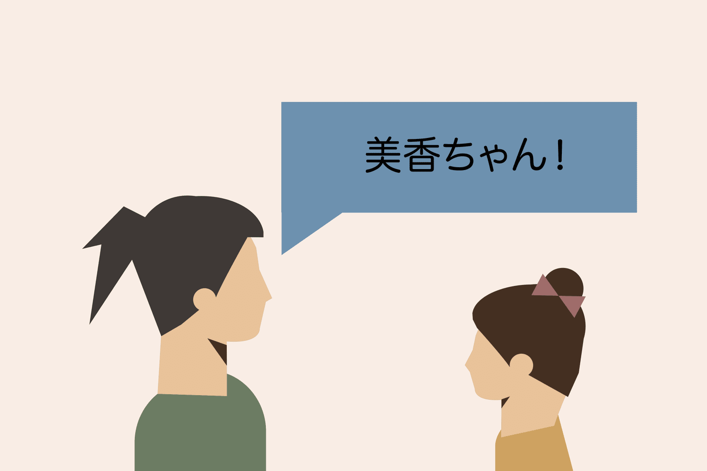

# Listening

> **TL;DR**
>
> - **What this is.** The canonical guide in this repo for the _listening skill_: what to listen to at each comprehension level, in what order, and how to actually train your ear rather than just having Japanese noise nearby.
> - **Why it matters.** Listening is the skill that breaks self-taught learners. Reading is self-paced and forgiving; audio is not. You cannot look up a word you did not hear, and real speech is full of reductions that textbooks never show you.
> - **When to start.** Day one for sound exposure, week two or three for real comprehensible input. There is no prerequisite to _start_; there is a prerequisite to _benefit_, and that prerequisite is comprehensible material.
> - **The recommended path.** Climb the [listening ladder](#the-listening-ladder) deliberately: comprehensible-input channels, then beginner podcasts, then slice-of-life anime, then learner-adjacent native podcasts, then news, then unscripted native talk. Do one honest 20-minute active rep a day. Pile passive volume on top of it, never instead of it.
> - **The two things to get right immediately.** Kill English subtitles during immersion, and learn the [contraction system](#fast-speech-and-contractions) as a generative set of four rules rather than a vocabulary list.
> - **Heads up:** this folder is **text-first by design** - Japanese subtitles for eight slice-of-life series, script-bearing beginner courses from NHK and the Japan Foundation, and a contractions reference. Transcripts are tiny and are what the active rep needs; the big _audio_ blocks live in [`../Speaking/`](../Speaking) and [`../Grammar/`](../Grammar). The [resource table](#in-this-repo-offline) indexes all of it, and [`sources.md`](./sources.md) records where it came from and what its licence actually permits.

---

## What this is and why it matters

Listening is the skill you will be worst at, for longer than you expect, and it is the skill that decides whether you can actually live in Japan.

That is not a motivational framing, it is an observation about how self-directed learners allocate effort. Anki is reading. Grammar guides are reading. Manga is reading. Sentence mining is reading with an audio field attached. A learner who does everything this repo recommends and never deliberately trains listening ends up with a very specific and very common profile: can read a light novel, cannot follow two adults talking in a cafe.

### Why listening is usually the weakest skill

Four structural reasons, and they compound.

**1. Reading is self-paced. Listening is not.** When you read, you control the clock. You can stop mid-sentence, back up, re-parse, look up a word, think about it for thirty seconds, and continue. Audio runs at the speaker's pace and then it is gone. Every processing step - segmenting the stream into words, recognising them, resolving grammar, holding the earlier clause in memory while the later one arrives - has to happen in real time, at native speed, with no buffer.

**2. You cannot look up what you did not catch.** This is the asymmetry that makes listening uniquely frustrating. In reading, an unknown word is a _visible_ unknown: you can see it, select it, and Yomitan tells you what it is. In listening, an unknown word is an _invisible_ unknown. You heard something like `なんとかかんとか`, you do not know where the word boundaries were, and you cannot type a sound you did not resolve into a dictionary. Not knowing a word and not hearing a word feel identical from the inside, and they need completely different fixes.

**3. Japanese is mora-timed and fast.** Japanese rhythm is built on the mora, not the syllable - each mora gets roughly equal duration, including the small `っ`, the long vowel, and standalone `ん`. That is a genuinely different timing system from English's stress-timed rhythm, where unstressed syllables get crushed. The practical consequence: Japanese has a high mora-per-second rate and very little of the stress-based signposting that English listeners unconsciously rely on to find word boundaries. Nothing in the stream tells you where one word ends and the next begins. You have to know the words to hear them, which is exactly the chicken-and-egg problem that makes the early stage feel impossible. The [Kana guide](../Kana/readme.md) owns the mora system in detail - read it there if this is new.

**4. Speech is full of reductions that never appear in textbooks.** Your grammar guide teaches you `食べてしまいました`. What you will actually hear is `食べちゃった`. It teaches `行かなければなりません`; you will hear `行かなきゃ`. It teaches `何をしているのですか`; you will hear `何してんの`. These are not slang or sloppiness - they are the normal spoken forms, used by everyone, constantly. A learner who has only ever seen the full forms hears a stream of unfamiliar sounds and concludes their listening is hopeless, when in fact their vocabulary is fine and their _phonology of the spoken register_ is missing. This is the single most fixable listening problem there is, which is why this guide has a [whole chapter on it](#fast-speech-and-contractions).

There is a fifth reason that is more about incentives than linguistics: **listening practice is uncomfortable and has no visible progress metric.** Anki gives you a number. Reading gives you a page count. Twenty minutes of listening to something you half-understood gives you nothing but the memory of having been confused. So people quietly stop doing it and replace it with passive audio, which feels like listening practice and mostly is not.

---

## Where it fits in the journey

**Prerequisites to start:** none worth waiting for. You can start sound exposure on day zero. But note the distinction between _starting_ and _benefiting_:

| You need                                                    | Before you can productively do                                       |
| :---------------------------------------------------------- | :------------------------------------------------------------------- |
| Nothing                                                     | Sound and rhythm exposure (rung 0 of the ladder)                     |
| Kana, roughly                                               | Comprehensible-input video for beginners (rung 1)                    |
| ~300-500 words, basic verb forms                            | Beginner podcasts without visual aids (rung 2)                       |
| ~1,000-1,500 words, `て`-form, past, negative, plain/polite | Slice-of-life anime as _training_ rather than entertainment (rung 3) |
| ~3,000 words and comfort with casual register               | Learner-adjacent native podcasts (rung 4)                            |
| ~5,000 words plus some domain knowledge                     | Unscripted native talk (rung 6)                                      |

Those word counts are ballparks, not gates. See [Vocabulary](../Vocabulary/readme.md) for the coverage-versus-comprehension arithmetic behind them, which is the real explanation for why each rung feels the way it does.

**What listening unlocks:**

- **Speaking.** You cannot produce a sound contrast you cannot perceive, and you cannot produce natural phrasing you have never heard. Listening is the input side of the output loop. [Speaking](../Speaking/readme.md) owns pitch accent, phonetics and shadowing.
- **The JLPT listening section.** Scored 0-60 at every level, with an independent sectional minimum you must clear regardless of your total. The reading-heavy immersion learner is precisely the person this rule catches. See [JLPT](../JLPT/readme.md).
- **Actually living in Japan.** Workplace meetings, train announcements, doctors, landlords, colleagues joking at lunch. None of this comes with subtitles.
- **Mining from audio-visual media.** Once you can parse spoken dialogue, anime and drama become mineable at volume rather than being a subtitle-reading exercise. See [AJATT](../AJATT/readme.md).

---

## The schools of thought

### 1. Listening comes last

The traditional textbook and classroom position: build grammar and vocabulary first, add listening once you have something to listen _with_. Listening exercises are short, scripted, slow, and tied to the chapter you just studied.

- **Pros.** Never demoralising. Every listening task is at your level by construction. Efficient per minute spent.
- **Cons.** Produces learners whose listening is calibrated exclusively to slow scripted studio audio and who fall apart on anything real. The gap between "textbook listening exercise" and "two Japanese people talking" is enormous, and this school never crosses it. Also defers the skill so long that it becomes a permanent weakness.
- **Best for.** Exam-only goals where the exam audio is itself scripted and slow. Genuinely nobody else.

### 2. Listening first, audio-primary

The Pimsleur / audio-course / "learn like a child" position: audio is the primary channel, text is secondary or absent. Some versions delay reading deliberately.

- **Pros.** Forces ear training from day one. Builds a genuine sound-first representation of words rather than a spelling-first one, which pays off in pronunciation and in recall speed.
- **Cons.** Extremely slow for vocabulary acquisition - you cannot scan audio, you cannot look words up efficiently, and the highest-quality Japanese input available to you is text. Also, the "learn like a child" analogy is bad: children get thousands of hours of caretaker speech tuned to them individually, and you get a podcast.
- **Best for.** Very short timelines to basic spoken survival (a three-week business trip). Also a reasonable _supplement_ if your routine is otherwise text-dominated.

### 3. Balanced dual-track

Run reading and listening in parallel from early on, deliberately, as separate trained skills with separate time budgets and separate difficulty ladders.

- **Pros.** Avoids the lopsided profile. Each skill reinforces the other - words you have read are easier to hear, words you have heard are easier to read. Matches how the JLPT is scored and how real life works.
- **Cons.** More scheduling discipline, and the listening track will feel much worse than the reading track for a long time, which is psychologically hard to sustain. Slower reading progress than a reading-maximalist would get.
- **Best for.** Almost everyone with a multi-year horizon, and specifically anyone who intends to live in Japan.

### 4. Passive-volume maximalism

Get the hour count as high as possible. Audio playing all day, every day, whether or not you are attending to it. The classic AJATT framing in its strongest form.

- **Pros.** The hour count really is large, and even a small per-hour effect multiplied by thousands of hours is not nothing. Costs almost no willpower. Keeps you inside the language as an identity, which sustains the hard work.
- **Cons.** The per-hour effect is small, unmeasured, and near zero when comprehension is low. Worse, it is the most self-deceiving option available: it _feels_ like immersion, it generates an impressive-sounding number, and it can silently replace the active work that actually produces gains.
- **Best for.** Anyone whose day contains many hours of low-cognitive-load work - as a _supplement_. Never as the strategy. [AJATT](../AJATT/readme.md#active-vs-passive-immersion) owns this argument in full, including the honest arithmetic.

---

## Recommended path (opinionated)

**Run the balanced dual-track (school 3), climb the ladder below one rung at a time, and defend one non-negotiable daily active listening block with no English subtitles ever.**

The reasoning, in order of weight:

1. **The failure mode is predictable and specific**, and it is the lopsided reading-heavy profile. Once you know your routine's bias, the fix is not clever - it is to schedule against it. Everything about a self-taught Japanese routine biases toward text. So listening gets a protected slot, the way you would protect a deploy window.

2. **The ladder is the whole trick.** Almost all listening failure is a difficulty-selection failure, not an effort failure. People listen to content at 20% comprehension for months because it is cool, learn nearly nothing, and conclude they are bad at listening. Comprehensible input at 70-85% comprehension is where parsing skill is actually built. The ladder is a mechanism for staying in that band as you improve.

3. **Active is where gains come from; passive is a multiplier.** This is not a compromise position, it is what the sources in this repo actually say. Donkuri: passive listening "probably shouldn't" be expected to produce large listening gains. shoui: below roughly 90% comprehension it does not produce gains at all. So: do both, count only the active hours.

4. **Subtitles are a fork in the road, not a preference.** English subtitles during immersion are the single largest waste of learner-hours in the hobby, and calling it immersion is self-deception. See [the subtitle question](#the-subtitle-question).

**Ignore this if:**

- **You have a hard deadline for a reading-only outcome** - a research literature, a specific exam section, mining volume for a card count. Then reading-maximalism is correct and you should accept a lopsided profile on purpose, with your eyes open.
- **You are below roughly 300 words.** At that point the highest-value listening activity is not listening, it is vocabulary. Do rung 0 and rung 1 for enjoyment, put the real hours into words and grammar, and come back in a month.
- **You are already living in Japan.** Your environment supplies the input. Your bottleneck is vocabulary and the confidence to be confused out loud, not a curated ladder.

---

## The listening ladder

This is the canonical staircase in this repo. Each rung has an entry condition, material, and a graduation test. The goal is to spend your active listening time in the band where comprehension is high enough to learn from and low enough to be learning.

### How to read this ladder

The percentages are **honest self-estimated comprehension of the audio alone** - how much of what was said you could restate. Three warnings before you use them:

- **People overestimate badly when video is present.** Visual context, facial expressions and plot momentum let you follow a scene at 40% of the words. That feels like 80%. The only honest measurement is audio-only - see [audio-only versus video](#audio-only-versus-video).
- **The productive band is roughly 70-85%.** Below that you are decoding, not listening. Above ~95% you are enjoying yourself, which is valuable for volume and for staying in the habit, but it is not training.
- **Rungs overlap.** You do not leave a rung, you add the next one. Keep something easy in rotation forever; it is your passive material and your rest day.

| Rung  | What it is                                                                                       |  Productive at  | What it trains                                                         | Graduate when                                                                                       |
| :---: | :----------------------------------------------------------------------------------------------- | :-------------: | :--------------------------------------------------------------------- | :-------------------------------------------------------------------------------------------------- |
| **0** | Any native audio, uncomprehended                                                                 |       0%        | Phoneme inventory, mora rhythm, prosody contour                        | You can tell Japanese from Korean/Chinese by sound, and you can hear `きた` vs `きいた` vs `きった` |
| **1** | Comprehensible-input video made for learners                                                     |      0-60%      | Word-to-meaning binding with visual support; segmentation              | You follow a beginner CI video without needing the drawings                                         |
| **2** | Beginner podcasts (audio only, graded)                                                           |     40-75%      | Segmentation without visual crutches; sustained attention              | You can summarise a 10-minute beginner episode after one listen                                     |
| **3** | Slice-of-life anime, easy drama                                                                  | 50-80% w/ video | Casual register, contractions, sentence-final particles, real speed    | You can rewatch a familiar SoL episode raw and follow it                                            |
| **4** | Learner-adjacent native podcasts, interviews                                                     |     60-85%      | Unscripted rhythm, fillers, two-speaker turn-taking                    | You can follow a new episode of a familiar podcast start to finish                                  |
| **5** | News: NHK Easy audio, then NHK proper                                                            |     70-90%      | Formal register, enunciated delivery, numbers, names, dates            | You can get the who/what/where of a news item on one listen                                         |
| **6** | Unscripted native talk: 雑談 podcasts, VTuber streams, radio, variety                            |     70-90%      | Overlapping speech, in-jokes, heavy reduction, dialect, no visual aids | You can follow two friends talking about nothing for 30 minutes                                     |
| **7** | Full native range: film, regional dialect, older recordings, technical talks, workplace Japanese |     varies      | Domain expansion, accent tolerance, keigo under time pressure          | Ongoing. This rung never closes.                                                                    |

### Rung 0 - Sound familiarisation (day 0)

You understand nothing. That is the point.

**What to do.** Put on anything Japanese. Anime you have already seen, a podcast you cannot follow, music, a stream. Do not attend to it.

**What this buys you.** Honestly: a little. Your brain is building a statistical model of which sounds occur, in what combinations, with what rhythm and what pitch contours. There is real research on infant and adult phonetic category formation supporting the idea that mere exposure sharpens perceptual boundaries. What it does _not_ buy you is vocabulary, grammar, or comprehension - those require meaning, and there is no meaning available to you yet.

**The honest framing:** rung 0 has low but non-zero value, it costs you nothing, and it is not a study activity. Do not count it. Do not let it feel like progress. Its real job is to make the language stop sounding alien so that rung 1 is less exhausting.

**Useful here from this repo:** the [kana audio set in the Grammar folder](<../Grammar/Itazuraneko Master Reference/djtguide.github.io-main/djtguide.github.io-main/learn/kana/audio>) - 105 single-mora mp3 files covering the whole syllabary including digraphs. Drilling these against the [Kana charts](../Kana/readme.md) is the fastest way to get the sound-to-kana mapping wired, and it directly serves the `きた` / `きいた` / `きった` graduation test.

**Done when:** you can reliably distinguish short vowel, long vowel and geminate consonant in isolated words, and Japanese has stopped sounding like undifferentiated noise.

### Rung 1 - Comprehensible input for beginners (weeks 2-12)

**This rung is the single biggest change in Japanese learning since AJATT was written, and it is why beginner advice from 2008 is out of date.**

In the classic AJATT era there was nothing between "textbook audio exercise" and "native anime". The advice was to endure native content at 5% comprehension for a year because there was no alternative. There is now an entire genre of YouTube channels that deliver **Japanese-only input, deliberately graded, with visual scaffolding** - drawings, gestures, props, slow deliberate speech, controlled vocabulary, and explanation of new words in simpler Japanese rather than in English. This is comprehensible input in the Krashen sense, actually executed, for free, in volume.

**Why it works when native content does not.** The comprehension floor is set by the creator, not by your vocabulary. A CI video is intelligible at 200 words because the speaker is drawing the thing they are naming. You are learning words _from Japanese_, through context, at a difficulty you can actually process - which is precisely the condition that native content cannot provide to a beginner.

**What to look for in a CI channel** (more useful than a channel list, because channels come and go):

- 100% Japanese audio, no English explanation
- Deliberate, slowed, clearly enunciated speech
- Visual support: whiteboard drawings, objects, gestures, on-screen words
- New words explained in simpler Japanese, not translated
- Levelled playlists (absolute beginner / beginner / intermediate)
- Japanese subtitles available as an option, not burned in

**Named examples.** From this repo's own curated data: **Japanese with Shun** (7-10 minute episodes, slow speech with pauses, vocabulary largely from Genki I, new words listed at the end - the repo's media sheet rates it "Very Easy-Easy" and "perfect for a beginner"), and **YUYUの日本語Podcast**, both of which run YouTube channels alongside their podcasts. Beyond the repo, the widely recommended channels in this genre include **Comprehensible Japanese** (visual-aid-heavy, levelled from absolute beginner), **Onomappu** (Japanese-only with Japanese subtitles) and **日本語の森 / Nihongo no Mori** (JLPT-oriented, taught in Japanese). **Check they are still publishing before you build a routine around any channel**, because this genre has high churn.

**How to use it.** Watch actively. Do not read English subtitles - there usually are none, which is a feature. If a video is at 90%+ comprehension, move up a playlist. If it is below 50%, move down. Twenty to thirty minutes a day is plenty at this stage; your bottleneck is still vocabulary.

**Done when:** you can watch a beginner-level CI video, understand the substance without leaning on the drawings, and restate what it was about in English afterward.

### Rung 2 - Beginner podcasts, audio only (months 1-6)

Removing the picture is a real step up, and it is the step that makes the skill honest. Video lets you follow a scene without parsing the sentences. Audio does not.

**Material - the graded-podcast format.** The defining example is **Nihongo con Teppei for Beginners**: short episodes, one host, deliberately slow, heavy topic repetition, occasional single English word to unstick an explanation. The repo's media sheet rates it "Very Easy" and calls it "perfect for a first podcast"; the repeated topics are the mechanism - the same vocabulary comes around often enough to stick. Note that the beginner series has **no transcript** per the repo's [podcast spreadsheet](<../AJATT/Reference Spreadsheets/100+ Podcasts.xlsx>), which matters for the active-rep technique below. The same spreadsheet references an archive of episodes 1-700 for the original series, so back-catalogue depth is not a problem.

Other graded beginner formats indexed in the same spreadsheet, with the transcript column being the thing to sort by: **Sakura Tips** (transcripts at <https://sakuratips.com/category/pod-cast/>), **Learn Japanese with Noriko** (transcripts), **Let's Talk in Japanese** (scripts at <https://ruby-s.net/script/>), **Nihongo Switch**, **The Miku Real Japanese Podcast**, **Momoko To Nihongo**. Transcript availability is worth more than a small difficulty difference, because a transcript turns a passive listen into a checkable active rep.

**Offline in this folder:** two complete script-bearing beginner courses - [NHK World Easy Japanese](<./NHK World - Easy Japanese>) (48 lessons) and [Erin's Challenge](<./Erins Challenge - Japan Foundation>) (25 lessons, basic _and_ advanced versions of the same skits). For most of it the audio streams free from the publisher's site while the script sits here, which is the whole active rep in two tabs; [Erin's lessons 1-5](<./Erins Challenge - Japan Foundation/Basic Skit Audio (lessons 1-5)>) have the audio offline too, so start there if you want the loop with no browser. Several podcasts publish free transcripts available online - see [`sources.md`](./sources.md) for the list, and the warning that the most-recommended beginner podcast is not one of them.

**How to use it.** One episode, actively, no other task. Then the same episode again while doing something else. Short episodes make this easy, and the repetition is doing the work.

**Done when:** you can listen to a fresh 10-minute beginner episode once and summarise it.

### Rung 3 - Slice-of-life anime and easy drama (months 3-18)

This is where most learners want to start and should not. It is also where the enjoyment finally justifies the effort, so getting the genre choice right matters enormously.

**Why slice-of-life beats action, fantasy and shounen for early listening:**

| Genre                          | Why it is harder than it looks                                                                                                                                                                                                                                       |
| :----------------------------- | :------------------------------------------------------------------------------------------------------------------------------------------------------------------------------------------------------------------------------------------------------------------- |
| **Fantasy / isekai**           | Invented vocabulary for invented things. Archaic and pseudo-archaic register (`〜のだ`, `〜であろう`, `わらわ`, `ぬ` negation). Proper nouns you cannot look up. You are learning words that will never occur in your life.                                          |
| **Action / shounen battle**    | Shouting distorts phonology - vowels stretch, consonants overdrive, pitch goes flat. Technique names are jargon. Dialogue is short exclamations rather than sentences, so you never practise parsing a clause. Long stretches with no speech at all.                 |
| **Mecha / sci-fi / military**  | Dense technical and military register delivered fast, often mumbled or over comms static. Evangelion is a brutal listening text for exactly this reason, whatever it is doing for you emotionally.                                                                   |
| **Rapid-fire dialogue comedy** | Wordplay, puns, cultural references, and speed. Bunny Girl Senpai is dialogue-dense in a way that is genuinely hard, not beginner-friendly.                                                                                                                          |
| **Slice-of-life**              | **Limited vocabulary domain** (school, home, food, weather, feelings, work). **Strong visual context** - the thing being discussed is on screen. **Everyday register** you will actually reuse. Sentences are complete. Speech is conversational speed, not shouted. |

The underlying principle is **domain narrowness**. A show set in a kitchen keeps returning to the same few hundred words, so repetition does your vocabulary work for free. A show set in a magic kingdom introduces a new proper noun every episode.

**The "deep dive" technique.** Rather than sampling twelve shows, stay inside one slice-of-life series until your comprehension of _it_ is high. Your vocabulary, the speakers' voices, the register and the recurring topics all stabilise, and comprehension climbs fast because you stop paying the start-up cost every episode. This repo's Perdition mirror builds a whole stage around this idea - see [AJATT](../AJATT/readme.md) for how it fits the wider method.

**Picking titles.** Use the repo's difficulty-ranked media sheets - [`Anime.png`](<../AJATT/saegusa resources/Japanese Media Recommendations/Anime.png>) and [`Dramas and TV.png`](<../AJATT/saegusa resources/Japanese Media Recommendations/Dramas and TV.png>) - which rank titles from Very Easy upward _with an explanation of why_. Or <https://jpdb.io/> for per-title vocabulary difficulty.

**Japanese subtitles for eight of these are already offline** in [`Japanese Subtitles (kitsunekko)/`](<./Japanese Subtitles (kitsunekko)>), chosen on exactly the domain-narrowness argument above: Shirokuma Cafe, Non Non Biyori, Yuru Camp, Takagi-san, Komi-san and Skip and Loafer as full runs, plus Crayon Shin-chan and Sazae-san samples. Pick one, do the deep dive, and use the subtitle file only for the diagnosis step - not as a reading crutch during the watch. See [the subtitle question](#the-subtitle-question).

**More calibration beyond the genre table above:** dark psychological fantasy such as **Berserk** carries an archaic, formal register that makes it a poor early listening text despite its popularity; industry-set drama such as **Oshi no Ko** delivers specialist vocabulary at speed; and shonen action such as **Chainsaw Man** leans on short shouted lines rather than full sentences. By contrast, contemporary dialogue-driven slice-of-life titles - built around two people talking at conversational speed in a narrow domain, such as **Onimai** or **Call of the Night** - are exactly the shape of material this rung calls for. The mistake is not having a favourite that is too hard to use as training material; the mistake is calling that hard favourite your study material and then wondering why listening progress is flat. A genuinely hard favourite can stay pure entertainment, watched however feels right, while separate, easier material carries the deliberate daily rep.

**Done when:** you can rewatch an episode of a familiar slice-of-life series with no subtitles and follow the dialogue, not just the plot.

### Rung 4 - Learner-adjacent native podcasts (months 9-30)

The bridge between graded material and the real thing: unscripted Japanese, spoken at something close to normal speed, but produced by people who are aware learners are listening, or on topics so ordinary that the vocabulary is predictable.

This repo's [podcast media sheet](<../AJATT/saegusa resources/Japanese Media Recommendations/HTML/Podcasts/Japanese Media Recommendations - Podcasts.html>) ranks 20 podcasts from Very Easy to Very Hard with a written justification for each rating, which makes it the single most useful listening artefact in the repo. Drawing directly from it, the rung-4 band looks like this:

| Title (as listed in the repo)             | Repo rating | Why it sits here                                                                                                                                                                                      |
| :---------------------------------------- | :---------- | :---------------------------------------------------------------------------------------------------------------------------------------------------------------------------------------------------- |
| **Nihongo con Teppei Z**                  | Easy        | Beginner-targeted, slow and clear, multiple topics                                                                                                                                                    |
| **Japanese with Teppei and Noriko**       | Easy        | Unscripted two-person, short episodes, recurring slice-of-life topics; harder words explained. The sheet notes you will understand a lot "after the first 100 episodes" - repetition is the mechanism |
| **Let's learn Japanese from small talk!** | Easy        | Learner-targeted, unscripted, not graded; hard words explained or occasionally given in English; per-episode vocabulary lists                                                                         |
| **ことのは日本語の会話のpodcast**         | Easy-Medium | Learner-targeted but two hosts talking to each other, which is a real difficulty jump                                                                                                                 |
| **4989 Utaco**                            | Easy-Medium | The sheet calls it "probably one of the easiest podcasts intended for native speakers" - clear delivery, and US-life topics give non-Japanese listeners a comprehension boost. Has a transcript       |
| **シノブとナルミの毒舌アメリカンライフ**  | Easy-Medium | 雑談 between two adult women, mostly Japanese, ordinary life topics                                                                                                                                   |

**Two-speaker audio is the specific new skill here.** One host talking at you is a monologue: predictable turn structure, complete sentences, no interruption. Two people talking to each other introduces turn-taking, back-channelling (`うん`, `そうそう`, `へえ`, `なるほど` layered over the other speaker), abandoned sentences, and topic drift with no announcement. That is the skill gap that separates rung 4 from rung 6, and it is why the repo's sheet marks "two hosts" as a difficulty factor in its own right.

**Status caveat.** Podcasts stop publishing, move platforms, and go behind paywalls. The repo's spreadsheet flags at least one entry as "Not free". Treat every title here as a pointer to check, not a guarantee.

**Done when:** you can follow a fresh episode of a podcast you know, end to end, without rewinding, and recall the main thread afterwards.

### Rung 5 - News (any time from rung 4 onward)

News is an unusual rung: it is _easier_ than unscripted conversation in delivery and _harder_ in vocabulary.

**Why it is easy.** Professional enunciation with no reduction and no mumbling. Deliberate pacing. Rigid structure - who, what, where, when, in that order, so you can predict what is coming. Repetition across bulletins. Formal register with full grammatical forms, which is the register your textbook actually taught you.

**Why it is limited.** The register is narrow and stiff. Nobody talks to you the way a newsreader talks. News listening will not teach you contractions, sentence-final particles, casual register, or how to survive a conversation, because none of those occur in it. It is a real rung, not a shortcut past rung 6.

**Material.**

- **NHK News Web Easy** (<https://www3.nhk.or.jp/news/easy/>) - simplified news with furigana _and an audio reading of each article_. This is the best single free listening-with-transcript resource on the internet for an early-intermediate learner: read-along, listen-only, and re-listen passes, all from one page, updated daily.
- **NHK News** (<https://www3.nhk.or.jp/news/>) - the unsimplified version, plus NHK's broadcast and radio news streams. The obvious graduation step.
- **NHK World Easy Japanese** (<https://www3.nhk.or.jp/nhkworld/lesson/en/>) - NHK's free lesson series with audio; the same site the repo's root README already uses for its kana guides. **The full 48-lesson textbook is now offline** at [`NHK World - Easy Japanese/`](<./NHK World - Easy Japanese>), so you can stream the audio and read the script locally. Note this is the beginner _course_, not news - it belongs to rungs 1-2 and is listed here only because it shares NHK's site.

**The specific drill news is best for:** numbers, dates, place names and personal names. These are disproportionately hard to catch and news is saturated with them. See [numbers, names and dates](#numbers-names-and-dates).

**Done when:** you can hear a short NHK Easy item once, audio only, and correctly report what happened, where, and to how many people.

### Rung 6 - Unscripted native content: the real wall

This is where anime-only listeners discover they have been training a narrower skill than they thought.

**What lives here.** 雑談 podcasts between friends, VTuber and streamer live content, terrestrial radio, variety and comedy shows, group conversation.

**Why it is much harder than anime, concretely:**

| Anime has                                                                  | Unscripted native talk has                                                    |
| :------------------------------------------------------------------------- | :---------------------------------------------------------------------------- |
| A script, written to be understood, performed by professional voice actors | No script, no rehearsal, and no obligation to be intelligible to you          |
| One speaker at a time, clean turn boundaries                               | Overlapping speech, interruption, two people finishing each other's sentences |
| Visual context and animation carrying half the meaning                     | Nothing. Audio only, often just two voices                                    |
| Clear studio audio, deliberate articulation                                | Room noise, laughing over words, mumbling, trailing off mid-sentence          |
| Register chosen for characterisation and kept consistent                   | Heavy reduction, filler, slang, and dialect all at once                       |
| Self-contained episodes                                                    | Years of accumulated in-jokes, running gags, and shared references            |
| Plot momentum to carry you past what you missed                            | Nothing to carry you. Miss the setup and the next ten minutes are noise       |

**Why anime-only listeners plateau here.** Anime Japanese is real Japanese, but it is a _performed_ subset of it: written dialogue, articulated by professionals, one speaker at a time, with pictures. Thousands of hours of that builds an ear tuned to clean, sequential, scripted speech. Real conversation is messy, simultaneous and unscripted. The vocabulary transfers; the _parsing conditions_ do not. The fix is not more anime, it is deliberate time on this rung - and the first month of it feels like going back to zero, which is exactly why people avoid it and stay plateaued.

**How to enter it without being crushed.** Three levers:

1. **Pick a familiar domain.** The repo's sheet makes this point repeatedly - 4989 Utaco is rated easier partly because familiarity with American daily life boosts comprehension, and GOLDNRUSH PODCAST is harder mainly because of music-industry references. Choose hosts talking about something you already know. As an engineer, the repo's listing of **Rebuild** (tagged "Tech" in the [podcast spreadsheet](<../AJATT/Reference Spreadsheets/100+ Podcasts.xlsx>)) is the obvious first target: you already know the concepts, the loanword density is high, and the domain vocabulary is vocabulary you want anyway.
2. **Stay with the same hosts.** Voices, speech habits, running jokes and vocabulary all stabilise. Comprehension on episode 30 of one show is far above episode 1 of thirty shows.
3. **Use the repo's difficulty ladder rather than guessing.** From its sheet: 雑談72% (Medium, "great stepping stone from the easier podcasts"), カワノユウマのマメトーク (Medium, single host, coffee domain), となりの雑談 (Medium-Hard, "as real as it gets"), ゆる言語学ラジオ (Hard, but about language, so unusually rewarding for a learner), 歴史を面白く学ぶコテンラジオ (Very Hard).

**VTubers and streamers** deserve a specific note: extremely high volume, free, often with active chat providing context, and the same host for hundreds of hours - which makes them excellent for the "stay with the same hosts" lever. Against that, the register is heavily slangy, internet-native and fast, and much of the humour is community-internal. The repo indexes them in [`VTubers.png`](<../AJATT/saegusa resources/Japanese Media Recommendations/VTubers.png>) and the searchable [VTubers HTML sheet](<../AJATT/saegusa resources/Japanese Media Recommendations/HTML/VTubers/Japanese Media Recommendations - VTubers.html>).

**Done when:** you can put on two people chatting about nothing in particular, for thirty minutes, and follow it without effort spikes.

### Rung 7 - Full native range

There is no graduation. What is left is domain expansion and accent tolerance:

- **Film, especially with regional dialect.** Cinema sound mixes are less forgiving than TV, delivery is naturalistic and often quiet, and directors use dialect for characterisation.
- **Older recordings.** Pre-1980s film and broadcast Japanese has noticeably different pronunciation norms, more formal register, and worse audio.
- **Technical and academic talks.** Dense on-reading compounds, delivered fast by people who are not performers.
- **Workplace Japanese.** Keigo under time pressure, phone calls without visual cues, meeting-room crosstalk, industry jargon. This is the rung that decides whether you can actually work in Japan, and almost no learning material addresses it. The repo has two odd but genuinely on-point items here: [`Teach Yourself Phone Japanese`](<../Speaking/Teach Yourself Phone Japanese/book.pdf>) with 46 audio tracks, and the business-traveller register that runs through [`Colloquial Japanese`](<./Colloquial Japanese/Colloquial Japanese.pdf>) and [`Speak Japanese with confidence`](<../Speaking/Speak Japanese with Confidence/Speak Japanese with confidence.pdf>). See also [Culture](../Culture/readme.md) for the norms behind the language.

### The two real walls

Everything above has two places where progress stops feeling incremental:

- **Wall 1: no visual aids.** Moving from rung 3 (video) to rung 4 (audio only). You discover how much of your comprehension was the picture. Expect your self-estimated comprehension to drop by 20-30 points overnight. Nothing has gone wrong; you have started measuring honestly.
- **Wall 2: unscripted speech.** Moving from rung 4/5 to rung 6. You discover how much of your comprehension was scripting. This is the long one - a multi-month plateau where comprehension feels flat while you slowly absorb reduction, overlap and fillers. This is where most people quit listening training, and it is precisely where it starts paying.

---

## The subtitle question

This and active-versus-passive are the two practical debates that actually change outcomes. Get this one wrong and you can burn thousands of hours for near-zero listening gain.

### Position 1: English subtitles

- **Pros.** You enjoy the show. You follow the plot. Zero friction. Genuinely useful if the goal is watching a film with your partner tonight.
- **Cons.** **You are reading, not listening.** Reading is automatic and involuntary for a literate adult - if English text is on screen you will process it, and once you have the meaning for free your brain has no reason to spend effort parsing the audio. The Japanese becomes background. This is not a small reduction in efficiency; it is close to eliminating the listening gain entirely, while producing a very strong _feeling_ of having immersed. It is the single most common way learners waste thousands of hours.
- **Best for.** Entertainment you are not counting. Watching with non-learners. Nothing else.

**To be blunt: English subtitles during "immersion" is self-deception.** Not a suboptimal choice - a mislabelled activity. If you watch 500 hours of anime with English subtitles and log it as immersion, you have logged 500 hours of reading English while Japanese played. That is fine as a hobby. It is not a study method, and the honest thing to do is stop calling it one.

### Position 2: Japanese subtitles

- **Pros.** Real and substantial value. You can see word boundaries, which solves the segmentation problem. You can look up what you heard - the invisible-unknown problem disappears, because Yomitan works on text. Audio and text reinforce each other, so reading speed and listening both improve. It is the standard mining setup (see [AJATT](../AJATT/readme.md)).
- **Cons.** **It becomes reading practice with audio attached.** The same involuntary-reading effect applies: given Japanese text, you will read it, and you will stop straining to hear. Many long-term JP-sub-only learners can read subtitles at speed and still cannot follow the same show without them - a real and well-known outcome. There is also a subtler problem: subtitles show you the _full written forms_, which quietly hides exactly the contractions and reductions you most need to learn to hear.
- **Best for.** Mining passes. Difficult content you want to comprehend now. Bridging a piece of media that is just out of reach. Verification during an active rep.

### Position 3: No subtitles

- **Pros.** **The only option that trains listening directly.** There is no fallback channel, so all the processing load lands on your ears, which is the whole point. It is also the only honest measurement of your actual comprehension.
- **Cons.** Demoralising below roughly 50% comprehension, and near-useless below roughly 30% - you cannot learn from a signal you cannot segment. It is also slow: you will miss things and not know what you missed.
- **Best for.** Content at rung-appropriate difficulty. Rewatches of material you already know. Every volume-listening session. Your daily active rep.

### Position 4: Hybrid cycles - what people actually do

The practitioners who get results almost never pick one. Two cycles worth stealing:

**The check cycle** (for a single scene or short episode, 20-30 minutes total):

1. **Raw.** No subtitles. Listen once. Note the moments you lost the thread.
2. **Check.** Japanese subtitles or a transcript. Read the parts you missed. Look up what you need. Ask specifically: _was this an unknown word, or a word I know that I failed to hear?_ Those are different problems.
3. **Raw again.** Same material, no subtitles. Confirm you now hear the thing you could not hear.

Step 3 is the one people skip, and it is the one that makes the rep work. Without it you have comprehended the content but not trained the perception.

**The volume cycle** (for a whole series):

- Episodes you are **mining**: Japanese subtitles on, stop freely, extract cards.
- Episodes you are **volume-watching**: raw, no subtitles, no stopping, accept the loss.
- **Rewatches** and condensed audio: always raw. You know the content, so comprehension is high, which is exactly when raw listening is productive.

### The recommendation

**English subtitles are out of the routine entirely - not reduced, out.** The only defensible exception is watching something with someone who does not speak Japanese, which does not count as study.

**Japanese subtitles are a tool with a specific job, not a default.** Mining passes and verification, and that is it. The failure mode here is real: JP subs feel virtuous and are genuinely productive, which makes it easy to use them to avoid the uncomfortable thing indefinitely. Watching everything with JP subs on is not immersion discipline - it is reading practice relabelled.

**Raw is the default, and the daily active rep is always raw first.** Concretely: one 20-minute episode raw, note what was missed, check with JP subs, then the same episode raw again. Five days a week. Passive audio can run all day on things already watched, always raw, since subtitles are no help when the material is only playing in the background.

The uncomfortable corollary: if raw listening is not uncomfortable, the material is too easy - that is enjoyment, not training. Both are legitimate. Only one of them counts as the active rep.

---

## Active and passive, from the listening side

[AJATT owns this doctrine](../AJATT/readme.md#active-vs-passive-immersion) - the definitions, the hour accounting, condensed audio, and the honest uncertainty about the size of the passive effect. Read it there. This section covers only what the distinction means for the listening skill specifically.

**What passive listening while working genuinely buys you:**

- **Phonological maintenance.** Continuous exposure keeps your perceptual categories sharp - mora timing, pitch contours, the phoneme boundaries you sharpened at rung 0.
- **Prosody.** Sentence melody, where speakers pause, how questions rise, how a `ね` trails. This is absorbed, not studied, and passive exposure is a reasonable way to absorb it.
- **Retention of already-learned material.** Words you have mined and half-know get extra low-quality reps in a natural context. This is real, and it is where most of the value sits.
- **Incidental review.** Hearing a word you drilled last week, in the wild, without trying. That link is worth more than another Anki rep of the same card.
- **Habit and identity.** Underrated. Having Japanese in your ears all day keeps you being a person who is learning Japanese, which is what sustains the active hours.

**What it does not buy you:**

- **New vocabulary.** You cannot acquire a word from audio you are not attending to and do not comprehend.
- **Parsing skill.** Segmenting a stream into words requires attention. Attention is the resource passive listening by definition does not spend.
- **Comprehension growth.** shoui's position in this repo is that below ~90% comprehension passive listening does not produce gains at all. Donkuri's is that you should not expect significant listening gains from it. Neither is saying it is worthless; both are saying it is not the mechanism.

**The honest answer for a high-passive routine.** If you get several hours of passive listening free because you listen while you work, the right model is:

**Passive listening is a multiplier on things you have already learned actively. It is not a substitute for active listening. And a multiplier applied to a large number is still worth a lot.**

Both halves of that matter. The first half is why passive cannot be the strategy - multiplying zero gives zero, which is what happens if you passively listen to content you have never actively processed. The second half is why it is still worth doing: a small per-hour effect times three hours a day times 365 days is not a rounding error. Whether the true per-hour weight is 0.15 or 0.02 nobody knows, and the AJATT guide is right that the answer dominates the arithmetic.

**Three rules that make passive listening actually multiply:**

1. **Passive material should be things you have already listened to actively.** Rewatched episodes, condensed audio of mined episodes, podcasts you have done an active rep on. High comprehension is the condition under which passive is not useless.
2. **Passive never displaces active.** Three hours of passive plus zero minutes of active is a day with no Japanese study in it, regardless of what the hour tracker says.
3. **Do not count passive hours in the same column as active hours.** Mixing them produces a number that flatters you and informs nothing.

---

## Practical technique

### The active listening rep

This is the atomic unit. It takes 20-30 minutes and it is the thing that actually moves the skill.

1. **Choose material at 70-85% comprehension.** One scene, one episode, or one podcast segment. Have a transcript or Japanese subtitles available but closed.
2. **Listen raw, once, straight through.** No pausing, no subtitles, no rewinding. Treat it as a test.
3. **Write down what you missed.** Not vaguely - specifically. "Lost the thread at 4:10 when the second speaker interrupted." "Heard something like `〜しちゃえば` and could not parse it." "Did not catch the number." Three to six notes is plenty.
4. **Open the transcript and diagnose each miss.** This is the step with all the value, and the question is always the same: **was this a word I do not know, or a word I know that I failed to hear?**
   - _Did not know it_ - a vocabulary gap. Mine it if it is worth mining ([AJATT](../AJATT/readme.md) owns mining, [Vocabulary](../Vocabulary/readme.md) owns card formats).
   - _Knew it, did not hear it_ - a **perception gap**, and this is the listening-specific problem. It is usually a contraction, a devoiced vowel, a reduction, or a word boundary you put in the wrong place. Check it against the [contraction tables](#fast-speech-and-contractions).
5. **Re-listen raw.** Same audio, subtitles closed. Confirm you now hear what you previously could not.
6. **Re-listen passively later.** Same material, in the background, during work. This is the multiplier being applied.

**Step 4's diagnosis is the whole point.** Learners who do steps 1-3 and 5 improve. Learners who skip step 4 do the same rep for a year without noticing that 80% of their misses are the same six contractions.

### Re-listening the same material versus always new material

The community default is volume: more hours, more shows, keep moving. That is the wrong emphasis early on, and the right one later.

**The case for repetition.** Comprehension of a single piece of audio rises steeply with repeats. Pass one you catch the gist; pass two you catch sentences you missed; pass three you notice how they were pronounced. That third pass - hearing _how_ something was said once you already know _what_ was said - is where perception is built, and you cannot get it from new material because you never resolve the ambiguity. One episode listened to five times trains parsing considerably more than five episodes listened to once, early on.

**The case against.** Repetition has sharply diminishing returns, it narrows you to one speaker and one vocabulary domain, and it is boring, which matters because bored people stop.

**The balance:** **early on, repetition wins - five passes of one episode over five single passes.** The beginner problem is parsing, not coverage, and parsing needs resolved ambiguity. Once you are reliably above ~85% on first listen at your rung, flip it: the bottleneck has become vocabulary and speaker variety, and volume is the answer. A reasonable ratio through the middle game is one deep-repeated piece plus three or four fresh pieces per week.

### Speed manipulation

Slowing audio to 0.8x-0.9x with a player that preserves pitch is a legitimate crutch **with one specific job**: making a single difficult passage resolvable during step 4 of an active rep. When you know the words but cannot hear the boundaries, slowing it down once can turn noise into speech, and once you have heard it you can usually hear it at full speed.

**It is harmful as a habit.** Native speed _is_ the skill. Reduction, devoicing and coalescence are partly _consequences_ of speed - slow the audio down and you are listening to something that does not have the properties you are trying to learn to handle. A learner who does all their listening at 0.85x has trained an ear for 0.85x Japanese, which does not exist.

**The rule:** full speed by default. Slow down one passage, once, to resolve it, then immediately re-listen at full speed. Never slow down a whole episode. And if you find yourself wanting to slow down everything, that is not a speed problem - the material is above your rung.

Speeding audio up (1.1x-1.25x) is the more interesting trick: it makes normal speed feel easy afterward, and it is decent training for rung 6 overlapping speech. Use sparingly and only on material you already comprehend well.

### Audio-only versus video

**Video inflates your sense of comprehension, so audio-only is the honest test.** A scene where someone points at a broken cup and says something exasperated is comprehensible at 30% of the words. You will experience that as understanding the scene, and you will be right - you just did not do it with your ears.

Practical consequences:

- **Use video for enjoyment and for mining.** The visual context is a genuine comprehension aid and there is nothing wrong with using it.
- **Use audio-only for measurement and for training.** Once a week, listen to a scene with the screen off or the window minimised. Whatever comprehension you get then is your real number.
- **Condensed audio is the natural bridge** - dialogue only, no video, from content you already know. See [AJATT](../AJATT/readme.md) for tooling.
- **Podcasts are audio-only by construction**, which is precisely why rung 4 is a harder step than its vocabulary would suggest.

### Transcripts and subtitles: where to get them

| Source                              | What it gives you                                                                                                                                                                                                                                                                |
| :---------------------------------- | :------------------------------------------------------------------------------------------------------------------------------------------------------------------------------------------------------------------------------------------------------------------------------- |
| <https://kitsunekko.net/>           | The long-standing Japanese subtitle archive for anime and drama. Largest collection, older and less curated. Already linked in this repo's root README.                                                                                                                          |
| <https://jimaku.cc/>                | Newer Japanese subtitle site, better curated. The current community preference.                                                                                                                                                                                                  |
| Podcast show notes                  | Many learner podcasts publish full scripts - the repo's [spreadsheet](<../AJATT/Reference Spreadsheets/100+ Podcasts.xlsx>) has a dedicated transcript column and script links, which is the fastest way to find listening material you can actually check.                      |
| <https://www3.nhk.or.jp/news/easy/> | Article text _and_ audio on the same page. The cleanest transcript-plus-audio pairing available free.                                                                                                                                                                            |
| Book scripts in this repo           | [`Nihongo Nama Chuukei`](<../Speaking/Speaking Skills Learned through Listening Japanese Live/Nihongo Nama Chuukei.pdf>) ships a furigana-annotated script for every conversation on its two CDs. That is 84 tracks of natural conversation with a verified transcript, offline. |
| YouTube auto-captions               | Japanese auto-captions are usable but error-prone, especially on names, dialect and overlapping speech. Fine for checking one line, not for mining.                                                                                                                              |

**Tooling** - subtitle-synced players (asbplayer, mpv with subtitle scripts) let you step through audio line by line with dictionary lookup on the subtitle text, which is the natural environment for step 4 of the active rep. Setup belongs to [General content](<../General content/readme.md>); the mining pipeline belongs to [AJATT](../AJATT/readme.md). Canonical links: <https://github.com/killergerbah/asbplayer> and <https://mpv.io/>.

### Numbers, names and dates

These are disproportionately hard and they are a distinct sub-skill worth drilling separately.

**Why they are hard.** They carry no redundancy. Context lets you reconstruct a missed verb; nothing lets you reconstruct a missed number. Japanese numerals also come with counters that change the reading of the number (`一本` ippon, `一杯` ippai, `一匹` ippiki, `一人` hitori, `一日` tsuitachi), large-number grouping at 万 rather than thousand, and dates with irregular readings for the first ten days of the month. Personal and place names are the worst case - arbitrary readings you cannot infer, and no dictionary will help mid-sentence.

**The drill.** News is saturated with all three, which makes NHK Easy the natural training ground: listen to one item audio-only and write down every number, name, date and place you hear, then check against the article text. Ten minutes, brutally concrete feedback, immediately measurable.

---

## Phase-by-phase plan

Phases overlap. "Done when" is a test you can actually run, not a feeling.

### Phase 0 - Sound foundation (weeks 1-3)

- **Goal.** Stop hearing noise. Get the kana-to-sound mapping and the mora timing system into your ears.
- **Time.** 10 minutes a day active, unlimited passive.
- **Daily routine.** Drill the [kana audio set](<../Grammar/Itazuraneko Master Reference/djtguide.github.io-main/djtguide.github.io-main/learn/kana/audio>) against the charts in the [Kana guide](../Kana/readme.md) - hear the mora, write the kana. Then min-pair practice: short vs long vowel, single vs geminate consonant. Passive: anything Japanese, all day, expecting nothing from it.
- **Materials.** [Kana audio (105 files)](<../Grammar/Itazuraneko Master Reference/djtguide.github.io-main/djtguide.github.io-main/learn/kana/audio>), [Kana guide](../Kana/readme.md), [`Recognizing kana.apkg`](<../Kana/Anki Decks/Recognizing kana.apkg>), the [hiragana](<../Kana/Hiragana/Learn ALL Hiragana in 1 Hour - How to Write and Read Japanese/video.mp4>) and [katakana](<../Kana/Katakana/Learn ALL Katakana in 1 Hour - How to Write and Read Japanese/video.mp4>) videos (each ships with an `subs.srt`, so they also work as your first subtitle-reading practice).
- **Done when.** Played an unfamiliar mora, you write the correct kana 90%+ of the time. You reliably distinguish `きた` / `きいた` / `きった` and `しゅじん` / `しゅうじん` by ear. Japanese no longer sounds like undifferentiated noise.

### Phase 1 - Comprehensible input floor (months 1-4)

- **Goal.** First real comprehension. Bind sound to meaning without going through English.
- **Time.** 20-30 min/day active, plus passive.
- **Daily routine.** One CI video, actively, no English subtitles. Then the same video passively later. Vocabulary and grammar are still your main effort - listening is a daily habit being established, not the main lever yet.
- **Materials.** CI YouTube channels (rung 1). Japanese with Shun and YUYU as starting points from the repo's own data; verify current status of anything else. Cross-check difficulty against the [podcast sheet](<../AJATT/saegusa resources/Japanese Media Recommendations/HTML/Podcasts/Japanese Media Recommendations - Podcasts.html>).
- **Done when.** You can watch a beginner CI video, follow it without depending on the drawings, and summarise it afterwards. You have done this every day for three weeks without it feeling like a chore.

### Phase 2 - Audio only (months 3-9)

- **Goal.** Drop the visual crutch. Build segmentation from sound alone. Establish the active rep as a habit.
- **Time.** 20-30 min/day active, plus passive.
- **Daily routine.** One beginner podcast episode, full [active rep](#the-active-listening-rep) including the diagnosis step. Prefer podcasts with transcripts so step 4 is possible. Same episode passively afterwards.
- **Materials.** Rung 2 podcasts. Sort the [spreadsheet](<../AJATT/Reference Spreadsheets/100+ Podcasts.xlsx>) by its transcript column. Add [NHK News Web Easy](https://www3.nhk.or.jp/news/easy/) once you have ~1,000 words - it has audio and text on one page, which makes it the ideal rep material.
- **Done when.** A fresh 10-minute beginner episode, listened to once, audio only, and you can summarise it. Your rep notes show you can now tell "did not know the word" from "did not hear the word".

### Phase 3 - Contractions and native media (months 6-18)

- **Goal.** Close the perception gap between the written forms you learned and the spoken forms that exist. Start using native media as training rather than aspiration.
- **Time.** 30-45 min/day active, plus passive.
- **Daily routine.** Active rep on one slice-of-life anime episode or drama scene, raw first. Work through the [contraction reference](#fast-speech-and-contractions) deliberately - one block of reductions a week, then hunt for them in the wild during reps. Keep one podcast in rotation for audio-only work.
- **Materials.** Rung 3 slice-of-life titles picked from [`Anime.png`](<../AJATT/saegusa resources/Japanese Media Recommendations/Anime.png>) or <https://jpdb.io/>. Subtitles from <https://jimaku.cc/> or <https://kitsunekko.net/>. [`Nihongo Nama Chuukei`](<../Speaking/Speaking Skills Learned through Listening Japanese Live/Nihongo Nama Chuukei.pdf>) plus its [84 audio tracks](<../Speaking/Speaking Skills Learned through Listening Japanese Live/Audio>) - a listening-driven course at roughly N4-N3 level with a full furigana script, which is exactly the right shape for this phase.
- **Done when.** You can hear `〜ちゃった`, `〜とく`, `〜なきゃ`, `〜てんの`, `〜じゃん`, `わかんない` in flowing speech without stopping to decode them. You can rewatch a familiar slice-of-life episode raw and follow the dialogue, not just the plot.

### Phase 4 - Unscripted (months 15-36)

- **Goal.** Break wall 2. Handle overlapping, unscripted, reduced, dialect-inflected real speech.
- **Time.** 45-60 min/day active, plus passive.
- **Daily routine.** Active rep on a two-speaker native podcast in a domain you know. Add one VTuber stream or variety segment a week as deliberate difficulty. Once a week, audio-only benchmark test (see [Measuring progress](#measuring-progress)).
- **Materials.** Rung 4 then rung 6 titles from the [podcast sheet](<../AJATT/saegusa resources/Japanese Media Recommendations/HTML/Podcasts/Japanese Media Recommendations - Podcasts.html>), starting in your own domain - Rebuild for tech, 雑談72% as the sheet's designated stepping stone. [VTubers sheet](<../AJATT/saegusa resources/Japanese Media Recommendations/HTML/VTubers/Japanese Media Recommendations - VTubers.html>) for stream content. [NHK News](https://www3.nhk.or.jp/news/) for the formal register and number drilling.
- **Done when.** You can follow a fresh episode of a 雑談 podcast between two natives, audio only, first listen, and recount the conversation. Expect this phase to include a months-long plateau where nothing seems to improve. That is the phase working, not failing.

### Phase 5 - Range and register (months 30+)

- **Goal.** Dialect tolerance, formal and workplace register, domain breadth.
- **Time.** Whatever your life allows. Listening is now maintenance plus targeted expansion.
- **Daily routine.** Native content freely, by interest. Deliberately seek out Kansai-ben content, film with regional dialect, and business/keigo material. If you are targeting employment in Japan, workplace register gets its own explicit block.
- **Materials.** Rung 7. [`Teach Yourself Phone Japanese`](<../Speaking/Teach Yourself Phone Japanese/book.pdf>) + [46 tracks](<../Speaking/Teach Yourself Phone Japanese/Audio/flac>) for telephone register - unglamorous and genuinely useful, since a phone call removes every visual cue at once. [Culture](../Culture/readme.md) for the dialect and work-culture context. [JLPT](../JLPT/readme.md) if you need the certificate for a visa or a hiring filter.
- **Done when.** Never. Track it by whether new domains are getting easier to enter.

---

## Daily and weekly routine

A concrete routine for a working adult with 60-90 minutes of active time and a lot of passive time. Copy it and adjust.

### Weekday

| When       | Minutes | What                                                                                           | Subtitles                       |
| :--------- | :-----: | :--------------------------------------------------------------------------------------------- | :------------------------------ |
| Morning    |  20-30  | Anki reviews. Audio on the listening cards - play it, try to parse before you look.            | n/a                             |
| Work block |  180+   | **Passive.** Condensed audio or podcasts from material you have already worked actively.       | n/a                             |
| Evening    |   20    | **Active listening rep.** Raw listen, note misses, diagnose against transcript, re-listen raw. | Raw, then JP to check, then raw |
| Evening    |  10-20  | Grammar or reading, whichever your week needs                                                  | n/a                             |
| Anytime    |    -    | Entertainment Japanese, guilt-free, however you like                                           | Your business                   |

### Weekend

| When        | Minutes | What                                                                                            | Subtitles                       |
| :---------- | :-----: | :---------------------------------------------------------------------------------------------- | :------------------------------ |
| One session |  45-60  | Long active rep - a full episode, or a podcast episode end to end                               | Raw, then JP to check, then raw |
| One session |   20    | **Audio-only benchmark test.** Fixed clip, screen off, estimate comprehension, log the number   | None, ever                      |
| One session |  20-30  | Deliberate difficulty - one rung above your current level, accepted as uncomfortable            | Raw                             |
| One session |   15    | Contraction and dialect review from the tables below, then hunt for them in the week's material | n/a                             |

### Weekly rhythm

| Day     | Listening focus                                                                    |
| :------ | :--------------------------------------------------------------------------------- |
| Mon-Fri | Daily active rep at your current rung                                              |
| Wed     | Swap the rep for audio-only (podcast instead of video) if your rung is video-based |
| Sat     | Long rep + deliberate-difficulty session                                           |
| Sun     | Benchmark test, log the number, contraction review, pick next week's material      |

**Two notes on making this survive contact with reality.**

First, **the active rep is the only non-negotiable line.** Everything else can slip. If you do nothing else on a bad day, do the 20-minute rep.

Second - and this is the trap in the routine above - **a heavy Anki load will quietly eat the active listening block.** Thirty-five new cards a day across several decks produces a review queue that grows for months and can easily reach 45-60 minutes. If your active budget is 60-90 minutes total, Anki alone can consume all of it, and the listening rep is what gets cut, because Anki has a number and listening does not. If that starts happening, **cut new cards before you cut the rep.** A smaller deck plus daily listening beats a bigger deck plus deafness. See [Vocabulary](../Vocabulary/readme.md#the-arithmetic-of-new-cards-per-day) for the arithmetic.

---

## Fast speech and contractions

This is the canonical reference chapter for reductions in this repo, and it is the highest-value-per-word content in this guide. Most guides skip it entirely, which is why so many learners with solid vocabularies cannot hear.

### Why textbooks do not prepare you

Textbooks teach the **written and formal forms** because those are what you need to read and what you should produce as a beginner. Native speakers in casual contexts use the **reduced forms**, near-universally. The result is a learner who knows `てしまいました` and has never heard `ちゃった`, and who therefore experiences an extremely common construction as an unfamiliar sound.

Crucially, **Japanese subtitles hide this too.** Subtitles transcribe what was said, so they will show `食べちゃった` if that is what was said - but they render it in clean text with visible word boundaries, so you read it rather than learning to hear it. The transcript tells you what the reduction _was_; only raw re-listening teaches you to _catch_ it.

### Learn the four rules, not the list

The tables below are long, but they are generated by four processes. Learn the processes and you can predict reductions you have never seen, which is what you actually need in real time.

| Rule                                           | What happens                                                                    | Examples                                                                                               |
| :--------------------------------------------- | :------------------------------------------------------------------------------ | :----------------------------------------------------------------------------------------------------- |
| **1. Drop `い` or `ら`** (`い抜き` / `ら抜き`) | A vowel in a compound ending is simply deleted                                  | `ている` -> `てる`, `ていた` -> `てた`, `食べられる` -> `食べれる`                                     |
| **2. Fuse into a small-ya** (palatalisation)   | A vowel plus `は`/`い` collapses onto the preceding consonant as `ゃ`/`ゅ`/`ょ` | `ては` -> `ちゃ`, `では` -> `じゃ`, `なければ` -> `なきゃ`, `なくては` -> `なくちゃ`, `れば` -> `りゃ` |
| **3. Collapse to `ん`** (nasalisation)         | `ら`/`り`/`る`/`の`/`に` before another mora becomes `ん`                       | `わからない` -> `わかんない`, `のです` -> `んです`, `してるの` -> `してんの`, `もの` -> `もん`         |
| **4. Collapse to `っ`** (gemination)           | A mora is swallowed into a glottal stop                                         | `そうか` -> `そっか`, `どこか` -> `どっか`, `という` -> `っていう`, `です` -> `っす`                   |

Almost every reduction below is one of these four, or two of them stacked. `何をしているのですか` -> `何してんの` is rule 1 (`ている`->`てる`), then rule 3 twice (`てるの`->`てんの`, and `のですか` dropped entirely), plus particle deletion.

### Verb-ending contractions

The highest-frequency block. If you learn nothing else in this chapter, learn these.

| Full form                     | Reduced                          | Example                              | Notes                                                                                                               |
| :---------------------------- | :------------------------------- | :----------------------------------- | :------------------------------------------------------------------------------------------------------------------ |
| `〜ている`                    | `〜てる`                         | 食べている -> 食べてる               | Universal. You will hear the reduced form far more than the full one.                                               |
| `〜ていた`                    | `〜てた`                         | 食べていた -> 食べてた               |                                                                                                                     |
| `〜でいる` / `〜でいた`       | `〜でる` / `〜でた`              | 読んでいる -> 読んでる               | Same rule after a voiced `て`-form.                                                                                 |
| `〜ておく`                    | `〜とく`                         | やっておく -> やっとく               | "do in advance". Extremely common.                                                                                  |
| `〜でおく`                    | `〜どく`                         | 読んでおく -> 読んどく               |                                                                                                                     |
| `〜ておいて`                  | `〜といて`                       | やっておいて -> やっといて           | Request form. Very common.                                                                                          |
| `〜ていく`                    | `〜てく`                         | 持っていく -> 持ってく               |                                                                                                                     |
| `〜てしまう`                  | `〜ちゃう`                       | 忘れてしまう -> 忘れちゃう           | Regret/completion. Ubiquitous.                                                                                      |
| `〜てしまった`                | `〜ちゃった`                     | 忘れてしまった -> 忘れちゃった       |                                                                                                                     |
| `〜でしまう` / `〜でしまった` | `〜じゃう` / `〜じゃった`        | 死んでしまった -> 死んじゃった       | Voiced counterpart.                                                                                                 |
| `〜ては`                      | `〜ちゃ`                         | 食べてはだめ -> 食べちゃだめ         | Prohibition.                                                                                                        |
| `〜では`                      | `〜じゃ`                         | 飲んではいけない -> 飲んじゃいけない |                                                                                                                     |
| `〜なければ`                  | `〜なきゃ`                       | 行かなければいけない -> 行かなきゃ   | The tail (`いけない`) is usually dropped entirely: just `行かなきゃ`.                                               |
| `〜なくては`                  | `〜なくちゃ`                     | 行かなくてはいけない -> 行かなくちゃ | Same - the tail usually vanishes.                                                                                   |
| `〜ていられない`              | `〜てられない` -> `〜てらんない` | やっていられない -> やってらんない   | Two rules stacked. Common and emphatic.                                                                             |
| `〜られる` (potential)        | `〜れる`                         | 食べられる -> 食べれる               | `ら抜き言葉`. Extremely common in speech. Ambiguous with passive in the full form, which is part of why it happens. |

### Copula, particle and nominaliser contractions

| Full form                            | Reduced                              | Example                      | Notes                                                                                                                                                                                              |
| :----------------------------------- | :----------------------------------- | :--------------------------- | :------------------------------------------------------------------------------------------------------------------------------------------------------------------------------------------------- |
| `ではない`                           | `じゃない`                           | 学生ではない -> 学生じゃない | Rule 2. So common it barely registers as a contraction.                                                                                                                                            |
| `のだ` / `のです`                    | `んだ` / `んです`                    | そうなのです -> そうなんです | The `の`->`ん` collapse. Everywhere.                                                                                                                                                               |
| `ので`                               | `んで`                               | 忙しいので -> 忙しいんで     |                                                                                                                                                                                                    |
| `のに`                               | `んに` (rare) / usually unchanged    | -                            | Do not over-apply the rule.                                                                                                                                                                        |
| `の` (nominaliser / question)        | `ん`                                 | 何をしているの -> 何してんの | `してるの` -> `してんの`. **Standard Tokyo casual.** Note: `何してるん？` with final `ん` is western/Kansai-flavoured, not standard - see the [dialect section](#dialects-as-a-listening-problem). |
| `もの`                               | `もん`                               | 嫌だもの -> 嫌だもん         | Sentence-final, slightly petulant/explanatory.                                                                                                                                                     |
| `ものだから`                         | `もんだから`                         | -                            |                                                                                                                                                                                                    |
| `ところ`                             | `とこ`                               | 今のところ -> 今んとこ       | Both rules 3 and 4 in one phrase.                                                                                                                                                                  |
| `という`                             | `っていう` -> `って`                 | 田中という人 -> 田中って人   | Also `ってゆう` in speech - the `い` often becomes a `ゆ` glide. Then reduces all the way to bare `って`.                                                                                          |
| `ということ`                         | `ってこと`                           | そういうことだ -> ってことだ |                                                                                                                                                                                                    |
| `こういう` / `そういう` / `どういう` | `こーゆー` / `そーゆー` / `どーゆー` | -                            | Written with long vowels here to show the sound; the spelling stays `そういう`.                                                                                                                    |
| `れば`                               | `りゃ`                               | よければ -> よけりゃ         | Real, but reads as older/masculine/blunt. Recognise it; you do not need to produce it.                                                                                                             |
| `だろう`                             | `だろ` / `だろー`                    | そうだろう -> そうだろ       |                                                                                                                                                                                                    |
| `でしょう`                           | `でしょ`                             | そうでしょう -> そうでしょ   |                                                                                                                                                                                                    |
| `ましょう`                           | `ましょ`                             | 行きましょう -> 行きましょ   |                                                                                                                                                                                                    |

### Word-level reductions

| Full form                 | Reduced                                | Notes                                                                                                                                                                                                                                                                                   |
| :------------------------ | :------------------------------------- | :-------------------------------------------------------------------------------------------------------------------------------------------------------------------------------------------------------------------------------------------------------------------------------------- |
| `わからない`              | `わかんない`                           | Rule 3. Standard Tokyo casual.                                                                                                                                                                                                                                                          |
| `つまらない`              | `つまんない`                           | Same pattern.                                                                                                                                                                                                                                                                           |
| `かわらない`              | `かわんない`                           | Same pattern.                                                                                                                                                                                                                                                                           |
| `どこか`                  | `どっか`                               | Rule 4.                                                                                                                                                                                                                                                                                 |
| `なにか`                  | `なんか`                               | Also functions as a filler ("like", "sort of") - context decides.                                                                                                                                                                                                                       |
| `そうか`                  | `そっか`                               |                                                                                                                                                                                                                                                                                         |
| `やはり`                  | `やっぱり` -> `やっぱ`                 | Two stages. `やっぱ` is very casual.                                                                                                                                                                                                                                                    |
| `すみません`              | `すいません` / `すんません` / `すまん` | `すいません` is near-universal in speech and completely normal. `すんません` is rougher; `すまん` is blunt/masculine.                                                                                                                                                                   |
| `ありがとうございます`    | heavily compressed                     | The `ござい` gets crushed and the final `す` is devoiced, so it lands closer to `arigatoogozaimas`. Shop staff compress it to the point of near-unintelligibility. The slangy clipped forms (`あざーす` / `あざっす`) exist and are young/casual/masculine - **recognise, do not use.** |
| `じゃない` (tag question) | `じゃん`                               | Kanto-origin, now broadly casual and nationwide. `いいじゃん`, `そうじゃん`. Kansai equivalent: `やん`.                                                                                                                                                                                 |
| `です`                    | `っす`                                 | `いいっす`, `そうっす`, `違うっす`. Casual, masculine-leaning, common among young men and in service and sports contexts. This repo's own YouTube sheet flags the channel ヒカル as someone who "speaks really fast and contracts a lot (っす etc)" - a useful real example.            |

### Sentence-final particle reality

The particles are where casual register lives, and they carry meaning that textbooks under-teach.

- **`じゃん`** - "right?", seeking agreement. `それでいいじゃん`.
- **`だろ` / `だろー`** - assertive "right?", blunt, masculine-leaning.
- **`でしょ`** - the polite-ish counterpart; rising for confirmation, falling for "as I said".
- **`っす`** - casual copula, above.
- **`もん`** - "because", defensive or petulant. `だって知らなかったもん`.
- **`わ`** - assertive. Note: in Tokyo speech this reads feminine; in Kansai it is gender-neutral. Do not infer speaker gender from `わ` without knowing the dialect.
- **`ぜ` / `ぞ`** - assertive, masculine, common in fiction and much rarer in real speech than anime suggests.
- **`かな` / `かしら`** - "I wonder". `かしら` is markedly feminine and somewhat dated.
- **`ね` / `ねー` / `な`** - seeking agreement, softening. The most frequent particle in conversation.
- **`さ`** - filler and topic-marking in casual speech, often mid-sentence: `でさ、昨日さ、...`.

### Sound-level changes that are not contractions

These are phonetic, not morphological - the word is the same, the sound is different. The `Colloquial Japanese` book in this folder covers all of these explicitly in its pronunciation introduction, which is the one part of it that is directly on-topic for listening.

**Devoiced vowels.** `i` and `u` are whispered or dropped when sandwiched between voiceless consonants (`p t k s sh ts ch f h`) or when following one at the end of an utterance. This is "particularly marked in the speech of Tokyo", per the book.

| Written         | Sounds closer to         |
| :-------------- | :----------------------- |
| です            | `des`                    |
| します          | `shimas`                 |
| 好き            | `ski`                    |
| 人 (ひと)       | `hto`                    |
| 靴 (くつ)       | `kts`                    |
| 下さい          | the `ku` nearly vanishes |
| 学生 (がくせい) | `gaksee`                 |

This is a large fraction of "they talk so fast I cannot hear the syllables". They are not fast - the syllables are genuinely not being voiced.

**`ei` -> `ee`.** `先生` sensei is pronounced `sensee`, not with a diphthong. The book states this plainly. Applies to `ei` sequences generally.

**`ん` assimilation.** Syllable-final `ん` takes its place of articulation from what follows: `[n]` before `n t d s z r w`, `[m]` before `m p b`, `[ŋ]` before `g k`. The book's examples: `新聞` shinbun is pronounced `shimbun`; `日本も` nihon mo comes out `nihom mo`. Learners who expect a clean `n` sound mis-hear all of these.

**Intervocalic `が` nasalisation.** Some speakers, particularly older Tokyo speakers, pronounce `g` between vowels as a nasal `[ŋ]`. The book notes the nasal pronunciation "still enjoys considerable prestige in the media" while the trend is toward the hard `g`. You will hear it in older broadcast material.

**Minimal pairs that actually trip you up.** Length and gemination are phonemic, so mishearing them changes the word. The book's own examples, which are well chosen:

| Pair                       | Meanings                   |
| :------------------------- | :------------------------- |
| 主人 shujin / 囚人 shuujin | husband / prisoner         |
| 顧問 komon / 肛門 koomon   | adviser / anus             |
| 肩 kata / 勝った katta     | shoulder / won             |
| バタ bata / バッタ batta   | butter / grasshopper       |
| 単位 tan'i / 谷 tani       | unit / valley              |
| 禁煙 kin'en / 記念 kinen   | no smoking / commemoration |

The last two are the `ん`-versus-`な`-row distinction, and they are the pairs most learners cannot hear at all until they train for it specifically.

### Intonation carries meaning

**Questions without `か`.** In casual speech the question particle is usually dropped and the question is marked purely by rising intonation. `行く` with a falling contour is "I'm going"; `行く？` with a rising contour is "are you going?". Same three sounds. If you are not tracking pitch contour you will miss half the questions addressed to you. This is the single most practically important prosodic fact for a learner.

**Other contours worth learning to hear:**

- **Flat-then-rising `ね`** - seeking agreement. Falling `ね` - asserting shared knowledge.
- **Lengthened final vowel** (`そうだねー`, `えーっと`) - hesitation, softening, or thinking. Not indecision about the content.
- **Sharp falling `そう`** - agreement. Rising `そう？` - doubt. Same word.
- **`えっ`** with a sharp rise - surprise or "what?", used constantly, often as a complete utterance.

**Pitch accent** distinguishes word pairs too (`箸` / `橋` / `端`), but that is [Speaking](../Speaking/readme.md)'s territory - it owns pitch accent and phonetics. For listening purposes the relevant point is that context almost always disambiguates lexical pitch, whereas nothing disambiguates a question contour you did not notice.

**Mumbling and trailing off.** Japanese conversation frequently leaves sentences unfinished, especially when declining or hedging: `ちょっと...` is a complete refusal. `そうですね、まあ...` is a complete non-answer. Waiting for the verb will leave you waiting forever. Learn to treat the trailing-off itself as the message.

### How overlapping speech actually works

In group conversation, Japanese speakers overlap heavily, but not randomly. The dominant pattern is **`あいづち`** - back-channelling. The listener continuously signals attention with short interjections (`うん`, `ええ`, `はい`, `そう`, `へえ`, `なるほど`, `うんうん`) layered over the speaker's talk. This is expected and its absence reads as disengagement or hostility.

For listening this has three consequences:

1. **`あいづち` is not content.** Learn to filter it out as a channel rather than trying to parse it as part of the sentence. Beginners waste attention on `うんうん` while the actual clause goes past.
2. **Two people can be constructing one sentence.** Collaborative completion is common - speaker A starts, B finishes, A confirms. If you parse only one voice you get half a sentence.
3. **Turn boundaries are soft.** There is no clean gap to use as a parsing reset. In group talk you have to hold multiple threads, which is why rung 6 is so much harder than a two-person podcast.

The practical drill: on group content, deliberately track _one_ speaker for a whole segment and ignore everyone else. Then re-listen tracking a different one. Trying to catch everything at once is how you catch nothing.

---

## Dialects as a listening problem

Standard Japanese (`標準語` / `共通語`) is what you learn, what the news uses, and what the JLPT tests. It is not what a large share of the media you consume actually sounds like, and a standard-only listener freezes the moment dialect appears.

**Why Kansai-ben in particular.** Two structural reasons, and they are worth understanding rather than just being warned about:

1. **Japanese comedy is Kansai-dominated.** The `お笑い` industry runs largely through Osaka - the `漫才` tradition, the Yoshimoto pipeline - so a large share of the comedians who saturate Japanese variety television perform in Kansai-ben. Variety is a huge fraction of terrestrial TV. If you watch Japanese entertainment, you are hearing Kansai-ben constantly.
2. **Anime uses it as characterisation.** A Kansai-speaking character is instant shorthand - brash, funny, warm, merchant-ish. So there is one in an enormous number of casts. `名探偵コナン`'s 服部平次 is the canonical example.

The practical upshot: you do not need to _speak_ Kansai-ben, but you need to _recognise_ it, or a character's every line becomes noise.

### Kansai-ben recognition kit

At a listening-recognition level only. This is not a grammar of Kansai-ben.

| Standard                | Kansai              | Example                                    | Notes                                                                                                    |
| :---------------------- | :------------------ | :----------------------------------------- | :------------------------------------------------------------------------------------------------------- |
| `〜ない` (negative)     | `〜へん` / `〜ひん` | 分からない -> 分からへん、来ない -> 来ひん | **The single most important one.** `へん` negation is pervasive and unmissable once you know it.         |
| `だ` (copula)           | `や`                | そうだ -> そうや、なんだ -> なんや         | Also `やった` for `だった`, `やろ` for `だろ`.                                                           |
| `いる`                  | `おる`              | 何をしているの -> 何しとるん               | `おる` is western Japanese generally, not only Kansai.                                                   |
| `じゃない` / `違う`     | `ちゃう`            | 違う違う -> ちゃうちゃう                   | Note the collision: standard `〜ちゃう` is `〜てしまう`. Context disambiguates, but it catches learners. |
| `だめ` / `いけない`     | `あかん`            | だめだ -> あかん、あかんで                 | Very high frequency.                                                                                     |
| `〜のだ` / `〜んだ`     | `〜ねん`            | 何をしているんだ -> 何してんねん           |                                                                                                          |
| final `〜の` (question) | final `〜ん`        | 何してるん？                               | This is the western/Kansai final `ん`, distinct from standard `何してんの？`.                            |
| `じゃん`                | `やん`              | いいじゃん -> ええやん                     | Also `ええ` for `いい`.                                                                                  |
| `とても`                | `めっちゃ`          | めっちゃ美味しい                           | Now spread nationwide, especially among young speakers.                                                  |
| `本当`                  | `ほんま`            | ほんまに？                                 |                                                                                                          |
| `面白い`                | `おもろい`          |                                            |                                                                                                          |
| `疲れた` / `つらい`     | `しんどい`          |                                            | Also spread well beyond Kansai.                                                                          |
| honorific               | `〜はる`            | 行かはる、食べはる                         | Kyoto-flavoured light honorific.                                                                         |
| -                       | `なんでやねん`      |                                            | The classic `漫才` retort. Literally "why is that", functionally "what are you talking about".           |

**Pitch accent is also different**, systematically - Kansai's accent system is not standard Tokyo's with a few exceptions, it is a different system, and some words have essentially inverted contours. For listening this mostly registers as "the melody is wrong", which is exactly why the repo's own podcast sheet warns that a Kansai-hosted show "may throw you off" if you are "not used to the goofy pitch and dialect phrasing". Details belong to [Speaking](../Speaking/readme.md).

To put the recognition kit above into practice against real dialogue rather than an isolated table, see [`Kansai-ben Primer (kansaibenkyou.net, CC BY-SA 3.0)/`](<./Kansai-ben Primer (kansaibenkyou.net, CC BY-SA 3.0)>) in this folder - twelve short scripted conversations that show every row of the table above in context, each with a standard-Japanese line right next to the Kansai-ben one.

### Other accents you will meet

Keep expectations modest here - recognition, not mastery.

- **Tohoku.** Colloquially `ズーズー弁`. What you will notice is vowel centralisation and reduced distinction between `い`/`え` and between `し`/`す`, plus voicing of consonants between vowels. Heavily used in film and drama for rural characters, and often subtitled _for Japanese audiences_, which tells you something about the difficulty.
- **Kyushu / Hakata.** Sentence-final `〜と` as a question marker (`何しとると？`), and the Hakata particles `〜ばい` / `〜たい`. Distinct enough that it reads as clearly non-standard immediately.
- **Okinawa.** Okinawan (`Uchinaaguchi`) is a separate language, not a dialect; what you will usually hear in media is Okinawan-accented Japanese with some local vocabulary mixed in.
- **Hiroshima / Chugoku.** Strongly associated with `ヤクザ` characters in film, which is a genre convention worth knowing so you can read the signal.

**How to train dialect tolerance.** Do not study dialects systematically - it is poor value for the time. Instead: once you are at rung 5 or 6, put one Kansai-heavy show or podcast into your rotation permanently and let exposure do the work. The `へん`/`や`/`あかん`/`ちゃう` core is small enough to learn in an afternoon, and it unlocks most of what you will hear. For everything else, accept partial comprehension. Native Tokyo speakers also struggle with heavy Tohoku dialect.

For the cultural, historical and social side of dialect - why Kansai has the prestige it does, regional identity, and what using dialect signals - see [Culture](../Culture/readme.md).

---

## Common pitfalls

**1. English subtitles while calling it immersion.**
_The mistake._ Watching hundreds of hours with English subs and logging it as listening practice.
_Why it feels right._ You are watching Japanese content, you are enjoying it, you understand everything, and the hour count goes up. All the surface indicators of immersion are present.
_The fix._ Remove English subs from anything you count. Use Japanese subs or none. If a show is unwatchable without English subs it is above your rung - move down, or watch it as entertainment and do not count it. Be honest about which one you are doing.

**2. Passive listening as the whole strategy.**
_The mistake._ Three to six hours of audio a day, no daily active rep, and an hour tracker that looks fantastic.
_Why it feels right._ The numbers are genuinely huge, it costs no willpower, and the AJATT literature is full of people talking about thousands of immersion hours.
_The fix._ Adopt AJATT's own rule: a day with passive only is a day with no Japanese study in it. Protect the active rep. Keep passive and active in separate columns and never add them.

**3. Content far too hard, for far too long, because it is cool.**
_The mistake._ Six months on a seinen series at 25% comprehension because it is your favourite.
_Why it feels right._ Motivation is real and it matters, and the community says "immerse in what you love". Plus difficulty feels like it should be productive - no pain no gain.
_The fix._ Separate the two roles explicitly. Training material is chosen for comprehension level. Entertainment is chosen for love. Both are legitimate; only one is a rung. Use the repo's difficulty-ranked sheets or <https://jpdb.io/> rather than vibes.

**4. Anime-only diet.**
_The mistake._ Thousands of hours of anime, then discovering you cannot follow two adults chatting on a podcast.
_Why it feels right._ Anime _is_ real Japanese, your comprehension of it is genuinely high, and the hours are real. The problem is invisible until you test outside the domain.
_The fix._ Get an audio-only, unscripted, two-adult source into the rotation by rung 4 at the latest. If your comprehension of anime is 85% and of a 雑談 podcast is 40%, that gap is the size of your blind spot - and the fix is time on the podcast, not more anime.

**5. Never testing yourself without visuals.**
_The mistake._ All listening practice happens with video, so your comprehension estimate is 20-30 points too high.
_Why it feels right._ You really did follow the episode. You just did not do it with your ears.
_The fix._ A fixed weekly audio-only benchmark. Screen off. Log the number.

**6. Treating one comprehension spike as the end of the plateau.**
_The mistake._ You have a great session, conclude you have broken through, and relax - then the next session is bad and you conclude you have regressed.
_Why it feels right._ Comprehension is genuinely spiky. Familiar topic, clear speaker, good audio, well-rested - all of these swing your comprehension by a large margin, independent of your actual skill.
_The fix._ Only trust the fixed benchmark clip, measured monthly. A single session tells you about that session's conditions, not about you.

**7. Ignoring the JLPT listening section until the last week.**
_The mistake._ Prepping vocabulary, grammar and reading, then cramming listening in the final fortnight.
_Why it feels right._ Vocabulary and grammar have lists you can grind, so they feel tractable. Listening has no list.
_The fix._ Understand the scoring: listening is 0-60 at every level and carries an **independent sectional minimum** you must clear no matter how high your total. The reading-heavy immersion learner is exactly the person this rule fails. See [JLPT](../JLPT/readme.md#scoring-the-part-that-actually-trips-people-up). Do timed, audio-only practice from the moment you register - and note that listening is always the last paper of the day, so you will be sitting it tired.

**8. Giving up during the real plateau.**
_The mistake._ Quitting listening practice during the multi-month stretch where comprehension feels completely flat.
_Why it feels right._ Because it is flat, by the only measure you have. Reading gives you page counts, Anki gives you a card count, and listening gives you months of ambiguous feelings.
_The fix._ Expect it. The transition into unscripted native content (wall 2) is genuinely long, and progress during it is real but happens below the resolution of self-assessment. Rely on the monthly benchmark, keep the rep, and keep some easy material in rotation so you have evidence that _something_ got easier.

**9. Skipping the diagnosis step.**
_The mistake._ Doing reps that consist of listen, then read the transcript, then move on.
_Why it feels right._ You understood the content by the end, which feels like success.
_The fix._ Always ask whether each miss was a vocabulary gap or a perception gap, and re-listen raw afterwards. Unknown words are a vocabulary problem. Words you know but cannot hear are the listening problem, and they are almost always one of the four contraction rules.

---

## Measuring progress

Vibes are useless here, because comprehension varies enormously with topic, speaker and fatigue. You need fixed instruments.

### The benchmark clip

The core instrument. Pick **one** 3-5 minute audio-only clip at roughly your current rung - a podcast segment works best. Then:

1. Listen once, audio only, no subtitles, no pausing.
2. Immediately write down everything you understood, in English, in as much detail as you can.
3. Check against the transcript. Estimate what fraction of the content you actually got.
4. Log the date and the number.
5. **Re-test the same clip monthly.** Never change the clip - the point is that it is fixed.

Because the material is constant, the change in the number is real signal. Keep a second clip one rung above as your leading indicator.

### Concrete self-tests

Run these periodically. Each is pass/fail, which is the point.

| Test                         | What it measures                              | Pass condition                                                                                                                                        |
| :--------------------------- | :-------------------------------------------- | :---------------------------------------------------------------------------------------------------------------------------------------------------- |
| **Episode summary, no subs** | Rung-3 competence                             | Watch an episode of a slice-of-life series you have never seen, no subtitles, then summarise the plot and the main character interactions accurately. |
| **Audio-only episode**       | Honest comprehension without visual inflation | Same episode, audio only. Note how much worse it is. That gap is your visual dependency.                                                              |
| **Fresh podcast episode**    | Rung-4 competence                             | A new episode of a podcast you know, audio only, no rewinding, and you can recount the conversation.                                                  |
| **Two-person unscripted**    | Rung-6 competence, the real target            | Two natives chatting with no agenda, audio only, 20+ minutes, and you can follow the thread including the topic changes.                              |
| **Numbers, names, dates**    | The disproportionately hard sub-skill         | One NHK Easy item, audio only, and you correctly write down every number, date, place name and person name.                                           |
| **Cold open**                | Robustness                                    | Start a random episode of something in the middle, with no context. Can you orient within a minute?                                                   |
| **Contraction catch**        | Perception, not vocabulary                    | During a rep, count how many of your misses were known words you failed to hear. This number should fall over months.                                 |
| **Group conversation**       | Rung 6-7                                      | Three or more speakers with overlap. Can you track who is saying what?                                                                                |

### What to log, and what not to

**Log:** monthly benchmark percentage; whether you did the daily rep (binary, per day); the perception-gap count from your rep notes; which rung your daily material is at.

**Do not log:** total passive hours as a progress metric. It measures your commute, not your ability.

### The rough hours question

People want a number for "how long until I can understand unscripted native conversation". Community estimates cluster somewhere in the range of **1,500 to 3,000 hours of listening** for comfortable comprehension of unscripted native speech in a familiar domain.

**Treat that as a rough community estimate, not a finding.** Nobody runs controlled studies on this. The estimates come from self-reports, the definition of "understand" varies wildly between reporters, and - as the [AJATT guide argues in detail](../AJATT/readme.md#the-honest-math-on-hours) - almost nobody discloses how they weighted passive hours against active ones, which makes their totals close to meaningless. Any single number you are quoted is more likely to be a motivational device than a measurement.

What is safe to plan around: this is a **multi-year** skill for a working adult, the early rungs move fast and the late rungs move slowly, and the difference between people who get there and people who do not is almost entirely whether they kept doing a daily active rep through the plateau.

---

## Resources

### In this repo (offline)

**This folder holds real listening material, but it is deliberately text-first.** Transcripts, scripts and subtitle files are tiny, legally cleaner, and are the thing the [active listening rep](#the-active-listening-rep) actually requires - you cannot listen raw and then verify yourself without something to verify against. The large blocks of _audio_ in this repo still live in [`../Speaking/`](../Speaking) and [`../Grammar/`](../Grammar), so this table indexes across folders. Provenance, licences and what is not included are in [`sources.md`](./sources.md) - **read it before publishing this repo anywhere**, because most of what is here is free-to-download-for-personal-use rather than redistributable.

#### In this folder

| Resource                                                                                                                                                                                                                                                                                     | Type                                                  | What it actually is                                                                                                                                                                                                                                                                                                                                                                                                                                                                                                                                                                                                                                                                                                                                                                                                                                                                               | How to use it                                                                                                                                                                                                                                                                                                                                                                                                                                                                                                                                                                                                                                                                                                                         |
| :------------------------------------------------------------------------------------------------------------------------------------------------------------------------------------------------------------------------------------------------------------------------------------------- | :---------------------------------------------------- | :------------------------------------------------------------------------------------------------------------------------------------------------------------------------------------------------------------------------------------------------------------------------------------------------------------------------------------------------------------------------------------------------------------------------------------------------------------------------------------------------------------------------------------------------------------------------------------------------------------------------------------------------------------------------------------------------------------------------------------------------------------------------------------------------------------------------------------------------------------------------------------------------ | :------------------------------------------------------------------------------------------------------------------------------------------------------------------------------------------------------------------------------------------------------------------------------------------------------------------------------------------------------------------------------------------------------------------------------------------------------------------------------------------------------------------------------------------------------------------------------------------------------------------------------------------------------------------------------------------------------------------------------------ |
| [`Japanese Subtitles (kitsunekko)/`](<./Japanese Subtitles (kitsunekko)>)                                                                                                                                                                                                                    | **95 `.srt`/`.ass` files**, 8 series, 3.2 MB          | Japanese subtitles for eight deliberately _accessible_ slice-of-life series: [Shirokuma Cafe](<./Japanese Subtitles (kitsunekko)/Shirokuma Cafe (Polar Bear Cafe)>) (24), [Non Non Biyori](<./Japanese Subtitles (kitsunekko)/Non Non Biyori>) (12), [Yuru Camp](<./Japanese Subtitles (kitsunekko)/Yuru Camp (Laid-Back Camp)>) (12), [Takagi-san](<./Japanese Subtitles (kitsunekko)/Karakai Jouzu no Takagi-san>) (12), [Komi-san](<./Japanese Subtitles (kitsunekko)/Komi-san wa Comyushou desu>) (12), [Skip and Loafer](<./Japanese Subtitles (kitsunekko)/Skip and Loafer>) (12), plus samples of [Crayon Shin-chan](<./Japanese Subtitles (kitsunekko)/Crayon Shin-chan (sample)>) (3) and [Sazae-san](<./Japanese Subtitles (kitsunekko)/Sazae-san (sample)>) (8). Official closed captions preferred over fansubs where both existed. 37,000+ timed cues, ~390,000 Japanese characters. | **The highest-value-per-byte item in this folder, and what makes [rung 3](#rung-3---slice-of-life-anime-and-easy-drama-months-3-18) workable.** Watch an episode raw, then load the subtitle file in asbplayer or mpv and step through line by line for the diagnosis step. Chosen for **domain narrowness**, not popularity - see the rung-3 argument. Shin-chan is there specifically because its speech is heavily reduced, which makes it live practice for the [contractions chapter](#fast-speech-and-contractions). **Licence is a grey area** - fan archive, no stated terms; see [`sources.md`](./sources.md).                                                                                                               |
| [`NHK World - Easy Japanese/`](<./NHK World - Easy Japanese>)                                                                                                                                                                                                                                | 2 PDFs, 9.4 MB                                        | NHK's own free 48-lesson beginner course, downloaded in full: [all 48 lessons](<./NHK World - Easy Japanese/NHK Easy Japanese - all 48 lessons (textbook).pdf>) and the [appendix](<./NHK World - Easy Japanese/NHK Easy Japanese - appendix.pdf>). Every lesson is a **skit with the complete Japanese script**, translation, vocabulary and notes. The matching audio streams and downloads free from NHK's site.                                                                                                                                                                                                                                                                                                                                                                                                                                                                               | The offline half of a resource this guide already recommended online at [rung 5](#rung-5---news-any-time-from-rung-4-onward). **Rungs 1-2 material:** play the lesson audio from NHK's page, then check yourself against the script here. The appendix holds the conjugation and counter tables, which is the fastest reference for the [numbers and counters](#numbers-names-and-dates) problem. **NHK marks these "personal use only"** - do not redistribute. Audio deliberately not downloaded: 9.6 MB per lesson, ~460 MB for the course.                                                                                                                                                                                        |
| [`Erins Challenge - Japan Foundation/`](<./Erins Challenge - Japan Foundation>)                                                                                                                                                                                                              | **50 PDFs + 5 MP3**, 15 MB                            | The Japan Foundation's flagship free video course: [Basic Skit Scripts](<./Erins Challenge - Japan Foundation/Basic Skit Scripts (JP)>) (25 lessons, N5-N4), [Advanced Skit Scripts](<./Erins Challenge - Japan Foundation/Advanced Skit Scripts (JP)>) (the same 25 lessons at a harder register, N4-N3), and [Basic Skit Audio](<./Erins Challenge - Japan Foundation/Basic Skit Audio (lessons 1-5)>) for lessons 1-5 (80-127 seconds each). Scripted everyday dialogue in a school and homestay setting. Remaining audio and all video stream free at <https://www.erin.jpf.go.jp/en/>.                                                                                                                                                                                                                                                                                                       | **A genuinely graded pair, which is rare.** Do the basic script for a lesson, then the advanced script for the _same_ lesson - same situation, longer turns, faster delivery, more casual forms. That is the cleanest difficulty step available in this folder, and it maps onto the jump from [rung 2](#rung-2---beginner-podcasts-audio-only-months-1-6) to [rung 3](#rung-3---slice-of-life-anime-and-easy-drama-months-3-18). **Lessons 1-5 are the one place in this folder where the entire [active rep](#the-active-listening-rep) runs fully offline** - short skit audio plus its exact script, which is why only five were taken rather than a token sample of many. Official Japanese government-affiliated free material. |
| [`Kansai-ben Primer (kansaibenkyou.net, CC BY-SA 3.0)/`](<./Kansai-ben Primer (kansaibenkyou.net, CC BY-SA 3.0)>)                                                                                                                                                                            | 12 `.html` files + full site mirror, 9.6 MB           | Twelve scripted Kansai-ben conversations (landlord, welcome party, market, directions, karaoke, train, neighbour, work, lunch break, izakaya, okonomiyaki), each saved with all four of the site's parallel tracks intact: Kansai-ben, grammar-annotated Kansai-ben, word notes, standard-Japanese translation, and English. A full `wget` mirror of the rest of the site (670 further files) adds 45 grammar-point pages, 16 phonology pages, 280 vocabulary word pages, and 36 "real conversations" pages (English summaries only, not transcripts). **CC BY-SA 3.0 - genuinely redistributable** for the site's own text; a handful of decorative background photos carry their own separate individual licences - see [`sources.md`](./sources.md).                                                                                                                                           | **Fills a genuine gap: a Kansai-ben listening primer.** Read the Kansai-ben line, then the standard-Japanese line beside it, to build the dialect's own set of contraction/copula/particle equivalences the same way the [contractions chapter](#fast-speech-and-contractions) does for standard Japanese - see also [dialects](#dialects-as-a-listening-problem). The grammar-point and vocabulary pages extend the same parallel-track approach beyond the twelve conversations. The site's audio for these same 12 conversations streams free from the same site if you want to pair script and sound.                                                                                                                             |
| [`Preadvanced Japanese (PDXOpen, Portland State University)/`](<./Preadvanced Japanese (PDXOpen, Portland State University)>)                                                                                                                                                                | PDF, 2.5 MB                                           | A real university course textbook (Emiko Konomi, Portland State University's PDXOpen initiative) built around four themed units - self-introduction, globalization, the 2011 Tohoku earthquake, and Soseki's _I Am a Cat_ - where every Main Text, Opinion piece and Drill is written to be used with its own accompanying audio, plus a Listening Exercise section per chapter. **CC BY-NC 4.0 - genuinely redistributable for non-commercial use.**                                                                                                                                                                                                                                                                                                                                                                                                                                             | Institutional listening material with scripts, roughly ILR 2->3 (ILR 2 pushing toward the top of [rung 4](#rung-4---learner-adjacent-native-podcasts-months-9-30) and into [rung 5-6](#rung-5---news-any-time-from-rung-4-onward) territory). Each unit also pairs with video of unscripted native-speaker interviews on the same theme - the closest thing in this repo to packaged [rung-6](#rung-6---unscripted-native-content-the-real-wall) material, though the video itself is not included here.                                                                                                                                                                                                                              |
| [`Contractions and Phonology Reference/`](<./Contractions and Phonology Reference>)                                                                                                                                                                                                          | 2 files, 0.24 MB                                      | Two Wikipedia references kept offline: [Japanese abbreviated and contracted words](<./Contractions and Phonology Reference/Japanese abbreviated and contracted words (Wikipedia CC BY-SA 4.0).html>) (HTML, tables preserved) and [Japanese phonology](<./Contractions and Phonology Reference/Japanese phonology (Wikipedia CC BY-SA 4.0).txt>) (plain text). **CC BY-SA 4.0 - genuinely redistributable.**                                                                                                                                                                                                                                                                                                                                                                                                                                                                                      | Supporting reference for this guide's two best chapters. The contractions article covers 縮約形 and clipped/blended vocabulary alongside [the four rules](#learn-the-four-rules-not-the-list); the phonology article covers the [sound-level changes that are not contractions](#sound-level-changes-that-are-not-contractions) - mora timing, vowel devoicing, intervocalic `が` nasalisation, gemination, `ん` assimilation. Neither replaces the chapters here; they are the citable background. A stronger scholarly reference than Wikipedia is not included here - the alternatives are an apparently-unauthorised upload of a commercial academic handbook and two off-topic NLP papers - see [`sources.md`](./sources.md).    |
| [`sources.md`](./sources.md)                                                                                                                                                                                                                                                                 | Provenance table                                      | Every item above: source URL, retrieval date, **honest licence status**, level, format, and why it is worth having. Plus what is not included and why, and the list of which learner podcasts publish free transcripts.                                                                                                                                                                                                                                                                                                                                                                                                                                                                                                                                                                                                                                                                           | **Read this before publishing this repo anywhere.** Only four items in this folder are genuinely redistributable (the two Wikipedia references, the Kansai-ben Primer, and Preadvanced Japanese); the rest are personal-use or grey-area.                                                                                                                                                                                                                                                                                                                                                                                                                                                                                             |
| [`Colloquial Japanese/Colloquial Japanese.pdf`](<./Colloquial Japanese/Colloquial Japanese.pdf>)                                                                                                                                                                                             | PDF, 395 pages                                        | **Not a book about colloquial contractions - the name misleads.** It is _Colloquial Japanese: The Complete Course for Beginners_, 2nd edition (Hugh Clarke and Motoko Hamamura, Routledge 2003), from Routledge's "Colloquial" series of spoken-language beginner courses. 15 units built around dialogues in a business-visitor setting (exchanging business cards, self-introduction, getting to the office, hotels, catching a cold), taught primarily in **romaji with pitch-accent marks**, introducing kana gradually over the first seven units and around 200-250 kanji in total. It states its own primary focus is "the spoken language" and that the accompanying tapes/CDs are "an indispensable part of this course".                                                                                                                                                                | **Two honest caveats first: the audio is not in this repo, and the book is romaji-forward**, which this repo argues against - see [Romaji](../Romaji/readme.md). So do not use it as a course. **Do use its 10-page pronunciation introduction**, which is genuinely excellent and directly on-topic: devoiced vowels, `ei`->`ee`, `ん` assimilation, intervocalic `が` nasalisation, single-versus-double consonants, long-versus-short vowels, and a well-chosen set of minimal pairs. Most of the [sound-level section](#sound-level-changes-that-are-not-contractions) above is sourced from it. It does **not** have a contractions chapter - it touches only `けど` from `けれども` and `のだ`->`んだ` in passing.              |

**What is still missing:**

- **JLPT listening practice sets with scripts (N5-N1).** Not downloadable: the official site states reproduction is prohibited without permission. [`../JLPT/`](../JLPT) holds the official sample material, so link there rather than duplicating it here.
- **A condensed-audio starter set.** Tooling and doctrine belong to [AJATT](../AJATT/readme.md); this folder holds no pre-made condensed audio, and it should not - the files are enormous.
- **Offline comprehensible-input video.** [Rung 1](#rung-1---comprehensible-input-for-beginners-weeks-2-12) is the one rung with no offline material at all, because the genre is YouTube-native and nobody publishes downloadable transcripts for it.
- **Subtitle coverage for rungs 5-7 (news, unscripted talk, variety, documentary, interview).** The 95 kitsunekko files are all slice-of-life (rung 3). Unlike anime and drama, documentary, variety and interview content is made for a native audience that has no need of captions, and the fansub community does not appear to produce Japanese subtitles for it at all - a structural gap rather than one that more searching would fix.
- **Native-podcast transcripts are available online, not offline.** [`sources.md`](./sources.md) lists ten podcasts confirmed to publish free transcripts - Let's Talk in Japanese, Momoko To Nihongo, Sakura Tips, Kissa Nihongo and Learn Japanese with Noriko among them - with source URLs and notes on what each covers. None are mirrored in this folder.
- **A shadowing and dictation set** - many short clips, each with its exact transcript. Tatoeba is the best option on licence grounds, but its audio download links are broken for the freely-licensed subset; see [`sources.md`](./sources.md). Two commercial shadowing textbooks on archive.org turned out to be DRM-locked lending scans rather than real downloads. The five Erin skits are the closest thing here, and five is not a drill.
- **A stronger scholarly reference on spoken-language contraction/reduction than the two Wikipedia articles.** A commercial academic handbook is available only as an apparently unauthorised upload, not openly licensed, and the arXiv papers on the topic are computational-linguistics research rather than learner-facing references. The Wikipedia pair remains the best genuinely-redistributable option.

**The binding constraint on this folder is size, not availability.** Audio is what listening practice needs and audio is what does not fit: NHK's 48 lesson MP3s alone are ~460 MB, and Erin's are another 40 MB. The deliberate trade is to hold **scripts and subtitles offline and stream the audio**, which is why the tables here are text-heavy and why the online table below still matters.

#### Listening material elsewhere in the repo

| Resource                                                                                                                                                                                                                                                                             | Contents                                                                                                                                                                                                                                                                                                                                                                          | Why it is listening material                                                                                                                                                                                                                                                                                                                                                                                                                                                                                                                                                                                | Notes                                                                                                                                                                                                                                                                                                                                                                                                |
| :----------------------------------------------------------------------------------------------------------------------------------------------------------------------------------------------------------------------------------------------------------------------------------- | :-------------------------------------------------------------------------------------------------------------------------------------------------------------------------------------------------------------------------------------------------------------------------------------------------------------------------------------------------------------------------------- | :---------------------------------------------------------------------------------------------------------------------------------------------------------------------------------------------------------------------------------------------------------------------------------------------------------------------------------------------------------------------------------------------------------------------------------------------------------------------------------------------------------------------------------------------------------------------------------------------------------- | :--------------------------------------------------------------------------------------------------------------------------------------------------------------------------------------------------------------------------------------------------------------------------------------------------------------------------------------------------------------------------------------------------- |
| [`../Speaking/Speaking Skills Learned through Listening Japanese Live/`](<../Speaking/Speaking Skills Learned through Listening Japanese Live>)                                                                                                                                      | [`Nihongo Nama Chuukei.pdf`](<../Speaking/Speaking Skills Learned through Listening Japanese Live/Nihongo Nama Chuukei.pdf>) (152 pages) + [`Audio/`](<../Speaking/Speaking Skills Learned through Listening Japanese Live/Audio>) (**84 mp3 tracks**, ~121 MB, split CD1 units 1-5 / CD2 units 6-10)                                                                             | **The single best listening asset in this repo.** 『聞いて覚える話し方 日本語生中継 初中級編2』 (Boykman, Miyatani, Komuro-Lee; Kurosio Publishers) - a course whose entire premise is learning to speak _by listening_. The cover promises 「聞く力」と「話す力」, "lively conversation" CDs, and - critically - **a furigana-annotated script usable for self-study**. Marked at old-JLPT level 3 and above, so roughly N4-N3.                                                                                                                                                                            | Natural conversation audio **with a verified transcript**, offline, in 84 short tracks. That is exactly the raw material the [active listening rep](#the-active-listening-rep) needs. This is Phase 3's backbone. Note this is **volume 2** of the series.                                                                                                                                           |
| [`../Speaking/Speak Japanese with Confidence/`](<../Speaking/Speak Japanese with Confidence>)                                                                                                                                                                                        | [`Speak Japanese with confidence.pdf`](<../Speaking/Speak Japanese with Confidence/Speak Japanese with confidence.pdf>) (80 pages) + [`Japanese Conversation booklet.pdf`](<../Speaking/Speak Japanese with Confidence/Japanese Conversation booklet.pdf>) (48 pages) + [`Audio/`](<../Speaking/Speak Japanese with Confidence/Audio>) (**108 mp3 tracks** across 3 CDs, ~230 MB) | Helen Gilhooly, _Teach Yourself Japanese Conversation_ (2005, reissued 2010). Ten conversations in two parts each - airport, phone calls, coffee shop and restaurant, shopping, directions, sightseeing, feeling ill, trains, visiting a home.                                                                                                                                                                                                                                                                                                                                                              | The largest block of graded conversation audio in the repo. Register is travel/tourist rather than casual, so it will not teach you contractions - but the phone-call and shop-transaction scenarios are genuinely useful listening domains that native media rarely covers cleanly. Good Phase 1-2 supplementary material.                                                                          |
| [`../Speaking/Teach Yourself Phone Japanese/`](<../Speaking/Teach Yourself Phone Japanese>)                                                                                                                                                                                          | [`book.pdf`](<../Speaking/Teach Yourself Phone Japanese/book.pdf>) (32 pages, scanned) + [`Audio/flac`](<../Speaking/Teach Yourself Phone Japanese/Audio/flac>) (**46 flac tracks**, ~181 MB: "Let's Make A Call", "If You Can't Get Through", and similar)                                                                                                                       | Telephone Japanese specifically.                                                                                                                                                                                                                                                                                                                                                                                                                                                                                                                                                                            | Unglamorous and disproportionately useful. **A phone call strips away every visual cue at once** - no face, no gestures, no context - which makes it the hardest everyday listening situation and one you cannot avoid if you work in Japan. Phase 5 material.                                                                                                                                       |
| [`../Speaking/Teach Yourself Instant Japanese/`](<../Speaking/Teach Yourself Instant Japanese>)                                                                                                                                                                                      | 12 page scans (jpg) + [`Audio/`](<../Speaking/Teach Yourself Instant Japanese/Audio>) (**7 mp3 tracks**, ~99 MB)                                                                                                                                                                                                                                                                  | A minimal survival-phrase course. Book is images only, no text layer.                                                                                                                                                                                                                                                                                                                                                                                                                                                                                                                                       | Lowest value of the four. Long tracks, no transcript, phrasebook register. Use it as rung-0/1 background audio at most.                                                                                                                                                                                                                                                                              |
| [`../Grammar/Itazuraneko Master Reference/.../learn/kana/audio`](<../Grammar/Itazuraneko Master Reference/djtguide.github.io-main/djtguide.github.io-main/learn/kana/audio>)                                                                                                         | **105 single-mora mp3 files** (`a.mp3`, `ba.mp3`, `bya.mp3`, `cha.mp3`, ...) covering the full syllabary including digraphs                                                                                                                                                                                                                                                       | Individual mora recordings from the DJT guide's kana section.                                                                                                                                                                                                                                                                                                                                                                                                                                                                                                                                               | **Phase 0's core tool.** Randomise them and write down the kana you hear. This is the fastest way to build the sound-to-kana mapping, and it directly trains the length and gemination contrasts that everything else depends on. Pair with the [Kana guide](../Kana/readme.md).                                                                                                                     |
| [`../Grammar/Books/Teach Yourself Japanese Complete Course/`](<../Grammar/Books/Teach Yourself Japanese Complete Course>)                                                                                                                                                            | [`Book.pdf`](<../Grammar/Books/Teach Yourself Japanese Complete Course/Book.pdf>) + [`Audio/`](<../Grammar/Books/Teach Yourself Japanese Complete Course/Audio>) (**30 mp3 tracks** across CD1 and CD2, named `p1l01.mp3` style - part and lesson)                                                                                                                                | Full Teach Yourself course with lesson-indexed audio.                                                                                                                                                                                                                                                                                                                                                                                                                                                                                                                                                       | Graded audio that maps onto book lessons, so the transcript is always findable. Solid Phase 1-2 material if you want structured listening tied to text. Grammar sequencing belongs to [Grammar](../Grammar/readme.md).                                                                                                                                                                               |
| [`../Grammar/Books/Japanese for You The Art of Communication/`](<../Grammar/Books/Japanese for You The Art of Communication>)                                                                                                                                                        | [`Japanese for you.pdf`](<../Grammar/Books/Japanese for You The Art of Communication/Japanese for you.pdf>) + [`Audio/`](<../Grammar/Books/Japanese for You The Art of Communication/Audio>) (2 long mp3 files, A and B)                                                                                                                                                          | Textbook with two long audio files.                                                                                                                                                                                                                                                                                                                                                                                                                                                                                                                                                                         | Two files with no track index makes navigation painful. Marginal for listening; the book is the point.                                                                                                                                                                                                                                                                                               |
| [`../AJATT/Reference Spreadsheets/100+ Podcasts.xlsx`](<../AJATT/Reference Spreadsheets/100+ Podcasts.xlsx>)                                                                                                                                                                         | Spreadsheet, **131 entries**                                                                                                                                                                                                                                                                                                                                                      | Sections: a learner **Starter Pack** with level, a transcript column and direct script links (Nihongo con Teppei, Sakura Tips, Japanese with Shun, Nihongo for You, Momoko To Nihongo, Let's Learn Japanese with Movies, 喫茶ニホンゴ, Miku Real Japanese, Nihongo Switch, The Real Japanese Podcast, Learn Japanese with Noriko, YUYUの日本語Podcast, Let's Talk in Japanese, ...), then **Conversation Podcasts** (incl. Rebuild tagged "Tech", 研エンの仲 "Science", 雑談72%), **Ears Anime** radio dramas, **AudioMovie**, **Anime Talks**, **Self Improvement**, **Horror**, **History**, **Special**. | **Sort by the transcript column first.** A podcast with a script is worth two without one, because it makes the active rep's diagnosis step possible. Podcasts move and die - verify before committing.                                                                                                                                                                                              |
| [`../AJATT/saegusa resources/Japanese Media Recommendations/HTML/Podcasts/`](<../AJATT/saegusa resources/Japanese Media Recommendations/HTML/Podcasts/Japanese Media Recommendations - Podcasts.html>)                                                                               | Interactive HTML sheet, **20 podcasts ranked Very Easy -> Very Hard** with a written difficulty justification for each                                                                                                                                                                                                                                                            | Columns: Ranking, Title, Difficulty Explanation, Description, Picture. Spans Nihongo con Teppei (Very Easy) through 雑談72% and となりの雑談 (Medium / Medium-Hard) to ゆる言語学ラジオ (Hard) and コテンラジオ (Very Hard).                                                                                                                                                                                                                                                                                                                                                                                | **The most useful single listening artefact in the repo** and the backbone of [rungs 4 and 6](#the-listening-ladder). It explains _why_ each podcast is the difficulty it is, which is what lets you predict your own. Complements the xlsx, which has links but no difficulty data. Static PNG version: [`Podcasts.png`](<../AJATT/saegusa resources/Japanese Media Recommendations/Podcasts.png>). |
| [`../AJATT/saegusa resources/Japanese Media Recommendations/HTML/VTubers/`](<../AJATT/saegusa resources/Japanese Media Recommendations/HTML/VTubers/Japanese Media Recommendations - VTubers.html>)                                                                                  | Interactive HTML sheet                                                                                                                                                                                                                                                                                                                                                            | VTuber recommendations with descriptions.                                                                                                                                                                                                                                                                                                                                                                                                                                                                                                                                                                   | Rung 6 material - enormous volume of unscripted speech from a consistent host, which is ideal for the "stay with the same hosts" lever. Slangy and community-internal. PNG: [`VTubers.png`](<../AJATT/saegusa resources/Japanese Media Recommendations/VTubers.png>).                                                                                                                                |
| [`../AJATT/saegusa resources/Japanese Media Recommendations/HTML/Youtube/`](<../AJATT/saegusa resources/Japanese Media Recommendations/HTML/Youtube/Japanese Media Recommendations - youtube.html>)                                                                                  | Interactive HTML sheet, ~75+ channels                                                                                                                                                                                                                                                                                                                                             | Columns: Channel Name, Genre, Description, Example Video. Genres include Kids (ボンボンアカデミー - folk tales and songs, genuinely easy), Gaming, Food, VLOG, Linguistics (kotolabo), History/Politics (社会部部長), Fitness, Miscellaneous.                                                                                                                                                                                                                                                                                                                                                               | Native YouTube spans rungs 3-7 depending on the channel, and the genre column is how you target a familiar domain. One entry is a useful contraction example in its own right: the sheet notes ヒカル "speaks really fast and contracts a lot (っす etc)". PNG: [`Youtube.png`](<../AJATT/saegusa resources/Japanese Media Recommendations/Youtube.png>).                                            |
| [`../AJATT/saegusa resources/Japanese Media Recommendations/Anime.png`](<../AJATT/saegusa resources/Japanese Media Recommendations/Anime.png>) and [`Dramas and TV.png`](<../AJATT/saegusa resources/Japanese Media Recommendations/Dramas and TV.png>)                              | Full-page sheet screenshots                                                                                                                                                                                                                                                                                                                                                       | Difficulty-ranked anime and live-action titles with explanations.                                                                                                                                                                                                                                                                                                                                                                                                                                                                                                                                           | How to pick rung-3 material without guessing. saegusa's own advice is to start with things rated Very Easy to Easy.                                                                                                                                                                                                                                                                                  |
| [`../Kana/Anki Decks/`](<../Kana/Anki Decks>)                                                                                                                                                                                                                                        | [`Recognizing kana.apkg`](<../Kana/Anki Decks/Recognizing kana.apkg>) (5.6 MB - the size suggests embedded media), [`Just Kana.apkg`](<../Kana/Anki Decks/Just Kana.apkg>) (72 KB, text only)                                                                                                                                                                                     | Kana recognition decks.                                                                                                                                                                                                                                                                                                                                                                                                                                                                                                                                                                                     | The larger deck is the one to check for audio. Phase 0 only. Anki setup belongs to [General content](<../General content/readme.md>).                                                                                                                                                                                                                                                                |
| [`../Kana/Hiragana/Learn ALL Hiragana in 1 Hour.../video.mp4`](<../Kana/Hiragana/Learn ALL Hiragana in 1 Hour - How to Write and Read Japanese/video.mp4>) and the [katakana equivalent](<../Kana/Katakana/Learn ALL Katakana in 1 Hour - How to Write and Read Japanese/video.mp4>) | Two videos, each with a `subs.srt`                                                                                                                                                                                                                                                                                                                                                | Kana instruction videos.                                                                                                                                                                                                                                                                                                                                                                                                                                                                                                                                                                                    | Mostly English instruction, so limited as listening practice - but each ships with a subtitle file, which makes them a zero-stakes place to practise the subtitle-player workflow before you need it for real content.                                                                                                                                                                               |

### Online

| Resource                                        | Link                                         | What it is                                                                                                                                                                                                                     |
| :---------------------------------------------- | :------------------------------------------- | :----------------------------------------------------------------------------------------------------------------------------------------------------------------------------------------------------------------------------- |
| **NHK News Web Easy**                           | <https://www3.nhk.or.jp/news/easy/>          | Simplified daily news with furigana **and an audio reading of every article**. The best free transcript-plus-audio pairing on the internet for an early-intermediate learner. Rung 5, and the ideal active-rep material.       |
| **NHK News**                                    | <https://www3.nhk.or.jp/news/>               | The unsimplified version, plus broadcast and radio news. The graduation step from Easy.                                                                                                                                        |
| **NHK World - Easy Japanese**                   | <https://www3.nhk.or.jp/nhkworld/lesson/en/> | NHK's free lesson series with audio. Same site as the kana guides linked from this repo's root README.                                                                                                                         |
| **kitsunekko**                                  | <https://kitsunekko.net/>                    | The long-standing Japanese subtitle archive for anime and drama. Largest collection; older and less curated. Already in this repo's root README.                                                                               |
| **jimaku.cc**                                   | <https://jimaku.cc/>                         | Newer, better-curated Japanese subtitle site. The current community preference.                                                                                                                                                |
| **jpdb.io**                                     | <https://jpdb.io/>                           | Per-title vocabulary difficulty and word lists. Use it to pick rung-appropriate media instead of guessing.                                                                                                                     |
| **asbplayer**                                   | <https://github.com/killergerbah/asbplayer>  | Browser-based subtitle-synced player - step through audio line by line with dictionary lookup on the subtitle. The natural home for the active rep's diagnosis step. Setup: [General content](<../General content/readme.md>). |
| **mpv**                                         | <https://mpv.io/>                            | The scriptable desktop player the immersion tooling is built around. Setup and scripts: [General content](<../General content/readme.md>); mining pipeline: [AJATT](../AJATT/readme.md).                                       |
| **Condenser**                                   | <https://ercanserteli.com/condenser/>        | Strips silence and non-dialogue from video to produce condensed audio - the technique that makes passive listening meaningfully better. Owned by [AJATT](../AJATT/readme.md).                                                  |
| **Condensed Audio Catalog**                     | <https://condensedaudiocatalog.com/>         | Pre-made condensed audio for many shows.                                                                                                                                                                                       |
| **Sakura Tips (transcripts)**                   | <https://sakuratips.com/category/pod-cast/>  | Beginner podcast with full transcripts - one of the transcript-bearing entries in the repo's spreadsheet.                                                                                                                      |
| **Let's Talk in Japanese (scripts)**            | <https://ruby-s.net/script/>                 | Scripts for the podcast, from the repo's spreadsheet.                                                                                                                                                                          |
| **Learn Japanese with Noriko**                  | <https://www.japanesewithnoriko.com/>        | Learner podcast with transcripts, rated in the repo's starter pack.                                                                                                                                                            |
| **Momoko To Nihongo**                          | <https://www.momoko-to-nihongo.com/podcast-scripts> | Bilingual JP/EN podcast scripts, beginner-friendly.                                                                                                                            |
| **喫茶ニホンゴ (Kissa Nihongo)**                | <https://kissa.nihongo.japaneselesson-shiga.com/episodesandscripts/> | Manga and pop-culture commentary podcast with easy and regular-speed transcript pairs.                                                                                          |
| **TheMoeWay**                                   | <https://learnjapanese.moe/>                 | Community guide; its main guide has the active-versus-passive listening discussion this guide defers to. Mirrored offline in [AJATT](../AJATT/readme.md).                                                                      |
| **Donkuri - Immersion-Based Japanese Learning** | <https://donkuri.github.io/learn-japanese/>  | The immersion syllabus this repo recommends; its `immersion` section is the best-argued discussion of passive versus active listening available. Mirrored offline in [AJATT](../AJATT/readme.md).                              |
| **Animecards**                                  | <https://animecards.site/>                   | Card formats and the anime mining pipeline, including subtitle handling and audio extraction. Mirrored offline in [AJATT](../AJATT/readme.md).                                                                                 |
| **JLPT official site**                          | <https://www.jlpt.jp/e/>                     | Authoritative per-level section lists, timings and sample questions - including the listening section format. See [JLPT](../JLPT/readme.md).                                                                                   |
| **Jisho**                                       | <https://jisho.org/>                         | J-E dictionary for manual lookups during the diagnosis step.                                                                                                                                                                   |

**A standing caveat on everything in the online table that is a podcast or a channel:** this genre has high churn. Shows stop publishing, move to paywalls, delete back catalogues, and change hosts. Treat every title as a pointer to verify, not a guarantee, and never build a routine on a single source.

---

## Where to go next

- **Starting from zero?** [Kana](../Kana/readme.md) for the sound system and mora timing - the foundation every listening skill sits on. Then [General content](<../General content/readme.md>) to get Anki, Yomitan and a subtitle-capable player working before you need them.
- **Want the immersion method rather than the listening skill?** [AJATT](../AJATT/readme.md) owns active-versus-passive doctrine, hour accounting, condensed audio, sentence mining, and where to source media in bulk. This guide tells you _what_ to listen to and in what order; AJATT tells you _how much, when, and what to do with it_.
- **Ready to produce sound as well as perceive it?** [Speaking](../Speaking/readme.md) owns pitch accent, phonetics, shadowing and spoken register. Perception and production are two halves of one loop - and the four books whose audio this guide indexes live in that folder.
- **Building the vocabulary that makes listening possible?** [Vocabulary](../Vocabulary/readme.md) for the coverage arithmetic behind every percentage in the ladder, and for audio card formats. [Kanji](../Kanji/readme.md) and [Grammar](../Grammar/readme.md) for the rest of the base.
- **Want the reading ladder as well?** [Reading](../Reading/readme.md) owns graded readers, extensive reading and vertical text. Running both ladders in parallel is the whole point of the balanced dual-track recommendation.
- **Need the certificate?** [JLPT](../JLPT/readme.md) for levels, structure and test strategy - and specifically for why the listening section's independent sectional minimum is the rule most likely to fail a reading-heavy immersion learner.
- **Curious why Kansai-ben carries the weight it does?** [Culture](../Culture/readme.md) for dialect, region, society and work culture - the context that makes the language mean what it means.
- **Writing and typing?** [Writing](../Writing/readme.md) for stroke order, handwriting and IME setup. [Romaji](../Romaji/readme.md) for why `Colloquial Japanese`'s romanised approach is a liability rather than a feature.
