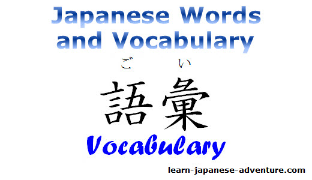

# Vocabulary

> **TL;DR**
> - Vocabulary is the one part of Japanese that never closes. Grammar is a finite system you can walk through in months; words are an open set, and they are what actually decides whether you understand a page or not.
> - **But an open set is not a random set.** Japanese words come from three identifiable strata - native 和語, Sino-Japanese 漢語, borrowed 外来語 - and each carries its own orthography, register and reading behaviour. Most of the lexicon past the first few thousand words is *assembled* from parts: kanji compounds, a few dozen affixes, compound verbs, clippings. Learn the machinery and later words get cheaper even as they get rarer. That is what [Part I](#part-i---a-brief-on-japanese-vocabulary) is for.
> - **"Knowing a word" is not one thing.** Form, meaning and use are three separate acquisitions, and recognition is several times cheaper than production. Most arguments about vocabulary are really arguments about which of those you are counting - see [what knowing a word actually means](#what-knowing-a-word-actually-means).
> - The numbers that matter: knowing about **95%** of the words in a text is roughly where reading becomes tolerable, about **98%** is where it becomes comfortable. Closing that 3-point gap costs thousands of words, because word frequency has a very long tail.
> - Start on day one, in parallel with [kana](../Kana/readme.md) and [grammar](../Grammar/readme.md). There is no stage where waiting helps.
> - **Recommended path:** one premade frequency deck for your first ~1,500 words - [Kaishi 1.5k](https://ankiweb.net/shared/info/1196762551) - then switch to mining words from media you actually consume, with immersion running the entire time.
> - Do the arithmetic **before** you pick a new-cards-per-day number. 10 new cards/day is ~3,650 words/year and roughly 90-100 reviews/day forever at steady state. Almost nobody checks this before committing, and then they drown. See [the arithmetic table](#the-arithmetic-of-new-cards-per-day).

---

## What this is and why it matters

This folder is about **words**: what a Japanese word is made of, where it came from, how it is written, how many you need, and - second half of the guide - how to acquire them without the review load collapsing on you.

Here is the asymmetry people underestimate. Japanese grammar is a **closed system**: a finite list of particles, a finite set of conjugations, a finite (if long) list of grammar points. A competent learner can read a complete grammar guide in a few months and spend the next year consolidating it. Vocabulary is an **open system**. There is no last word. Native adults know tens of thousands, and no amount of cleverness collapses that number.

So when you sit down with a manga page and understand nothing, the cause is almost never grammar. You can know every particle and every verb form and still be helpless, because you do not know twenty of the nouns on that page. Comprehension is gated by words.

The consolation, and the reason the reference half of this guide exists: the open set has visible internal structure. 漢語 compounds are semi-decodable once you know a few hundred on'yomi. A few dozen affixes generate thousands of words. Compound verbs are built from an inventory of about twenty second elements. None of that makes vocabulary finite, but it does mean the per-word cost falls as you go, which is the opposite of what the coverage arithmetic below would suggest on its own.

### What "knowing a word" actually means

Before any of the numbers in this guide mean anything, one distinction. Vocabulary knowledge has **three dimensions**, and they are acquired separately and at wildly different costs:

| Dimension | What it covers | Typical failure when it is missing |
| :--- | :--- | :--- |
| **Form** | The spoken form and the written form(s). Which kanji, or whether it is normally kana. Its pitch accent. | You know 綺麗 on a card and do not recognise きれい in text. You read a word fluently and never catch it in speech. |
| **Meaning** | The concept, its range, and what it is *not*. Which of its senses you have. | You learned 履く as "to wear" and now six words all mean "to wear". |
| **Use** | Its part of speech, the particle it takes, its transitivity partner, what it collocates with, its register. | You produce 車を乗る, or 飯 in a job interview, or 綺麗い. |

And each of those splits again into **receptive** (you understand it when you meet it) and **productive** (you can summon it when you need it). Productive knowledge of a word costs roughly three times what receptive knowledge costs, which is the single most important economic fact in this guide - it is why [production cards are usually a bad trade](#the-honest-verdict-on-production-cards) and why "I know 5,000 words" needs a footnote.

The practical upshot: **breadth beats depth, until it does not.** For comprehension - which is what gates reading and listening - you want the largest possible number of words known receptively at the "form + one meaning" level. Depth on any individual word is something immersion adds for free over time. The exceptions are the words carrying obligatory grammatical baggage, covered in [what each word obliges you to store](#what-each-word-obliges-you-to-store).

### Coverage and comprehension

Reading research has converged on two approximate thresholds, usually stated in terms of **lexical coverage** - the share of the running words in a text that you already know:

- **~95% coverage**: reading is *possible* with effort. You can follow a text with frequent guessing and occasional lookups.
- **~98% coverage**: reading is *comfortable*. You can read for pleasure, infer the rare unknown from context, and not lose the thread.

Treat these as well-established ballparks, not physical constants - the exact figure depends on the text, the reader and what you count as "understanding". The shape of the finding is what matters, and the shape is robust.

> **Where these numbers come from.** The 95% and 98% lexical-coverage figures originate in Laufer and Ravenhorst-Kalovski's work on English, and are discussed in Matsushita's PhD thesis, [*In What Order Should Learners Learn Japanese Vocabulary?*](<./Vocabulary Size and Text Coverage (Matsushita PhD Thesis)>) (in this folder), at **pp. 31-33** - which also reports a Japanese-specific figure nearer **96%** - with coverage-by-frequency-rank tables for Japanese corpora at **pp. 42-44**. [Honda (2019)](<./Reading Basic Vocabulary 10k (Honda 2019 Paper)>) is independent Japanese-side research on the same question, with coverage broken down by JLPT level and register.
>
> Two caveats worth keeping in view. The thresholds were established **on English**, and the Japanese figure is not identical - so "95%" is a borrowed constant, not a measured Japanese one. And coverage is measured in **running words** (tokens), not distinct words (types): a text where you know 95% of the running words may still contain a great many distinct words you do not know, because the ones you do know are the frequent ones repeating. That type/token split comes back with force in [the three strata](#the-three-strata-wago-kango-gairaigo).

Now make it concrete. Take a light-novel page of roughly 300 words:

| Coverage | Unknown words per 300-word page | Feels like |
| :--- | :--- | :--- |
| 90% | 30 | Decoding. One lookup every other line. Exhausting. |
| 95% | 15 | Possible. Constant small friction, plot survives. |
| 98% | 6 | Comfortable. You can stay in the story. |
| 99% | 3 | Native-ish reading. You barely notice. |

### Why 95% to 98% is such a brutal gap

Because word frequency follows a Zipf-like distribution: a small number of words are absurdly common, and then there is an enormous tail of words that each appear rarely but which **collectively** make up a large share of any real text.

Rough, corpus-dependent ballparks for Japanese:

| Words known (by frequency) | Approximate coverage of running text |
| :--- | :--- |
| Top 1,000 | ~60-70% |
| Top 2,000 | ~70-75% |
| Top 5,000 | ~80-85% |
| Top 10,000 | ~90% |
| Top 20,000 | ~95% |

Look at what that table is telling you. Your first 1,000 words buy roughly 60 points of coverage - 0.06 points per word. Getting from 90% to 95% costs about 10,000 more words - 0.0005 points per word, more than a hundred times worse per unit of effort. The early payoff is enormous and the late payoff is microscopic. This single fact explains most of the strategy in this guide, including why frequency ordering is right at the start and nearly pointless later, and why the [intermediate plateau](#the-intermediate-plateau-and-the-10k-wall) feels the way it does.

---

## Where it fits in the journey

**Prerequisites:**

- **Kana**, non-negotiable, and it takes days not months - see [Kana](../Kana/readme.md). Romaji-based vocabulary study is a dead end; see [Romaji](../Romaji/readme.md) for why.
- **Enough grammar to parse a sentence** - particles, present/past, negative, て-form. Roughly the first third of a grammar guide. See [Grammar](../Grammar/readme.md). You do not need to finish grammar first; you need enough to stop the example sentences on your cards from being noise.
- **A working SRS**. Anki, configured once and then left alone. Installation, FSRS, deck options, add-ons and Yomitan all live in [General content](<../General content/readme.md>) - that guide owns Anki configuration and it is not repeated here.

**Kanji runs in parallel, not before.** Whether you should study kanji as isolated characters at all, or only ever inside words, is a real debate and it is owned by [Kanji](../Kanji/readme.md). One reasonable position, in two sentences: a small daily dose of character study makes new words stickier and cheaper to distinguish, with everything else learned as whole words. Take that debate to that guide, not this one.

**What vocabulary unlocks:**

- [Reading](../Reading/readme.md) - graded readers at a few hundred words, NHK Easy and furigana manga at 2,000-3,000, light novels around 10,000.
- [Listening](../Listening/readme.md) - your listening usually lags your reading badly, because you can look up a written word and you cannot look up a sound.
- [AJATT](../AJATT/readme.md) - sentence mining only works once you have a base. You cannot find i+1 sentences when every sentence is i+10.
- [JLPT](../JLPT/readme.md) - the vocabulary section is the most directly word-gated part of the test.

---

# Part I - A brief on Japanese vocabulary

This is the reference half: what Japanese words actually are, before any question of how to drill them. It is the part that makes the rest of the guide make sense - the [corpus-mismatch](#word-frequency-and-its-limits) argument, the [leech](#leeches) diagnoses and the [card format](#card-formats-what-goes-on-a-vocabulary-card) rules all turn out to be consequences of facts in this section.

Boundaries, so nothing is duplicated: [Kanji](../Kanji/readme.md) owns how on'yomi and kun'yomi work and how characters are built; [Kana](../Kana/readme.md) owns katakana-to-English decoding and the 和製英語 false-friend tables; [Grammar](../Grammar/readme.md) owns conjugation, particle semantics and the keigo machinery. This section keeps the *word-level consequences* of all three and links out for the mechanics.

## Basic terms

The terms you will meet in Japanese-language resources, in dictionary tags, and in the datasets in this folder.

| Term | Reading | What it means |
| :--- | :--- | :--- |
| 語彙 | ごい | Vocabulary - the lexicon as a whole, or someone's stock of words. Not an individual word. |
| 単語 | たんご | A word; a single vocabulary item. The "tango" in the JLPT Tango deck series. |
| 語種 | ごしゅ | **Word stratum** - whether a word is native, Sino-Japanese, borrowed or hybrid. See [the three strata](#the-three-strata-wago-kango-gairaigo). |
| 和語 | わご | A native Japanese word. 食べる, 大きい, 水 (みず). |
| 漢語 | かんご | A Sino-Japanese word - built from Chinese-derived morphemes, read with on'yomi. 食事, 巨大, 水分. |
| 外来語 | がいらいご | A loanword from a language other than Chinese, normally written in katakana. パン, ストップ. |
| 混種語 | こんしゅご | A hybrid word mixing strata. 消しゴム (wago + gairaigo), 大型トラック. |
| 品詞 | ひんし | Part of speech. |
| 活用 | かつよう | Inflection / conjugation. A word that inflects is 活用語. |
| 見出し語 | みだしご | **Headword** - the dictionary entry form. What your flashcard stores. |
| 読み | よみ | The reading: how a written form is pronounced. |
| 音読み / 訓読み | おんよみ / くんよみ | The Chinese-derived / native reading of a kanji. Mechanics in [Kanji](../Kanji/readme.md#on-yomi-and-kun-yomi). |
| 送り仮名 | おくりがな | The kana tail written after a kanji to show inflection: the べる in 食べる. |
| 振り仮名 | ふりがな | A reading gloss printed above or beside kanji. |
| 熟語 | じゅくご | A compound word, usually two or more kanji. 16,599 of them in this folder's [Kanjium](<./Kanjium (pitch accent, jukugo, proverbs)>) data. |
| 熟字訓 | じゅくじくん | A compound read as a single native word rather than character by character. 大人 = おとな. |
| 当て字 | あてじ | Kanji assigned for sound or meaning rather than by regular reading. 寿司, 珈琲. |
| 助数詞 | じょすうし | A **counter**. See [counters, numbers and dates](#counters-numbers-and-dates). |
| 擬音語 / 擬態語 | ぎおんご / ぎたいご | Sound-mimicking / manner-mimicking word. See [onomatopoeia and mimetics](#onomatopoeia-and-mimetics). |
| 類義語 | るいぎご | A near-synonym. The source of most leeches. |
| 対義語 | たいぎご | An antonym. 521 pairs in the Kanjium data. |
| 同音異義語 | どうおんいぎご | A homophone with a different meaning. 交渉 / 高尚 / 考証. |
| 多義語 | たぎご | A polysemous word - one form, several senses. |
| 自動詞 / 他動詞 | じどうし / たどうし | Intransitive / transitive verb. Japanese pairs them lexically; see [Grammar](../Grammar/readme.md#reference-transitivity-pairs-自動詞--他動詞). |
| 複合動詞 | ふくごうどうし | A compound verb. 取り出す, 立ち上がる. |
| 略語 | りゃくご | A clipping or abbreviation. コンビニ, スマホ. |
| 敬語 | けいご | Honorific language. Partly lexical - see [register](#register-is-a-lexical-property-not-only-a-grammatical-one). |
| 語源 | ごげん | Etymology. |
| 高低アクセント | - | Pitch accent. 124,137 words' worth in this folder. |

And the learner-side jargon used throughout this repo:

| Term | What it means |
| :--- | :--- |
| **Gloss** | The short translation on the back of a card. A scaffold, and it [lies by omission](#synonyms-glosses-and-the-monolingual-transition). |
| **Lemma / dictionary form** | The uninflected headword: 食べる, not 食べさせられなかった. |
| **Surface form** | The word as it actually appears in a text, inflected. |
| **Type vs token** | Distinct words vs total running words. "5,000 words" means types; "95% coverage" means tokens. Confusing them makes most vocabulary statistics meaningless. |
| **Coverage** | The share of a text's tokens you know. See [above](#coverage-and-comprehension). |
| **i+1** | A sentence where exactly one item is unknown. The unit of [sentence mining](../AJATT/readme.md). |
| **Mining** | Making a card from a word you met in real media rather than from a premade list. |
| **Leech** | A card you keep failing. See [leeches](#leeches). |
| **SRS** | Spaced repetition system. Anki, in practice. Configuration in [General content](<../General content/readme.md>). |
| **Monolingual transition** | Switching your card backs from English glosses to Japanese-Japanese definitions. See [below](#synonyms-glosses-and-the-monolingual-transition). |

## What counts as one word

This sounds like pedantry and it is not: it is why every word-count number in this guide is hedged.

**Japanese does not put spaces between words.** 今日は学校に行きました is nine characters with no boundary marks. Where one word stops and the next starts is an *inference* the reader makes, not a fact on the page - which is why a beginner cannot look up a word they cannot first isolate, and why a popup dictionary that segments for you ([Yomitan](../General%20content/readme.md)) is worth more at the start than any deck.

Worse, the segmentation is genuinely ambiguous, and Japanese corpus linguistics handles this by defining **two** standards:

| Standard | Japanese | How it segments 東京大学入学試験 |
| :--- | :--- | :--- |
| **Short unit word** (SUW) | 短単位 | 東京 / 大学 / 入学 / 試験 - four words |
| **Long unit word** (LUW) | 長単位 | 東京大学 / 入学試験 - two words |

This is not academic trivia for this folder: the frequency file sitting in it is named `BCCWJ_SUW_LUW_combined.zip`. The "what is a word" problem is in the filename, and the reason the file ships both is that neither answer is wrong.

Three consequences that matter to you:

1. **"How many words do you know" is an ill-posed question** without stating a segmentation standard and a knowledge threshold. A jpdb known-word count, a JLPT level's word list and your Anki card count are three different measurements of three different things. Use each only against its own earlier self.
2. **Your cards store headwords; text contains surface forms.** 食べさせられなかった has to be run back to 食べる before it can be looked up. Yomitan does this with a deconjugation ruleset - the same data is in [`Grammar/Deconjugation Rules`](<../Grammar/Deconjugation Rules (Yomitan - Yomichan)>) - and doing it in your head is a skill that arrives with [grammar](../Grammar/readme.md#reference-the-conjugation-map), not with vocabulary.
3. **Some vocabulary items are longer than a word.** ～てしまう, ～ておく, ～に関して, ～として, ～わけではない sit exactly on the grammar/vocabulary border. Card them as units when you meet them as units, and do not worry about which folder they belong to.

## The three strata: wago, kango, gairaigo

If you learn one thing from this section, learn this one. Every Japanese word belongs to a stratum - **和語** native, **漢語** Sino-Japanese, **外来語** borrowed, or **混種語** hybrid - and the stratum predicts its spelling, its reading, its register and its likely part of speech. Japanese lexicography calls this 語種.

| Stratum | Origin | Written as | Read with | Register and flavour | Examples |
| :--- | :--- | :--- | :--- | :--- | :--- |
| **和語** (native) | Native Japanese, pre-Chinese | Kanji + 送り仮名, or plain kana | **kun'yomi** | Everyday, concrete, emotional, spoken. Often several mora long. | 食べる, 大きい, やめる, 水 (みず), 心 (こころ) |
| **漢語** (Sino-Japanese) | Borrowed from Chinese, or coined in Japan from Chinese parts | Kanji compound, usually no 送り仮名 | **on'yomi** | Formal, technical, abstract, compact, written. Two kanji, two to four mora. | 食事, 巨大, 中止, 水分 (すいぶん), 心臓 |
| **外来語** (loanword) | Any non-Chinese source - mostly English, also Portuguese, Dutch, German, French | **Katakana** | - | Modern, commercial, technical, occasionally euphemistic or just fashionable. | パン (pt.), ガラス (nl.), アルバイト (de.), ストップ |
| **混種語** (hybrid) | Mixed | Mixed | Mixed | Inherits from its parts. Extremely common and usually invisible to learners. | 消しゴム, 歯ブラシ, 大型トラック, 逆ギレ |

### The proportions, and why types and tokens disagree

NINJAL's 『現代雑誌九十種の用語用字』 magazine survey is the classic measurement, and it was repeated on 1994 magazines, which makes the pair unusually informative:

| Stratum | 1956 by **type** | 1956 by **token** | 1994 by **type** | 1994 by **token** |
| :--- | ---: | ---: | ---: | ---: |
| 和語 native | 36.7% | **53.9%** | 25.7% | 35.7% |
| 漢語 Sino-Japanese | **47.5%** | 41.3% | 34.2% | **49.9%** |
| 外来語 loanwords | 9.8% | 2.9% | **33.8%** | 12.3% |
| 混種語 hybrid | 6.0% | 1.9% | 6.4% | 2.1% |

Two findings in that table, both load-bearing:

**1. 漢語 dominates the dictionary; 和語 dominates the page.** Sino-Japanese words are the plurality of *distinct* words but a minority of *running* words - because there are enormous numbers of rare technical 漢語, while the handful of native verbs, adjectives and function words repeat endlessly. This is the type/token distinction from the [coverage caveat](#coverage-and-comprehension) with real numbers on it, and it has a direct strategic consequence: **your first thousand words will be mostly 和語, and your ten-thousandth thousand will be mostly 漢語.** A beginner frequency deck looks native-heavy; a JLPT N1 list looks like a chemistry glossary. Both are correctly sampled from their band.

**2. Loanword *types* more than tripled in four decades** (9.8% -> 33.8%) while loanword *tokens* rose far less (2.9% -> 12.3%). Japanese acquires a huge number of loanwords, most of them individually rare. Practical translation: katakana words are a long, shallow tail, you will meet new ones forever, and the right response is the [decoding skill](../Kana/readme.md#reading-katakana-loanwords) rather than flashcards. Modern figures agree on the shape - by BCCWJ, loanwords are roughly 19% of written types but only about 5% of tokens; in spoken Japanese (CEJC) about 14% and 2%.

### Stratum is register, and register is your corpus problem

The same NINJAL line of work reports the fact that should reshape how you read the rest of this guide: **newspaper prose runs over 70% 漢語 by token count, and conversation runs over 70% 和語.**

That is the mechanism behind the entire [corpus-mismatch](#word-frequency-and-its-limits) argument. A news-derived frequency list and an anime-subtitle list do not merely differ in topic - they sample different *strata* of the language. Which is why grinding N1 news vocabulary teaches you 首相 and 協議 and leaves you unable to follow a slice-of-life conversation, and why the reverse leaves you literate in 面倒くさい and helpless in a meeting.

The clearest demonstration is that Japanese frequently has **one meaning at all three strata**, differing only in register:

| Meaning | 和語 (everyday, spoken) | 漢語 (formal, written) | 外来語 (modern, commercial) |
| :--- | :--- | :--- | :--- |
| stop | やめる / とめる | 中止する / 停止する | ストップする |
| meal | ご飯 | 食事 | ランチ / ディナー |
| lodging | 宿 | 旅館 / 宿泊施設 | ホテル |
| big | 大きい | 巨大 / 大型 | ビッグ |
| cancel | 取り消す | 解約する / 解除する | キャンセルする |
| idea | 考え | 案 / 構想 | アイデア |
| rules | 決まり | 規則 / 規定 | ルール |
| price | 値段 | 価格 | プライス |

Read that table as three parallel vocabularies, because that is what it is. Picking the wrong column is the most common way an otherwise advanced learner sounds wrong: 中止する to a friend is stiff, ストップする in a contract is unserious, 宿 on a hotel booking form is quaint. Nothing about the English gloss tells you this, which is one more reason [glosses are a scaffold](#synonyms-glosses-and-the-monolingual-transition).

### Two footnotes worth knowing

**和製漢語** - Sino-Japanese words *coined in Japan*, mostly in the Meiji period, to translate Western concepts: 社会, 科学, 経済, 哲学, 電話, 自由, 概念. Many were subsequently exported into Chinese and Korean, so a fair slice of modern East Asian abstract vocabulary is Japanese-made. Practical value: none for passing a test, considerable for realising that 漢語 is a living productive system rather than a stack of ancient borrowings.

**和製英語** - English-looking words coined in Japan that no English speaker would recognise in that sense. アルバイト is German, マンション means "apartment", サラリーマン, コンセント, ソフトクリーム. This is a decoding trap rather than a lexical-stratum question, so it is fully owned by [Kana](../Kana/readme.md#false-friends-和製英語), which has the tables and the drills.

### What this means for how you study

The two big strata need **different strategies**, and treating them the same is a quiet waste of years:

- **漢語 is semi-decodable.** Once you know a few hundred common on'yomi and the [compound patterns](#how-new-words-are-built) below, a new two-kanji word is often a guess rather than a lookup: 火山 = fire + mountain = volcano. Effort spent on kanji readings pays a compounding dividend here, which is the strongest argument in the [kanji-in-isolation debate](../Kanji/readme.md#the-real-debate-should-you-study-kanji-in-isolation-at-all).
- **和語 is not decodable.** 心 as こころ, 水 as みず, おっしゃる, さすが - the native layer is irregular, high-frequency and must simply be learned. Fortunately it is small and front-loaded, so a frequency deck handles it.
- **外来語 is a skill, not a list.** Learn the katakana transformation rules once and most loanwords become free.

## What each word obliges you to store

A word is not a (form, meaning) pair. Depending on its part of speech, it drags obligatory baggage along with it, and a card that omits the baggage is a card that will fail you the moment you try to use it.

| Part of speech | What you must store beyond form + meaning | Why | What goes wrong if you skip it |
| :--- | :--- | :--- | :--- |
| **Verb** 動詞 | Its **group** (godan / ichidan / irregular), its **transitivity** and partner verb, and the **particle** it takes | Conjugation depends entirely on group; the transitive partner is a *different word*; the particle is not predictable from English | You conjugate 帰る as ichidan (it is godan - 帰ります, not 帰ます). You say 車を乗る instead of 車に乗る. You use 落ちる where 落とす is needed. |
| **する-noun** 動名詞 | Whether it takes する, and whether it prefers を | 勉強する and 勉強をする are both fine; many nouns take neither | You invent 努力をしる, or attach する to a noun that does not take it |
| **i-adjective** | Nothing extra - it is the regular class | | |
| **na-adjective** | **The fact that it is na.** It is a noun wearing an adjective hat | 綺麗 is a noun; the な is doing the work | 綺麗い, and 綺麗かった. The single most recognisable beginner error |
| **Adverb** | Whether it wants と, に, or nothing | ゆっくり(と), 急に, 突然 | Sentences that are comprehensible but audibly non-native |
| **Mimetic** 擬態語 | Its particle (usually と) **and** its habitual verb | These live in fixed pairings: ニコニコ(と)笑う, ドキドキする | An unusable word - you know it and cannot deploy it |
| **Noun** | Whether it is [usually written in kana](#how-a-word-is-written), and its **counter** | 一本 vs 一枚 vs 一匹 is a property of the noun | You cannot count the thing you just learned the name of |
| **Counter** 助数詞 | Its sound changes across 1 / 3 / 6 / 8 / 10 | 一本 is いっぽん, not いちほん | Fluent-sounding nouns and broken numbers |
| **Any word** | Its **register** - which of the three strata columns it sits in | See [above](#stratum-is-register-and-register-is-your-corpus-problem) | 飯 in an interview; 中止する to a friend |

**The data for all of this is already in this folder**, which is the point of having it locally. [JMdict](<./JMdict (jmdict-simplified JSON)>) tags every entry with part of speech (`v5r`, `v1`, `vs`, `adj-i`, `adj-na`, `vt`/`vi`, `ctr`) and usage (`uk`, `col`, `hon`, `hum`, `arch`, `vulg`). [Kanjium's `compverbs.txt`](<./Kanjium (pitch accent, jukugo, proverbs)>) carries the governing particle for each of its 430 compound verbs. [`Grammar/Transitivity Pairs`](<../Grammar/Transitivity Pairs (Jim Breen)>) and [`Grammar/Verb Particle Collocations`](<../Grammar/Verb Particle Collocations (Kanjium)>) hold the pairings. If you generate your own cards, these fields are free; if you use a premade deck, check which of them it bothered to include.

**The honest qualification:** for a pure **recognition** card you can skip nearly all of this. Meeting 乗る in a sentence and understanding it does not require knowing it takes に. The baggage becomes mandatory at production time - which is one more reason the [production-card verdict](#the-honest-verdict-on-production-cards) is "defer, then be selective". Store the metadata when it is free, and only *study* it when you have an output goal.

## How a word is written

One Japanese word can have several legitimate written forms, and your card has to carry the one you will actually meet. This is a bigger source of wasted effort than it looks.

**The same word, different clothes.** 私 / わたし, 有難う / ありがとう, 綺麗 / きれい, 猫 / ねこ / ネコ, 沢山 / たくさん, 出来る / できる. All correct. But real text has strong preferences, and JMdict encodes them: the **`uk` tag** ("usually written using kana alone") marks thousands of words whose kanji form you will rarely see. If you card 綺麗 and everything in the wild writes きれい, you trained a recognition you will not use, and failed to train the one you need.

> **The rule:** the front of the card is the form that appears in your media. Not the most impressive form, not the dictionary's first form - the one you will meet.

**送り仮名 variation.** 行う / 行なう, 表す / 表わす, 申し込み / 申込み. Both are legal, government guidelines permit variation, and different publishers pick differently. Recognise both, write one, do not agonise. [Writing](../Writing/readme.md) owns the orthography question properly.

**熟字訓 - compounds with no per-character reading.** The reading attaches to the whole compound and cannot be derived from the parts:

| Word | Reading | Not |
| :--- | :--- | :--- |
| 大人 | おとな | だいじん |
| 明日 | あした / あす | みょうじつ |
| 今日 | きょう | こんじつ |
| 一昨日 | おととい | いっさくじつ |
| 田舎 | いなか | でんしゃ |
| 眼鏡 | めがね | がんきょう |
| 紅葉 | もみじ | こうよう (both exist, different senses) |
| 果物 | くだもの | かぶつ |
| 土産 | みやげ | どさん |

These are high-frequency and unguessable, so they are worth a deliberate early pass. They are also why "learn the kanji readings and you can read any word" is overstated - see [Kanji](../Kanji/readme.md#the-exceptions-you-must-know-about).

**当て字 - kanji picked for sound or vibe.** 寿司, 珈琲 (coffee), 天麩羅, 出鱈目, 滅茶苦茶. Mostly you will meet these in signage and older text and read them as the kana word you already know.

**Katakana is not only for loanwords.** It also marks emphasis (ダメ, スゴイ, ヤバイ), animal and plant names in casual and scientific writing (ネコ, サクラ, バラ - 薔薇 exists and nobody writes it), onomatopoeia, robot and non-native speech, and a great deal of slang and branding. So a katakana word is not automatically a foreign word, and treating katakana as "the loanword script" will mislead you regularly.

**Furigana** is a reading aid, not a property of the word - see [Kanji](../Kanji/readme.md) for when to trust it and [`JmdictFurigana`](./JmdictFurigana) in this folder for the 236,255-entry character-level alignment that lets you generate it yourself.

## How new words are built

This is the section that turns vocabulary from a list into a system, and it is the practical answer to the despair induced by the [coverage arithmetic](#why-95-to-98-is-such-a-brutal-gap). Words past the first few thousand are rarer *and* cheaper, because most of them are assembled from parts you already own.

### Two-kanji compound patterns

Roughly a handful of structural patterns cover most 熟語. Learning to spot them means a new compound is often a guess rather than a lookup:

| Pattern | Structure | Examples |
| :--- | :--- | :--- |
| **Modifier + head** | Attribute then noun | 高山 (high mountain), 新車 (new car), 大国, 親友 |
| **Verb + object** | Verb then its object - **Chinese word order, backwards from Japanese** | 読書 (read-book = reading), 登山 (climb-mountain), 食事, 殺人, 開店 |
| **Synonym pair** | Two near-synonyms reinforcing each other | 道路 (way-road), 身体, 森林, 巨大, 変化, 増加 |
| **Antonym pair** | Two opposites naming the whole scale | 大小 (size), 上下, 左右, 売買, 明暗, 有無 |
| **Subject + verb** | Noun then what it does | 地震 (earth-quake), 日没, 頭痛, 雷鳴 |
| **Negated noun** | Negating prefix + noun | 不安, 未定, 非常, 無理 |
| **Derived noun** | Noun/stem + suffix | 一般的, 可能性, 自動化, 医者 |

The **verb + object** pattern deserves special attention because it is the one that confuses learners who know Japanese syntax: 読書 is *verb-then-object*, the reverse of Japanese 本を読む. It is Chinese grammar fossilised inside Japanese vocabulary. Once you see it, a large class of compounds becomes transparent - and it explains why so many 漢語 nouns take する to become verbs again.

### Affixes, ranked by how much vocabulary they unlock

This is the highest-leverage table in the reference half. A few dozen morphemes generate thousands of words.

| Affix | Force | Examples |
| :--- | :--- | :--- |
| **不-** | not, un-, dis- | 不安, 不便, 不足, 不可能, 不自由 |
| **未-** | not yet | 未定, 未来, 未成年, 未完成 |
| **非-** | non-, un- | 非常, 非公式, 非現実的 |
| **無-** | without, -less | 無料, 無理, 無限, 無意味 |
| **再-** | re-, again | 再開, 再会, 再建, 再利用 |
| **全-** | all, whole | 全員, 全国, 全体 |
| **お- / ご-** | politeness (wago / kango respectively) | お金, お茶, ご飯, ご連絡 |
| **-的** | -ic, -al (produces a na-adjective) | 一般的, 具体的, 社会的, 積極的 |
| **-性** | -ness, -ity (abstract noun) | 可能性, 必要性, 安全性 |
| **-化** | -ization, becoming | 自動化, 国際化, 高齢化, 悪化 |
| **-者** | person (formal, institutional) | 医者, 労働者, 被害者, 担当者 |
| **-家** | practitioner, expert | 作家, 政治家, 専門家, 芸術家 |
| **-員** | member of a body or staff | 会社員, 店員, 駅員, 公務員 |
| **-屋** | shop, or the person who runs it | 本屋, 八百屋, パン屋 |
| **-力** | power, capacity | 能力, 体力, 想像力, 集中力 |
| **-中** | in the middle of | 仕事中, 使用中, 工事中 |
| **-さ** | nominaliser from an i-adjective (objective, measurable) | 大きさ, 高さ, 長さ, 重さ |
| **-み** | nominaliser (subjective, felt) | 悲しみ, 深み, 甘み, 痛み |
| **-すぎる** | too much | 食べすぎる, 高すぎる |
| **-やすい / -にくい** | easy / hard to | 読みやすい, 分かりにくい |

The 的 / 性 / 化 trio is worth singling out: they are how Japanese builds abstract and academic vocabulary, they attach to almost any 漢語 root, and they make a large fraction of non-fiction and news vocabulary predictable from a root you already know.

### Compound verbs

**複合動詞** glue two verbs together, and the second element usually contributes a direction, an aspect or a degree rather than its literal meaning. There are 430 in [this folder's Kanjium data](<./Kanjium (pitch accent, jukugo, proverbs)>), each with its particle and transitivity - and the second-element inventory is only about twenty items:

| Second element | Contributes | Examples |
| :--- | :--- | :--- |
| **-出す** | outward, or *beginning* | 取り出す, 走り出す, 言い出す |
| **-込む** | inward, thoroughly | 書き込む, 申し込む, 飛び込む |
| **-上げる / -上がる** | upward, completion | 見上げる, 立ち上がる, 仕上げる |
| **-切る** | completely, to the end | 使い切る, 言い切る, 読み切る |
| **-直す** | redo | やり直す, 書き直す, 見直す |
| **-過ぎる** | excess | 食べ過ぎる, 言い過ぎる |
| **-始める / -終わる** | start / finish | 読み始める, 食べ終わる |
| **-合う** | mutually | 話し合う, 助け合う |
| **-返す** | back, in return | 言い返す, 読み返す |

Learn those twenty and a hundred-odd compounds become guessable, which is a far better return than carding them one at a time. The catch is that some are idiomatic rather than compositional - 引っ越す (move house) is not "pull-cross" - so treat transparency as the default and idiom as the exception.

### Clipping and abbreviation

Japanese clips aggressively, and **four mora is the target length**:

- コンビニエンスストア -> **コンビニ**, スマートフォン -> **スマホ**, パーソナルコンピュータ -> **パソコン**, アニメーション -> **アニメ**, リモートコントロール -> **リモコン**, エアコンディショナー -> **エアコン**, アルバイト -> **バイト**
- Native and Sino-Japanese clip too: 就職活動 -> **就活**, 結婚活動 -> **婚活**, 高等学校 -> **高校**, 携帯電話 -> **携帯**

This is where new vocabulary arrives fastest, and it is the category no frequency list from five years ago contains. It is also a reason to keep your input current rather than only studying lists.

### 連濁 - why a compound's reading is not just its parts

When two words compound, the second element's initial consonant frequently **voices**: 手 + 紙 -> てが み, 人 + 人 -> ひとび と, 三 + 本 -> さんぼ ん, 花 + 火 -> はなび.

There is a partial constraint, **Lyman's Law**: rendaku is blocked if the second element already contains a voiced obstruent - hence 山 + 風 -> やまかぜ, not やまがぜ. Honest caveat: rendaku is a strong tendency with real exceptions, not a rule you can apply blindly. Know that it happens, so an unexpected voiced reading does not read as a memory failure.

## Counters, numbers and dates

Japanese cannot count a thing without naming what kind of thing it is. **助数詞** are a small, closed, high-frequency system with irregular forms - which makes them the one place in this guide where a thematic list genuinely beats frequency ordering, because the whole set is worth having at once. JMdict tags **266** entries as part of speech `ctr`, extractable with one filter.

| Counter | For | Irregular forms to know |
| :--- | :--- | :--- |
| **つ** | Generic small things, 1-9 (native numerals) | ひとつ, ふたつ, みっつ, よっつ, いつつ, むっつ, ななつ, やっつ, ここのつ |
| **個** こ | Generic small objects (the 漢語 default) | 一個 いっこ, 六個 ろっこ |
| **人** にん | People | 一人 **ひとり**, 二人 **ふたり**, 四人 よにん |
| **本** ほん | Long thin things; also bottles, phone calls, train services | 一本 **いっぽん**, 三本 **さんぼん**, 六本 **ろっぽん**, 八本 はっぽん, 十本 じゅっぽん |
| **枚** まい | Flat things - paper, plates, shirts, tickets | regular |
| **匹** ひき | Small animals | 一匹 **いっぴき**, 三匹 **さんびき**, 六匹 **ろっぴき** |
| **頭** とう | Large animals | regular |
| **台** だい | Machines and vehicles | regular |
| **冊** さつ | Books and bound volumes | 一冊 いっさつ, 八冊 はっさつ |
| **杯** はい | Cupfuls, glassfuls | 一杯 **いっぱい**, 三杯 **さんばい** |
| **回** かい | Times, occasions | 一回 いっかい |
| **歳 / 才** さい | Age | 一歳 いっさい, 二十歳 **はたち** |
| **階** かい | Floors of a building | 一階 いっかい, 三階 さんがい |
| **分** ふん | Minutes | 一分 **いっぷん**, 四分 よんぷん, 六分 **ろっぷん** |

**One rule instead of forty memorised forms:** counters beginning with **h-** (本, 匹, 杯, 分, 泊, 階) shift to **p-** after 1, 6, 8 and 10, and often to **b-** after 3. That single pattern covers the overwhelming majority of the irregularities above.

**Dates are their own small disaster**, and they are unavoidable. Days 1-10 plus 14, 20 and 24 use native readings; everything else is regular:

| Day | Reading | Day | Reading |
| :--- | :--- | :--- | :--- |
| 一日 | ついたち | 七日 | なのか |
| 二日 | ふつか | 八日 | ようか |
| 三日 | みっか | 九日 | ここのか |
| 四日 | よっか | 十日 | とおか |
| 五日 | いつか | 十四日 | じゅうよっか |
| 六日 | むいか | 二十日 | **はつか** |

**Verdict:** counters and date readings are worth a deliberate, boring, one-week thematic pass, early - somewhere in [Phase 1](#phase-1---the-first-1500-words). They are high-frequency, unguessable, closed, and a permanent embarrassment if skipped. This is the legitimate use case that the [thematic-list school](#3-thematic--textbook-vocabulary) has been waiting for.

## Onomatopoeia and mimetics

English treats sound-words as childish. Japanese does not: **擬音語** (sound-mimicking), **擬態語** (manner-mimicking) and **擬情語** (feeling-mimicking) words appear in novels, news, food writing and adult conversation, and there are thousands of them. Skipping them leaves a hole that no amount of 漢語 fills.

They come in recognisable shapes, which is what makes them learnable in bulk:

| Shape | Feel | Examples |
| :--- | :--- | :--- |
| **Reduplicated** CVCV-CVCV | Repeated or continuous | キラキラ (glittering), ドキドキ (heart pounding), ワクワク (excited), バラバラ (scattered), ペコペコ (famished) |
| **-り** ending | A settled, completed state | ぴったり (exactly fitting), ゆっくり (slowly), さっぱり (refreshed), こっそり (stealthily) |
| **-っと / -と** | A single brief action | ちらっと (a glance), さっと (swiftly), ぐっと (with force) |
| **-ん** ending | Resonance, or emptiness | ぽかん (blankly), がらん (deserted), きちん (neatly) |

And there is a genuine **sound-symbolism** pattern, one of the few places in Japanese where the sound predicts the meaning: a **voiced** initial consonant makes the thing bigger, heavier, coarser or less pleasant.

| Voiceless | Voiced | The difference |
| :--- | :--- | :--- |
| ころころ | ごろごろ | a small thing rolling / a heavy thing rolling |
| さらさら | ざらざら | smooth and flowing / rough and gritty |
| きらきら | ぎらぎら | pretty sparkling / harsh glaring |
| とんとん | どんどん | light tapping / heavy banging |

**How to actually learn them.** Two rules. First, they live in **fixed pairings** with a particle and a verb - ニコニコ(と)笑う, ドキドキする, お腹がペコペコ - so card the pairing, never the bare mimetic. Second, **English glosses are uniquely useless here** ("glitteringly", "with a thud"), which makes them a reliable leech factory on gloss-based cards; learn them from context, or from a source that shows contrasting pairs. The manga SFX and onomatopoeia dataset in [`Grammar/Onomatopoeia and Manga SFX Dataset`](<../Grammar/Onomatopoeia and Manga SFX Dataset>) is the local resource, and manga is the natural place to meet them - see [Reading](../Reading/readme.md).

## Homophones, and what pitch accent does and does not fix

Japanese has a very small sound inventory - on the order of 110-120 distinct mora - and short words, and a 漢語 layer built by recombining a few hundred on'yomi. The arithmetic is unforgiving: **massive homophony is structurally guaranteed.**

Counted directly from [`Kanjium/accents.txt`](<./Kanjium (pitch accent, jukugo, proverbs)>) in this folder - 108,021 words carrying a reading, across 68,942 distinct readings:

| Measure | Count |
| :--- | ---: |
| Readings shared by 2 or more words | **22,110** |
| Readings shared by 5 or more words | **1,825** |
| Words sharing the reading こうしょう | **22** |
| Words sharing the reading こう | 33 |

Twenty-two words pronounced こうしょう - 交渉, 高尚, 考証, 公証, 校章, 哄笑, 鉱床 and more. This is **why kanji survived**: written Japanese disambiguates visually what speech cannot. It is also why 同音異義語 is specifically a *listening* problem - see [Listening](../Listening/readme.md).

### The pitch-accent reality check

Pitch accent is frequently sold as the answer to homophones (箸 はし / 橋 はし / 端 はし). Test that claim against the data. [`Kanjium/homonyms.txt`](<./Kanjium (pitch accent, jukugo, proverbs)>) is 690 sets of words sharing a reading, each flagged for whether pitch accent separates them:

| | Sets | Share |
| :--- | ---: | ---: |
| **Same** pitch accent - pitch does **not** help | **459** | 67% |
| **Different** pitch accent - pitch **does** help | 231 | 33% |

So pitch accent disambiguates about **one third** of real collisions. That is a genuine contribution and it is not a solution. The honest position: pitch accent is worth having on your cards because it is *free* - Kaishi ships it, Kanjium has 124,137 words of it, and looking at it daily costs nothing - but it is not the fix for homophones, and deliberate pitch *study* is an output concern owned by [Speaking](../Speaking/readme.md). **Context is the fix.** Kanji is the fix in writing.

### Three things to do about it

1. **Never card two homophones on the same day.** You will not learn two meanings; you will learn to guess which card you are looking at. This is [synonym collision](#leeches) with sound instead of glosses.
2. **`homonyms.txt` tells you your future leeches in advance.** It lists exactly which words collide, and flags the 459 sets where pitch will not save you. That is a pre-emptive leech list sitting in this folder.
3. **When you mishear something, the fix is more context, not more pitch drilling.** Native listeners resolve こうしょう by topic, not by acoustics.

## Register is a lexical property, not only a grammatical one

[Grammar](../Grammar/readme.md#reference-keigo---the-register-ladder) owns the keigo machinery - the お～になる frames, the humble constructions, when each register applies. What belongs here is the **lexical** half: Japanese routinely has entirely *different words* for the same act at different politeness levels, and those are vocabulary items you have to store, not rules you can derive.

| Blunt / intimate | Plain | Polite | Honorific (about others) | Humble (about yourself) |
| :--- | :--- | :--- | :--- | :--- |
| 飯 めし | ご飯 | お食事 | - | - |
| 食う | 食べる | 食べます | 召し上がる | いただく |
| 見る | 見る | 見ます | ご覧になる | 拝見する |
| 行く | 行く | 行きます | いらっしゃる | 伺う / 参る |
| 言う | 言う | 言います | おっしゃる | 申す / 申し上げる |
| する | する | します | なさる | いたす |
| いる | いる | います | いらっしゃる | おる |
| 俺 / あいつ | 私 / あの人 | わたし / あの方 | - | わたくし |

Note what the honorific and humble columns are: **not conjugations**. 召し上がる is a separate word from 食べる and has to be learned as one. There are only about ten such verb sets and they cover most of what you will hear in shops and offices, which makes them an unusually good return for a small, closed study set - recognition first, production much later.

Two further register dimensions that are lexical rather than grammatical:

- **Speaker-marked vocabulary.** 俺 / 僕 / 私 / あたし / わし are all "I" and each announces something about the speaker's gender, age, formality and self-presentation. Pronouns in Japanese are ordinary nouns with heavy social loading, not a neutral closed class.
- **The source-register trap.** **Your deck inherits the register of whatever it was built from.** A deck mined from shounen anime teaches you 俺 and てめえ and no 恐縮ですが. An N1 news deck teaches you 稟議 and no 面倒くさい. Neither is defective; both are *partial samples of one stratum*. Know which register you are accumulating, and see [Speaking](../Speaking/readme.md) for the anime-register problem at the output end and [Culture](../Culture/readme.md) for what the distinctions actually encode socially.

## Synonyms, glosses and the monolingual transition

The most persistent beginner error is learning a Japanese word as an **English label** rather than as a word with its own usage range. English glosses are a scaffold, and they lie by omission.

The classic demonstration is "to wear", which is not one Japanese word but a family sorted by *what* you are wearing:

| Japanese | Roughly | Used for |
| :--- | :--- | :--- |
| 着る | to wear | clothing on the torso - shirts, coats, dresses |
| 履く | to wear | things on the feet and legs - shoes, socks, trousers |
| かぶる | to wear | things on the head - hats, helmets |
| する | to wear | accessories - a tie, a necklace, a scarf |
| はめる | to wear | things you slide onto something - rings, gloves |
| かける | to wear | glasses |

If all six of those cards say "to wear", you have built six cards that are mutually indistinguishable and a guaranteed set of leeches. The same trap catches 見る / 見える / 見られる (to look at, to be visible, to be able to see - a distinction about agency and possibility, not about vision), 分かる / 知る, あげる / くれる / もらう, and 思う / 考える. And it is the same failure as the [three-strata register columns](#stratum-is-register-and-register-is-your-corpus-problem) above: やめる, 中止する and ストップする all gloss as "to stop" and are not interchangeable.

**Fixes, cheapest first:**

1. **Never let two cards have the same English side.** Write "to wear (on feet/legs)" not "to wear". Twenty seconds, permanent fix.
2. **Let the example sentence carry the distinction.** 靴を履く is worth more than any gloss.
3. **Learn the collocation, not the word.** Card 帽子をかぶる as a unit. Japanese verbs of this kind live in fixed pairings.
4. **Go monolingual eventually.** A Japanese-Japanese definition gives you the actual usage range instead of an English approximation, and it doubles as reading practice. This is a *transition*, not a switch - typically somewhere around 5,000+ words, and you can run both dictionaries side by side for months. Dictionary and Yomitan setup is owned by [General content](<../General content/readme.md>).
5. **Trust immersion for the fine distinctions.** Some usage ranges cannot be carded. You will simply have heard 履く with shoes four hundred times and it will stop being a question.

---

# Part II - Acquiring vocabulary

Part I was what words are. This part is how you get them into your head without the review load burying you.

## Word frequency and its limits

Frequency-ordered study is the single highest-leverage idea in beginner vocabulary, and it is also routinely oversold. Both halves are true.

**Why it works early:** if the top 1,000 words cover 60-70% of everything, then learning words in frequency order means every card you add is immediately useful, and you will meet those words within hours of starting any Japanese media. This is why every serious beginner deck - Core 2k, Kaishi 1.5k, JP1K - is frequency-sorted or close to it.

**Why it stops working:** past a few thousand words the ranking becomes noise for your purposes. The difference between word #6,000 and word #12,000 in some corpus is a rounding error in how often *you* will personally meet them. What matters then is not global frequency but **frequency in your media**.

**Corpus mismatch is the trap nobody mentions.** A frequency list is only a frequency list *of something* - and as [the strata section](#stratum-is-register-and-register-is-your-corpus-problem) showed, different corpora sample different *layers* of the language, not merely different topics:

| List derived from | Great for | Bad for |
| :--- | :--- | :--- |
| Anime/drama subtitles (e.g. the Netflix-frequency field inside the local Core10k deck) | Anime, drama, casual spoken Japanese, manga dialogue | Business email, technical writing, news |
| Newspapers (many JLPT-oriented lists) | News, formal writing, JLPT reading | Casual speech, slang, anime |
| Novels / literary corpora | Light novels, prose fiction | Everyday conversation |
| Textbook or JLPT syllabus lists | Passing a specific test | Anything unfiltered and real |

So "the 5,000 most common Japanese words" is an incomplete sentence. If your target is anime and manga, a subtitle-derived list is the right tool and a news-derived list will waste your time on 首相 and 協議 while you still do not know 面倒くさい. If your target is a Japanese office, the reverse. **Know which corpus your deck came from** - and note that this folder holds [seven independent frequency corpora](./sources.md#counting-the-frequency-corpora), so you can check a word's rank in more than one.

For a learner whose target media is seinen manga and anime, subtitle- and fiction-weighted data is exactly right for the next few years. Office-register Japanese matters eventually, but learning 稟議 before 面倒くさい would be backwards. Frequency first, domain later.

## The schools of thought

### 1. Premade frequency decks

Core 2k/6k/10k, [Kaishi 1.5k](https://ankiweb.net/shared/info/1196762551), Ankidrone Essentials / Core10k, Ankidrone Foundation and JP1K, the JLPT Tango series - all available online, see the [Online resources table](#online). Someone else chose the words, wrote the sentences, recorded the audio, and sorted the whole thing by frequency.

- **Pros:** zero setup - you are studying five minutes after download. Sane ordering, so early cards are high-value. Native audio and example sentences you could not produce yourself at this level. Quality control by someone who knew more than you. Consistent card format, which makes reviews fast and rhythmic.
- **Cons:** the words arrive with no personal context and no emotional hook - you meet 全員 as an entry in a queue, not as a word someone shouted in a scene you cared about. A meaningful fraction of cards feel arbitrary (the Ankidrone decks openly warn that they include place names and obvious katakana loanwords straight from the source textbooks). And long decks have a brutal abandonment rate: the 10k deck that dies at card 400 is the single most common Anki story there is.
- **Best for:** absolute beginners up to roughly 1,500-2,000 words. Also a decent background second deck later if you have review capacity spare.

### 2. Sentence mining / personal decks

You read or watch something, hit a word you do not know, and make a card from that exact sentence. The mechanics - finding i+1 sentences, Yomitan-to-Anki, one-click card creation - are owned by [AJATT](../AJATT/readme.md). What belongs here is the strategic verdict.

- **Pros:** every card carries context and a memory hook, because you were *there*. You learn precisely the words your media uses, which is the only frequency list that actually applies to you. It scales forever - the only approach that still works at 15,000 words - and it keeps study and immersion welded together instead of competing.
- **Cons:** real per-card time cost (30-90 seconds even with good tooling, plus the decision fatigue of choosing what to mine), and it requires a tool chain. It is **genuinely bad before you have a base**: if a page has 30 unknowns you cannot mine it, you can only transcribe it. It also lets you fool yourself - a card you made yourself feels like progress even when it is a rare word you will never meet again.
- **Best for:** roughly 1,500+ words, and from then on permanently.

### 3. Thematic / textbook vocabulary

Topic lists: restaurant words, train station words, job interview words. The [japanesepod101 cheat sheets](./japanesepod101) in this folder are exactly this genre, and so are textbook chapter lists.

- **Pros:** immediately practical for a concrete situation - a trip, a doctor's visit, an apartment viewing, a work domain. Ties directly to output, so it serves [Speaking](../Speaking/readme.md) goals better than frequency lists do.
- **Cons:** ignores frequency completely, so you learn twenty vegetable names before common verbs. Semantically clustered sets also cause **interference** - ten similar clothing words learned together are harder to tell apart, not easier. Coverage per hour is poor.
- **Best for:** targeted needs with a deadline, as a supplement - never as your main engine. The one exception where it genuinely wins is **closed irregular systems**: [counters, dates and the keigo verb sets](#counters-numbers-and-dates), which are small, high-frequency and unguessable, so taking them as a set beats meeting them at random.

### 4. No SRS at all - pure extensive reading and listening

Acquire words the way you acquired most of your native vocabulary: by meeting them repeatedly in context until they stick.

- **Pros:** zero maintenance and zero review debt. No artificial queue growing for years. Words learned this way come with usage, register and collocation attached, not just a gloss. Unlimited ceiling, and it is what everyone ends up doing eventually anyway.
- **Cons:** painfully slow for the first few thousand words. A word typically needs something like 10-20 meaningful encounters to stick from exposure alone, and at low coverage you are not getting meaningful encounters, you are getting noise. The first 2,000 words this way can take years of frustration that four months of SRS would have skipped.
- **Best for:** intermediate and beyond, and for everyone who has decided SRS is making them miserable. Not a good opening move.

### 5. Managed services

[WaniKani](https://www.wanikani.com/) (kanji-first with attached vocabulary), [Bunpro](https://bunpro.jp/), [Marumori](https://marumori.io), [Renshuu](https://www.renshuu.org/), [jpdb](https://jpdb.io/).

- **Pros:** structure, scheduling and content decisions are made for you. Good UX, progress dashboards, no deck maintenance, no note-type editing. For people who bounce off Anki's interface this is the difference between studying and not studying. jpdb in particular is genuinely excellent at per-media word lists and known-word tracking.
- **Cons:** subscription cost, and inflexibility - their word order, their card format, their algorithm. Hard to merge with mined cards, so you often end up maintaining two systems. If the service dies your data is awkward to rescue, and the gamified progress bar can become the goal.
- **Best for:** people who need external structure or have failed to stick with Anki. Also worth paying for one narrow thing (jpdb for measurement) without buying the whole method.

### Honest synthesis

None of these is wrong. They are each optimal at a different coverage level, which is exactly why the argument never ends: people are describing the stage they happen to be in. The path below is built on that observation.

---

## Recommended path (opinionated)

**One premade frequency deck to ~1,500 words, then mine, with immersion running the whole time.**

Concretely: [Kaishi 1.5k](https://ankiweb.net/shared/info/1196762551) at 10 new cards/day, finished in about five months, while watching and reading Japanese every day from day one. Then stop adding premade cards, keep the finished deck for reviews, and make every new card from your own media for the rest of your life.

**The reasoning:**

1. **The early frequency payoff is too large to pass up, and you cannot self-source it.** At zero words you cannot mine, cannot judge which words matter, and cannot write example sentences. Someone else already did that work correctly. Refusing a premade deck at this stage is ideology, not strategy.
2. **1,500 is roughly where mining becomes possible.** Below that, "find a sentence where you know everything except one word" has no solutions in real media. Above it, in easy slice-of-life material, i+1 sentences start appearing constantly. The number is soft - 1,200 to 2,500 all work - but the threshold is real.
3. **Premade decks past ~2,000 words are a trap.** Cards get more arbitrary exactly as your ability to source better ones improves. This is why Kaishi (1,501 notes, ends cleanly) beats Core 6k/10k or the 7,718-note Ankidrone Essentials here: **a deck that ends is a deck you finish.** The 10k decks are not bad decks, they are decks that outlive your motivation.
4. **Immersion is not optional at any stage.** Cards without immersion are trivia. Immersion is what converts a recognized card into a known word, and it is where the words you did not study get learned for free.

**Ignore this if:**

- **You need Japanese for a specific job or exam on a deadline.** Then thematic and JLPT lists beat general frequency, because you are optimizing a narrow target. See [JLPT](../JLPT/readme.md).
- **You have already passed ~2,000 words** by any route. Do not go back and grind a beginner deck for completeness. Start mining today.
- **Anki makes you quit.** A managed service you use daily beats a perfect Anki setup you abandon. Consistency dominates optimality by a wide margin.
- **You want to speak soon, above all else.** Then front-load thematic and production-oriented vocabulary and accept worse coverage. See [Speaking](../Speaking/readme.md).
- **You genuinely enjoy reading with a dictionary open** and hate flashcards. Extensive reading does work. It is slower to the first 2,000 words and you must be honest that you are trading months for comfort.

A conservative new-card rate is worth revisiting once the deck is short enough to terminate. On a 1,501-note deck like Kaishi, 5 new/day finishes in about ten months versus five at 10/day, with review load peaking around 120-150 cards/day before it *falls* once the deck ends - a temporary cost with a hard end date, not a permanent tax. What decides whether a routine is sustainable is the **total** new-card count across every deck combined - word deck, kanji deck, exposure deck all draw on the same daily budget - not any single deck's rate in isolation, which is exactly how the real total goes unnoticed.

---

## Phase-by-phase plan

### Phase 0 - Setup

- **Goal:** kana readable, Anki running, dictionary popup working, one premade deck imported.
- **Time:** 1-2 weeks, overlapping with kana study.
- **Daily routine:** kana drills; 20-30 minutes of Japanese audio in the background; no vocabulary cards yet.
- **Materials:** [Kana](../Kana/readme.md); [General content](<../General content/readme.md>) for Anki, FSRS and Yomitan; [Kaishi 1.5k](https://ankiweb.net/shared/info/1196762551) from AnkiWeb.
- **Done when:** you can read a random hiragana word aloud without hesitating, Kaishi appears in Anki with ~1,500 new cards waiting, and hovering a Japanese word in your browser shows a definition.

### Phase 1 - The first 1,500 words

- **Goal:** ~1,500 recognized words; kanji stop looking like noise.
- **Time:** 5 months at 10 new/day, 10 months at 5/day.
- **Daily routine:** all due reviews plus 10 new cards (20-30 min); 30+ min of easy immersion with Japanese subtitles; grammar reading 15 min.
- **Materials:** Kaishi 1.5k; grammar from [Grammar](../Grammar/readme.md); easy listening from [Listening](../Listening/readme.md). Somewhere in here, take the one-week thematic pass on [counters and date readings](#counters-numbers-and-dates).
- **Done when:** the Kaishi new-card queue is empty **and**, taking a random line of dialogue from a slice-of-life anime with Japanese subtitles, you recognize most words and can name the one or two you do not. If you finished the deck but that test fails, your reviews were dishonest - see [pressing Good on cards you did not know](#common-pitfalls).

### Phase 2 - The bridge: mining starts

- **Goal:** 1,500 -> 3,000 words, and a working mining habit.
- **Time:** 6-9 months.
- **Daily routine:** reviews plus 5-10 **mined** cards/day; 45-60 min active immersion (the source of the cards); grammar as needed.
- **Materials:** [AJATT](../AJATT/readme.md) for the mining pipeline and note type; [Reading](../Reading/readme.md) for what to read at this level; [japanesepod101 cheat sheets](./japanesepod101) if you have a concrete practical need like a trip.
- **Done when:** you can read an [NHK Easy](https://www3.nhk.or.jp/news/easy/) article with 5 or fewer lookups, you produce cards from your own media without it feeling like a chore, and you have mined from at least two different shows or books.

### Phase 3 - Volume

- **Goal:** 3,000 -> 10,000 words. This is the long middle and where most people stall.
- **Time:** 1.5-3 years, depending entirely on immersion hours rather than card count.
- **Daily routine:** reviews plus 5-15 mined cards; 1-2+ hours of immersion, increasingly unsubtitled and text-heavy; ruthless leech deletion.
- **Materials:** your own media; [jpdb](https://jpdb.io/) for per-title word lists and difficulty ordering; the [Reading](../Reading/readme.md) and [Listening](../Listening/readme.md) ladders. This is also where the [affix and compound-verb tables](#how-new-words-are-built) start paying - much of this band is assembled from parts.
- **Done when:** you finish a full manga volume or light novel without your comprehension collapsing, unknowns run under ~10 per novel page, and you regularly meet words you learned from immersion alone and never carded.

### Phase 4 - Domain specialization

- **Goal:** the vocabulary your actual life needs - workplace Japanese, keigo, your technical field, plus whatever literary register your reading demands. 10,000 -> 20,000.
- **Time:** ongoing, indefinitely.
- **Daily routine:** reviews shrinking as a share of your time; mining from work-adjacent and non-fiction sources; [monolingual](#synonyms-glosses-and-the-monolingual-transition) dictionary by default.
- **Materials:** domain sources rather than decks; thematic lists become useful *again* here, since general frequency has nothing left to offer; [Culture](../Culture/readme.md) and [Speaking](../Speaking/readme.md) for register and output. Expect this band to be overwhelmingly [漢語](#the-three-strata-wago-kango-gairaigo), which is why it is more decodable than its frequency rank suggests.
- **Done when:** you read something in your professional domain and the unknown words are the same ones a Japanese newcomer to that domain would not know.

---

## The arithmetic of new cards per day

Run your intended number through this *before* you commit, because the review load arrives three months later and you do not get to negotiate with it.

**Assumptions**, so you can adjust: at steady state with ~90% retention, each new card generates roughly **9-10 reviews per day per new-card-per-day** (the standard Anki rule of thumb). A mature word-recognition review takes 6-10 seconds; a sentence card 10-20; each brand-new card costs 45-60 seconds across its learning steps. Anki's own stats will replace these guesses with your real numbers within a month, and deck options, FSRS and desired retention all move them - see [General content](<../General content/readme.md>).

| New/day | Words/year | Steady-state reviews/day | Daily time, word cards | Daily time, sentence cards | Time to finish Kaishi (1,501) | Time to finish Essentials (7,718) |
| :--- | :--- | :--- | :--- | :--- | :--- | :--- |
| **5** | ~1,825 | ~45-50 | 10-15 min | 15-25 min | ~10 months | ~4.2 years |
| **10** | ~3,650 | ~90-100 | 20-30 min | 35-50 min | ~5 months | ~2.1 years |
| **20** | ~7,300 | ~180-200 | 40-60 min | 70-100 min | ~2.5 months | ~13 months |
| **30** | ~10,950 | ~270-300 | 60-90 min | 100-150 min | ~7 weeks | ~8.5 months |

Three things to notice:

1. **The review load is the real commitment, not the new cards.** 30 new/day sounds like ten minutes of extra work. It is an hour and a half a day, indefinitely, and it does not go away when you get bored.
2. **A terminating deck's cost is temporary.** Finishing Kaishi at 20/day costs ~45 min/day for two and a half months, then the load *decays*. Doing 20/day forever on a 10k deck costs 45+ min/day for years. Same rate, completely different decision.
3. **Time-to-finish is not time-to-know.** Finishing the new-card queue means every card has been *seen*. Retention keeps costing reviews for a year afterwards.

### How long each deck takes

Verified note counts from the deck files (see the [Online resources table](#online) for where to get each; JLPT N1 Vocabulary is in the [offline table](#in-this-repo-offline)):

| Deck | Notes | @5/day | @10/day | @20/day |
| :--- | :--- | :--- | :--- | :--- |
| Kaishi 1.5k | 1,501 | 300 d (~10 mo) | 150 d (~5 mo) | 75 d (~2.5 mo) |
| Ankidrone Foundation V7 | 1,514 | 303 d | 151 d | 76 d |
| Bob and Rick's JP1K v3 | 1,000 | 200 d | 100 d | 50 d |
| Ankidrone Essentials V8 | 7,718 | ~4.2 y | ~2.1 y | ~1.1 y |
| AnkiDrone Core10k (extra) | 9,363 | ~5.1 y | ~2.6 y | ~1.3 y |
| JLPT N1 Vocabulary | 7,861 | ~4.3 y | ~2.2 y | ~1.1 y |

Print this table out and put it next to the download button. The 10k decks are not for finishing.

---

## Daily and weekly routine

A copyable routine for Phase 1-2, sized for a 60-90 minute daily budget with a job:

| When | What | Time | Type |
| :--- | :--- | :--- | :--- |
| Morning, before work | All due reviews + the day's new cards (one deck's new queue at a time) | 20-30 min | Active |
| Commute / chores | Passive listening: podcast, condensed audio, a show you have already watched | 30-60 min | Passive |
| Lunch | Clear any leftover reviews; 5 min of grammar reading | 10 min | Active |
| Evening | Active immersion: one episode with Japanese subtitles, or a few manga pages | 30-45 min | Active |
| Evening, Phase 2+ | Mine 5-10 cards from what you just watched or read | 10 min | Active |
| Before bed | Nothing. Do not add cards at night; you will over-add. | - | - |

| Weekly | What | Why |
| :--- | :--- | :--- |
| Once a week | Review the leech list: rewrite, merge or delete. Ten minutes, non-negotiable. | Leeches eat a disproportionate share of review time |
| Once a week | Check Anki's Future Due graph | Is the load flat, rising or falling? That answers "am I over-adding?" |
| Once a month | Count unknowns on one page of your target media | The only honest comprehension metric |
| Once a month | Decide whether to change the new-card rate - then leave it alone for the month | Constant fiddling prevents you from ever learning what a setting does |

Rules that make this survive a bad week:

- **Reviews are mandatory, new cards are optional.** On a hard day, do reviews and set new cards to zero. Never the reverse.
- **If the backlog exceeds ~3 days, set new cards to 0 until it clears.** Do not try to hero through 600 reviews.
- **One new-card budget across all decks.** Per-deck limits hide the total from you.

---

## Card formats: what goes on a vocabulary card

Get the format right once and everything downstream is cheaper.

| Format | Front -> Back | Creation cost | Review cost | What it actually builds | Use when |
| :--- | :--- | :--- | :--- | :--- | :--- |
| **Word -> meaning** (recognition) | 全員 -> ぜんいん, "all members" | Very low | 5-8 s | Fast recognition of the written form | Default. Always. Especially at high volume. |
| **Sentence / context card** | チーム全員に名札が配られました。 (target bolded) -> reading + meaning | Low (premade) to medium (mined) | 10-20 s | Usage, collocation, grammar in passing | Mined cards; words whose meaning depends on context |
| **Cloze deletion** | チーム[...]に名札が配られました。 -> 全員 | Medium | 10-20 s | Retrieval in context, halfway to production | Function words, set phrases, grammar-adjacent vocabulary |
| **Audio card** (listening-first) | native audio -> written form + meaning | Low if audio exists | 8-15 s | Mapping sound to meaning, which reading practice never trains | Always add some. Your listening lags. |
| **Animecards style** (screenshot + native audio + sentence) | image + the actual voiced line -> word | High (60-90 s even with tooling) | 10-20 s | Maximum memorability - the scene comes back with the word | Words you care about from media you love |
| **Production / recall** | "all members" -> 全員 | Low to make, expensive to review | 15-30 s, high failure rate | Active recall for output | Defer. See below. |

### The honest verdict on production cards

Production cards (English -> Japanese, or picture -> Japanese) are the only card type that builds active recall, and for a reading-and-listening-focused learner they are usually **not worth it**. They fail more often, take longer per review, and each is effectively worth two or three recognition cards in review cost. Since comprehension is gated by *volume* of recognized words, spending 3x per word to make a fraction of them active is a bad trade at the beginner stage - this is the [receptive/productive asymmetry](#what-knowing-a-word-actually-means) priced out.

The Ankidrone decks include a `MakeProductionCard` field precisely so you can opt in selectively rather than globally - that is the right design. **Recommendation: defer production cards until you have an explicit output goal** (an interview, a move date, a conversation partner), then add them for a curated few hundred high-utility words, not your whole collection. Real output practice with a human beats production cards anyway - see [Speaking](../Speaking/readme.md).

### Fields a good vocabulary card has

Kaishi 1.5k uses Word, Word Reading, Word Meaning, Word Furigana, Word Audio, Sentence, Sentence Meaning, Sentence Furigana, Sentence Audio, Notes, Pitch Accent, Pitch Accent Notes, Frequency and Picture. The Ankidrone "Japanese sentences" type uses SentKanji, SentFurigana, SentEng, SentAudio, VocabKanji, VocabFurigana, VocabPitchPattern, VocabPitchNum, VocabDef, VocabAudio, Image, Notes, MakeProductionCard and Focus. The pattern is consistent and worth copying:

**Essential:** (1) **the word as written**, in the form real text uses - see [how a word is written](#how-a-word-is-written); (2) **the reading**, in a separate field or as furigana so you can hide it; (3) **one short meaning** - one sense, a few words, not a dictionary dump; (4) **one example sentence** with the target bolded; (5) **native audio** of the word, the sentence, or both.

**Worth having:** (6) **pitch accent** - free if the deck has it, costs nothing to see daily, and the [homophone data](#the-pitch-accent-reality-check) explains exactly how much it buys; (7) **an image**, only if it genuinely disambiguates - Kaishi's [AnkiWeb page](https://ankiweb.net/shared/info/1196762551) is full of reviewers calling its images unhelpful or misleading and saying they hid the field, and a bad image is worse than none; (8) **source** - which show, episode or book it came from, because "oh, that's the Chainsaw Man word" is a real retrieval cue; (9) **frequency rank**, for triage when deciding what to delete - note the local Core10k deck's field is literally named `NetfilxFreq` (the typo is the deck's), a fine reminder that a frequency number is only as good as its corpus.

**Worth having for verbs and adjectives specifically:** the part-of-speech metadata from [what each word obliges you to store](#what-each-word-obliges-you-to-store) - group, transitivity, particle. Free to include if you generate cards from JMdict; invisible until the day you try to produce the word.

**Card design rules**

- **Front minimal, back rich.** The front should be the word and nothing else you could use as a crutch. A widely recommended Kaishi tweak is to move the example sentence to a *hint* rather than showing it on the front - otherwise you learn to recognize the sentence shape instead of the word. This is the single most common failure mode of sentence cards.
- **One card per word, not five.** A word with three cards (recognition, production, cloze) is three times the review cost for maybe 1.3x the knowledge. High word count beats deep coverage of few words, because coverage is what gates comprehension. Add a second card type only for the handful of words you keep failing.
- **One meaning per card.** If a word has six senses, card the one you met. The rest arrive through immersion. This is also the fix for cards with an ambiguous English keyword.
- **Never two cards with the same English side**, and never two homophones on the same day. Both are covered above - [glosses](#synonyms-glosses-and-the-monolingual-transition) and [homophones](#homophones-and-what-pitch-accent-does-and-does-not-fix).
- **Delete or suspend rather than suffer.** Both Ankidrone decks explicitly tell you to press `@` to suspend or `Ctrl+Delete` to delete cards you do not want - including the place names and obvious katakana loanwords they shipped only because the source textbooks had them. A premade deck is a menu, not a contract. Deleting a card costs nothing; grinding a card you do not care about costs you minutes a week forever.

---

## Word-count milestones

Rough, and "know" is a fuzzy word - these are recognition-level counts, and your mileage varies by media, kanji ability and tolerance for ambiguity. Use them as a map, not a scoreboard, and remember from [what counts as one word](#what-counts-as-one-word) that the underlying number is not even well defined.

| Known words (rough) | What opens up | Where to go |
| :--- | :--- | :--- |
| **~300-500** | Graded readers. Basic sentences make sense. You start hearing individual words instead of a stream. | [Reading](../Reading/readme.md) |
| **~1,000** | Simple slice-of-life with Japanese subtitles and heavy lookup. Many sentences are *almost* parseable. This is the "it is finally working" point. | [Listening](../Listening/readme.md) |
| **~2,000-3,000** | NHK Easy with a handful of lookups. Easy manga with furigana. Mining becomes practical because i+1 sentences are everywhere. | [AJATT](../AJATT/readme.md), [Reading](../Reading/readme.md) |
| **~5,000** | Most slice-of-life anime followed without subtitles some of the time. Mainstream manga. Visual novels with a popup dictionary. Comfortable N3-ish territory. | [JLPT](../JLPT/readme.md) |
| **~10,000** | Light novels. Most anime comfortably. Native YouTube. Unknown words become occasional rather than constant. | [Reading](../Reading/readme.md) |
| **~15,000-20,000+** | Literary prose, news, adult non-fiction, business and technical Japanese. Register and idiom become the difficulty, not raw word count. | [Culture](../Culture/readme.md), [Speaking](../Speaking/readme.md) |

Two warnings. First, the milestones are **not** evenly spaced in effort: 0 to 1,000 is a few months, 5,000 to 10,000 is years. Second, a milestone unlocks a *genre*, not a title. Berserk's archaic register and Evangelion's technobabble are both harder than their word counts suggest, and a shonen manga aimed at ten-year-olds is easier than either. Difficulty is vocabulary *and* domain *and* [stratum](#stratum-is-register-and-register-is-your-corpus-problem).

---

## Leeches

A **leech** is a card you keep failing. Anki tags a card as a leech after 8 lapses by default and suspends it after 8 more. A small number of leeches will consume a wildly disproportionate share of your review time if you let them.

The key insight most people miss: **a leech is usually a card problem, not a you problem.** Your memory is not selectively broken for that one word. Something about the card is wrong. Diagnose before you grind.

| Cause | Symptom | Where it comes from |
| :--- | :--- | :--- |
| **Ambiguous English keyword** | The answer is "look" and you said "see". You knew the word; the card marked you wrong. | [Glosses lie by omission](#synonyms-glosses-and-the-monolingual-transition) |
| **Synonym collision** | Two cards whose English side is nearly identical. You are not failing to recall a meaning, you are failing to guess *which card this is*. | The 類義語 problem, same section |
| **Homophone collision** | Two words that sound identical and now compete. | [22,110 readings are shared](#homophones-and-what-pitch-accent-does-and-does-not-fix) |
| **The word is too rare** | You have literally never met it outside Anki, so there is nothing to attach it to. | Corpus mismatch |
| **No real-world exposure** | Same as above but self-inflicted: cards without immersion. | |
| **The card is overloaded** | Six senses, a long dictionary entry, and no single thing to recall. | |
| **Sentence-shape recognition** | You "know" the card but not the word, and the moment the context changes you are lost. | Sentence on the front instead of a hint |
| **Genuinely hard form** | Similar-looking kanji, an irregular or [熟字訓](#how-a-word-is-written) reading, an odd pitch. Real, but rarer than people think. | |

**Triage, in order of preference**

1. **Rewrite the card.** Change the English to something unambiguous and specific. Cut it to one sense. Change the example sentence to one you actually understand. This fixes the majority of leeches in about twenty seconds.
2. **Add context or an image.** A sentence from something you watched, or a picture that genuinely disambiguates. Adding the source ("Oshi no Ko ep 3") is often enough.
3. **Merge colliding cards.** If 見る and 見える are fighting, put them on one card that contrasts them explicitly, or delete one and learn it from immersion.
4. **Delete it.** This is not failure, it is triage. If the word is rare and you have no hook for it, delete the card and let immersion reintroduce it later, when it will come with context and stick in three repetitions instead of thirty.
5. **Suspend it** if you cannot bear to delete. Same effect on your review load, less emotional damage.

**What not to do:** do not "just keep pressing Again until it sticks" - you will burn ten minutes a week on one word for a year. And do not disable the leech threshold to make the tag go away; the tag is the useful part. Leech settings live in deck options; see [General content](<../General content/readme.md>).

The practical conclusion: ten minutes every week on the leech list, with a default bias toward deletion. A genuinely useful word will be met again and will be easier the second time; if it is never met again, deleting it cost nothing. Emotional attachment to a card you have "invested in" is the sunk cost fallacy with furigana.

---

## The intermediate plateau and the 10k wall

Somewhere around 5,000-10,000 words, progress stops feeling like progress. This is not imagination and not a motivation problem. It is arithmetic.

**Why it happens:**

1. **Each new word buys less.** Word #300 raised your coverage measurably; word #8,000 raises it by a rounding error. You are learning at the same rate and the *felt* return has collapsed.
2. **Reviews accumulate while the deck grows.** You now maintain thousands of cards, so an increasing share of your study time goes to holding what you have rather than gaining anything new.
3. **The remaining unknowns are individually rarer**, so the word you just carded may not reappear for weeks - exactly the words that become leeches.
4. **Your material got harder.** You graduated from slice-of-life to novels, then measured yourself against the harder material while forgetting that the easy material became effortless.

**The fix - a ratio change, not a harder grind:**

- **Shift from SRS toward volume.** If you are spending 45 minutes on Anki and 30 on immersion, invert it. Past a few thousand words, hours of input dominate card counts. This is also the point where school 4 stops being bad advice and starts being correct.
- **Accept ambiguity.** Read past unknown words. Guess. Keep going. At 95% coverage you can understand a page without knowing every word on it, and stopping at every unknown is now the bottleneck.
- **Stop trying to mine everything.** Mine what is interesting or what keeps recurring. Mining every unknown at this level is a treadmill with no end.
- **Use the structure.** This band is heavily [漢語](#the-three-strata-wago-kango-gairaigo), which means the [affix and compound patterns](#how-new-words-are-built) apply. A word you can decompose is a word you barely have to study - and this is the one real sense in which later words are *cheaper* than the coverage table implies.
- **Change the metric.** Word count has stopped being a good progress signal. Switch to characters read, hours listened, or "could I finish this volume" - see the character-count ladder in [AJATT](../AJATT/readme.md).
- **Specialize.** General frequency is exhausted. Pick a domain - your job, your favorite author, news - and go deep. Coverage within a domain rises much faster than coverage in general.

---

## Common pitfalls

**1. Chasing card count.** *The mistake:* treating "words in my deck" as the score. *Why it feels right:* it is the only number on the screen, it always goes up, and it feels like progress. *The fix:* measure comprehension instead - unknowns per page of real media. A 4,000-card deck with no immersion loses to a 1,500-card deck plus 500 hours of input, every time.

**2. Adding more new cards than you can sustain, then drowning.** *The mistake:* 30 new/day in week one because you are motivated. *Why it feels right:* week one is genuinely easy - the review load has not arrived yet. *The fix:* look at the [arithmetic table](#the-arithmetic-of-new-cards-per-day) and pick a rate you can hold on your worst week, not your best. Ramp *up* after three months of stability, never down in panic.

**3. Never deleting anything.** *The mistake:* every card ever added stays forever. *Why it feels right:* deleting feels like throwing away work, and the deck feels like an asset. *The fix:* the deck is a liability with an interest rate measured in daily minutes. Delete leeches, delete words you do not care about, delete the country names.

**4. Learning words with no immersion to reinforce them.** *The mistake:* pure Anki, planning to "start reading when I am ready". *Why it feels right:* Anki is measurable and gives you a streak; immersion at low level is confusing and feels unproductive. *The fix:* immerse from day one, badly. The community even has a word for the failure mode - "ankidrone" - and the Ankidrone decks are named as a deliberate warning: "It is a subtle reminder that doing too much Anki and little immersion is a bad strategy."

**5. Pressing Good on cards you did not actually know.** *The mistake:* you half-recognized it, you were close, you press Good and move on. *Why it feels right:* Again feels like punishment, the queue shrinks faster, and the stats look better. *The fix:* one rule - if you could not produce the reading *and* the meaning before flipping, it is Again. Note the distinction from a deliberate exposure-only deck where "Good" always is the *design* (that is not SRS, it is a media feed, and it should not be your vocabulary deck).

**6. The Kaishi or Core deck abandoned at card 400.** *The mistake:* download a 6,000-card deck, do 300 cards, feel the review load, quit, download a different deck. *Why it feels right:* the new deck is always more exciting than the current backlog. *The fix:* pick a deck that *terminates*, commit to a finish date from the table above, and do not evaluate deck choice again until you finish. Deck-hopping is procrastination with a progress bar.

**7. Mining too early.** *The mistake:* skipping the premade deck for ideological purity, mining from episode one. *Why it feels right:* mined cards are "authentic" and the immersion crowd says premade decks are training wheels. *The fix:* you need roughly 1,500 words before i+1 sentences exist in your media. Before that you are not mining, you are transcribing a wall of unknowns. Finish the base deck.

**8. Obsessing over production cards before you can read.** *The mistake:* English -> Japanese cards from day one because "I want to speak". *Why it feels right:* output feels like the real skill and recognition feels passive. *The fix:* recognition is the cheap prerequisite for everything, including speaking. Defer production until you have an output goal and a person to talk to.

**9. Editing the note type instead of studying.** *The mistake:* three weeks of CSS and field tuning. *Why it feels right:* it is engineering, it is satisfying, and it looks like preparation. *The fix:* pick a good note type, use it, and touch it again in six months. Tooling is in [General content](<../General content/readme.md>) specifically so it stops being an excuse.

**10. Studying a deck whose corpus does not match your goal.** *The mistake:* grinding JLPT N1 news vocabulary while your actual target is anime, or the reverse. *Why it feels right:* a big authoritative-looking list feels more serious than "words from cartoons". *The fix:* match the corpus to the target. See [word frequency and its limits](#word-frequency-and-its-limits).

**11. Learning words as English labels.** *The mistake:* 履く means "to wear", full stop. *Why it feels right:* the gloss is what the card says, and it worked for the first thousand words. *The fix:* the whole of [synonyms and glosses](#synonyms-glosses-and-the-monolingual-transition), plus the awareness that [register is part of the meaning](#register-is-a-lexical-property-not-only-a-grammatical-one).

**12. Ignoring the stratum.** *The mistake:* treating 和語, 漢語 and 外来語 as one undifferentiated pile of vocabulary. *Why it feels right:* they are all just "Japanese words", and your deck does not label them. *The fix:* [the three strata](#the-three-strata-wago-kango-gairaigo). They need different learning strategies, they signal different registers, and mixing up the columns is what makes an advanced learner sound wrong.

---

## Measuring progress

Vibes are a terrible instrument. On a good day you feel fluent; on a bad day you feel illiterate; neither is data.

**1. Known-word estimate.** [jpdb](https://jpdb.io/) will track a known-word count and estimate your coverage of specific titles. Failing that, self-test: sample 20 random words from a frequency band (say 3,000-4,000) and check how many you know. 14/20 means roughly 70% of that band, so roughly 700 of those 1,000 words. Repeat across bands and add up. Crude, cheap, honest - and repeat the *same* procedure quarterly so the numbers are comparable.

**2. Unknowns per page, counted not felt.** Open your actual target media, take one page or one minute of dialogue, and **count** the words you do not know. Over 25 per novel page means the material is too hard today; under 10 is the comfortable zone; under 5 means move up a level. This is the metric that correlates with real reading ability, and it takes two minutes.

**3. Is your review load stable or growing?** Anki's Future Due graph. Flat or falling with new cards still flowing means you are sustainable. Rising steadily means you are borrowing time from your future self. Early-warning system for burnout, one click.

**4. Retention rate.** True retention in the 85-92% band is healthy. Below ~80% means your cards are too hard or too vague - see [card format](#card-formats-what-goes-on-a-vocabulary-card) and [leeches](#leeches). Above ~95% means you are reviewing too often or grading too generously.

**5. The immersion test that actually counts.** Once a month, watch or read something you tried three months ago. The improvement between "unintelligible" and "I followed the plot" is far more informative than any card count, and it is the only measurement that tests what you are actually trying to build.

**6. Volume consumed.** Hours listened, characters read, episodes watched. Past the intermediate plateau this becomes a better predictor of progress than word count. See the character-count ladder in [AJATT](../AJATT/readme.md).

---

## Resources

### In this repo (offline)

Everything in `Resources/Vocabulary/`, ~360 MB. Note counts and field lists below are read directly out of the actual `.apkg` databases. Kaishi 1.5k and the Ankidrone decks are not mirrored here - they are large, split-archived and change upstream, so they are linked from the [Online resources table](#online) instead. The six rows after Word Frequency are **machine-readable datasets** rather than decks - provenance, licences and full verification counts for those are in [`sources.md`](./sources.md). The five rows after that cover Japanese-facing vocabulary research, a Japan Foundation word list, and a small parallel corpus - same provenance file, second section.

| Resource | What it actually is (verified) | Size | Verdict |
| :--- | :--- | :--- | :--- |
| **[japanesepod101](./japanesepod101)** (folder) | Thematic vocabulary PDFs from japanesepod101.com, per its [`Readme.md`](./japanesepod101/Readme.md). | 27 MB | School 3 material. Supplement only. |
| [`JapanesePod101 Cheat Sheets (Collection).pdf`](<./japanesepod101/JapanesePod101 Cheat Sheets (Collection).pdf>) | 45 pages, one theme per page, each with Japanese + romaji + English: money and shopping, survival phrases, emergency words, introducing yourself, numbers, talking about family, music genres, regional dialects (there is an Okayama-dialect page), a particles summary page. | 13 MB | Genuinely useful for a trip or an emergency. Print two pages, do not try to card the whole thing. Romaji-heavy, so see [Romaji](../Romaji/readme.md). |
| [`Learn Japanese PDF Bundle.pdf`](<./japanesepod101/Learn Japanese PDF Bundle.pdf>) | 112 pages of "Conversation Cheat Sheets": each has a short dialogue, a Key Vocabulary block of 3-4 related words, a translation, and a fill-in-the-blank example. Topics include family well-being, feelings, 24-hour survival phrases, numbers, journal writing, apologising, giving directions. Contains marketing pages. | 13 MB | The best structured of the three. The fill-in-the-blank frames are decent sentence-pattern practice. |
| [`Christmas Writing Workbook.pdf`](<./japanesepod101/Christmas Writing Workbook.pdf>) | 10 pages, "The Big Japanese Winter Season Writing Workbook: 60+ Japanese Must-Know Words & Phrases". Winter and holiday vocabulary (雪, 手袋, 雪だるま, holiday greetings) with English on the early pages and stripped out on the later pages for self-testing. | 230 KB | Narrow, seasonal, and it is really writing practice - see [Writing](../Writing/readme.md). Skip unless it is December. |
| **[`JLPT N1 Vocabulary.apkg`](<./JLPT N1 Vocabulary/JLPT_N1_Vocabulary.apkg>)** | **7,861 notes**, deck 「単語」 JLPT N1 Vocabulary, note type `Basic-f3d6b` with fields Expression, Reading, Meaning, Kanji Meanings and a single forward template. In the samples the reading is embedded in the Expression field (愛想 [あいそう]), the Reading field is empty, and the meanings are raw EDICT glosses with part-of-speech tags - "(n) civility/courtesy/compliments/sociability/graces". **No audio, no example sentences, no images.** | 14 MB | A word list, not a teaching deck - and a good illustration of everything the [card format](#card-formats-what-goes-on-a-vocabulary-card) section warns about: slash-separated multi-glosses are a leech factory. Useful as a **checklist** to test which advanced words you know. Do not study it card-by-card. Also, 7,861 notes is far more than any single JLPT level's word list, so treat the "N1" label as approximate. |
| **[`Japanese locations.apkg`](<./Japanese locations/Japanese locations.apkg>)** | **295 notes, 642 cards**, deck "Regions, Prefectures, Cities and Ancient Provinces of Japan". Six note types (SubRegions, Cities, Wards, SpecialWardDistricts, OldProvinces, Geography) with fields Name, Kanji, Kana, Flag, Map, Classification, Description, Audio. | 19 MB | Proper nouns and geography, not general vocabulary. Charming and genuinely practical if you are moving to Japan - place names are unguessable and you will read them constantly. Fits better with [Culture](../Culture/readme.md); keep it as a low-priority side deck at 1-2 new/day. |
| **[80-20 Japanese](<./80-20 Japanese>)** (folder) | Richard Webb's *80/20 Japanese*, **romaji edition**, 165 pages (2015/2016), plus cheat sheets and a full site mirror. | 91 MB | Misfiled - it is a grammar and sentence-structure book, not a vocabulary resource. |
| [`80-20 japanese book romaji edition.pdf`](<./80-20 Japanese/80-20 japanese book romaji edition.pdf>) | The book. Applies the Pareto idea to Japanese: teach the structures that carry most of the communicative load first. Strong on word order, particles, politeness levels and verb tenses. | 6.4 MB | Decent beginner grammar - but **this is the romaji edition**, which is a real drawback: it trains you to read Japanese through an English-shaped filter and delays kana fluency. See [Romaji](../Romaji/readme.md) for why that hurts, and [Grammar](../Grammar/readme.md) for better-shaped alternatives. Read the cheat sheets, skip the book. |
| [`Sentence-Structure cheat sheet`](<./80-20 Japanese/cheat sheet/80-20-Japanese_Sentence-Structure-Cheat-Sheet_A4-hiragana.pdf>) and [`Verb-Tenses cheat sheet`](<./80-20 Japanese/cheat sheet/80-20-Japanese_Verb-Tenses-Cheat-Sheet_Hiragana.pdf>) | One page each, **hiragana** versions (not romaji). | 2 pages total | The best part of this folder. Print both, stick them on the wall. |
| [`offline copy/8020japanese.com/index.html`](<./80-20 Japanese/offline copy/8020japanese.com/index.html>) | Full site mirror, 1,812 files: article pages on wa vs ga, ni vs de, word order, politeness levels, pronunciation, time expressions, giving and receiving, plus [`anki-for-japanese/`](<./80-20 Japanese/offline copy/8020japanese.com/anki-for-japanese/index.html>) and a [`resources/`](<./80-20 Japanese/offline copy/8020japanese.com/resources/index.html>) page. | 85 MB | The free articles are the same quality as the book without the romaji problem. Use for particle questions. |
| **[JMdict (jmdict-simplified JSON)](<./JMdict (jmdict-simplified JSON)>)** | **218,776 word entries**, 233,458 kanji forms, 265,663 kana forms, 253,596 senses; `version 3.6.2`, `dictDate 2026-09-14`. The master Japanese-English dictionary (EDRDG, started 1991 by Jim Breen) as regular JSON instead of XML - every field present on every record, no implicit "same as previous" values. Per entry: kanji and kana forms with `common` flags, per-sense part of speech, `appliesToKanji`/`appliesToKana` scoping, cross-references, `misc` tags (`uk`, `arch`, `col`, `vulg`), field-of-use tags, language of origin. Also carries the EDICT priority tags `news1/news2` (Mainichi Shimbun corpus), `ichi1/ichi2`, `spec1/spec2`, `nf01`-`nf48`. **CC-BY-SA 4.0 - attribution to EDRDG is mandatory.** | 113 MB | **The single most valuable file in this folder, and the thing to look at first.** This is the dictionary Jisho, Yomitan, jpdb and half the decks above are built on - you now own that layer rather than renting it. It is also where the [per-word metadata](#what-each-word-obliges-you-to-store) lives: part of speech, transitivity, `uk`, register tags. Directly usable by the local tutor tool. Two practical notes: it is **one single minified line**, so use `jq` or a streaming parser rather than `head`; and **266 entries are tagged part-of-speech `ctr`**, which is a licensed [counter-word list](#counters-numbers-and-dates) for one filter's worth of effort. |
| **[JMnedict (jmdict-simplified JSON)](<./JMnedict (jmdict-simplified JSON)>)** | **743,661 proper-name entries** (`dictDate 2026-09-14`), each with its reading and a `type` - `surname`, `fem`, `masc`, `place`, `station`, `company`, `product`, `work`. **Left as the release `.zip`** because the unpacked JSON is 167 MB; a Python `zipfile` plus `json.load` reads it without extracting. **CC-BY-SA 4.0 - attribution to EDRDG is mandatory.** | 13 MB | The fix for the complaint in [Reading](../Reading/readme.md) that **name readings are unpredictable**. They are, there is no rule to learn, and a lookup table is the only real answer - this is it. That it holds 3.4x as many entries as JMdict itself is a fair measure of how much of written Japanese is proper nouns you cannot derive. |
| **[JmdictFurigana](./JmdictFurigana)** | **236,255 furigana mappings**, release `2.3.1+2026-08-25`. Gives the **character-level** alignment JMdict does not: not just that 一時間 reads いちじかん but that 一 is いち, 時 is じ and 間 is かん. Pipe-delimited, one word per line, index-to-kana pairs - two `split()` calls to parse. Built by a real matching algorithm with a hand-maintained exception list for irregular readings. Note the UTF-8 BOM. **CC-BY-SA, same licence as JMdict.** | 12 MB | Hard to reproduce and quietly essential if you generate your own cards: it is what lets you render proper furigana, hide only the character you do not know, or automatically flag a word whose reading is irregular - including the [熟字訓](#how-a-word-is-written) that have no per-character reading at all. Pairs directly with the [card formats](#card-formats-what-goes-on-a-vocabulary-card) section above. |
| **[Tanaka Corpus (JP-EN example sentences)](<./Tanaka Corpus (JP-EN example sentences)>)** | **147,836 aligned Japanese-English sentence pairs** with 147,836 matching word-index lines (the 1:1 match is the integrity check). `A:` lines hold the sentence and its translation; `B:` lines hold a hand-checked index of every dictionary word in the sentence with **dictionary form, reading, sense number and inflected surface form**. The corpus behind Jisho's and WWWJDIC's example sentences. **CC-BY-SA 4.0 (EDRDG) - attribution mandatory**, sentences also credited to Tatoeba. | 32 MB | The `B:` lines are why this beats a plain sentence dump: you can ask "sentences where 見る is used in sense 3", which no unindexed bitext can answer. It is also the practical answer to the [collocation problem](#synonyms-glosses-and-the-monolingual-transition) - if the tutor tool should show a real example of a word in use, this is the file it should read. Tatoeba's Japanese side was seeded from this corpus, so do not treat the two as independent sources. |
| **[Kanjium (pitch accent, jukugo, proverbs)](<./Kanjium (pitch accent, jukugo, proverbs)>)** | Verified line counts: `accents.txt` **124,137 words**, `jukugo.txt` **16,599**, `kotowaza.txt` **3,153** proverbs, `compverbs.txt` **430** compound verbs, `homonyms.txt` **690**, `antonyms.txt` **521**, `novels_freq.txt` **285,718** (from 5,000+ novels - the Innocent Corpus lineage), `wikipedia_freq.txt` **20,000**. **CC-BY-SA 4.0 with the author's prescribed attribution wording** - see [`sources.md`](./sources.md). | 11 MB | **`accents.txt` is the prize:** *the* pitch-accent dataset, the one every pitch deck and Yomitan pitch dictionary descends from, giving the mora position of the accent drop (`0` = flat) with alternatives where a word has more than one accepted accent. Pitch accent is the feature most learners skip and the hardest to retrofit, and it costs 3 MB. The rest of the folder backs three reference sections above: `compverbs.txt` carries the particle and transitivity for every [compound verb](#compound-verbs), `jukugo.txt` is 16,599 [kanji compounds](#two-kanji-compound-patterns) with readings and frequency, and `homonyms.txt` is the sleeper - it tells you in advance which words will collide in sound, and [flags the 459 sets where pitch accent will not save you](#the-pitch-accent-reality-check). |
| **[Word Frequency (JPDB and BCCWJ)](<./Word Frequency (JPDB and BCCWJ)>)** | `jpdb_v2.2_freq_list.csv` **278,946 rows** (`term`/`reading`/`frequency`/`kana_frequency`) from jpdb.io's anime, drama, light-novel, visual-novel and web-novel corpus - **it is tab-separated despite the `.csv` extension**. `BCCWJ_SUW_LUW_combined.zip` **1,000,219 entries**, NINJAL's 100-million-word Balanced Corpus of Contemporary Written Japanese, kept zipped because it is an installable Yomitan dictionary (81 MB unpacked). **BCCWJ: (c) NINJAL, research and educational use. JPDB list: no stated licence - personal use only.** | 28 MB | This is where the [frequency](#word-frequency-and-its-limits) section stops being theoretical. JPDB is what you will actually be watching and reading; BCCWJ is the academically balanced answer that gets cited in papers. Look up the same word in both and the gap *is* the corpus-dependence argument. The BCCWJ filename is also the [SUW/LUW segmentation problem](#what-counts-as-one-word) in plain sight. Counting the tags inside JMdict, `novels_freq`/`wikipedia_freq` in Kanjium, the four corpora in [`../Kanji/Kanji Frequency (multi-corpus)`](<../Kanji/Kanji Frequency (multi-corpus)>) and the Netflix ranks in the online Ankidrone Core10k deck (see [Online](#online)), this guide can point to **seven independent frequency corpora**. |
| **[NINJAL Basic Vocabulary Survey](<./NINJAL Basic Vocabulary Survey (nihongo kyouiku kihongoi)>)** | **6,896 headwords** in gojuon order cross-referenced against 7 other historical Japanese-teaching word lists; **6,942 words** classified into ~180 meaning-based categories (『分類語彙表』 scheme) by 22 expert judges with an importance code per word; **855** category-index rows. The digitised data behind NINJAL Report 78 (1984), 『日本語教育のための基本語彙調査』. **CC-BY 4.0.** | 1.3 MB | The one genuinely **Japanese-language-facing** (not English-gloss-first) vocabulary reference in this folder, and organised by *meaning* rather than frequency or JLPT level - a real dataset behind the "thematic vocabulary" school of thought instead of a marketing PDF. See [`sources.md`](./sources.md) for the full breakdown. |
| **[Marugoto Starter Wordbook (Japan Foundation)](<./Marugoto Starter Wordbook (Japan Foundation)>)** | `MarugotoStarterCompetencesVocabularyIndex_EN.pdf` **577 entries** (table-extracted, full 「あ」-「わ」 range); `MarugotoStarterWordbook_EN.pdf` self-states **1,000 words** across 18 Can-do topics, 82 pages, not independently recounted (thematic, illustrated layout, not a table). Every entry carries a **pitch accent mark**. (c) 2017 The Japan Foundation - freely downloadable, **not a CC licence**. | 2.8 MB | The Japan Foundation's actual **Marugoto** coursebook vocabulary - Can-do-topic ordered rather than frequency ordered, which is a genuinely different organising principle from every deck above, and it is the vocabulary layer under the JF Standard framework already summarised in [`../Grammar/JF Standard Guidebook (Japan Foundation)`](<../Grammar/JF Standard Guidebook (Japan Foundation)>). |
| **[Vocabulary Size and Text Coverage (Matsushita PhD Thesis)](<./Vocabulary Size and Text Coverage (Matsushita PhD Thesis)>)** | 388-page PDF. Tatsuhiko Matsushita, *In What Order Should Learners Learn Japanese Vocabulary? A Corpus-based Approach* (PhD thesis, Victoria University of Wellington, 2012). **"Author Retains Copyright"** on the university's open-access archive - freely downloadable, **not a CC licence**. | 4.1 MB | **A real source for this guide's own "~95%/~98% coverage" claim** (see [Coverage and comprehension](#coverage-and-comprehension) above). pp.31-33 review the Laufer & Ravenhorst-Kalovski 95%/98% thresholds and a Japanese-specific 96% finding (Komori et al.); pp.42-44 give real Japanese cumulative-coverage-by-frequency-rank data (e.g. top 1,000 words ≈ 60-73%, top 5,000 ≈ 81-88% depending on register) that line up with the [word-frequency table](#why-95-to-98-is-such-a-brutal-gap) above. Full citation trail in [`sources.md`](./sources.md). |
| **[Reading Basic Vocabulary 10k (Honda 2019 Paper)](<./Reading Basic Vocabulary 10k (Honda 2019 Paper)>)** | 16-page PDF. 本田ゆかり, 「コーパスに基づく『読解基本語彙1万語』の選定」, 『日本語教育』172号 (2019.4), pp.118-133, published by 日本語教育学会 via J-STAGE. Standard society-journal copyright - freely downloadable, **not a CC licence**. | 632 KB | A second, independent, **Japanese-side** academic source for the coverage question, built from NINJAL's BCCWJ. Its Tables 7-9 give measured text-coverage percentages at the 2,000-10,000-word bands, separately for four JLPT levels and four general-register text types (newspaper, web, novel, spoken) - real corpus-measured Japanese coverage data, and the register breakdown is the same [stratum-by-register](#stratum-is-register-and-register-is-your-corpus-problem) effect measured directly. |
| **[Kyoto Free Translation Task (KFTT dev-tune-test)](<./Kyoto Free Translation Task (KFTT dev-tune-test)>)** | **3,561 aligned Japanese-English sentence pairs** (dev 1,166 + tune 1,235 + test 1,160, `wc -l`-matched on both sides of every split). Professionally translated Wikipedia articles on Kyoto's history, religion and geography (NICT's Bilingual Corpus of Wikipedia's Kyoto Articles). **CC-BY-SA 3.0.** | 797 KB | A second aligned parallel corpus alongside the Tanaka Corpus above, deliberately in a different register: encyclopedic prose rather than short dictionary example sentences - so it is also a ready-made sample of the 漢語-heavy written register. The much larger auto-aligned training split (99 MB) was deliberately left out - see [`sources.md`](./sources.md) for why. |
| **[AxoGo Blog offline copy](<./AxoGo Blog offline copy>)** (folder) | Two-post Japanese-learning blog from a commercial app (AxoGo, by Achoq Software Inc.), mirrored with `wget`: the blog index plus both articles and their page assets. All rights reserved, no open licence. | 333 KB | Content marketing built on an unpublished proprietary corpus, not peer-reviewed research - see the folder's own `archive-info.md` for the full caveat. |
| [`japanese-full-homonyms.html`](<./AxoGo Blog offline copy/axogo.app/en/japanese/blog/japanese-full-homonyms.html>) | "Is Japanese Full of Homonyms? A Quantitative Comparison" (Oct 2025): a mora-based homonym-density comparison between Japanese and Spanish, reporting roughly 7x more shared readings in Japanese. | 32 KB | An interesting number with no independently checkable methodology behind it. If you want a homophone statistic you can verify yourself, use the [counts taken from `accents.txt`](#homophones-and-what-pitch-accent-does-and-does-not-fix) instead. |
| [`kanji-needed-understand.html`](<./AxoGo Blog offline copy/axogo.app/en/japanese/blog/kanji-needed-understand.html>) | "Beyond the Average: How Many Kanji and Vocabulary Do You Really Need to Understand Japanese?" (Oct 2025): proposes kanji/vocabulary thresholds for **whole-sentence** comprehension (e.g. ~2,570 kanji / ~13,157 words for 95% of sentences fully understood). | 31 KB | Measures a different thing than this guide's 95%/98% **running-word coverage** figures above - not a confirming or conflicting data point, just a different metric answering a different question. |
| **[Reddit Thread - How Many Kanji and Words (pointer only)](<./Reddit Thread - How Many Kanji and Words (pointer only)>)** (folder) | Not a mirror - a single `archive-info.md` recording the URL of an r/LearnJapanese thread on the same question as the AxoGo post above. Reddit's login wall, JSON-endpoint 403 and disallow-all `robots.txt` blocked every retrieval route. | 3 KB | Pointer only; no thread text, comments or vote counts are stored anywhere in this repo. |

### Online

| Name | Link | Notes |
| :--- | :--- | :--- |
| **Anki** | [apps.ankiweb.net](https://apps.ankiweb.net/) | The SRS everything here assumes. Free, open source, and the desktop version is the one that matters. Setup and configuration in [General content](<../General content/readme.md>). |
| **Kaishi 1.5k (AnkiWeb)** | [ankiweb.net/shared/info/1196762551](https://ankiweb.net/shared/info/1196762551) | The live deck page, for the current version and the full review thread. **1,501 notes**, frequency-sorted, "in the spirit of Core 2k but with additional features". Read the reviews before you start: the two best tweaks are hiding the image field (several reviewers call the images misleading) and moving the example sentence to a hint. |
| **Kaishi 1.5k (GitHub)** | [github.com/donkuri/Kaishi](https://github.com/donkuri/Kaishi) | Issue tracker, deck options and the "genesis of the deck" write-up. Report problems here rather than working around them. |
| **Ankidrone Essentials + AnkiDrone Core10k (extra)** | [Download](https://disk.yandex.com/d/adEb8n9uhOacHw) · [Telegram mirror](https://t.me/ajatt_tools/60) · [description](https://tatsumoto.neocities.org/blog/ankidrone-essentials.html) | Two AJATT-community decks bundled together. **Ankidrone Essentials**: sentences from the JLPT Tango textbook series, 5 subdecks by level (N5 1,077 / N4 914 / N3 2,045 / N2 1,659 / N1 2,023 = 7,718 vocabulary cards), targeted-sentence-card format with pitch accent and a `MakeProductionCard` toggle. Meant for learners already immersing and mining, not a first deck - see [the recommended path](#recommended-path-opinionated). **AnkiDrone Core10k (extra)**: 9,363 notes, the same card format but frequency-sorted by a Netflix-subtitle corpus (`NetfilxFreq` field, typo is the deck's) - ideal for anime/drama, wrong for business Japanese. |
| **Ankidrone Foundation + Bob and Rick's JP1K v3** | [Download](https://disk.yandex.com/d/N2gncNlCP0tBiA) · [AnkiWeb mirror](https://ankiweb.net/shared/info/917377946) · [description](https://tatsumoto.neocities.org/blog/jp1k-anki-deck.html) | **Ankidrone Foundation V7**: 1,514 notes, teaches kanji recognition alongside the most common everyday words for complete beginners - "if you know more than 1,000 words, you are unlikely to benefit". A direct Kaishi alternative: similar size, arguably richer cards, and it terminates. Pick one, not both. The archive's "Extra" folder holds community JP1K-style decks, including **Bob and Rick's JP1K v3** (1,000 notes, ultra-high-frequency words with short natural sentences) - the "first 1,000 words" concept done minimally. |
| **jpdb** | [jpdb.io](https://jpdb.io/) | Best measurement tool available: known-word tracking, per-title vocabulary lists and difficulty ratings. Tells you which anime or novel is actually at your level instead of guessing. |
| **Jisho** | [jisho.org](https://jisho.org/) | The default Japanese-English dictionary: multiple senses, readings, example sentences, kanji breakdowns. Fine for card-making; graduate to a popup dictionary for volume. |
| **Yomitan** | [github.com/yomidevs/yomitan](https://github.com/yomidevs/yomitan) | Browser popup dictionary and the engine of card creation. It is also what solves the [word-segmentation problem](#what-counts-as-one-word) for you at the start. Setup in [General content](<../General content/readme.md>), mining workflow in [AJATT](../AJATT/readme.md). |
| **Animecards** | [animecards.site](https://animecards.site/) | The canonical statement of the screenshot + native audio + sentence card format, and the argument for word cards over sentence cards. A local mirror lives at [`AJATT/AnimecardsWebsite`](<../AJATT/AnimecardsWebsite>). |
| **Donkuri's guide** | [donkuri.github.io/learn-japanese](https://donkuri.github.io/learn-japanese/) | The guide Kaishi was built for. Read its vocabulary chapter alongside this one; the recommendations are the same stack. |
| **Tatsumoto / learnjapanese.moe** | [learnjapanese.moe](https://learnjapanese.moe/) | The AJATT community home the Ankidrone decks come from. Opinionated, occasionally dogmatic, technically excellent. |
| **WaniKani** | [wanikani.com](https://www.wanikani.com/) | Kanji-first SRS with a large attached vocabulary list. Free for the first three levels. Evaluate it in [Kanji](../Kanji/readme.md) - as a *vocabulary* source it is inflexible and slow, since word order is dictated by kanji order. |
| **Bunpro** | [bunpro.jp](https://bunpro.jp/) | Primarily grammar SRS, with vocabulary decks attached. Useful if you want one paid system covering both. |
| **Marumori** | [marumori.io](https://marumori.io) | Integrated grammar + kanji + vocabulary + reading curriculum. The most "just tell me what to do" option here. |
| **Renshuu** | [renshuu.org](https://www.renshuu.org/) | Large free tier, heavily customisable schedules and quiz types. Good middle ground between Anki and a managed service. |
| **NHK News Web Easy** | [nhk.or.jp/news/easy](https://www3.nhk.or.jp/news/easy/) | Simplified news with furigana. The standard 2,000-3,000 word checkpoint. More in [Reading](../Reading/readme.md). |
| **NINJAL 語種 research** | [ja.wikipedia.org/wiki/語種](https://ja.wikipedia.org/wiki/%E8%AA%9E%E7%A8%AE) · [Yamazaki & Onuma (2004), PDF](https://www.anlp.jp/proceedings/annual_meeting/2004/pdf_dir/P6-3.pdf) | The source of the [stratum proportion tables](#the-proportions-and-why-types-and-tokens-disagree) above: NINJAL's 『現代雑誌九十種の用語用字』 survey and its 1994 repetition, which is where the "loanword types tripled" and "newspapers are 70% 漢語, conversation is 70% 和語" figures come from. |

---

## Where to go next

- **[Kanji](../Kanji/readme.md)** - characters as characters: radicals, readings, study methods, and the "isolation vs in-words" debate. Read it next; it is the other half of written-word knowledge, and it is what makes [漢語 decodable](#what-this-means-for-how-you-study).
- **[AJATT](../AJATT/readme.md)** - the sentence-mining pipeline, immersion scheduling, and active vs passive input. Go here the moment you finish your base deck.
- **[General content](<../General content/readme.md>)** - Anki installation, FSRS, deck options, add-ons, Yomitan, dictionaries and fonts. Everything deliberately left for that guide, not repeated here.
- **[Grammar](../Grammar/readme.md)** - the closed system. Get through enough of it early that your example sentences stop being noise, and go there for conjugation, transitivity and the keigo machinery this guide only samples.
- **[Reading](../Reading/readme.md)** - what to read at each word count, graded readers and the reading ladder.
- **[Listening](../Listening/readme.md)** - podcasts and listening ladders, and the fix for reading running ahead of your ears. Also where the [homophone problem](#homophones-and-what-pitch-accent-does-and-does-not-fix) actually bites.
- **[Speaking](../Speaking/readme.md)** - pitch accent, shadowing and output practice. Where production vocabulary and [register](#register-is-a-lexical-property-not-only-a-grammatical-one) finally earn their cost.
- **[JLPT](../JLPT/readme.md)** - if you want a certificate, the word lists and test strategy live there.
- **[Romaji](../Romaji/readme.md)** - romanization systems, and why the romaji edition of a textbook is a handicap.
- **[Writing](../Writing/readme.md)** - stroke order, handwriting and IME typing, including 送り仮名 conventions and turning a vocabulary deck into a handwriting deck. Its written-register chapter is where the [strata](#the-three-strata-wago-kango-gairaigo) above turn into a production decision: written Japanese systematically prefers the 漢語 column.
