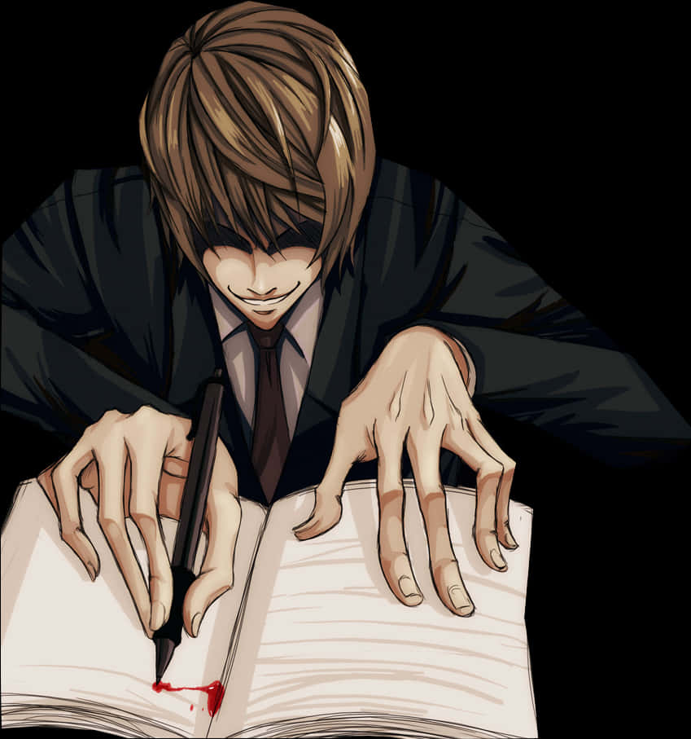

# Writing

> **TL;DR**
> - "Writing Japanese" is **two almost unrelated skills**, and conflating them is the single most expensive mistake in this topic. **Handwriting** is a motor skill (stroke order, proportion, recalling characters from nothing). **Composition** is a language skill (producing correct, natural, register-appropriate Japanese text - which in 2026 you do on a keyboard).
> - You need **composition** from month one and **typing** from week one. You may never need **handwriting** at all, depending on your goal - and plenty of Japanese adults can read characters they can no longer write.
> - Start the parts that are nearly free immediately: set up an **IME** on day 1 (30 minutes, permanent payoff), handwrite the **kana** once (they are 100 shapes, not 2,000), and start a **one-sentence-a-day 日記** as soon as you can conjugate a verb.
> - **Defer handwriting kanji.** When you do take it on, do it from words you already read, not from English keywords, and write each word **once** per spaced review rather than 50 times in a row.
> - The thing nobody teaches and everybody needs: **orthography**. Punctuation (。、「」・〜), no spaces between words, full-width vs half-width, okurigana, ー vs 一, and だ/である vs です・ます - a few hours of study that makes your written Japanese stop looking foreign. If you will ever touch a Japanese form, add **era-name dates** (令和8年 = 2026, and year 1 is 元年) and **addresses written largest-unit-first**. See [Part I](#part-i---the-marks-on-the-page).
> - **The decision nobody teaches at all: kanji, hiragana or katakana.** Your dictionary offers a kanji form for 下さい, 出来る, 有る, 事 and 為, and a Japanese writer uses kana for every one of them. The rule is that words doing grammatical work go in kana. The government's own list settles it, it is in this folder as an unsearchable scan, and it is therefore [transcribed here](#reference-choosing-kanji-hiragana-or-katakana).
> - **Written Japanese is closer to a different dialect than to a politeness setting.** でも -> しかし, だから -> したがって, 〜てる -> 〜ている, すごく -> 非常に, plus a systematic shift toward 漢語 vocabulary. Perfectly consistent です・ます prose can still read as transcribed speech. See [Part II](#part-ii---composing-a-text).
> - Note that **the JLPT contains no writing at all**; if you are grinding handwriting "for the test", the test you want is [漢検](#handwriting-typing-and-the-jlpt).

---

## What this is and why it matters

Ask a learner "can you write Japanese?" and you will get an answer to a question you did not ask. They will tell you whether they can draw 漢字 from memory with a pencil. That is not what "write" means in any other language.

**This guide is built around one claim: writing is two skills, and they barely touch each other.**

| | **Skill 1 - Handwriting** | **Skill 2 - Composition** |
| :--- | :--- | :--- |
| What it is | Physically forming characters: stroke order, stroke count, proportion, recall-from-blank | Producing Japanese text: word choice, grammar, register, orthography, punctuation |
| The hard part | Motor memory and *production* recall of ~2,000 characters | Knowing what a Japanese person would actually write |
| Tool | Pencil, grid paper | An IME and a keyboard |
| Time to competence | Years, at real daily cost | Ongoing, but the first useful level arrives in weeks |
| Needed for reading? | **No.** This is the crux. | No, but it accelerates it |
| Needed for living in Japan? | **Yes, a bounded subset** - forms, your name, your address | Yes, constantly - email, chat, applications |
| Tested by the JLPT? | No | No |
| Tested by 漢検 | Yes, heavily | Partly |

The two skills get conflated because Japanese schools teach them together, textbooks open with tracing grids, and "learn to write kanji" sounds like a single project. It is not. You can be a fluent, employed, well-read adult who types Japanese all day and cannot hand-write 曜 without thinking. A large number of Japanese natives are exactly that person.

So the useful question is not "should I learn to write Japanese?" It is **two** questions, and they have different answers:

1. Should I learn to produce Japanese text? **Yes, obviously, start soon.**
2. Should I learn to form characters by hand? **It depends on your goal, and the honest answer for most learners in their first year is "not yet, and maybe never all of them."**

### What this guide owns

Stroke order as a discipline. Handwriting practice and its mechanics. The honest cost-benefit argument about handwriting. IME and typing as a practical skill. Orthography, punctuation and okurigana. Vertical vs horizontal text. Written register. Composition practice and getting it corrected.

### What it does not own

The kana characters themselves and their tracing sheets live in [Kana](../Kana/readme.md). Kanji as characters - components, readings, study methods - lives in [Kanji](../Kanji/readme.md). Romanization *systems* (including the standards side of wapuro romaji) live in [Romaji](../Romaji/readme.md). Spoken output, pitch accent and spoken register live in [Speaking](../Speaking/readme.md). Anki, fonts and IME-adjacent tooling live in [General content](<../General content/readme.md>). Keigo grammar lives in [Grammar](../Grammar/readme.md); the social machinery behind business email lives in [Culture](../Culture/readme.md).

---

## Where it fits in the journey

### Prerequisites

| To start... | You need... |
| :--- | :--- |
| Typing (IME setup) | Hiragana recognition. That is all. Day 1-7. |
| Handwriting kana | Kana recognition. Week 1-4. See [Kana](../Kana/readme.md). |
| Punctuation and orthography | Kana, plus enough reading to have *seen* the marks in the wild. Month 2+. |
| One-sentence 日記 | Roughly 100 words and one verb conjugation. Month 1-2. |
| Real composition (paragraphs) | Basic grammar finished, ~1,000 words. Month 6+. |
| Handwriting kanji | **Comfortable reading.** Both Tatsumoto and the Animecards site are emphatic: learn to *read* a word before you learn to *write* it, or you are learning three things at once and all of them badly. Year 2+. |
| Business/formal writing | Solid です・ます, some keigo, and a reason. Pre-move. |

### What it unlocks

- **Typing** unlocks dictionary lookup by keyboard, monolingual dictionaries, Japanese web search (which is a completely different internet), Anki cards you type into, Japanese-language software and settings, and talking to actual people.
- **Composition** unlocks the feedback loop. Input alone tells you nothing about the gap between what you understand and what you can produce. A corrected sentence is worth an hour of passive listening for finding out what you actually do not know.
- **Orthography** unlocks looking native in text. A learner who writes `わたしは 日本語を 勉強して います.` with English spaces and an English period has announced themselves before the first word.
- **Handwriting** unlocks paper forms, 漢検, calligraphy, classrooms and paper exams - and, arguably, a sharper recognition of look-alike characters.

### Two readers, two correct answers

This guide has to serve two people with genuinely different optimal plans. Find yourself:

| | **Reader A - reading/media focused** | **Reader B - moving to Japan** |
| :--- | :--- | :--- |
| Goal | Read manga, novels, play games, watch raw | Live, work, do paperwork, hold a job |
| Typing | Essential | Essential |
| Composition | Useful; drives recognition | Essential and load-bearing |
| Orthography | Useful for reading | Essential for writing |
| Handwriting | **Optional. Genuinely optional.** | **A bounded subset is mandatory** |
| Which subset | - | Your name (kanji + katakana + furigana), your address, ~200 form words, dates, numbers, 〒, your signature block |
| Full 2,136 by hand | No | Only if you want 漢検 or enjoy it |

If you are Reader A and someone tells you handwriting is a prerequisite, they are wrong. If you are Reader B and someone tells you handwriting is obsolete, they have never filled in a 転入届 at a city office.

---

## The schools of thought

The composition side is not really contested - everyone agrees you should produce Japanese and get it checked. The handwriting side is a genuine fight. Here are the four positions, argued as their advocates would argue them.

### (a) Write everything, from the start

The classroom and RTK-adjacent position. Every new kanji gets hand-written when you learn it. Heisig's *Remembering the Kanji* is built on it: you learn to *write* 2,200 characters by keyword, on the theory that writing is what makes the shape stick.

- **Pros:** motor memory is unusually durable. Writing forces you to notice every component, which is the best possible cure for the 待/持/特 and 論/輪/諭 families. You end up able to do everything - forms, exams, 漢検, calligraphy. It is screen-free, and for some people it is the part of Japanese study they actually enjoy, which matters more than any efficiency argument.
- **Cons:** the time cost is enormous and it lands in your first year, which is exactly when you are least able to afford it. It buys you a skill (production) at the expense of the skill you actually want first (recognition). Heisig's keyword method in particular attaches each character to an *English* word, and the Animecards critique of this is sharp: when you write Japanese there is no English keyword in your head, so keyword-to-kanji recall does not transfer to word-to-kanji recall. You can finish RTK and still be unable to write 病院 when someone says びょういん.
- **Best for:** classroom learners with no choice, people sitting paper exams, 漢検 aspirants, and people who enjoy it enough that it keeps them studying.

### (b) Write while learning, then stop

Hand-write each character a handful of times as you first meet it, to burn in the shape, then never review handwriting again and let it decay.

- **Pros:** cheap. Captures most of the "noticing the components" benefit for a fraction of the cost. Feels like real study. You come away with correct stroke-order instincts, which are nearly impossible to retrofit later.
- **Cons:** you get the cost of handwriting and not the *benefit*, because production without spaced review decays to nothing. You will not be able to write those characters in a year. Also, writing a character ten times in a row is one of the least efficient uses of ten repetitions in existence - Tatsumoto's answer on this is blunt: [write each word once and let spaced repetition do the work](<../General content/Tatsumoto Blog offline copy/tatsumoto.neocities.org/blog/should-i-write-each-word-many-times.html>).
- **Best for:** learners who want the recognition benefit and accept that handwriting is a byproduct they will lose.

### (c) Recognition only - never handwrite kanji

The mainstream immersion position. Read, listen, mine, type. Never pick up a pencil.

- **Pros:** maximum reading progress per hour, which is the bottleneck for basically everyone. Matches the actual demands of modern life - phones and keyboards, phonetic input, candidate selection. Tofugu's founder, who sells a kanji product, [says the ability to hand-write kanji is "pretty unnecessary 90% of the time"](<../General content/Tofugu Website offline copy/www.tofugu.com/japanese/forgetting-kanji/index.html>) and cut it from his own curriculum.
- **Cons:** you cannot fill in a form, sit a paper test, or take a class. Recognition of look-alike characters stays fuzzier for longer, and you will have a period where 講/could-be-謙 ambiguity slows you down. And the "I'll learn it later if I need it" plan collides with reality about two weeks after you land in Japan.
- **Best for:** Reader A. Anyone whose Japanese goals live entirely on a screen.

### (d) Handwrite kana only

The compromise most experienced learners quietly end up on. Hand-write hiragana and katakana properly. Never systematically hand-write kanji.

- **Pros:** the kana are ~100 shapes, finishable in two days to two weeks, and the motor memory is the best single fix for シ/ツ/ソ/ン and め/ぬ, which are real and persistent reading problems. It gives you correct stroke-order *instincts* that transfer to kanji later for almost nothing. You can write your name, fill in the katakana fields on a form, and leave a note. Cost: a couple of hours total.
- **Cons:** you still cannot write the kanji on a form, and a form that wants 漢字 will not accept kana. So this is a floor, not a plan, for Reader B.
- **Best for:** almost everyone, as a minimum. This is the default that should require an argument to *not* do.

### The honest state of the evidence

The claim "writing builds recognition" is not marketing. There is real support for the idea that motor production of a character strengthens the visual representation of it - the general finding in the handwriting-vs-typing literature is that hand-forming a shape aids its later recognition more than typing it. This guide will not pretend to a precise effect size, and neither should anyone quoting studies at you.

> **The research on handwriting and recognition.** Sugaya (2025) in 日本語教育方法研究会誌 found a **split**, which is more interesting than either camp's version: **typing produced better recall for *reading* the characters, while handwriting produced better recall for their *form*.** Sonehara and Saito (2010) and Minagawa and Takeguchi (2024) cover adjacent ground. These papers are cited in [`sources.md`](./sources.md) rather than stored here, because J-STAGE's terms require the copyright holder's consent for redistribution - so you get links, not local PDFs.
>
> That split maps almost exactly onto the recommendation below: if your goal is to *read* Japanese, the evidence does not support spending your hours on handwriting - typing may even be better. If your goal includes *producing* characters from memory, handwriting is what builds that, and nothing else does. So the question is not "does handwriting work"; it is "which of the two skills do you actually want", which is the distinction this whole guide is built around.

But notice the structure of the argument. Even at its strongest, it says handwriting is *one* way to improve recognition, not the *only* way and not the *cheapest* way. The honest comparison is not "handwriting vs nothing", it is "one hour of handwriting vs one hour of reading, listening or SRS". At that exchange rate the case gets much weaker, because the alternative uses of the hour are also very good at building recognition and they build several other things at the same time.

Two more facts that should sit uncomfortably next to each other:

- **Character amnesia is real, widespread, and native.** Japanese adults who type on phones all day routinely forget how to write characters they read effortlessly. Tofugu's [article on it](<../General content/Tofugu Website offline copy/www.tofugu.com/japanese/forgetting-kanji/index.html>) is from 2010 and the trend has only gone one direction. The 漢字検定 statistics are a nice hard datapoint: the level covering only 640 characters - grades 1 to 5 of elementary school - is failed by roughly 20% of the native speakers who sit it, and that test is mostly handwriting.
- **And yet Japan still runs on paper in the places that matter to a resident.** City hall, banks, clinics, rental agreements, school forms for your kids. Being unable to write your own address by hand is a real, recurring, low-grade humiliation.

Both are true. The resolution is not "handwrite everything" or "handwrite nothing" - it is **handwrite the bounded set you will actually be asked to produce, and read everything else.**

---

## Recommended path (opinionated)

**Type from day one. Handwrite the kana once. Do not handwrite kanji in year one. Start a one-sentence diary in month two and get it corrected. Learn orthography deliberately, as a short unit, because it is cheap and nobody teaches it. Then, only when a move to Japan becomes concrete, learn a bounded handwriting set from words you already read - not from English keywords - with spaced repetition.**

The reasoning, in order of weight:

1. **Typing is the highest return-per-minute item in this entire guide.** Thirty minutes of setup, permanently unlocks Japanese search, monolingual dictionaries and communication. There is no argument against it.
2. **Kana handwriting is cheap and pays a recognition dividend.** 100 shapes. Two hours. It fixes look-alike pairs that otherwise nag at your reading for a year. Do it.
3. **Kanji handwriting in year one is the worst trade available.** It competes directly with reading volume, which is the actual bottleneck, and it trains production when you cannot yet recognize.
4. **Composition is where you find out what you do not know.** Input tells you nothing about your gaps. One corrected sentence a day is a diagnostic instrument, not just practice.
5. **Orthography is absurdly under-taught relative to its cost.** A few hours. It is the difference between text that reads as Japanese and text that reads as translated English.
6. **Handwriting has a real, bounded, later use case.** Treat it as a pre-move project with a specific scope, not an open-ended grind.

**Ignore this recommendation if:**

- **You are in a class or sitting a paper exam.** You have no choice. Go to school (a) and use the kana sheets and genkouyoushi sections below.
- **You are aiming at 漢検.** That test is a handwriting test. School (a), no shortcuts.
- **You enjoy handwriting.** This overrides everything. A method you do beats a method you abandon, and calligraphy is a legitimate reason to learn a language's script. Just be honest that you are spending the time for enjoyment, not efficiency, so you do not also feel behind.
- **You are a slow visual learner who keeps confusing similar kanji.** Then handwriting is not a luxury, it is your fix. Do school (b) on the specific characters that confuse you rather than on all of them.
- **You are moving to Japan in under a year.** Compress everything: start the bounded handwriting set now, in parallel with reading, and accept the cost.

---

## Phase-by-phase plan

### Phase 0 - Set up typing (day 1, ~30 minutes, one time)

- **Goal:** you can type Japanese in any text box on every device you own, and you know how to commit, cancel and cycle candidates.
- **Time:** 30 minutes once, then zero.
- **Daily routine:** none. This is setup. Then use it forever.
- **Materials:** [IME and typing](#reference-ime-and-typing-how-to-actually-type-japanese) below; Tofugu's [How to Install Japanese Keyboard](<../General content/Tofugu Website offline copy/www.tofugu.com/japanese/how-to-install-japanese-keyboard/index.html>) and [How to Type in Japanese](<../General content/Tofugu Website offline copy/www.tofugu.com/japanese/how-to-type-in-japanese/index.html>) (offline); Tatsumoto's [How to type in Japanese](<../General content/Tatsumoto Blog offline copy/tatsumoto.neocities.org/blog/how-to-type-in-japanese.html>) for the Linux route; the Windows walkthrough in `docs/ime.md` inside [`shoui520.github.io-master.zip`](<../AJATT/TheMoeWay/shoui520.github.io-master.zip>) is the most detailed one in this repo.
- **Done when:** with no notes open, you can type `にほんご` and convert it to 日本語; type こんにちは and commit it as kana; type a sentence, realise the IME picked the wrong kanji for one word, fix *only that word* without retyping the sentence; and produce 。、「」・ー without hunting.

### Phase 1 - Handwrite the kana, once and properly (week 1-4, ~2 hours total)

- **Goal:** you can hand-write both kana syllabaries from memory with correct stroke order. Not beautifully. Correctly.
- **Time:** 15-20 minutes/day for a week, or one long sitting per script. Then stop.
- **Daily routine:** work through one page of tracing sheets per day, saying the sound aloud as you write each character. Then cover the model and write the row from memory.
- **Materials:** [hiragana_writing_practice_sheets.pdf](<../Kana/Hiragana/hiragana_writing_practice_sheets.pdf>) and [katakana_writing_practice_sheets.pdf](<../Kana/Katakana/katakana_writing_practice_sheets.pdf>) (10 pages each, 5 kana per page, numbered strokes). The [Hiragana & Katakana PRACTICE WORKSHEET](<../Kana/Practice Worksheets/Hiragana & Katakana PRACTICE WORKSHEET - japanesepod101.pdf>) is a 52-page follow-on with applied prompts. Tatsumoto's kana *writing* Anki deck (front: romaji + audio; back: stroke diagram; you write it on paper) is described on [Writing Japanese](<../General content/Tatsumoto Blog offline copy/tatsumoto.neocities.org/blog/writing-japanese.html>), mirrored at [AnkiWeb](https://ankiweb.net/shared/info/1312311543).
- **Done when:** someone reads you 20 random kana across both scripts and you write all 20 correctly from memory, with the strokes in the right order and the right direction. Check yourself with a handwriting-recognition keyboard (see [the free grader](#the-free-grader-handwriting-recognition)).

### Phase 2 - One sentence a day (month 2 onward, ~5 min/day)

- **Goal:** an unbroken output habit at a cost too small to skip, plus a daily diagnostic on your real productive level.
- **Time:** 5 minutes. Genuinely 5.
- **Daily routine:** type one sentence in Japanese about something concrete that happened today. Start at the most boring possible level - 今日はラーメンを食べました。 - and do not upgrade until it is effortless. Then two sentences. Then add a reason (〜から, 〜ので). Then add an opinion. Get it corrected (see [Getting corrected](#getting-corrected)). Log the corrections in one file; patterns will appear within a month.
- **Materials:** any text file. Optionally the japanesepod101 worksheets in this folder for the recall drills - see the [resource table](#in-this-folder-offline).
- **Done when:** you have 30 consecutive days logged, and your correction log shows the *same* error type three or more times (that is the finding - now you know what grammar to go study).

### Phase 3 - Orthography and punctuation, as a short deliberate unit (month 3-9, ~3 hours total)

- **Goal:** your written Japanese stops having an accent on the page.
- **Time:** one or two sittings, then it is passive knowledge.
- **Daily routine:** not daily. Read the [orthography reference](#reference-orthography-and-punctuation) below in one sitting. Then, for two weeks, when you read Japanese, deliberately *notice* the punctuation: where the 、falls, whether the author writes 行う or 行なう, whether a quote uses 「」 or 『』.
- **Materials:** the reference chapter below; Tofugu's [Japanese Punctuation - The Definitive Guide](<../General content/Tofugu Website offline copy/www.tofugu.com/japanese/japanese-punctuation/index.html>) offline, which is the best single source on this and where the mark names below come from; [The Biggest Spelling Mistakes in Japanese](<../General content/Tofugu Website offline copy/www.tofugu.com/japanese/japanese-spelling-mistakes/index.html>); [Furigana](<../General content/Tofugu Website offline copy/www.tofugu.com/japanese/furigana/index.html>).
- **Done when:** you can take an English paragraph's worth of Japanese you wrote with English habits and fix every orthography error in it - spacing, period, comma, quotes, the long-vowel mark, full-width vs half-width - without looking anything up. And you can explain why 「わたしは 日本語を 勉強します.」 has three errors in it.

### Phase 4 - Composition with a correction loop (month 6-24, 10-20 min/session, 3-5x/week)

- **Goal:** paragraphs. Correct, natural, consistent in register, and checked by something other than your own intuition.
- **Time:** 10-20 minutes, 3-5 times a week. This can substitute for part of your reading time; it should not substitute for all of it.
- **Daily routine:** rotate the four drills in [Composition practice, staged](#composition-practice-staged) - copying, substitution, diary, image description. Once a week, write something longer (100-200 characters) and send it to a human.
- **Materials:** the composition section below; [HiNative / italki / r/WriteStreakJP](#getting-corrected); the 50-word worksheets in this folder for substitution material.
- **Done when:** you can write 150 characters on a familiar topic in 15 minutes, in consistent です・ます *or* consistent だ/である (your choice, but not both), and a native corrector returns it with fixes that are about *naturalness* rather than about grammar being broken.

### Phase 5 - Handwriting kanji, if and when (year 2+, 10 min/day)

Only enter this phase if you have a reason. Reader A can skip it permanently. Reader B should enter it roughly a year before the move.

- **Goal:** hand-produce the characters in the words you actually need to write, from the Japanese word - not from an English keyword.
- **Time:** 10 minutes/day. Do not let it grow. If it grows past 15, cut the new-card rate, not the reading.
- **Daily routine:** the method both Tatsumoto and Animecards converge on, and it is a good method: a card shows you a **Japanese sentence with the target word written in kana**, plus audio. Your job is to write the word in kanji on paper. Correct stroke order, one attempt, then grade Good or Again. No English anywhere. The sentence context is what disambiguates homophones - 保証 vs 保障 - and that disambiguation is the actual skill.
  - Build these from words already in your collection with mature intervals, not from new vocabulary. Tatsumoto's search for this is `is:review "note:Japanese sentences" card:Recognition VocabKanji:*<kanji>*`, optionally with `prop:ivl>180`.
  - Write each word **once** per review. Not ten times. Spacing does the work.
  - Put a **kyoukasho (textbook) font** on the card so the model you copy is the handwritten stroke form, not a printed one: [jis-2004 kyoukasho font.zip](<../General content/Japanese Fonts/jis-2004 kyoukasho font/jis-2004 kyoukasho font.zip>) or [YuKyoNV-M.otf](<../General content/Japanese Fonts/Yu Kyokasho/YuKyoNV-M.otf>). This matters more than people think - see [General content](<../General content/readme.md>) on font classes.
- **Materials:** [Writing Japanese](<../General content/Tatsumoto Blog offline copy/tatsumoto.neocities.org/blog/writing-japanese.html>) (offline) for the full note-type walkthrough; `docs/writingjapanese.md` inside [`AnimecardsWebsite-master.zip`](<../AJATT/AnimecardsWebsite/AnimecardsWebsite-master.zip>) for the Kanken-deck variant and the argument against production-RTK; genkouyoushi grid paper (see [Handwriting mechanics](#reference-handwriting-mechanics)).
- **Done when (Reader B, bounded version):** you can hand-write, from memory, in ink, on a blank form: your full name in kanji and katakana, your Japanese address, today's date in Japanese format, your date of birth, and the ~30 field labels on a standard municipal form. Test it by printing a real form template and filling it in.
- **Done when (Reader A / full version):** you can hand-write the target word in 90% of your writing-deck reviews with correct stroke order. There is no natural end to this one; pick a character count and stop there.

### Phase 6 - Formal and professional writing (pre-move / on arrival)

- **Goal:** you can send an email to a Japanese colleague that does not make them wince.
- **Time:** a focused unit of a few hours, then continuous refinement forever.
- **Daily routine:** collect real examples. Every Japanese email you receive is a template. Keep a file of openers, closers and transitions with a note on who sent it to whom.
- **Materials:** [Register in written Japanese](#reference-register-in-written-japanese) below; Tofugu's [How To Write Letters In Japanese](<../General content/Tofugu Website offline copy/www.tofugu.com/japanese/how-to-write-letters-in-japanese/index.html>) and [Keigo](<../General content/Tofugu Website offline copy/www.tofugu.com/japanese/keigo/index.html>) offline; [Culture](../Culture/readme.md) for the social side; [Grammar](../Grammar/readme.md) for keigo forms.
- **Done when:** you can write a 5-line email requesting a meeting reschedule, with an appropriate opener, a clear request in 〜ていただけますでしょうか form, and a closer - and a native reader's only comment is stylistic.

---

## Daily and weekly routine

A concrete, copyable plan for the recommended path, sized for a 60-90 minute daily budget where writing is a *slice*, not the meal. Reading and listening still own the majority of your time.

**Year 1 (Reader A or B). Writing total: ~10 min/day.**

| Slot | Activity | Time |
| :--- | :--- | :--- |
| Any | One-sentence 日記, typed, in a running file | 5 min |
| Any | Paste yesterday's sentence + correction into your error log; read the log | 2 min |
| Passive | Type every dictionary lookup instead of copy-pasting it (free IME practice) | 0 min |
| Weekly (Sun) | Write 100-200 characters on one topic; send to a human corrector | 15 min |
| Weeks 1-4 only | Kana tracing sheets, one page/day | 15 min |
| Never (year 1) | Handwriting kanji | - |

**Year 2+ (Reader B, pre-move). Writing total: ~20 min/day.**

| Slot | Activity | Time |
| :--- | :--- | :--- |
| Morning | Handwriting production deck - write each target word once, on grid paper | 10 min |
| Evening | 日記, now 3-5 sentences with a reason and an opinion | 7 min |
| Evening | Error log review | 3 min |
| Weekly | Longer piece (300+ characters), human-corrected | 20 min |
| Weekly | 書き取り dictation: 5 sentences from audio you already know, written by hand | 10 min |
| Monthly | Fill in one real Japanese form template by hand, from memory | 15 min |

**The rule that keeps this honest:** if your writing time starts crowding out reading time, cut writing. Writing is the diagnostic and reading is the engine. A diagnostic that eats the engine is a bad diagnostic.

---

# Part I - The marks on the page

Everything in this part is about **skill 1 and its immediate surroundings**: forming characters, operating an IME, and the orthographic conventions that decide what a correctly written Japanese sentence looks like. [Part II](#part-ii---composing-a-text) is skill 2 - deciding what to write.

## Reference: terms for written Japanese

Written Japanese has its own vocabulary, and the distinctions are not decorative - 字体 versus 字形 is the difference between "you wrote the wrong character" and "your handwriting looks different from the print", which is the single most common false alarm in beginner handwriting.

| Term | Reading | What it means |
| :--- | :--- | :--- |
| 表記 | ひょうき | **Orthography** - how a word is written down: which script, which okurigana, which characters. The umbrella term for most of this part. |
| 文体 | ぶんたい | **Writing style/register** - だ体, である体, です・ます体. 文体の統一 is holding one of them across a document. See [register](#reference-register-in-written-japanese). |
| 句読点 | くとうてん | **Punctuation**, literally 句点 (。) plus 読点 (、). |
| 字体 | じたい | The abstract **identity** of a character - *which* character it is. 島 and 嶋 are different 字体. |
| 字形 | じけい | The concrete **shape** as drawn or printed. Two 字形 of one 字体 are the same character written differently. |
| 書体 | しょたい | A **typeface or script style** - 明朝体, ゴシック体, 教科書体, 楷書. |
| 楷書 | かいしょ | **Block script.** Every stroke separate and complete. What you learn, and what character charts show. |
| 行書 | ぎょうしょ | **Semi-cursive.** Strokes joined and abbreviated. Ordinary adult handwriting and handwritten signs. |
| 草書 | そうしょ | **Full cursive.** Heavily abbreviated - effectively a separate reading skill. Calligraphy and old documents. |
| 明朝体 | みんちょうたい | The **serif-like printed face**, default for Japanese body text. Its stroke shapes are printing conventions, *not* handwriting models. |
| ゴシック体 | - | The **sans-serif printed face**. Headings, signage, interfaces. |
| 教科書体 | きょうかしょたい | The **textbook face**, drawn to model handwritten forms. The correct thing to copy - see [printed vs handwritten forms](#reference-printed-forms-vs-handwritten-forms). |
| 交ぜ書き | まぜがき | Writing part of a word in kanji and part in kana because one character is outside the standard list: 改ざん, き損, ねん挫. |
| 表外字 | ひょうがいじ | A character **outside 常用漢字表**. Newspapers avoid them, gloss them, or use 交ぜ書き. |
| 常用漢字 | じょうようかんじ | The **2,136 characters** of the 2010 cabinet list. For official and press writing this is a *constraint on what you may write*, not just a study target. |
| 人名用漢字 | じんめいようかんじ | The extra characters legally permitted in personal names. Why some people's names use characters you have never seen. |
| 送り仮名 | おくりがな | The kana tail after a kanji stem: the べる in 食べる. See [okurigana](#okurigana---which-part-is-kanji-and-which-is-kana). |
| 振り仮名 / ルビ | ふりがな | A reading gloss set above or beside kanji. ルビ is the publishing term, from the old British type size "ruby". |
| 縦中横 | たてちゅうよこ | Short runs of Latin letters or digits set upright-sideways inside a vertical column. |
| 禁則処理 | きんそくしょり | **Line-breaking prohibitions** - which characters may not begin or end a line (。」 and friends). Specified in the [W3C jlreq](<./Text layout/W3C Requirements for Japanese Text Layout (jlreq).html>) document in this folder. |
| 大字 | だいじ | **Anti-tamper numerals** (壱 弐 参 拾) used on cheques and contracts. See [numbers](#reference-numbers-dates-and-era-names). |
| 元号 / 年号 | げんごう / ねんごう | The **era name** in a Japanese-format date: 令和, 平成, 昭和. |
| 段落 | だんらく | A **paragraph**. Marked by a one-character indent, not by a blank line. |
| 起承転結 | きしょうてんけつ | The four-part text structure taught in Japanese schools. See [text organisation](#reference-how-a-japanese-text-is-organised). |
| 書き言葉 / 話し言葉 | かきことば / はなしことば | **Written vs spoken language** - a difference in vocabulary and connectives, not only in politeness. |
| 変換ミス | へんかんミス | An **IME conversion error**: right sound, wrong kanji. See [choosing the right candidate](#the-real-skill-choosing-the-right-candidate). |
| 校正 | こうせい | Proofreading. |

---

## Reference: stroke order

### Why stroke order matters - argued, not asserted

Most guides assert that stroke order matters and move on. Here are the four actual arguments, ordered from weakest to strongest:

1. **Legibility and proportion.** Correct order produces correctly proportioned characters, because the order is partly *derived* from how the shape balances. Write 国 as a closed box and then stuff the inside in, and the contents come out cramped. This is real but minor.
2. **Handwriting recognition input.** Handwriting recognition on phones and in Google Translate uses stroke order and direction as features. Modern recognizers are more forgiving than they used to be, but wrong order is still the usual reason the thing refuses to find your character. Also true, also minor - unless you use it as a self-test, in which case it is a free grader.
3. **Reading cursive later.** 行書 (semi-cursive) and 草書 (cursive) are essentially stroke order rendered as a continuous motion. Handwritten signs, notes and older documents become readable only once you know what order the strokes came in. Real, but a long way off.
4. **A consistent motor routine aids recall.** This is the strongest argument and it is the one worth internalising. If you write a character a different way every time, you have no routine, and there is nothing for your hand to remember. With a fixed order, recall becomes "run the sequence" rather than "reproduce the picture". This is why stroke order matters *even for people who do not care about calligraphy*.

And the honest counterweight: **stroke order does not matter at all for reading printed text**, which is what most learners actually want. Nobody has ever failed to read 経済 because they were unsure which stroke came first. If your goal is reading, stroke order is a tool for the handwriting phase you may never enter.

### The rules

These are the conventions. They cover the large majority of characters, they compose, and once you know them you will guess most new characters correctly without looking them up.

| # | Rule | Examples | Note |
| :-- | :--- | :--- | :--- |
| 1 | Every individual stroke runs **left to right** (horizontals) or **top to bottom** (verticals and diagonals) | 三, 川 | This is the meta-rule. Never draw a horizontal right-to-left. |
| 2 | **Top to bottom** overall | 三, 言, 音 | Stack components top-down. |
| 3 | **Left to right** overall | 川, 州, 順 | Stack components left-right. |
| 4 | **Horizontal before vertical** when they cross | 十, 土, 大, 干 | 土 is 一 then 丨 then the long bottom 一. |
| 5 | **Centre before symmetrical wings** | 小, 水, 木 | In 木 the horizontal still comes first (rule 4), *then* the centre vertical, *then* the two diagonals. |
| 6 | **Left-falling diagonal (丿) before right-falling** | 人, 文, 父 | Tofugu phrases it "right-to-left diagonals before left-to-right", which is the same rule described by drawing direction. |
| 7 | **The box 口 is three strokes, not four**: left vertical, then top-plus-right as one turning stroke, then the closing bottom horizontal | 口, 日, 目 | Learn this one properly. Rule 8 depends on it. |
| 8 | **Enclosure on three sides, then contents, then the closing bottom stroke last** | 国, 回, 園, 田 | The bottom line of the frame is genuinely the **last** stroke of the whole character. This surprises everybody. |
| 9 | Enclosures with **no bottom**: write as much of the frame as exists, then the contents | 同, 用, 月, 可, 病, 風 | Same pattern as rule 8, minus the closing stroke. |
| 10 | **Bottom-left enclosures go last**, after everything above them | 道, 近, 週 (辶); 建, 延 (廴) | The しんにょう 辶 is written *after* the part it wraps. Also note it is drawn as 2 or 3 strokes depending on convention. |
| 11 | A stroke that **pierces through many others** goes last | 中, 車, 事, 半, 母 | Vertical piercers (中, 車) and long horizontal crossers (母, 女) both follow this. |
| 12 | **Dots and short dashes go last** - except a dot at the very top, which goes first | Last: 犬, 玉. First: 主, 文, 六 | Combine with rule 8 and you get 国: the 玉's dot is the last stroke *of 玉*, but the frame's bottom is the last stroke of the character. |
| 13 | Left-side 阝 (こざとへん) goes **first**; right-side 阝 (おおざと) goes **last** | 院, 陽 vs 都, 部 | Same 3 strokes, opposite position in the sequence. |
| 14 | **Write component by component, resetting the rules inside each** | 泳 = 氵 then 永; 講 = 言 then 冓 | This is the rule that makes the others scale. A 20-stroke kanji is 3 or 4 small characters in a known order. |

**The practical upshot of rule 14:** do not memorize stroke order as 2,000 sequences. Memorize ~200 component sequences and the order the components go in. This is also the reason component-based kanji study ([Kanji](../Kanji/readme.md)) makes handwriting cheap later.

### The exceptions, and who actually decides

Stroke order is a **convention taught in schools**, not a law of the language, and there are real exceptions the rules above will not get you.

- **右 and 左 disagree with each other.** 左 begins with its horizontal stroke; 右 begins with its left-falling 丿. Two characters, mirror-image shapes, opposite starting strokes. It is the classic demonstration that these are taught conventions, not derivations.
- **王 and the interior of 田 are the two that people confidently get wrong from first principles.** The general rules underdetermine them. Look them up rather than deriving them.
- **Characters routinely cited as counter-intuitive** include 必 and 飛. If a character feels like it is fighting you, that is a signal to check it rather than to trust the rules.
- **Multi-stroke components have fixed internal orders** that are worth learning once as units: 辶, 廴, 阝, 氵, 忄, 糸, 言, 門.

**Who is authoritative?** In Japan the reference point is 筆順指導の手びき, published in 1958 by what was then the Ministry of Education, as guidance for teaching the kanji learned in elementary school. Two honest caveats: it covers only the school kanji, and it was explicitly framed as guidance rather than as the only permissible order. For anything outside it, the practical authority is a per-character stroke-order diagram.

**A common misconception worth killing:** the JIS standards are about printed **glyph shapes**, not stroke order. The JIS2004 revision changed the printed form of a set of characters (the しんにょう in 辻 and 迂 being the most cited), which is why fonts differ - see [General content](<../General content/readme.md>) on fonts. It says nothing about which stroke you draw first.

**How to look one up:** per-character diagrams on [jisho.org](https://jisho.org/) (kanji pages show animated stroke order), [kakijun.jp](https://kakijun.jp/), or a stroke-order font installed into your Anki cards. Tatsumoto's position - that after writing a few hundred words you will guess most new characters correctly and the diagram on the card catches your errors - is the right way to use these: as a check, not as a curriculum.

### Do not learn these as 14 rules

Learn them as three habits:
1. **Top-left to bottom-right**, component by component.
2. **Frames before contents; closing strokes last.**
3. **Piercing strokes and dots last; top dots first.**

Everything else falls out of those.

---

## Reference: handwriting mechanics

### Paper: 原稿用紙 and 漢字練習帳

**原稿用紙** (genkouyoushi) is Japanese manuscript paper: a grid of squares, conventionally 20 characters by 20 lines, so one sheet is 400 characters (400字詰). Each character - including each punctuation mark and each small kana - gets exactly one square. That constraint is the whole point: it forces you to size and proportion characters consistently, which is the thing a blank page will never teach you.

The main conventions, as taught in Japanese schools:

- One character per square. Punctuation marks 。、 and small kana っ ゃ ゅ ょ each occupy their own square.
- Indent the first square of each new paragraph.
- 。 and 」 do not begin a line - if one would fall at the start, it shares the last square of the previous line.
- Title on the first line, name on the second (toward the end of the line), body from the third.

You do not need to buy any of this. Tatsumoto's advice is sound: print a free PDF, or draw a grid, or use a squared maths exercise book. The search page he links for 原稿用紙 PDFs is [sousakuba.com/genkouyousi](http://www.sousakuba.com/genkouyousi/). A **漢字練習帳** is the same idea with cross-hair guides inside each square for positioning components; equally printable.

### Pencil vs pen

Practise in **pencil** (or mechanical pencil), which is what Japanese schools use. Japanese handwriting instruction cares about the three stroke endings - **とめ** (stop), **はね** (flick up), **はらい** (sweep out) - and a pencil or brush renders those visibly while a ballpoint flattens them into uniform lines. If you cannot see your own stroke endings you cannot correct them.

Use pen for the thing pen is for: filling in a real form. Japanese letters and forms conventionally want **black or blue ink**, and explicitly not pencil.

### Proportion is the tell

The commonest way learner handwriting reads as foreign is not wrong strokes, it is wrong proportions. A left-hand radical should be *compressed* - narrower and taller than it is as a standalone character. Compare 言 standing alone with the 言 in 講: same strokes, different width. The fix is mechanical: use squares, and consciously allocate the square before you start drawing (left radical gets a third, right component gets two thirds).

A kyoukasho font is the correct model here, because it shows the *handwritten* forms rather than printed ones. Install [jis-2004 kyoukasho font.zip](<../General content/Japanese Fonts/jis-2004 kyoukasho font/jis-2004 kyoukasho font.zip>) or [YuKyoNV-M.otf](<../General content/Japanese Fonts/Yu Kyokasho/YuKyoNV-M.otf>) and set it on your writing cards.

### 書き取り - dictation

**書き取り** (kakitori) covers two related drills, both worth doing:

- **Dictation proper:** play a sentence you already know, pause, write it down by hand, compare. This tests listening, kanji production, okurigana and punctuation simultaneously, which makes it the highest-density handwriting drill there is.
- **The school version:** a sentence with one word written in kana, and your job is to write that word in kanji. This is exactly the production-card format in Phase 5, and it is the format 漢検 uses.

Start with sentences from audio you have already mined, so you are testing production and not comprehension. Five sentences is a full session.

### The free grader: handwriting recognition

Write a character in the handwriting input of Google Translate or the handwriting layout of Gboard. If the recognizer finds your character, your strokes are approximately right. If it offers you something else entirely, they are not. This is instant, free feedback and it is a much better self-check than "it looks about right to me". It is not a stroke-order *tutor* - modern recognizers tolerate some deviation - but it is an excellent detector of the gross errors that matter.

---

## Reference: printed forms vs handwritten forms

Here is a problem that wastes a great deal of beginner anxiety: **the printed shape of a character is not a model for handwriting, and the two differ in ways that look like errors and are not.**

### The one principle that settles almost every case

The 明朝体 body face you read Japanese in is a **printing convention**, evolved for legibility in metal type and then in pixels. It is not a record of how the character is drawn. So when your handwriting does not match the textbook print, the overwhelmingly likely answer is that **both are correct** - they are two 字形 of one 字体.

This is not a folk opinion. It is the explicit conclusion of the 文化審議会's 2016 report 常用漢字表の字体・字形に関する指針, whose load-bearing chapter is [in this folder as a 7-page excerpt](<./Official orthography/joyo kanji forms guidance excerpt 2016 - 常用漢字表の字体・字形に関する指針(抄).pdf>) precisely because it answers this question - with side-by-side comparison diagrams. The report's distinction is the one in the [terms table](#reference-terms-for-written-japanese):

| | What it is | Does a difference matter? |
| :--- | :--- | :--- |
| **デザイン差** | Two renderings of the same character - a stroke that touches in one face and not in another, a hook present in one and absent in another | **No.** Both are the same character, both are correct. |
| **字体の差** | Genuinely different characters, or the old/new form distinction | **Yes.** 島 vs 嶋, 辺 vs 邊 are different. |

Almost everything that worries a learner is the first row.

### The cases that come up most

The kana are where you will notice it first, because you write them daily:

| Character | In 明朝体 print | Commonly handwritten | Both correct? |
| :--- | :--- | :--- | :--- |
| き | Final stroke **detached** from the vertical | Often **joined** | Yes |
| さ | Final stroke **detached** | Often **joined** | Yes |
| ふ | Four separate strokes | Lower strokes may join the top | Yes |
| り | Two separate strokes | May be written as one continuous motion | Yes |

And in kanji, the recurring categories rather than a list to memorise:

- **Hooks (はね) that appear or vanish.** Whether a vertical ends in an upward flick or a clean stop is frequently a design difference, not a different character.
- **Strokes that touch or clear each other.** Whether two strokes meet at a junction varies by face.
- **Stroke *shape* in components like 糸, 言, 心, 令** - the printed rendering of the small strokes differs from the drawn one.
- **The しんにょう 辶** - one dot in modern print and in handwriting, two in older print. This is the JIS2004 change the [stroke-order chapter](#the-exceptions-and-who-actually-decides) already warns about, and it is a font difference, not a stroke-order or 字体 one.

**Do not try to learn these as a list.** Learn the principle, install a 教科書体 font so the model in front of you is already a handwritten form, and go to the excerpt above when a specific character genuinely bothers you.

### 楷書, 行書, 草書 - and which ones you actually need

Japanese handwriting is a spectrum from fully separated strokes to fully joined:

| Style | What it is | You need to... |
| :--- | :--- | :--- |
| **楷書** (block) | Every stroke separate and complete. What charts, 教科書体 fonts, stroke-order diagrams and handwriting recognisers all show. | **Write** it. This is your target, permanently. |
| **行書** (semi-cursive) | Strokes joined and partly abbreviated, following the stroke order as a continuous motion. **This is what ordinary adult handwriting actually looks like.** | **Read** it. You do not need to write it. |
| **草書** (cursive) | Radically abbreviated, often unrecognisable from the block form. Calligraphy, historical documents, some signage and logos. | Ignore it until you have a reason. |

The asymmetry in that table is the practical point, and it is the fourth argument in the [stroke-order chapter](#why-stroke-order-matters---argued-not-asserted) cashed out: **you write 楷書 and you read 行書.** A handwritten note from a colleague, a doctor's annotation, a shop's handwritten sign, a form filled in by a city-office clerk - these are 行書, and they are legible to you *only* to the extent that you know what order the strokes came in, because the joining follows the order. This is the one concrete, everyday payoff of stroke order for a person who never intends to do calligraphy.

There is no drill for 行書 worth scheduling. It comes from exposure - handwritten signs, notes, and the handwritten portions of anything official - and from already knowing the block forms cold.

---

## Reference: IME and typing (how to actually type Japanese)

### How conversion works

You do not type Japanese characters. You type their **sound** in Latin letters, and the IME converts.

1. **Type romanized kana.** `nihongo` appears on screen as にほんご, converted letter-group by letter-group as you type. The text is underlined: it is in an *edit buffer*, not yet committed.
2. **Press Space to convert.** にほんご becomes 日本語. The IME guesses from context and frequency.
3. **Press Space again to open the candidate list** and cycle through homophones. Arrow keys or number keys select; Enter commits.
4. **Press Enter without Space** to commit the kana as-is - which is how you type こんにちは or a katakana word you do not want converted.
5. **Press Esc** to abandon the conversion and get your kana back.
6. **Shift + Left/Right adjusts the segment boundary** when the IME has split a long phrase in the wrong place.

The whole interaction is about the edit buffer. Type, convert, check, commit. Commit in small pieces - a phrase at a time - rather than typing a whole sentence and trying to fix six segments at once.

For the underlying romanization conventions - why `si` and `shi` both give し, what wapuro romaji is and how it differs from Hepburn - see [Romaji](../Romaji/readme.md). This section is about the practical skill.

### Setup, by platform

| Platform | What to install | How to switch |
| :--- | :--- | :--- |
| **Windows 10/11** | Add **Japanese** under Settings > Time & language > Language & region > Add a language. Microsoft IME comes with it; you do not need the optional handwriting/speech packs. | `Win` + `Space` cycles keyboard layouts. `Alt` + `` ` `` toggles the Japanese layout between あ (kana input) and A (direct input). Windows remembers the mode **per application**. |
| **macOS** | Add the **Japanese** input source in System Settings > Keyboard > Input Sources; you want the Romaji entry. | `Ctrl` + `Space` (or whatever your input-source shortcut is set to) cycles sources. Caps Lock can be configured to toggle Japanese/ABC. |
| **Linux** | An input method *framework* plus an input method *engine*: **fcitx5** (or IBus, which is preinstalled on GNOME) plus **mozc** - `fcitx5-mozc` / `ibus-mozc`. Mozc is the open-source core of Google Japanese Input. | Framework-configured, usually `Ctrl` + `Space`. If nothing works, check your **locale** first - Tatsumoto has offline pages on [locale](<../General content/Tatsumoto Blog offline copy/tatsumoto.neocities.org/blog/japanese-locale.html>) and [fcitx](<../General content/Tatsumoto Blog offline copy/tatsumoto.neocities.org/blog/how-to-type-x-with-fcitx.html>). |
| **iOS** | Settings > General > Keyboard > Keyboards > Add New Keyboard > Japanese. Choose **Kana** (12-key flick) or **Romaji** (QWERTY). Add both. | Globe key. |
| **Android** | Gboard supports Japanese - add it in the Gboard language settings and pick the 12-key or QWERTY layout. Google Japanese Input also exists as a separate app. | Globe key / space-bar swipe. |

If you object to proprietary IMEs on principle, Tatsumoto's [Google or Microsoft IME?](<../General content/Tatsumoto Blog offline copy/tatsumoto.neocities.org/blog/google-or-microsoft-ime.html>) is a two-line answer: use fcitx with a free engine. For everyone else, the bundled OS IME is fine and Google's is slightly better at long-phrase conversion.

### The real skill: choosing the right candidate

Here is the thing nobody warns beginners about. **Typing Japanese is a continuous vocabulary test, and it is possible to fail it without noticing.**

You type かける. The IME offers you:

| Candidate | Meaning |
| :--- | :--- |
| 掛ける | to hang, to hook, to apply, to spend (very broad) |
| 賭ける | to bet, to wager |
| 欠ける | to be chipped, to be lacking |
| 駆ける | to run, to gallop |
| 架ける | to build across (a bridge) |
| 書ける | to be able to write |

They are all かける. The IME cannot read your mind; it guesses from frequency and recent use. If you do not know which kanji your word takes, you will confidently commit the wrong one, and unlike a spelling error in English it will not look like a typo - it will look like a different word. Native Japanese writers make this class of error too; 変換ミス (conversion error) is a recognised phenomenon.

Classic traps: 慎重 (careful) vs 身長 (height), both しんちょう. 保証 (guarantee) vs 保障 (security) vs 補償 (compensation), all ほしょう. 以外 (other than) vs 意外 (unexpected), both いがい. 
See Tofugu's [Japanese Homophones](<../General content/Tofugu Website offline copy/www.tofugu.com/japanese/japanese-homophones/index.html>) offline for more.

**What to do about it:**

- Treat every candidate list as a flashcard. If you are not sure which one, look it up *then*, not later.
- Commit short. Convert word by word so you actually look at each choice.
- When the candidate list is long and you are guessing, that is a mining signal: you have found a word you only half know.
- Good IMEs show a short gloss next to candidates. Turn that on if it is available.

This is why typing is not a distraction from study. It is one of the few study activities that tests orthographic knowledge you would otherwise never check.

### Input cheatsheet - the characters that trip people up

| Target | Type | Note |
| :--- | :--- | :--- |
| ん | `nn` | A bare `n` is ambiguous - the IME waits to see if a vowel follows. `ona` = おな, `onna` = おんな, `onnna` = おんんあ. Before a consonant a single `n` usually resolves correctly; before a vowel or `y` you need `nn` or `n'`. |
| っ (small tsu) | **double the following consonant** | `yatta` = やった, `kitto` = きっと, `mittsu` = みっつ, `maccha` = まっちゃ. You can also force it with `xtu`, but you rarely need to. |
| ー (long vowel mark) | the `-` key, in kana mode | This is the **chouonpu**, not a hyphen and not 一. See [ー vs 一 vs -](#lookalike-characters-that-break-search). |
| ぢ / づ | `di` / `du` | じ is `ji` or `zi`; ず is `zu`. This is the question the [Kana](../Kana/readme.md) guide sends you here for. |
| small kana ぁぃぅぇぉ | `xa` `xi` `xu` `xe` `xo` (many IMEs also accept `la` `li` `lu` `le` `lo`) | For casual spellings like ねぇ, ちっちぇ. |
| ファ フィ フェ フォ | `fa` `fi` `fe` `fo` | |
| ヴァ ヴィ ヴェ ヴォ | `va` `vi` `ve` `vo` | |
| ティ ディ トゥ | `texi` `dexi` `toxu` | The `x` prefix forces a small kana, so these are just large-kana + forced-small-kana. |
| シェ チェ ジェ | `she` `che` `je` | |
| は as a particle | `ha` | Pronounced わ, typed `ha`. Same for を = `wo` and へ = `he`. Always. |
| full-width ＡＢＣ / １２３ | hold `Shift` while typing in あ mode, or `F9` during an edit | |

### Punctuation and symbol keys

On a US layout in kana-input mode:

| Mark | Key | Name |
| :--- | :--- | :--- |
| 。 | `.` | 句点 (くてん) / 丸 (まる) |
| 、 | `,` | 読点 (とうてん) / 点 (てん) |
| 「 」 | `[` `]` | 鈎括弧 (かぎかっこ) |
| 〜 | `Shift` + `~` | 波線 (なみせん) |
| ・ | `/` | 中黒 (なかぐろ) |
| ー | `-` | 長音符 (ちょうおんぷ) |
| ￥ | `\` | 円記号 |

**The universal fallback: type the symbol's name and convert.** This works in every IME and is worth knowing because it covers everything the keyboard does not:

| Type | Gets you |
| :--- | :--- |
| `はてな` / `ぎもんふ` | ？ |
| `びっくり` / `かんたんふ` | ！ |
| `なかぐろ` | ・ |
| `かぎかっこ` | 「」 |
| `まる` | ○ ◎ ◯ 。 |
| `ほし` | ☆ ★ ✪ |
| `こめ` | ※ |
| `ゆうびん` | 〒 〶 |
| `みぎ` / `ひだり` | → ← |
| `おんがく` | ♪ ♫ ♬ |
| `えん` | ¥ |

Google Japanese Input adds a set of `z`-prefixed shortcuts that Microsoft's and Apple's IMEs do not have: `z-` = 〜, `z,` = ‥, `z.` = …, `z/` = ・, `z[` = 『, `z]` = 』, and `zh` `zj` `zk` `zl` = ← ↓ ↑ →.

### Microsoft IME keys worth memorising

| Key | Effect |
| :--- | :--- |
| `Enter` | Commit the current edit |
| `Esc` | Discard the current edit, back to kana |
| `Space` | Convert; press again to open/cycle candidates |
| `Tab` | Autocomplete / cycle candidates |
| Arrow keys / number keys | Select a candidate |
| `Shift` + Left/Right | Resize the conversion segment |
| `Alt` + `` ` `` | Toggle あ / A |
| `F6` | Force the edit to hiragana |
| `F7` | Force the edit to katakana |
| `F8` | Force half-width katakana |
| `F9` | Force full-width romaji (ＡＢＣ) |
| `F10` | Force half-width romaji (ABC) |
| `Ctrl` + `Backspace` | Revert an uncommitted conversion to kana |

`F7` is the one you will use constantly - type a word in romaji, hit `F7`, get clean katakana.

### Mobile: flick input

Japanese phone typing is usually not QWERTY. The default is **フリック入力** (flick input) on a 12-key pad, where each key is a kana *row* - あ, か, さ, た, な, は, ま, や, ら, わ. Tap for the あ-column character; flick **left** for the い-column, **up** for う, **right** for え, **down** for お. So the か key: tap = か, flick left = き, up = く, right = け, down = こ. Dakuten and small kana come from a modifier key.

It looks alien and it is genuinely fast once learned, because every kana is one gesture instead of two keystrokes. If you will live in Japan and text in Japanese, learning flick is worth a week of mild annoyance. If not, add the Romaji keyboard and type QWERTY like you do on a computer - it works fine and most learners never switch.

---

## Reference: orthography and punctuation

This is the highest-value-per-minute chapter in this guide and it is missing from almost every course. Marks and names below follow Tofugu's [Japanese Punctuation](<../General content/Tofugu Website offline copy/www.tofugu.com/japanese/japanese-punctuation/index.html>), which is in this repo offline.

### The marks

| Mark | Name | What it does | Learner notes |
| :--- | :--- | :--- | :--- |
| 。 | 句点 / 丸 | Full stop | A small **circle**, not a dot. Never use a Latin `.` in Japanese prose. |
| 、 | 読点 / 点 | Comma | Used far more liberally than English commas - basically wherever the writer wants a breath. There is no comma-splice police. Note it is a wedge, not a Latin `,`. |
| 「 」 | 鈎括弧 | Primary quotation marks | The default for *all* quoting. Latin `" "` are not used (and would collide visually with dakuten). |
| 『 』 | 二重鉤括弧 | Nested quotes; titles of books and works | **Inside** 「」, opposite to American English convention. Also the standard wrapper for a book/film/album title. |
| ・ | 中黒 / 中点 | Interpunct | Separates elements inside a katakana name (ジョン・レノン), separates list items, and disambiguates kanji strings that would otherwise read as one word. |
| 〜 | 波線 / 波ダッシュ | Wave dash | Ranges (９時〜１０時), drawn-out vowels in casual writing (そうだね〜), "from X" (アメリカ〜), and framing subtitles (〜こんにちは〜). Not the same job as an English dash. |
| ？ | 疑問符 / はてなマーク | Question mark | **Optional in Japanese**, because か already marks a question. You will not see it in formal writing. Very common in casual writing, where か gets dropped and the tone is doing the work. |
| ！ | 感嘆符 / ビックリマーク | Exclamation mark | Same story: common casually, absent formally. |
| （ ） | 丸括弧 | Parentheses | Also used to gloss readings: 鰐蟹（わにかに）. |
| 【 】 | 隅付き括弧 | Thick brackets | No English equivalent. Emphasis, headers, labels, list markers. Extremely common in headlines, shop signs and subject lines. |
| … ‥ | 三点リーダー | Ellipsis | Sits at mid-height, not on the baseline. Comes in pairs (…… is common). Carries silence, hesitation and emotion - manga runs on it. |
| 々 | 踊り字 | Iteration mark | Repeats the preceding kanji: 人々, 時々, 代々木. Kana versions (ゝ ゞ ヽ ヾ) exist but are archaic. |
| ゛ ゜ | 濁点 / 半濁点 | Voicing marks | You never type these separately - type `ga`, get が. |
| ー | 長音符 | Long vowel mark | Mostly katakana (スーパー). In hiragana it appears mainly in drawn-out casual speech. |
| 〒 | 郵便記号 | Postal mark | Precedes a postal code on every Japanese address. You will write this by hand. |

### There are no spaces between words

Japanese does not space words. Word boundaries are signalled by **script changes** - kanji stems, hiragana grammar, katakana loanwords - which is why half-learning katakana damages your ability to parse *sentences* rather than just words. See [Kana](../Kana/readme.md) for the three-script division of labour.

What this means for your writing: **do not insert spaces.** `わたしは 日本語を 勉強します` is wrong in a way that instantly marks you. The exceptions are narrow and deliberate: material for small children, occasional spacing for emphasis or dramatic pause, and a full-width space 　(U+3000) sometimes used where an English writer would use a dash or an indent.

You also do not add a space after 。or 、 - the marks are full-width and carry their own trailing space. Typing `。 ` produces a visible double gap.

### Full-width vs half-width

Japanese text is typographically **full-width**: each character occupies one square em. Latin letters and digits exist in both widths and they are *different characters*:

| Full-width | Half-width |
| :--- | :--- |
| ＡＢＣ　ａｂｃ | ABC abc |
| １２３ | 123 |
| ！？（） | !?() |
| 　(U+3000 space) | ` ` (space) |

Also **half-width katakana** (ｶﾀｶﾅ), a legacy of early character encodings, still alive in receipts, bank statements and older business systems. Read it; do not write it.

Why you care: Japanese web forms and databases often insist on one width and reject the other, and search is not always width-insensitive. If a search for a Japanese product code returns nothing, width mismatch is the first thing to check. `F9` and `F10` in the IME convert an edit between widths.

### Lookalike characters that break search

| Character | What it is | Where it comes from |
| :--- | :--- | :--- |
| ー | 長音符, the katakana-hiragana prolonged sound mark | The `-` key in kana mode |
| 一 | The **kanji** for "one" | Converting いち |
| ‐ / − / ─ | Hyphen, full-width minus, box-drawing line | Latin input, maths, ASCII art |

In many fonts these are visually near-identical, and they are completely different characters. Typing コンピュ**一**ター instead of コンピュ**ー**ター gives you a word that no dictionary and no search engine will find. The same trap exists for 〇 (ideographic zero), ○ (white circle) and `0`.

If a lookup mysteriously fails on a word you are sure about, suspect one of these.

### Okurigana - which part is kanji and which is kana

**送り仮名** (okurigana) is the kana tail attached to a kanji stem. 食**べる**, 食**べた**, 高**い**, 高**かった**. The kanji carries the meaning, the kana carries the inflection. The reason this needs a section is that **where the boundary falls is partly conventional and genuinely variable**, and learners meet the variation as if it were an error.

There are official guidelines - 送り仮名の付け方, issued as a Cabinet Notification in 1973 and amended since - and they contain both rules and explicitly permitted alternatives. In practice:

| Standard | Also seen | Comment |
| :--- | :--- | :--- |
| 行う | 行なう | Both attested; 行う is the standard form, 行なう is a permitted variant you will meet in older or more explicit writing |
| 表す | 表わす | Same pattern |
| 現れる | 現われる | Same pattern |
| 申し込み | 申込み, 申込 | Compound nouns progressively shed okurigana, especially in administrative and legal usage |
| 受け付け | 受付け, 受付 | 受付 is what is written on the sign at the building entrance |
| 書き表す | - | Compound verbs keep the internal okurigana |

What to do with this:

- **When reading:** 行なう and 行う are the same word. Do not treat a spelling variant as a new item.
- **When writing:** type the reading and take the IME's default. It gives you the standard form.
- **On flashcards:** pick one spelling per word and stick to it, or your SRS will quietly duplicate items.
- **The one real production rule to internalise:** the inflecting part is *always* kana. 食べる, never 食る. If you cannot conjugate it without touching the kanji, the boundary is in the right place.

### Furigana

**振り仮名** - small kana giving the reading of kanji. Above the characters in horizontal text, to the **right of the column** in vertical text. Manga aimed at younger readers often furigana every kanji, which is why manga is readable the moment you can read hiragana. See [Reading](../Reading/readme.md) for using that, and [Furigana](<../General content/Tofugu Website offline copy/www.tofugu.com/japanese/furigana/index.html>) offline.

Two things worth knowing as a writer: furigana is also used **expressively** - an author can gloss a word with a reading that is not its dictionary reading, to say two things at once, which manga does constantly - and if you are writing something for learners, parenthesised glosses 漢字（かんじ）are the plain-text substitute.

### Vertical vs horizontal - 縦書き and 横書き

| | 縦書き (vertical) | 横書き (horizontal) |
| :--- | :--- | :--- |
| Direction | Top to bottom, **columns right to left** | Left to right, lines top to bottom |
| Where | Novels, manga, newspapers, calligraphy, formal and personal letters, Japanese-language school textbooks, shop signs | Web, email, technical and scientific writing, maths, business documents, most textbooks for foreigners |
| Page turn | Right to left - the "back" of a Western book is the front | Left to right |

What changes when text goes vertical:

- 。 and 、 sit in the upper-right of their own square rather than at the baseline.
- 「」, （）, 【】 and ー **rotate 90 degrees** to run with the column.
- Small kana (っ ゃ ゅ ょ) sit in the upper-right of their square.
- Furigana runs down the right side of the column.
- Short runs of Latin digits are often set sideways-within-the-column (縦中横) or written in kanji instead.

**Is vertical reading its own skill?** A little. Tatsumoto's answer in this repo is [no, do not schedule practice for it](<../General content/Tatsumoto Blog offline copy/tatsumoto.neocities.org/blog/is-it-important-to-practice-reading-tategaki.html>) - manga and light novels are vertical, so if your immersion includes either, you get it for free and it costs you at most a little speed. That holds *if* your immersion actually includes them. If you read exclusively on a screen in a reader that reflows to horizontal, you will meet your first physical novel and be slower than you expect. The cheap insurance is one manga volume in original orientation. See [Reading](../Reading/readme.md).

---

## Reference: choosing kanji, hiragana or katakana

This is **the** central orthographic decision in Japanese composition, and it is the one most likely to make otherwise-correct learner writing read as wrong.

The mechanism is simple and it is your dictionary's fault. Look up "please" and you get 下さい. Look up "to be able to" and you get 出来る. "Thing" gives you 事, "because" gives you 為, "to exist" gives you 有る, "to receive" gives you 貰う. Every one of those has a kanji form, every kanji form is in the dictionary, and **a Japanese writer would use kana for all of them.** So the learner who diligently writes the kanji they looked up produces text that is not incorrect exactly, but is uniformly, conspicuously over-kanji'd - the written equivalent of speaking in full formal sentences at a bar.

### The authority, and why it has gone unused

There is an actual government answer: **公用文における漢字使用等について** (内閣訓令第1号), and [the scan is in this folder](<./Official orthography/kanji usage in official documents 2010 - 公用文における漢字使用等について.pdf>). It is five pages and it lists, by part of speech, which words to write in kanji and which in kana.

The reason it is worth pulling out into this chapter rather than leaving as a resource row: **the PDFs in this folder are image-only with no text layer**, as flagged at the top of the [resource section](#in-this-folder-offline). You cannot search them or run a dictionary over them, which makes a five-page list of word forms almost unusable in practice. So it is transcribed below.

> One note on the source text. The notification predates the modern convention of writing small っ, so its own text reads したがつて, おつて, 至つて with a large つ. Written normally today these are したがって, おって, 至って. The lists below use modern spelling.

### The single generative rule

Before the lists, the principle that covers most of them:

> **If the word is doing grammatical work rather than carrying meaning, write it in kana.**

That one sentence gets you most of the way, because Japanese has a large set of words that do double duty - a concrete noun in one use, a piece of grammar in another - and the script follows the *function*, not the word:

| Word | Kanji, when it carries meaning | Kana, when it does grammatical work |
| :--- | :--- | :--- |
| こと / 事 | 事件, 事故, 行事 - a matter, an affair | そういう**こと**がある, 見た**こと**がない |
| とき / 時 | 三**時**, **時**間, 当**時** - a clock time, an era | 帰る**とき**に, 若い**とき** |
| ところ / 所 | 住**所**, 場**所**, 近**所** - a place | 見た**ところ**, 今の**ところ** |
| もの / 物 | 荷**物**, 食べ**物**, **物**価 - a physical object | そんな**もの**だ, 若い**もの** |
| ため / 為 | 行**為** - an act, a deed | 君の**ため**に, 雨の**ため** |
| わけ / 訳 | 翻**訳**, **訳**文 - a translation | そういう**わけ**だ, **わけ**ではない |
| とおり / 通り | 大**通**り - a street | 思った**とおり**, 次の**とおり** |
| ほか / 外 | **外**国, 海**外** - outside, abroad | その**ほか**, **ほか**の人 |
| よう / 様 | **様**子, **様**式 - a manner, a style | 〜の**よう**だ, 〜する**よう**に |
| うち / 中 | **中**心, **中**央 - a middle, a centre | その**うち**, 帰る**うち**に |

Learn the principle and this table and you have covered the highest-frequency half of the problem.

### The lists, by part of speech

**Write in kana.** These are the ones that cost learners most, because the dictionary offers a kanji form for every single one.

| Category | Write in kana |
| :--- | :--- |
| **Auxiliary verbs** (補助動詞) - a verb attached to 〜て, doing aspect or direction rather than its own meaning | 〜て**あげる**, 〜て**いく**, 〜て**いただく**, 〜て**おく**, 〜て**ください**, 〜て**くる**, 〜て**しまう**, 〜て**みる**, 〜て**よい** |
| **Existence and change verbs** | **ある**, **なる**, **いる**, **できる** |
| **Formal nouns** (形式名詞) | **こと**, **とき**, **ところ**, **もの**, **とも**, **ほか**, **ゆえ**, **わけ**, **とおり** |
| **Auxiliaries and particles** | **ない**, **ようだ**, **ぐらい**, **だけ**, **ほど**, **について** |
| **Conjunctions** (most of them) | **おって**, **かつ**, **したがって**, **ただし**, **ついては**, **ところが**, **ところで**, **また**, **ゆえに** |
| **A few adverbs** | **かなり**, **ふと**, **やはり**, **よほど** |

So: 書いて**下さい** -> 書いて**ください**. 読んで**見る** -> 読んで**みる**. 買って**来る** -> 買って**くる**. やって**置く** -> やって**おく**. **出来る** -> **できる**. **有る** -> **ある**. **無い** -> **ない**. **然し** -> **しかし**. 〜に**就いて** -> 〜に**ついて**.

**Write in kanji.**

| Category | Write in kanji |
| :--- | :--- |
| **Pronouns** | 彼, 何, 僕, 私, 我々 |
| **Conjunctions - the four exceptions** | 及び, 並びに, 又は, 若しくは |
| **Adverbs and adnominals** | 必ず, 少し, 既に, 直ちに, 甚だ, 再び, 全く, 最も, 専ら, 余り, 至って, 大いに, 恐らく, 必ずしも, 辛うじて, 極めて, 殊に, 更に, 少なくとも, 絶えず, 互いに, 例えば, 次いで, 努めて, 常に, 初めて, 果たして, 割に, 概して, 実に, 切に, 大して, 特に, 突然, 無論, 明くる, 大きな, 来る, 去る, 小さな, 我が |

The four kanji conjunctions are worth memorising on their own, because they are **legal and administrative connectives with precise scopes** - 及び and 並びに are both "and" at different levels of nesting, 又は and 若しくは are both "or" at different levels. You will meet them in every contract, form and regulation, and they are written in kanji specifically because the precision matters.

### A genuine exception to the IME advice

The [okurigana section](#okurigana---which-part-is-kanji-and-which-is-kana) above tells you to type the reading and take the IME's default, which is good advice *for okurigana*. **It does not work here.** IMEs will cheerfully hand you 下さい, 出来る, 有る and 事 as first candidates, because they are valid spellings and the IME is ranking by frequency and recency rather than by style guidance. This is the one orthographic decision where you have to override the tool rather than trust it.

### When to reach for katakana

Katakana is a *choice* in your own writing far more often than learners realise. Beyond loanwords, it marks:

- **Emphasis**, where English would use italics: ダメ, スゴイ, ウソ, バカ.
- **Animal and plant names**, in both casual and scientific writing: ネコ, イヌ, サクラ, バラ (薔薇 exists; essentially nobody writes it).
- **Onomatopoeia and mimetics**, especially sharp or mechanical sounds: ガタガタ, ピカピカ.
- **Non-native, robotic or otherwise marked speech** in fiction.
- **Slang, branding and a general "modern" flavour**, which is why product names and shop signage lean on it.

The decoding side of katakana - transformation rules and 和製英語 false friends - belongs to [Kana](../Kana/readme.md#reading-katakana-loanwords). What belongs here is that **a katakana word is not automatically a foreign word**, and that choosing katakana for a native word is a deliberate tonal move you can make on purpose.

### 表外字 and 交ぜ書き

When a word contains a character outside 常用漢字表, you have three options, and Japanese publishing uses all three:

| Option | Looks like | Used by |
| :--- | :--- | :--- |
| Write the character with furigana | 改竄（かいざん） | Books, literary prose |
| **交ぜ書き** - kanji for the in-list part, kana for the rest | 改ざん, き損, ねん挫 | Newspapers, official documents |
| Write the whole word in kana | かいざん | Plain-language and children's material |

交ぜ書き looks broken to a learner and is entirely standard. If you see 改ざん in a newspaper, nothing is wrong.

### The honest limits of all of this

This is guidance for **公用文** - official and administrative writing - and it is also broadly what newspapers, business writing and technical prose follow. That makes it the right *default* for a learner, because it is the register in which being wrong is most visible.

It is not a law of the language, and two directions of deviation are completely normal:

- **Literary and fiction writing uses more kanji, deliberately.** An author who writes 何処 for どこ or 相応しい for ふさわしい is making a texture choice, not an error. Reading is where you will meet this; do not "correct" it.
- **Casual writing uses less**, plus katakana and kana for tone. A text message is not a 公用文.

Use the lists as your default and let your reading recalibrate you. The failure mode this chapter is preventing is not "insufficiently literary" - it is the uniform, undifferentiated over-kanji-ing that comes from writing whatever the dictionary showed.

---

## Reference: numbers, dates and era names

Two of this guide's own checkpoints - the Reader B done-when in [Phase 5](#phase-by-phase-plan) and [test 17](#measuring-progress) - ask you to write a date "in Japanese format" on a form. This chapter is what that requires.

### Japanese groups numbers by four digits, not three

This is a reading and writing problem that never quite goes away, because it fights the comma convention:

| Power | Japanese | English |
| :--- | :--- | :--- |
| 104 | 一万 | ten thousand |
| 105 | 十万 | a hundred thousand |
| 106 | 百万 | one million |
| 107 | 千万 | ten million |
| 108 | 一億 | a hundred million |
| 1012 | 一兆 | one trillion |

The trap: Japanese text still writes digits with a comma every **three** places, Western style, while the *words* group every **four**. So `1,000,000` has to be re-parsed as 百万 and `35,000,000` as 三千五百万. There is no trick; you re-group by hand until it becomes automatic. It is worth practising deliberately, because population figures, prices, salaries and news numbers all live in this range.

### 漢数字 or アラビア数字

The modern guidance is in **公用文作成の考え方** (文化審議会建議, 2022), [also in this folder](<./Official orthography/official document writing guidance 2022 - 公用文作成の考え方.pdf>). In horizontal text, **Arabic numerals are the default**, with these exceptions taking 漢数字:

| Use 漢数字 for | Examples |
| :--- | :--- |
| The large-unit words themselves | 五十億, 百万円, 数兆 |
| Approximations and vague quantities | 二十余人, 数十人, 十数年 |
| Numbers read with kun'yomi | 一人 (ひとり), 二人 (ふたり), 一つ |
| Set phrases and idioms | 二者択一, 三日坊主, 三権分立, 七福神, 四捨五入 |

Two more conventions from the same document: **counters change form with the numeral system** - ○か所 and ○か月 with Arabic numerals, but ○箇所 and ○箇月 with 漢数字 - and while there is no rule fixing full-width versus half-width digits, you must be **consistent within a document**, with half-width preferred for data and monetary amounts. On [full-width vs half-width](#full-width-vs-half-width) generally, see above.

In **vertical text** (縦書き), 漢数字 is the norm. Where Arabic digits do appear, short runs are set upright-sideways within the column - **縦中横** - rather than rotated.

### 〇 is not 0 and not ○

In 漢数字, zero is written **〇** (U+3007, ideographic number zero): 二〇二六年. It is a different character from the digit `0` and from the geometric circle ○, and this is the same class of trap as the [ー vs 一 problem](#lookalike-characters-that-break-search) - visually near-identical, completely different for search.

### 大字 - the anti-tamper numerals

On cheques, contracts, receipts and anything financial you will meet:

| Ordinary | 大字 |
| :--- | :--- |
| 一 | 壱 |
| 二 | 弐 |
| 三 | 参 |
| 十 | 拾 |
| 万 | 萬 |

The reason is fraud prevention: 一 can be turned into 二 or 三 with a pen stroke, and 壱 cannot. You will rarely write these, and you need to recognise them the first time a bank form uses them.

### 元号 - era-name dates

Japanese forms overwhelmingly ask for dates in **era format**, not the Western year, and this is the piece the rest of this guide assumes without teaching.

| Era | Kanji | Began | Convert to Western year |
| :--- | :--- | :--- | :--- |
| Reiwa | **令和** | 1 May 2019 | era year **+ 2018** |
| Heisei | **平成** | 8 Jan 1989 | era year **+ 1988** |
| Showa | **昭和** | 25 Dec 1926 | era year **+ 1925** |
| Taisho | **大正** | 30 Jul 1912 | era year **+ 1911** |
| Meiji | **明治** | 1868 | era year **+ 1867** |

So 令和8年 is 2026, 平成20年 is 2008, 昭和50年 is 1975.

Four conventions to get right:

1. **Year 1 of an era is 元年, not 一年.** 令和元年 (2019), 平成元年 (1989). Writing 令和一年 marks you immediately.
2. **The order is year, month, day**, each with its counter: 令和8年9月18日.
3. **Eras do not align with calendar years.** 1989 was both 昭和64年 (to 7 January) and 平成元年 (from 8 January). 2019 was both 平成31年 and 令和元年. If you are writing a date near a transition, check.
4. **Forms give you a selector.** Real Japanese forms print 明・大・昭・平・令 with a box or circle for you to mark, then a blank for the year - including the [住民異動届 in this folder](<./Form filling practice/resident registration change form (national reference) - 住民異動届.pdf>). Circle the era, write the era year. Do not write the Western year in the box.

### Addresses, while you are on a form

Japanese addresses run **largest unit to smallest**, the reverse of English, and start with the postal mark:

〒150-0002　東京都渋谷区渋谷2-21-1　○○ビル5階

Prefecture (都道府県) -> municipality (市区町村) -> district and block numbers -> building and floor. The postal code takes 〒 and a hyphen after three digits. Name order is likewise family name first. This, plus the era-format date above, is most of what the [form test](#measuring-progress) is actually checking.

---

# Part II - Composing a text

[Part I](#part-i---the-marks-on-the-page) was the marks: how to form them, how to type them, which script they go in. This part is the other skill the [opening section](#what-this-is-and-why-it-matters) named - **deciding what to write** - and it is the one you need from month one.

## Reference: register in written Japanese

Written Japanese has a register system that does **not** map onto the spoken politeness system, and this catches people who learned Japanese conversationally.

| Style | Name | Looks like | Used for |
| :--- | :--- | :--- | :--- |
| Plain | 常体 (だ体) | 〜だ, 〜する, 〜ない | Diaries, blogs, casual writing, fiction narration, notes to yourself |
| Formal-written | である体 | 〜である, 〜ではない | Essays, academic papers, reports, editorials, technical writing. **This is the *formal* style, and it uses the plain copula.** |
| Polite | 敬体 (です・ます体) | 〜です, 〜ます | Letters, email, anything addressed to a reader, business correspondence, polite prose |

The trap: many learners assume "formal" means です・ます, because that is what "polite" means when speaking. In written Japanese the most formal register - a research paper, a report, a newspaper article - is **である**, which is built on the plain copula. Writing a university essay in です・ます reads as naive, not as respectful.

**Consistency is a hard rule.** 文体の統一 - unifying your style within a document - is real, taught, and marked. Do not mix だ and です in the same piece. Pick one at the top and hold it. This is the single most common register error in learner writing and it is completely avoidable.

Register also does not travel from speech to text. See [Speaking](../Speaking/readme.md) for spoken register; the relevant warning *here* is that **anime speech patterns do not belong in written Japanese**. 〜だぜ, 〜かしら, 〜のさ, 俺様, heavy sentence-final particles and dropped particles are spoken-casual or character-voice features. In a written paragraph they read as either a teenager or a cartoon. This is a real hazard for immersion learners whose input is overwhelmingly fiction dialogue.

---

## Reference: written vocabulary and connectives

The [register chapter](#reference-register-in-written-japanese) above covers the **copula** axis - だ, である, です・ます - and then warns you that anime speech does not belong in prose. That warning is correct and it is incomplete, because it tells you what not to write without telling you what to write instead. This chapter is the substitution table.

The distinction is 書き言葉 versus 話し言葉, and it is **lexical**, not merely polite. You can write a perfectly consistent です・ます paragraph that still reads as transcribed speech, because the *words* are spoken words.

### The substitutions that matter most

| Spoken / casual | Written | Note |
| :--- | :--- | :--- |
| でも | **しかし** / だが / ところが | The single most common one |
| だから | **したがって** / そのため / ゆえに | |
| じゃない | **ではない** | |
| 〜てる | **〜ている** | Contraction |
| 〜ちゃう | **〜てしまう** | Contraction |
| 〜なきゃ | **〜なければ** | Contraction |
| 〜とく | **〜ておく** | Contraction |
| 〜なくちゃ | **〜なくては** | Contraction |
| けど / だけど | **が** / けれども | |
| っていう | **という** | |
| とか | **など** | |
| みたいな | **のような** | |
| すごく / めっちゃ | **非常に** / 極めて | |
| ちょっと | **少し** / やや | |
| いっぱい | **多く** / 多数の | |
| やっぱり | **やはり** | |
| あと | **その後** / 次に | |
| もう | **すでに** | |
| 全然〜ない | **全く〜ない** / 決して〜ない | |
| ちゃんと | **きちんと** / 適切に | |
| いろんな | **さまざまな** | |
| なんか | **など** / 何か | |
| ばっかり | **ばかり** / のみ | |

**The contractions are the hard line.** 〜てる, 〜ちゃう, 〜なきゃ, 〜とく, 〜なくちゃ, じゃ for では - these are not "informal written Japanese", they are transcribed speech. In fiction dialogue, yes. In a paragraph of your own prose, including a casual だ体 blog post, no.

### The 漢語 shift

There is a second, deeper pattern underneath the table: **written Japanese reaches for Sino-Japanese vocabulary where speech uses native words.**

| Spoken (和語) | Written (漢語) |
| :--- | :--- |
| 使う | 使用する |
| 増える | 増加する |
| 始める | 開始する |
| 決める | 決定する |
| 調べる | 調査する |
| 集める | 収集する |
| 作る | 作成する / 製作する |
| 分かる | 判明する |

This is not a separate fact to memorise - it is the stratum system doing its job, and the [Vocabulary guide covers it properly](../Vocabulary/readme.md#stratum-is-register-and-register-is-your-corpus-problem), including the corpus measurement behind it: **newspaper prose runs over 70% 漢語 by token count while conversation runs over 70% 和語.** Written register *is* largely a stratum choice.

The practical consequence for a learner, and it is an uncomfortable one: if your input is overwhelmingly anime and manga dialogue, you have been trained almost entirely on the 和語 column and you will reach for it when you write. The fix is not a drill, it is reading some non-fiction - news, Wikipedia, blogs, the [NHK Easy](https://www3.nhk.or.jp/news/easy/) ladder in [Reading](../Reading/readme.md) - so that the written column is in your input at all.

### Connectives, and how they carry structure

Written Japanese signposts its structure far more explicitly than spoken Japanese does, using 接続詞 at the head of sentences and paragraphs. Learning this set is the cheapest available upgrade to how organised your writing sounds:

| Function | Connectives |
| :--- | :--- |
| Sequence | まず / 次に / さらに / 最後に |
| Addition | また / さらに / なお / 及び |
| Contrast | しかし / だが / 一方 / ところが / とはいえ |
| Qualification, restriction | ただし / もっとも |
| Cause -> effect | したがって / そのため / よって / ゆえに |
| Effect -> cause | なぜなら / というのは |
| Restatement | つまり / すなわち / 要するに |
| Example | 例えば / 具体的には |
| Conclusion | このように / 以上のように |

Two distinctions worth getting right, because they look interchangeable and are not:

- **なお adds supplementary information; ただし adds a restriction.** なお、詳細は別紙のとおりです (by the way, details are attached) versus ただし、雨天の場合は中止します (however, cancelled if it rains).
- **例えば introduces an instance; つまり restates what you just said.** Learners use つまり where they mean 例えば surprisingly often.

Note that nearly all of these are written **in kana** - したがって, ただし, また, ゆえに - per the [kanji-vs-kana lists](#reference-choosing-kanji-hiragana-or-katakana). The exceptions are the four legal connectives 及び, 並びに, 又は, 若しくは.

---

## Reference: how a Japanese text is organised

[Phase 4](#phase-by-phase-plan) sets "paragraphs" as its goal. Here is what a Japanese paragraph and a Japanese text actually look like, because the conventions are not the English ones and nothing else in this guide covers them.

### 段落 - the paragraph

Two mechanical rules, both of which learners break by default:

1. **Indent the first character of every paragraph by one full-width space.** In 原稿用紙, leave the first square empty - as the [genkouyoushi conventions](#paper-原稿用紙-and-漢字練習帳) say.
2. **Do not put a blank line between paragraphs.** The indent is the paragraph marker. Blank-line separation is a Western and web convention; in Japanese prose it looks like a formatting accident.

Japanese paragraphs also tend to run **longer** than English ones, and to be organised around a topic rather than around a single topic sentence. Do not force the English one-idea-per-short-paragraph habit onto Japanese text.

### The topic is stated once and then disappears

This is the structural fact that most changes how your paragraphs read. Once は has established a topic, Japanese **drops it** for as long as it holds - across clauses and across sentences. A learner who restates 私は at the head of every sentence produces text that is grammatical and reads as broken, because a Japanese reader expects the topic to persist silently.

So a diary paragraph is 今日は、... and then four sentences with no subject at all. [Grammar](../Grammar/readme.md#5-over-using-私は) covers the same error on the sentence level; the paragraph-level version is that **topic continuity is your paragraph's cohesion device**, doing the work that pronouns do in English.

### Three structures, and which to use

| Structure | Shape | Use it for |
| :--- | :--- | :--- |
| **序論・本論・結論** | Introduction, body, conclusion | Essays, 小論文, reports, anything argumentative. **The default for a learner.** |
| **起承転結** | 起 introduce, 承 develop, 転 turn, 結 conclude | Narrative, personal essays, 作文 in school |
| **頭括型 / 尾括型 / 双括型** | Conclusion first / conclusion last / conclusion at both ends | A choice you make within either of the above |

**On 起承転結**, an honest caveat, because it gets taught to learners as though it were *the* Japanese structure. It is a four-part scheme borrowed from Chinese quatrain poetry, and the 転 - a deliberate pivot to an unexpected angle in the third part - is genuinely foreign to English expository writing, where introducing a tangent two-thirds of the way through reads as losing the thread. It is real, it is taught in Japanese schools, and it belongs to **narrative and personal writing**. Do not use it for a business email or a report; use 序論・本論・結論.

**On 頭括型 vs 尾括型**, this is the one that causes actual friction. Japanese expository writing traditionally favours **尾括型** - context and reasoning first, conclusion at the end - while Western business writing demands the conclusion up front. Both exist in modern Japanese and business Japanese has moved toward conclusion-first, but the default expectation is later than you are used to. When you write a request in Japanese and it feels like you are burying the point, you are probably writing it correctly.

### What this means in practice

For the [composition drills](#composition-practice-staged) below: once your diary reaches the paragraph stage, pick 序論・本論・結論, mark your paragraph with a one-space indent, state your topic once with は and then stop restating it, and open each new movement with a connective from the [table above](#connectives-and-how-they-carry-structure). That is most of what separates a paragraph that reads as Japanese from a paragraph that reads as translated English.

---

## Email and formal letters

This is a deep topic - deep enough that Japanese adults buy books about it. Tofugu's [How To Write Letters In Japanese](<../General content/Tofugu Website offline copy/www.tofugu.com/japanese/how-to-write-letters-in-japanese/index.html>) is in this repo and is the right introduction. The minimum shape of a business email:

| Slot | Typical form |
| :--- | :--- |
| Address the recipient | 〜株式会社　〜様 / 〜部長 |
| Opener, existing contact | いつもお世話になっております。 |
| Opener, first contact | 突然のご連絡失礼いたします。 / 初めてご連絡いたします。 |
| Self-introduction | 〜株式会社の〜と申します。 |
| The request | 〜していただけますでしょうか。 |
| Closer | よろしくお願いいたします。 / 何卒よろしくお願い申し上げます。 |
| Signature | Name, company, department, contact details |

Formal paper letters have their own fixed frame - 拝啓 to open and 敬具 to close, with a seasonal greeting (時候の挨拶) after the opener. Do not try to derive any of this; collect real examples and copy the structure. Every email you receive from a Japanese colleague is a template.

For the keigo grammar itself go to [Grammar](../Grammar/readme.md); for the workplace norms that decide *which* form is right, [Culture](../Culture/readme.md).

---

## Composition practice, staged

Five drills, in increasing difficulty. Each one is useful on its own; the sequence matters because each removes a support the previous one gave you.

### 1. Copying (写経-style)

Copy a sentence you already understand, verbatim. The word 写経 literally means copying out Buddhist sutras by hand, and learners and programmers both borrow it for "copy it out to absorb it".

Why it works: it forces attention onto details your eye skips when reading - which particle, where the 、goes, whether the word took okurigana, whether that was 「」 or 『』. It has zero creative load, so you can do it when you are tired.

- **Source:** sentences from your own Anki collection, so you already know them.
- **Version:** typing (trains IME and orthography) or by hand (trains handwriting too).
- **Dose:** 5 sentences, 5 minutes.

### 2. Substitution drills

Take one sentence and swap one element repeatedly. 昨日ラーメンを食べました。 becomes 今朝パンを食べました。 becomes 昨日の夜寿司を食べました。 - then change the verb, then the tense, then the politeness.

Why it works: it builds fluency in the *pattern* rather than memorising the sentence, and it is the cheapest way to convert passive grammar knowledge into something you can produce. The 50-word worksheets in this folder are good raw material - a page of 50 verbs or 50 adjectives is a substitution list.

- **Dose:** one pattern, 10 substitutions, 5 minutes.

### 3. 日記 - the diary, starting at one sentence

**This is the one that actually works, and its whole value is in starting absurdly small.**

Day 1: 今日はカレーを食べました。 That is it. That is a complete, successful session.

The beginner version is not a warm-up for the real version - it *is* the real version, at the level where you can do it every day without deciding to. The progression:

1. One sentence about what you ate or did.
2. Two or three sentences.
3. Add a reason: 〜から, 〜ので.
4. Add an opinion: 〜と思う, 〜たい.
5. Add a past/future contrast, then connectives (でも, それで, だから).
6. A paragraph on a topic rather than on your day.

Pick **one** style and hold it - a diary is the natural home of だ体, and using it here is good practice at *not* defaulting to です・ます for everything.

- **Dose:** 5 minutes/day, every day. Consistency beats length by a wide margin.

### 4. Describing images

Find a photo or a manga panel and describe it. This forces vocabulary you would never reach for in a diary - spatial relations, colours, clothing, posture, counters, 〜ている for states.

Why it is a good step up: the content is given, so you are not also inventing something to say, but the vocabulary is not given, so you find your gaps fast. Every "I do not know the word for that" is a mining candidate.

- **Dose:** one image, 5 sentences, 10 minutes.

### 5. Free writing

Pick a topic and write, without looking anything up, for a fixed time. Then go back and look up what you dodged.

The value is specifically in **not** looking things up mid-flow, because the words you route around are precisely the holes in your productive vocabulary, and you only see them if you let yourself fail. Mark them, look them up afterwards, mine them.

- **Dose:** 10 minutes of writing, 5 minutes of lookups, weekly.

---

## Getting corrected

**Unchecked output entrenches errors.** This is the crux of the whole composition side. If you write 300 sentences with the same wrong particle and nobody tells you, you have not practised Japanese - you have practised a mistake until it is automatic. Every composition drill above needs a feedback path, or it is just typing.

### The honest counter-position

Tatsumoto argues the opposite: [corrections from native speakers are unnecessary](<../General content/Tatsumoto Blog offline copy/tatsumoto.neocities.org/blog/how-do-i-get-corrections-from-native-speakers.html>). The argument is that with enough input you develop an intuition that tells you when you have said something wrong, the way you do in your native language; and that before you have that input, a corrector cannot fix everything and you cannot absorb what they do fix. There is a related AJATT-lineage claim that premature output builds bad habits.

The first half is genuinely right; the conclusion does not follow. The intuition does come from input, and a beginner cannot absorb a page of corrections. But the inference "therefore do not seek correction" only follows if correction is expensive. It is not - it is free and asynchronous. And the failure mode of the input-only position is well documented within the immersion community itself: strong comprehension, no output, and fear of producing anything. See [AJATT](../AJATT/readme.md), which covers this argument in full.

The synthesis: **get corrected on small amounts, early, and expect to absorb only the corrections you are ready for.** One sentence a day is precisely the right dose for that.

### The options

| Route | What it is | Honest notes |
| :--- | :--- | :--- |
| **HiNative** | Question-shaped feedback from natives - "does this sound natural?", "which of these is correct?" | Run by Lang-8, Inc. Well suited to single sentences, which is exactly the Phase 2 dose. Free tier plus paid options. |
| **Lang-8** | The original journal-correction site, where you posted an entry and natives marked it up | **Effectively gone.** Its journal service was discontinued and HiNative is the company's successor product. If a guide tells you to use Lang-8, that guide is old. Check current status before relying on it. |
| **italki** | Marketplace for paid tutors; also has community features where you can post writing | The paid-tutor route is the only one with *accountability* - a tutor who reads your writing weekly and remembers your recurring errors is worth more than ten anonymous corrections. Costs money; rates vary widely, so check rather than trusting any figure you read in a guide. |
| **HelloTalk** | Language-exchange chat with built-in correction tools | Good for volume and for casual register. Quality is uneven and it drifts toward socialising. |
| **Reddit** | r/LearnJapanese has recurring question threads; **r/WriteStreakJP** is built specifically around posting a short piece of Japanese every day for native correction | The write-streak format matches the one-sentence-a-day habit almost exactly. Free. Correction quality varies with who shows up. |
| **Discord servers** | Most large Japanese-learning communities have a corrections channel | Fast, informal, unreliable in both directions. Good for "is this weird?" questions. |
| **A human exchange partner** | A real person who reads your writing and whose writing you read | Highest quality and highest effort. Best acquired once you can hold up your end. See Tofugu's offline [Language Exchange](<../General content/Tofugu Website offline copy/www.tofugu.com/japanese/language-exchange/index.html>), [Japanese Language Partner](<../General content/Tofugu Website offline copy/www.tofugu.com/japanese/japanese-language-partner/index.html>) and [Guide For Finding A Japanese Tutor](<../General content/Tofugu Website offline copy/www.tofugu.com/japanese/guide-for-finding-a-japanese-tutor/index.html>). |
| **An LLM** | Instant, free, infinitely patient correction | See below. Useful. Not an authority. |

### Using an LLM for correction - honestly

The upside is real and it is mostly about **friction**. Correction that arrives in two seconds gets used every day; correction that arrives in two days does not. An LLM will reliably catch broken conjugations, wrong particles, missing okurigana, mixed register and obvious word-choice errors, and it will explain why - which a human corrector on a free platform usually will not.

The failure modes are also real:

- **It over-formalises.** Ask it to fix a casual diary sentence and it will often hand you back something in stiff です・ます or written-formal style, because that is what most of its Japanese training text looks like. Your natural-sounding だ体 sentence gets "corrected" into a business email.
- **It smooths rather than corrects.** It will rewrite your sentence into something fluent and unobjectionable, and you will lose the information about what was actually *wrong* versus merely not-how-it-would-have-put-it.
- **It will confidently produce unnatural Japanese.** Collocations that are grammatically fine and that no Japanese person would say. Confidently, with an explanation.
- **It agrees with you.** Push back on a correct correction and it may well fold.

How to use it well:

1. **Ask for a diagnosis, not a rewrite.** "List what is *wrong*, separately from what is merely *unnatural*, and give the minimum edit for each. Do not rewrite the sentence."
2. **Pin the register.** "This is a casual diary entry in だ体. Keep it in だ体."
3. **Verify suggested collocations against real Japanese.** If it hands you a phrase, search for it in quotes, or check it against a frequency source like [jpdb.io](https://jpdb.io/), or wait until you meet it in immersion. A phrase that returns nothing is a phrase it invented.
4. **Route anything that matters to a human.** An email to a colleague, a form, an application. An LLM is a first pass and a habit-preserver, not a final reviewer.

---

# Part III - Closing out

## Handwriting, typing and the JLPT

Worth stating plainly, because it redirects a lot of misplaced effort:

**The JLPT contains no writing at all.** It is entirely multiple choice. There is no composition section, no short-answer section, no handwriting, and no production of any kind - the only thing you write on the paper is a pencil mark in a bubble. Every level, every section. See [JLPT](../JLPT/readme.md).

So: if you are hand-writing kanji "for the JLPT", stop. You are training a skill the exam does not test, at the expense of the vocabulary and reading speed it does.

The test that *does* examine handwriting is **漢字検定** (漢検, the Kanji Kentei), which is built for native speakers and tests writing characters, stroke order, stroke counts, radical names, readings and usage across ten levels. It is the correct target if handwriting is your goal, and it is hard - the level covering 640 characters is failed by about a fifth of the natives who sit it, and fewer than 15% pass level 1. See Tofugu's offline [Kanji Kentei](<../General content/Tofugu Website offline copy/www.tofugu.com/japanese/kanji-kentei/index.html>) article and the official site at [kanken.or.jp](https://www.kanken.or.jp/).

The other reality check: for *living* in Japan, neither test is the standard. The standard is a blank form and a pen.

---

## Common pitfalls

**1. Treating handwriting as a prerequisite for reading, and stalling for months.**
- *Why it feels right:* every textbook opens with tracing grids, every classroom teaches writing alongside reading, and "learn to write it" sounds like the thorough, serious approach. Skipping it feels like cheating.
- *The fix:* separate the two skills explicitly, as the top of this guide does. Reading is gated on recognition, not production. Write the kana, then go read. You can enter the handwriting phase any time in the next five years; you cannot get back the five months.

**2. Learning stroke order as 2,000 rote sequences instead of ~200 component chunks.**
- *Why it feels right:* stroke-order diagrams are presented per character, so the unit of learning looks like the character.
- *The fix:* learn the [component orders](#the-rules) and the order components go in. Then a 20-stroke kanji is four small known characters. This is also the strongest practical argument for component-based kanji study.

**3. Writing each new character ten times in a row.**
- *Why it feels right:* it feels like effort, the page fills up, and it is what school handwriting practice looked like.
- *The fix:* write it **once**, correctly, and let spaced repetition schedule the next attempt. Ten in a row tests nothing after the first one - you are copying the one above. [Tatsumoto is direct about this](<../General content/Tatsumoto Blog offline copy/tatsumoto.neocities.org/blog/should-i-write-each-word-many-times.html>).

**4. Typing Japanese for years without ever checking whether you picked the right kanji.**
- *Why it feels right:* the IME's first candidate is usually correct, the text looks like Japanese, and nothing visibly breaks.
- *The fix:* treat the candidate list as a flashcard. Commit word by word rather than sentence by sentence. When you are guessing between 保証 and 保障, that is a word to mine, not a coin to flip.

**5. Writing long journal entries that nobody corrects.**
- *Why it feels right:* volume feels like progress, and a page of Japanese you produced is genuinely satisfying.
- *The fix:* invert the ratio. One sentence corrected is worth more than a page unchecked, because unchecked output entrenches whatever you already do wrong. Shorten the piece until you can reliably get it checked.

**6. English punctuation and English spacing.**
- *Why it feels right:* your fingers do it automatically, and `.` looks close enough to 。
- *The fix:* the [orthography chapter](#reference-orthography-and-punctuation). No spaces between words, no space after 。, 。not `.`, 、not `,`, 「」not `" "`, ー not 一 and not `-`.

**7. Putting everything in です・ます.**
- *Why it feels right:* です・ます was drilled into you as "polite", and polite feels safe.
- *The fix:* learn the three written styles. Essays and reports want である. Diaries want だ. Letters and email want です・ます. And **never mix two in one document** - 文体の統一 is a real standard.

**8. Writing the way anime characters talk.**
- *Why it feels right:* it is your input, and it *is* real Japanese - spoken, in-character, by a fictional teenager.
- *The fix:* notice that your input distribution is fiction dialogue and deliberately read some non-fiction prose - news, blogs, Wikipedia - to calibrate written register. See [Speaking](../Speaking/readme.md) for the spoken side of the same problem.

**9. Never reading vertical text, then meeting a novel.**
- *Why it feels right:* everything on a screen is horizontal, and your reader app reflows.
- *The fix:* read one manga volume in original orientation. That is usually the entire fix. See [Reading](../Reading/readme.md).

**10. Buying equipment instead of writing.**
- *Why it feels right:* a nice 原稿用紙 pad and a good pencil feel like commitment, and shopping is easier than practising.
- *The fix:* print a free grid. Tatsumoto's rule of thumb - do not pay more than about a dollar for 原稿用紙 or a 漢字練習帳 - is sound.

**11. Writing every word in the kanji your dictionary showed you.**
- *Why it feels right:* the kanji form is in the dictionary, so it must be the "real" spelling, and using it looks more literate. The IME reinforces it by offering 下さい and 出来る as first candidates.
- *The fix:* [words doing grammatical work go in kana](#reference-choosing-kanji-hiragana-or-katakana). 書いてください, できる, ある, ない, こと, とき, ため. This is the one orthographic decision where you override the IME rather than trusting it, and it is the highest-visibility fix in this guide.

**12. Assuming that picking the right copula makes it written Japanese.**
- *Why it feels right:* the register chapter gives you three styles, you pick です・ます or である, you hold it consistently - job done.
- *The fix:* register is [lexical as well as grammatical](#reference-written-vocabulary-and-connectives). A flawlessly consistent です・ます paragraph built out of でも, だから, 〜てる, すごく and っていう still reads as speech written down. The copula is one axis; the vocabulary is the other.

**13. Restating the topic in every sentence, and never indenting a paragraph.**
- *Why it feels right:* English needs a subject in every clause, and web writing separates paragraphs with a blank line.
- *The fix:* [state the topic once with は and let it persist](#the-topic-is-stated-once-and-then-disappears); indent each paragraph one full-width space and use no blank line. These two habits account for most of the difference between a paragraph that reads as Japanese and one that reads as translated English.

**14. Panicking that your handwriting does not match the printed form.**
- *Why it feels right:* the print is authoritative-looking, and you were told to be precise about strokes.
- *The fix:* most of those differences are [デザイン差 and both forms are correct](#reference-printed-forms-vs-handwritten-forms) - the 文化審議会 says so explicitly. Install a 教科書体 font so your model is a handwritten form in the first place, and stop comparing yourself to 明朝体.

---

## Measuring progress

Self-tests with pass/fail conditions, not feelings.

**Typing**

1. **The blind-typing test.** Type 私は日本語を勉強しています。 with no reference, in under 20 seconds, correctly converted. Then type it again ending in katakana via `F7`.
2. **The punctuation test.** Produce 。、「」『』・〜！？ー〒 without looking at the [cheatsheet](#punctuation-and-symbol-keys).
3. **The homophone test.** Someone says ほしょう in a sentence context. You pick the right one of 保証 / 保障 / 補償 from the candidate list, and can say why.

**Orthography**

4. **The error-hunt test.** Given `わたしは 日本語を 勉強して います.` you find and fix all of: the three inserted spaces, the Latin period. Given コンピュ一ター you spot that the ー is a 一.
5. **The okurigana test.** Shown 行なう and 行う, you say "same word, variant okurigana" rather than looking for a difference in meaning.
6. **The register test.** Given three short texts - a blog post, a news article, a business email - you identify each style (だ体 / である体 / です・ます体) and explain why that style fits that genre.
7. **The script-choice test.** Rewrite 「出来るだけ早く、有る物を全部持って行って下さい。」 with the conventional kanji/kana split. Five things change; you should get all five without looking at [the lists](#reference-choosing-kanji-hiragana-or-katakana).
8. **The date-and-number test.** Write today's date in era format, with 元年 handled correctly if it applies. Convert 平成15年 and 昭和60年 to Western years. Say 35,000,000 in Japanese. Write your own address in Japanese order, starting with 〒.

**Composition**

9. **The 30-day streak.** 30 consecutive days of at least one written Japanese sentence, logged. This is a habit test, and it is the one that predicts everything else.
10. **The 150-in-15 test.** 150 characters on a familiar topic in 15 minutes, one consistent style throughout, without a dictionary. Then count how many lookups you *wanted* - that number is your productive vocabulary gap.
11. **The corrector-comment test.** Send a piece to a native. If the corrections are mostly "this is wrong", you are in Phase 4. If they are mostly "this is correct but we would say it this way", you have graduated to naturalness, which is the good problem.
12. **The error-log test.** Look at your last 30 corrections. Can you name your top three recurring errors? If not, you are collecting corrections instead of learning from them.
13. **The written-register rewrite test.** Take a casual paragraph of your own and convert it to written register: contractions expanded, でも -> しかし, だから -> したがって, and at least two 和語 verbs swapped for [漢語 equivalents](#the-漢語-shift). Then check that you did not also change the copula style by accident - the two axes are independent.
14. **The paragraph test.** Write two connected paragraphs: topic stated once with は and not restated, each paragraph indented one full-width space with no blank line between them, and the second opening with a connective that names its relationship to the first.

**Handwriting (only if you entered Phase 5)**

15. **The recognizer test.** Write 10 characters into a handwriting input. It correctly identifies at least 9.
16. **The stroke-order guess test.** Take 10 kanji you have never written. Guess the stroke order from the [rules](#the-rules), then check against a diagram. Score 8/10 or better and you have internalised the system rather than memorised instances.
17. **The form test (Reader B).** On a blank printed municipal form, in ink, from memory: your name in kanji and katakana, your address, your date of birth in Japanese format, today's date. No lookups, no corrections, legible. [Era-name dates and address order](#reference-numbers-dates-and-era-names) are what this is really testing.
18. **The dictation test.** 5 sentences from audio you know, written by hand, with correct kanji, okurigana and punctuation. Score by number of sentences with zero errors.

---

## Resources

### In this folder (offline)

This folder holds reference and raw material, not a course: the official Japanese orthography notifications (the primary sources behind several chapters above), open stroke-order data, and printable practice paper. The JapanesePod101 vocabulary worksheets are also here, and are the weakest thing in the folder - they are *writing-as-vocabulary-drill*, not writing-as-composition, and they lean on romaji transliterations throughout, which is a real drawback (see [Romaji](../Romaji/readme.md) for why). Guided composition material is covered separately; see [What is still missing](#what-is-still-missing-from-this-folder). Provenance and licensing for everything downloaded is in [`sources.md`](./sources.md).

**The primary sources.** These matter more than their page counts suggest. Several chapters above had to hedge - "stroke order is a convention, not a law", "okurigana is the most-guessed-at part of written Japanese" - and these documents are the actual text of the rules, published by the 文化庁. When this guide and one of these documents disagree, the document wins.

One practical caveat before you open them: all of these are **image-only scans with no text layer**. You cannot search them, select text out of them, or run a pop-up dictionary over them - they have to be read as pictures. For a 164-page kanji table that is genuinely annoying, so treat them as the authority you go to settle a specific question, not as material you skim. If you need a searchable joyo list, use one of the structured datasets instead (see [Kanji](../Kanji/readme.md) and [JLPT](../JLPT/readme.md)).

| Resource | What it is |
| :--- | :--- |
| [常用漢字表 (2010)](<./Official orthography/joyo kanji table 2010 - 常用漢字表.pdf>) | The **official 2,136-character list as promulgated**, 164 pages: every character with its official on/kun readings, the 付表 of 熟字訓 irregular readings, and the 字体 notes. Cabinet notification, 30 Nov 2010. The definition of "a joyo kanji" rather than a transcription of it. Pairs with [Kanji](../Kanji/readme.md). |
| [常用漢字表 別紙](<./Official orthography/joyo kanji table appendix - 常用漢字表 別紙.pdf>) | 4 pages: exactly which characters the 2010 revision added and removed. Explains why older material disagrees with newer material. |
| [送り仮名の付け方](<./Official orthography/okurigana rules - 送り仮名の付け方.pdf>) | **The okurigana rulebook.** Cabinet notification, 1973. 8 pages: the 7 通則 with their exceptions and 許容 permitted-alternative forms, plus the 付表. This is the document that decides 行う vs 行なう and 表す vs 表わす - read it alongside [Okurigana](#okurigana---which-part-is-kanji-and-which-is-kana) above. |
| [現代仮名遣い](<./Official orthography/modern kana usage - 現代仮名遣い.pdf>) | Cabinet notification, 1986. 11 pages defining modern kana spelling: を/は/へ as particles, the ぢ/じ and づ/ず cases, long vowels, and the 本則/許容 split. Why 続く is つづく and not つずく. |
| [外来語の表記](<./Official orthography/loanword transcription - 外来語の表記.pdf>) | Cabinet notification, 1991. 14 pages on katakana loanwords: the standard table, the second table of less-established forms (ヴ, ティ, ツィ), and the rules for the long-vowel mark ー. Loanword spelling is where learners go wrong most often. |
| [公用文作成の考え方 (2022)](<./Official orthography/official document writing guidance 2022 - 公用文作成の考え方.pdf>) | 文化審議会建議, 63 pages with 解説. The modern replacement for the 1952 公用文作成の要領, and **the closest thing to an official Japanese style guide.** Covers kanji vs kana for individual words, 、and 。 usage, brackets, numerals, full-width vs half-width, and writing for a public audience. Directly supports [Register in written Japanese](#reference-register-in-written-japanese), [orthography and punctuation](#reference-orthography-and-punctuation), [choosing kanji, hiragana or katakana](#reference-choosing-kanji-hiragana-or-katakana) and - for the 漢数字-vs-Arabic rules - [numbers, dates and era names](#reference-numbers-dates-and-era-names). |
| [公用文における漢字使用等について (2010)](<./Official orthography/kanji usage in official documents 2010 - 公用文における漢字使用等について.pdf>) | 内閣訓令第1号 plus its 別紙, 5 pages. The short **operational memo** behind 常用漢字表 and 送り仮名の付け方: exactly which pronouns, adverbs and conjunctions to write in kanji vs kana (俺・彼・誰 in kanji; とき・ところ・わけ in kana even though joyo kanji forms exist), plus the list of words where okurigana is conventionally dropped (取扱い→取扱, 打合せ...). The closest thing here to a one-page orthography cheat sheet - the government's own distillation. **Its word lists are transcribed in [choosing kanji, hiragana or katakana](#reference-choosing-kanji-hiragana-or-katakana)**, because as an image-only scan this document is unsearchable and had therefore gone effectively unused. |
| [常用漢字表の字体・字形に関する指針 (2016) - 抄](<./Official orthography/joyo kanji forms guidance excerpt 2016 - 常用漢字表の字体・字形に関する指針(抄).pdf>) | 7-page excerpt of the 文化審議会 report (法務省 hosting), covering the chapter that answers "my handwriting doesn't match the printed textbook form - is that wrong?" (usually: no; 明朝体 デザイン差 vs actual 字体 differences, with comparison diagrams). **The source for [printed forms vs handwritten forms](#reference-printed-forms-vs-handwritten-forms)**, and the document to open when one specific character bothers you. The full 238-page report is still not here - see [What is still missing](#what-is-still-missing-from-this-folder). |

**Stroke order.** The diagram set and font behind the [stroke order chapter](#reference-stroke-order).

| Resource | What it is |
| :--- | :--- |
| [`Stroke order/kanji/`](<./Stroke order/kanji>) | **KanjiVG** release `r20250816` - one SVG per character - 6,702 files, every stroke a separate numbered path. Unpacked, so you can open a single character directly in drawing order, with radical and component tagging. **CC BY-SA 3.0**, and the upstream source of most stroke-order tools you have used. Unzip and open `kanji/26085.svg` in a browser to get 日. The answer to "how do I look up one character's stroke order offline". |
| [`kanjivg-20250816.xml`](<./Stroke order/kanjivg-20250816.xml>) | **The same data as the directory above**, concatenated into one XML file - keep whichever form suits you, they are redundant with each other. This is the form you want for **scripting** - generating writing cards, bulk stroke-count lookups, building your own practice sheets - where 11,000 loose files are a nuisance. |
| [`KanjiStrokeOrders-4.005/`](<./Stroke order/KanjiStrokeOrders-4.005>) | A **font whose glyphs are stroke-order diagrams** with numbered strokes - 6,500+ kanji, 180+ kana. 3-clause BSD. Install it, set a field to `KanjiStrokeOrders` at 100pt or more, and any character you type becomes its own diagram. **This is the one to put on the back of the writing cards** described in Phase 5 - no tooling, works inside Anki, which is exactly what the "how to look one up" advice in the [stroke order chapter](#reference-stroke-order) wanted. Install like the fonts in [General content](<../General content/readme.md>). |

**Practice paper.** All from 方眼紙ネット, which explicitly permits redistribution. Print with page scaling set to **none** or the squares come out the wrong size.

| Resource | What it is |
| :--- | :--- |
| [原稿用紙 A4 vertical, 20x20](<./Practice paper/genkouyoushi A4 vertical 20x20 400ji.pdf>) | The standard **400字詰 manuscript sheet**, top-to-bottom right-to-left - the orientation real 原稿用紙 uses. One square per character, punctuation mark and small kana. The sheet the [genkouyoushi section](#reference-handwriting-mechanics) describes. |
| [原稿用紙 A4 horizontal, 20x20](<./Practice paper/genkouyoushi A4 horizontal 20x20 400ji.pdf>) | The same 400 squares laid out horizontally, for 横書き practice. |
| [原稿用紙 A4 horizontal, 25x32](<./Practice paper/genkouyoushi A4 horizontal 25x32 800ji.pdf>) | 800 characters per sheet, smaller squares. For once your proportions are steady and you want more text per page. |
| [Kanji practice grid, A4 20mm](<./Practice paper/kanji practice grid A4 20mm with guide lines.pdf>) | 20mm squares, heavier line every fifth square. **Large squares are what you want when learning a character** - room to get the components in proportion, with a centre reference. |
| [Kanji practice grid, A4 10mm](<./Practice paper/kanji practice grid A4 10mm with guide lines.pdf>) | 10mm squares. The step down from 20mm once a character is familiar, and closer to the size you will really write on a form. |

**The JapanesePod101 worksheets.**

| Resource | What it is |
| :--- | :--- |
| [`0 how to use.md`](<./japanesepod101 Worksheets/0 how to use.md>) | JapanesePod101's own instructions, saved from [their worksheets page](https://www.japanesepod101.com/japanese-worksheets). **Read this first** - it explains the three-part structure that makes these worksheets worth more than a tracing sheet. |

**How the worksheets are built** (from `0 how to use.md` and the PDFs themselves). Each word-list worksheet is a cover page, an instructions/ads page, and then the same vocabulary three times over, in three increasingly difficult passes:

1. **Pass 1** - you get the Japanese word (with romaji) *and* the English meaning. Copy the Japanese onto the line. Pure handwriting practice.
2. **Pass 2** - you get the Japanese only. Write the English. Recognition test.
3. **Pass 3** - you get the English only. Recall and write the Japanese. **Production test.** This is the pass that is actually worth your time.

That three-pass design is genuinely good and is the reason to use these rather than a blank grid: pass 3 is a production drill, which is the rarest and most useful thing in beginner material. Print several copies if you want repeats.

| Worksheet | Pages | Contents |
| :--- | :--- | :--- |
| [40 Words & Phrases for Ordering Food](<./japanesepod101 Worksheets/40 Words & Phrases for Ordering Food.pdf>) | 9 | Restaurant vocabulary and set phrases. Immediately useful if you are travelling. |
| [50 Most Common Adjectives](<./japanesepod101 Worksheets/50 Most Common Adjectives.pdf>) | 8 | High-frequency adjectives. Good substitution-drill material. |
| [50 Most Common Nouns](<./japanesepod101 Worksheets/50 Most Common Nouns.pdf>) | 8 | High-frequency nouns. Same. |
| [50 Most Common Verbs](<./japanesepod101 Worksheets/50 Most Common Verbs.pdf>) | 7 | High-frequency verbs. **The best one here for composition** - 50 verbs is 50 sentence patterns. |
| [50 Must-Know Personality Adjectives](<./japanesepod101 Worksheets/50 Must-Know Personality Adjectives.pdf>) | 7 | Describing people. Useful for the image-description drill. |
| [60 Words & Phrases for the Winter Season](<./japanesepod101 Worksheets/60 Words & Phrases for the Winter Season.pdf>) | 10 | Seasonal vocabulary. Largest set in the folder. |
| [Common Reasons for Learning Japanese](<./japanesepod101 Worksheets/Common Reasons for Learning Japanese.pdf>) | 8 | Set phrases for explaining why you study Japanese. You will be asked this constantly. |
| [Goals & New Year's Resolutions](<./japanesepod101 Worksheets/Goals & New Year’s Resolutions.pdf>) | 7 | Goal and intention phrasing (〜たい, 〜つもり territory). |
| [Halloween Words & Phrases](<./japanesepod101 Worksheets/Halloween Words & Phrases.pdf>) | 6 | Seasonal, katakana-heavy. Decent katakana production practice. |
| [How to ask 'How Are you' and answer it](<./japanesepod101 Worksheets/How to ask 'How Are you' and answer it.pdf>) | 4 | Greeting exchanges, question and answer paired. |
| [Love Phrases for Valentine's Day](<./japanesepod101 Worksheets/Love Phrases for Valentine’s Day.pdf>) | 4 | Seasonal. Skippable unless relevant. |
| [Most Common Japanese Greetings](<./japanesepod101 Worksheets/Most Common Japanese Greetings.pdf>) | 4 | おはよう through お久しぶりです, with the register differences visible. |
| [Opposite Verbs & Adjectives](<./japanesepod101 Worksheets/Opposite Verbs & Adjectives.pdf>) | 7 | Antonym pairs. **The best-designed one here** - paired opposites are far stickier than flat lists. |
| [Talk About Family](<./japanesepod101 Worksheets/Talk About Family.pdf>) | 8 | Family terms in a 3-column grid. Note it does not distinguish the うち/そと humble-vs-honorific split (母 vs お母さん) - see [Culture](../Culture/readme.md). |
| [Time-Related Words & Phrases](<./japanesepod101 Worksheets/Time-Related Words & Phrases.pdf>) | 7 | Time expressions. Directly useful for the 日記 drill. |
| [Top 25 Questions Worksheet](<./japanesepod101 Worksheets/Top 25 Questions Worksheet.pdf>) | 2 | 25 self-introduction questions with romaji and English, two lines each. Densest page here; a self-introduction drill in one sheet. |
| [Ways to say Goodbye](<./japanesepod101 Worksheets/Ways to say Goodbye.pdf>) | 4 | Parting expressions across registers. |

With a 60-90 minute daily budget, printing all 17 and copying out 400 words by hand is a poor trade against the same time in Anki. What these *are* good for is narrow and real: **pass 3 of a worksheet whose vocabulary is already known**, used as a handwriting-and-production drill rather than as a way to learn the words. `Top 25 Questions` and `50 Most Common Verbs` are the two worth doing the recall pass on; the rest can wait for a specific reason.

`Top 25 Questions` is worth prioritizing for a non-obvious reason: those 25 questions are close to the exact set asked in the first five minutes with any Japanese speaker. Being able to *produce* the answers, in writing first and then out loud, is a genuinely high-leverage two pages.

**Form filling practice.** A real government form to practice on, not just grid paper.

| Resource | What it is |
| :--- | :--- |
| [住民異動届 - national reference form](<./Form filling practice/resident registration change form (national reference) - 住民異動届.pdf>) | 8 pages from a 総務省 report standardising local-government forms (Jan 2015): the **住民異動届**, the form nearly every resident of Japan hand-writes when moving house, shown in its national reference layout plus two real municipal variants with annotations. The printed form for the Reader B **form test** in [Measuring progress](#measuring-progress) - name in kanji and katakana, address, and the date in era-name format. Note its 明・大・昭・平・令 era selector: [numbers, dates and era names](#reference-numbers-dates-and-era-names) is what you need before you can fill this in. |

**Composition prompts.** Graded さくぶん worksheets from the Japan Foundation's own *まるごと 日本のことばと文化* coursebook.

| Resource | What it is |
| :--- | :--- |
| [Starter A1, Lessons 3-10](<./Composition prompts (JF Marugoto)/Starter A1 - composition sheets Lesson 3-10.pdf>) | 8 pages. Self-introduction, daily routine, simple-preference さくぶん: a model sentence to copy, then a blank row for your own sentence on the same pattern, bilingual instructions throughout. |
| [Starter A1, Lessons 11-18](<./Composition prompts (JF Marugoto)/Starter A1 - composition sheets Lesson 11-18.pdf>) | 8 pages, continuing to the end of the A1 book: shopping, invitations, simple past-tense narration. |
| [Elementary 1 (A2), Lessons 1-10](<./Composition prompts (JF Marugoto)/Elementary1 A2 - composition sheets Lesson 1-10.pdf>) | 11 pages. Longer prompts, less scaffolding - the graded step up from Starter, not more of the same. |
| [Elementary 1 (A2), Lessons 11-18](<./Composition prompts (JF Marugoto)/Elementary1 A2 - composition sheets Lesson 11-18.pdf>) | 9 pages, to the end of the A2-1 book. |

> Free, official, and explicitly licensed for this kind of redistribution (see [`sources.md`](./sources.md)). Higher levels (Elementary 2, B1 「書く」sheets) exist on the same site under the same terms if this is not enough.

**Text layout.** The technical specification behind the 縦書き rules described earlier in this guide.

| Resource | What it is |
| :--- | :--- |
| [W3C Requirements for Japanese Text Layout (jlreq)](<./Text layout/W3C Requirements for Japanese Text Layout (jlreq).html>) | The authoritative, vendor-neutral reference for vertical writing and Japanese typesetting: line-breaking rules (禁則処理), ruby placement, how numerals and Latin text behave inside vertical text, and emphasis marks. A W3C Working Group Note, freely copyable and redistributable under the W3C Document License. |

### What is still missing from this folder

The vertical-text samples this chapter might otherwise ask for already exist elsewhere in the repo at [`../Reading/Aozora Bunko/`](<../Reading/Aozora Bunko/>), which is public-domain prose and doubles as the source text for the copying drill in [Composition practice, staged](#composition-practice-staged). What is left:

- **A writing production Anki deck** - the Kanken-style sentence-to-kanji deck described in Phase 5. The [KanjiVG XML](<./Stroke order/kanjivg-20250816.xml>) and the [stroke-order font](<./Stroke order/KanjiStrokeOrders-4.005>) above are the two pieces it needs, but no such deck exists in this folder.
- **常用漢字表の字体・字形に関する指針 (2016) - the full report.** The [7-page excerpt](<./Official orthography/joyo kanji forms guidance excerpt 2016 - 常用漢字表の字体・字形に関する指針(抄).pdf>) above covers the load-bearing chapter (明朝体 デザイン差 vs real 字体 differences); the complete 238-page 文化審議会 report is not here, at 35.6 MB. See [`sources.md`](./sources.md).
- **Scholarship on handwriting and kanji retention, cited but not stored locally.** Sugaya (2025) compared typing and handwriting for kanji learning directly; Sonehara & Saito (2010) compared handwriting and keyboard input for memory more broadly; Minagawa & Takeguchi (2024) discuss the cognitive demands of each mode. J-STAGE's and the hosting repository's terms do not permit redistributing the PDFs, so these are linked in [`sources.md`](./sources.md) rather than stored here.

### Elsewhere in this repo (offline)

| Resource | What it is |
| :--- | :--- |
| [Kana: hiragana writing practice sheets](<../Kana/Hiragana/hiragana_writing_practice_sheets.pdf>) | 10 pages, 5 kana/page, numbered strokes with red guides. **The Phase 1 material.** |
| [Kana: katakana writing practice sheets](<../Kana/Katakana/katakana_writing_practice_sheets.pdf>) | Same for katakana. Also the best cure for シ/ツ/ソ/ン. |
| [Kana: Hiragana & Katakana PRACTICE WORKSHEET](<../Kana/Practice Worksheets/Hiragana & Katakana PRACTICE WORKSHEET - japanesepod101.pdf>) | 52-page JapanesePod101 workbook - tracing grids for both scripts, then applied production prompts. |
| [Tofugu: Kanji Stroke Order](<../General content/Tofugu Website offline copy/www.tofugu.com/japanese/kanji-stroke-order/index.html>) | Koichi, 2014. The clearest statement of the rules, and the source of several in [the table above](#the-rules). Honest about exceptions. |
| [Tofugu: Japanese Punctuation](<../General content/Tofugu Website offline copy/www.tofugu.com/japanese/japanese-punctuation/index.html>) | 2016. **The best single source in this repo on orthography.** Every mark with its Japanese name and usage. |
| [Tofugu: How to Type in Japanese](<../General content/Tofugu Website offline copy/www.tofugu.com/japanese/how-to-type-in-japanese/index.html>) | 2016. Full kana-to-keystroke tables, punctuation keys, symbol-by-name conversions, Google IME `z`-shortcuts. |
| [Tofugu: How to Install Japanese Keyboard](<../General content/Tofugu Website offline copy/www.tofugu.com/japanese/how-to-install-japanese-keyboard/index.html>) | 2016. Mac, Windows, iOS, Android walkthroughs. Menu names have drifted since; the structure has not. |
| [Tofugu: Why It's Okay To Forget Kanji](<../General content/Tofugu Website offline copy/www.tofugu.com/japanese/forgetting-kanji/index.html>) | 2010. Character amnesia, and the case for cutting handwriting - from someone who sells a kanji product. |
| [Tofugu: Kanji Kentei](<../General content/Tofugu Website offline copy/www.tofugu.com/japanese/kanji-kentei/index.html>) | The test that *does* examine handwriting, level by level, with native pass rates. |
| [Tofugu: The Biggest Spelling Mistakes in Japanese](<../General content/Tofugu Website offline copy/www.tofugu.com/japanese/japanese-spelling-mistakes/index.html>) | Look-alike characters, long vs short vowels, big つ vs small っ. The orthography error catalogue. |
| [Tofugu: Furigana](<../General content/Tofugu Website offline copy/www.tofugu.com/japanese/furigana/index.html>) | Short. What furigana is and tools for adding it. |
| [Tofugu: How To Write Letters In Japanese](<../General content/Tofugu Website offline copy/www.tofugu.com/japanese/how-to-write-letters-in-japanese/index.html>) | 2013. Relationships, formality tiers, materials, vertical vs horizontal layout, set expressions. The Phase 6 starting point. |
| [Tofugu: Keigo](<../General content/Tofugu Website offline copy/www.tofugu.com/japanese/keigo/index.html>) | Background for formal written register. Grammar detail belongs to [Grammar](../Grammar/readme.md). |
| [Tofugu: Japanese Homophones](<../General content/Tofugu Website offline copy/www.tofugu.com/japanese/japanese-homophones/index.html>) | Why IME candidate selection is a vocabulary test. |
| [Tofugu: Hentaigana / history of the writing system](<../General content/Tofugu Website offline copy/www.tofugu.com/japanese/hentaigana-history-of-japanese-writing-system/index.html>) | Where the scripts came from. Optional, interesting. |
| [Tatsumoto: Writing Japanese](<../General content/Tatsumoto Blog offline copy/tatsumoto.neocities.org/blog/writing-japanese.html>) | 2021. **The best in-repo source on the handwriting *method*** - when to start, 原稿用紙, the kana writing deck, and the sentence-to-kanji production card design with the exact Anki search queries. Also the argument against production-RTK. |
| [Tatsumoto: Should I write each word once or many times?](<../General content/Tatsumoto Blog offline copy/tatsumoto.neocities.org/blog/should-i-write-each-word-many-times.html>) | 2025. Once. Let SRS space it. |
| [Tatsumoto: How do you learn how to write Japanese?](<../General content/Tatsumoto Blog offline copy/tatsumoto.neocities.org/blog/how-do-you-learn-how-to-write-japanese.html>) | The short version: it takes a long time, reach fluency first, and it only really matters if you are moving to Japan. |
| [Tatsumoto: How to type in Japanese](<../General content/Tatsumoto Blog offline copy/tatsumoto.neocities.org/blog/how-to-type-in-japanese.html>) | 2021. How conversion works, plus the Linux IMF/IME distinction and a full fcitx walkthrough. |
| [Tatsumoto: Google or Microsoft IME?](<../General content/Tatsumoto Blog offline copy/tatsumoto.neocities.org/blog/google-or-microsoft-ime.html>) | The free-software position, stated bluntly. |
| [Tatsumoto: Japanese locale](<../General content/Tatsumoto Blog offline copy/tatsumoto.neocities.org/blog/japanese-locale.html>) / [How to type X with fcitx](<../General content/Tatsumoto Blog offline copy/tatsumoto.neocities.org/blog/how-to-type-x-with-fcitx.html>) | Troubleshooting for Linux input. |
| [Tatsumoto: Is it important to practice reading tategaki?](<../General content/Tatsumoto Blog offline copy/tatsumoto.neocities.org/blog/is-it-important-to-practice-reading-tategaki.html>) | 2023. No - manga gives it to you for free. |
| [Tatsumoto: How does the space between words function in Japanese?](<../General content/Tatsumoto Blog offline copy/tatsumoto.neocities.org/blog/how-does-the-space-between-words-function-in-japanese.html>) | Two sentences, and they are the right two. |
| [Tatsumoto: How do I get corrections from native speakers?](<../General content/Tatsumoto Blog offline copy/tatsumoto.neocities.org/blog/how-do-i-get-corrections-from-native-speakers.html>) | 2023. The contrarian position on correction, fairly stated. Read it and then read [the counter-argument](#the-honest-counter-position). |
| [Tatsumoto: Is it worth making production cards?](<../General content/Tatsumoto Blog offline copy/tatsumoto.neocities.org/blog/is-it-worth-making-production-cards.html>) | 2025. The AJATT position: recognition cards for language, production cards **only** for handwriting. |
| [Tatsumoto: How do Japanese people pronounce "?" and "!"](<../General content/Tatsumoto Blog offline copy/tatsumoto.neocities.org/blog/how-do-japanese-people-pronounce-question-mark-and-exclamation-mark.html>) | 疑問符 / ハテナマーク and 感嘆符 / ビックリマーク - which are also the readings you type to produce them. |
| [Tatsumoto: Japanese fonts](<../General content/Tatsumoto Blog offline copy/tatsumoto.neocities.org/blog/japanese-fonts.html>) | Why a kyoukasho font matters for writing practice. |
| [Fonts: jis-2004 kyoukasho font.zip](<../General content/Japanese Fonts/jis-2004 kyoukasho font/jis-2004 kyoukasho font.zip>) | Textbook-style font in official JIS2004 glyph forms. **Put this on your writing cards** - it shows the handwritten stroke forms, not printed ones. Unzip before installing. |
| [Fonts: YuKyoNV-M.otf](<../General content/Japanese Fonts/Yu Kyokasho/YuKyoNV-M.otf>) | 游教科書体 Medium. A second, cleaner-looking textbook face. Try both, keep whichever is clearer. |
| [`AnimecardsWebsite-master.zip`](<../AJATT/AnimecardsWebsite/AnimecardsWebsite-master.zip>) | Contains `docs/writingjapanese.md` - why writing from recognition cards is inefficient, why post-fluency RTK fails, and the Kanken-deck method with native audio. |
| [`shoui520.github.io-master.zip`](<../AJATT/TheMoeWay/shoui520.github.io-master.zip>) | Contains `docs/ime.md` - the most thorough Microsoft IME walkthrough in this repo, with a full key cheatsheet, full-width character handling, and the per-application input-mode quirk. |
| [DJT guide](<../General content/djtguide.neocities.org/guide.html>) | Its writing-system section makes the recognition-vs-production distinction explicitly: "Practicing one will make the other easier, but fluent recognition requires recognition practice, and the same goes for production." |

### Online

| Resource | Link | Notes |
| :--- | :--- | :--- |
| JapanesePod101 worksheets | [japanesepod101.com](https://www.japanesepod101.com/japanese-worksheets) | Source of the PDFs in this folder; more are added over time. |
| 原稿用紙 PDF templates | [sousakuba.com/genkouyousi](http://www.sousakuba.com/genkouyousi/) | Printable manuscript-paper grids in several formats. The link Tatsumoto recommends. |
| Kakijun | [kakijun.jp](https://kakijun.jp/) | Per-character stroke-order diagrams, in Japanese. The lookup tool. |
| Jisho | [jisho.org](https://jisho.org/) | Kanji pages show animated stroke order, stroke counts and radicals. |
| Tofugu: Kanji Stroke Order | [tofugu.com](https://www.tofugu.com/japanese/kanji-stroke-order/) | Web version of the offline article, with the diagrams intact. |
| Tofugu: Japanese Punctuation | [tofugu.com](https://www.tofugu.com/japanese/japanese-punctuation/) | Web version, with the marks rendered properly. |
| Tofugu: How to Type in Japanese | [tofugu.com](https://www.tofugu.com/japanese/how-to-type-in-japanese/) | Web version of the input tables. |
| Tatsumoto: Writing Japanese | [tatsumoto.neocities.org](https://tatsumoto.neocities.org/blog/writing-japanese) | Web version, with the card screenshots. |
| Tatsumoto's kana writing deck | [ankiweb.net](https://ankiweb.net/shared/info/1312311543) | Front: romaji + audio. Back: stroke diagram. You write it on paper. Phase 1. |
| Kanken sentence-production deck | [ankiweb.net](https://ankiweb.net/shared/info/759825185) | The deck recommended by the Animecards site for Phase 5 - all 常用漢字 in sentence context with native audio. |
| AJATT-Tools | [github.com/Ajatt-Tools](https://github.com/Ajatt-Tools) | Note types and add-ons, including the TSC note type with the `MakeProductionCard` field used in Phase 5. |
| Mozc | [github.com/google/mozc](https://github.com/google/mozc) | The open-source IME engine behind Google Japanese Input; what `fcitx5-mozc` wraps. |
| HiNative | [hinative.com](https://hinative.com/) | Native feedback on short questions - "does this sound natural?". The Phase 2 correction route. |
| italki | [italki.com](https://www.italki.com/) | Paid tutors and community writing. The accountability route. |
| HelloTalk | [hellotalk.com](https://www.hellotalk.com/) | Exchange chat with correction tools. |
| r/WriteStreakJP | [reddit.com/r/WriteStreakJP](https://www.reddit.com/r/WriteStreakJP/) | Post a short piece of Japanese daily, get native corrections. Format matches the one-sentence-a-day habit. |
| r/LearnJapanese | [reddit.com/r/LearnJapanese](https://www.reddit.com/r/LearnJapanese/) | Recurring question threads; good for one-off "is this natural?" checks. |
| 漢字検定 (official) | [kanken.or.jp](https://www.kanken.or.jp/) | The handwriting exam. Levels, dates, fees. |
| JLPT (official) | [jlpt.jp/e](https://www.jlpt.jp/e/) | Confirm for yourself that there is no writing section. |
| jpdb | [jpdb.io](https://jpdb.io/) | Frequency data - useful for sanity-checking whether a phrase an LLM handed you actually occurs. |

---

## Where to go next

- **[Kana](../Kana/readme.md)** - the kana characters, their sound system, and the tracing sheets this guide's Phase 1 uses. Start here if you have not.
- **[Kanji](../Kanji/readme.md)** - components, readings and study methods. Component-based study is what makes handwriting cheap later, so this page and that one are more connected than they look.
- **[Grammar](../Grammar/readme.md)** - sequencing, particles, conjugation, keigo forms. Where your correction log sends you when the same error appears three times.
- **[Vocabulary](../Vocabulary/readme.md)** - frequency, decks, card formats. Production cards are a *card format* question as much as a writing question.
- **[Reading](../Reading/readme.md)** - graded readers, reading ladders, and the vertical-text practice you get for free from manga.
- **[Listening](../Listening/readme.md)** - the source material for 書き取り dictation.
- **[Speaking](../Speaking/readme.md)** - spoken output, pitch accent, spoken register. **The other half of output**, and where the "do not write like an anime character" problem gets its spoken twin.
- **[AJATT](../AJATT/readme.md)** - sentence mining and immersion scheduling. Where the sentences you copy, mine and turn into production cards come from, and where the early-output debate lives in full.
- **[JLPT](../JLPT/readme.md)** - what the exam actually tests, which is not this.
- **[Romaji](../Romaji/readme.md)** - romanization systems, including wapuro romaji: the standards behind what you type into the IME.
- **[General content](<../General content/readme.md>)** - Anki, FSRS, Yomitan, dictionaries and fonts. Your writing deck and your kyoukasho font live here.
- **[Culture](../Culture/readme.md)** - work culture, etiquette, and the social rules that decide which written register is correct.

---

*Stroke-order conventions, okurigana guidelines and punctuation usage described here follow Japanese school and publishing convention, which admits real variation and real exceptions. Where a specific character's stroke order matters to you, check a per-character diagram rather than deriving it from the rules on this page. IME key bindings are as of the current Microsoft IME, Google Japanese Input and mozc defaults and are user-configurable; if a key does not do what this page says, check your IME's settings before concluding the page is wrong. Correction-platform features, pricing and availability change - verify current status before relying on any of them.*
